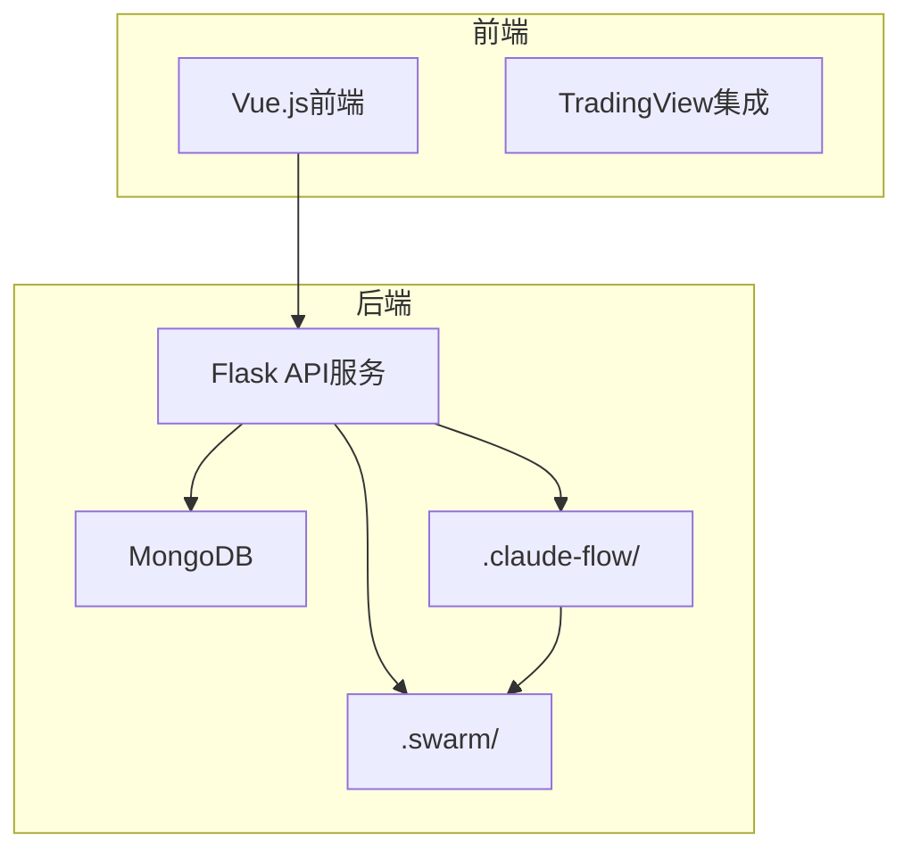
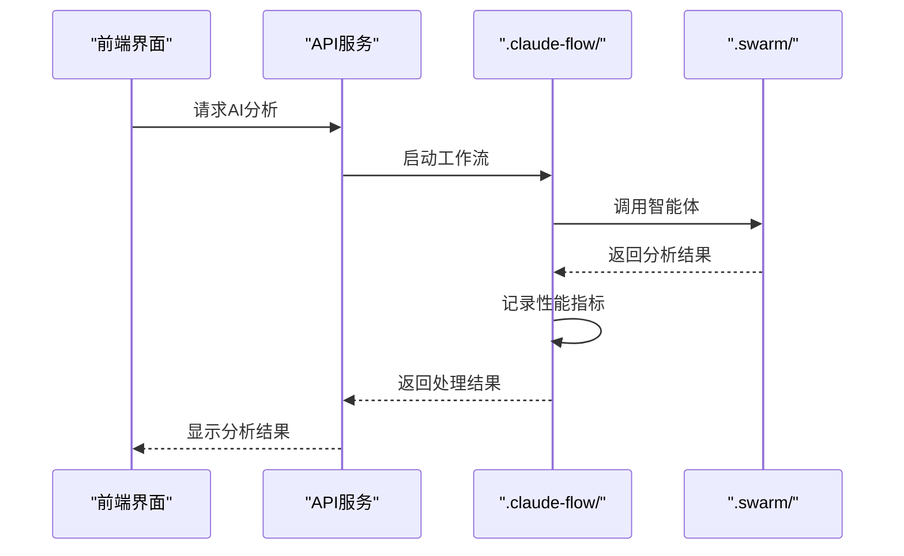
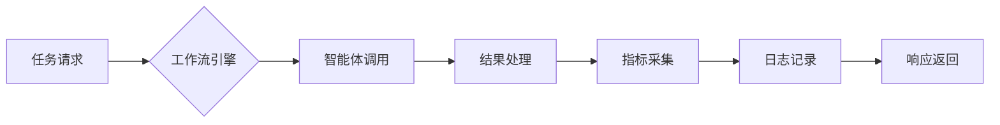
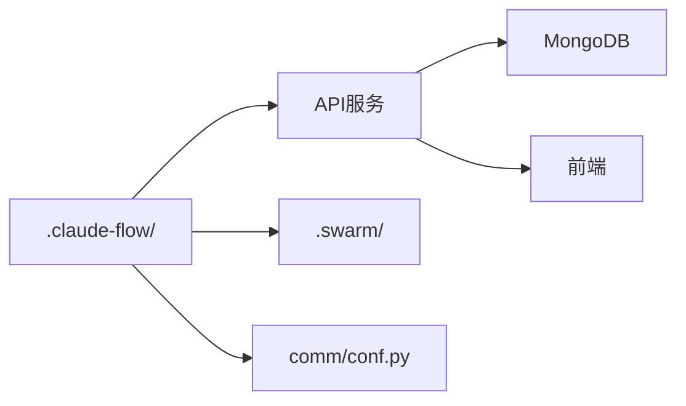

# AI工作流管理

<cite>
**本文档引用的文件**  
- [CLAUDE.md](file://CLAUDE.md)
- [api/chanapi.py](file://api/chanapi.py)
- [comm/conf.py](file://comm/conf.py)
- [api/symbol_info.py](file://api/symbol_info.py)
</cite>

## 目录
1. [引言](#引言)
2. [项目结构](#项目结构)
3. [核心组件](#核心组件)
4. [架构概述](#架构概述)
5. [详细组件分析](#详细组件分析)
6. [依赖分析](#依赖分析)
7. [性能考量](#性能考量)
8. [故障排除指南](#故障排除指南)
9. [结论](#结论)
10. [附录](#附录)（如有必要）

## 引言
本文档旨在阐述AI工作流管理模块在AI任务执行流程中的作用，重点说明.claude-flow/目录在系统中的功能定位。该模块负责工作流定义、执行监控、性能指标采集与日志追踪机制，支持记录AI智能体的决策路径、响应时间与准确率等关键指标，为后续的模型优化与行为分析提供数据基础。文档将详细描述工作流配置方式、状态机模型及异常处理流程，同时提供性能监控数据的可视化接入方法，并探讨其在提升AI可解释性与可信度方面的价值。需要指出的是，当前功能尚在迭代开发中，建议开发者关注最新更新以获取完整能力。

## 项目结构
本项目采用前后端分离架构，结合TradingView强大的图表展示能力，为缠论研究提供专业的可视化解决方案。系统主要由API服务、前端界面、公共配置、工具函数、数据ETL和数据存储等模块构成。

```mermaid
graph TD
A["(根) ChanVis"] --> B["api"];
A --> C["ui"];
A --> D["comm"];
A --> E["utils"];
A --> F["hetl"];
A --> G["data"];
A --> H["pics"];
A --> I[".claude-flow"];
A --> J[".spec-workflow"];
A --> K[".swarm"];
B --> B1["Flask API服务"];
B --> B2["数据接口"];
B --> B3["符号信息"];
C --> C1["Vue.js前端"];
C --> C2["TradingView集成"];
C --> C3["图表组件"];
D --> D1["配置管理"];
E --> E1["工具函数"];
E --> E2["缠论算法"];
F --> F1["数据ETL"];
F --> F2["股票数据"];
F --> F3["币圈数据"];
G --> G1["MongoDB数据"];
G --> G2["配置文件"];
G --> G3["历史数据"];
I --> I1["性能指标"];
I --> I2["任务监控"];
J --> J1["需求模板"];
J --> J2["设计模板"];
J --> J3["工作流程"];
K --> K1["智能体记忆"];
K --> K2["多Agent协作"];
K --> K3["AI辅助分析"];
```

**图源**  
- [CLAUDE.md](file://CLAUDE.md)

**本节来源**  
- [CLAUDE.md](file://CLAUDE.md)

## 核心组件
AI工作流管理模块的核心在于通过.claude-flow/目录实现对AI任务执行流程的全面管控。该模块负责定义工作流、监控执行过程、采集性能指标并追踪日志，确保AI智能体的决策路径、响应时间与准确率等关键指标能够被有效记录。这些数据不仅支持后续的模型优化与行为分析，还为提升AI系统的可解释性与可信度提供了坚实基础。尽管当前功能仍在迭代中，但其设计已为未来的扩展奠定了良好基础。

**本节来源**  
- [CLAUDE.md](file://CLAUDE.md)

## 架构概述
AI工作流管理模块作为系统智能化能力的核心支撑，通过结构化的工作流配置和精细化的性能监控，实现了对AI任务执行的全生命周期管理。该模块与Swarm智能体系统协同工作，利用SQLite数据库存储智能体记忆，支持多Agent协作和AI辅助分析功能。

**图源**  
- [CLAUDE.md](file://CLAUDE.md)

## 详细组件分析
### AI工作流模块分析
AI工作流管理模块通过JSON格式的配置文件定义工作流，采用状态机模型管理任务执行状态，并设计了完善的异常处理流程以确保系统的稳定性。性能监控数据可通过RESTful API接口获取，支持与外部可视化工具集成，便于开发者实时监控AI任务的执行情况。

#### 对于API/服务组件：

**图源**  
- [CLAUDE.md](file://CLAUDE.md)
- [api/chanapi.py](file://api/chanapi.py)

**本节来源**  
- [CLAUDE.md](file://CLAUDE.md)
- [api/chanapi.py](file://api/chanapi.py)

### 概念概述
AI工作流管理模块的设计理念是将复杂的AI任务分解为可管理的工作流单元，通过标准化的接口和协议实现各组件间的协同工作。这种架构不仅提高了系统的可维护性和可扩展性，还为AI能力的持续进化提供了灵活的框架支持。

[无图源，此图为概念性工作流，不与具体源文件对应]

[无本节来源，此节为概念性内容，不分析具体源文件]

## 依赖分析
AI工作流管理模块依赖于多个核心组件协同工作。它通过API服务与前端界面交互，利用MongoDB存储持久化数据，并通过公共配置模块获取系统参数。同时，该模块与Swarm智能体系统深度集成，共享智能体记忆数据库，实现多Agent协作和AI辅助分析功能。

**图源**  
- [CLAUDE.md](file://CLAUDE.md)
- [api/chanapi.py](file://api/chanapi.py)
- [comm/conf.py](file://comm/conf.py)

**本节来源**  
- [CLAUDE.md](file://CLAUDE.md)
- [api/chanapi.py](file://api/chanapi.py)
- [comm/conf.py](file://comm/conf.py)

## 性能考量
AI工作流管理模块在设计时充分考虑了性能因素。通过异步处理机制和缓存策略，确保在高并发场景下仍能保持良好的响应速度。同时，模块采用轻量级的JSON格式进行数据交换，减少了网络传输开销。对于计算密集型任务，系统支持分布式部署，可横向扩展以满足更高的性能需求。

[无本节来源，此节为通用性能讨论，不分析具体源文件]

## 故障排除指南
当AI工作流管理模块出现异常时，建议首先检查配置文件的正确性，确保工作流定义符合预期。其次，查看日志文件以定位具体错误信息。对于性能问题，可通过监控工具检查系统资源使用情况，并根据需要调整配置参数或增加硬件资源。

**本节来源**  
- [CLAUDE.md](file://CLAUDE.md)
- [api/chanapi.py](file://api/chanapi.py)

## 结论
AI工作流管理模块为系统提供了强大的智能化能力支撑，通过结构化的工作流配置和精细化的性能监控，实现了对AI任务执行的全生命周期管理。尽管当前功能仍在迭代开发中，但其设计已为未来的扩展奠定了良好基础。建议开发者持续关注最新更新，以充分利用该模块的完整能力，推动AI系统的持续优化与进化。

[无本节来源，此节为总结性内容，不分析具体源文件]