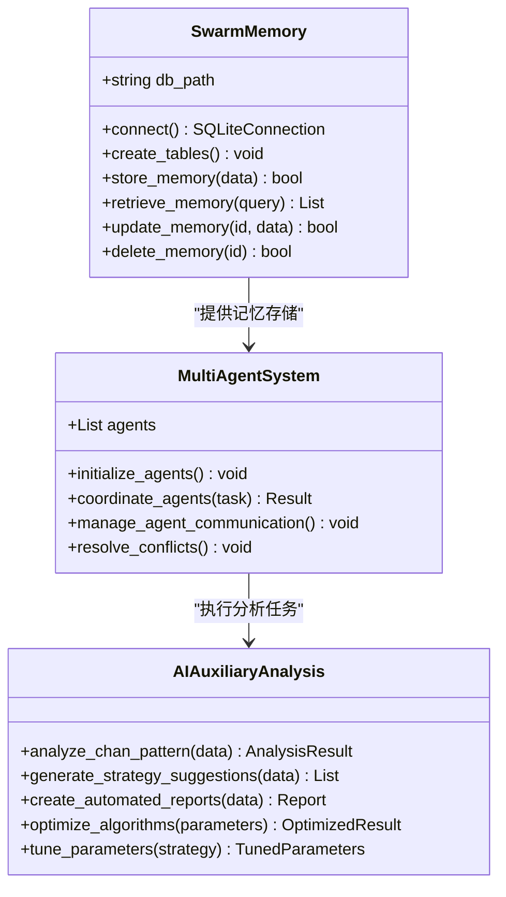
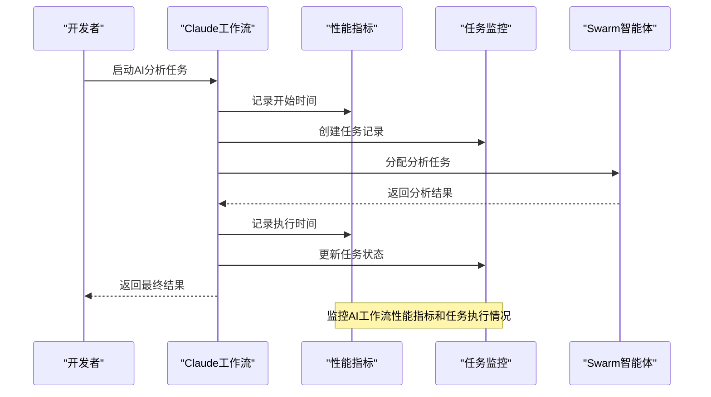
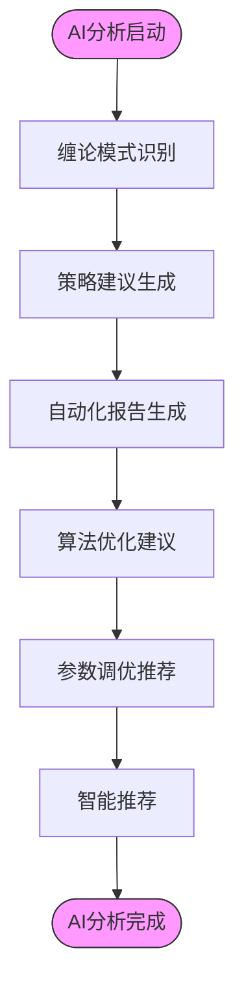
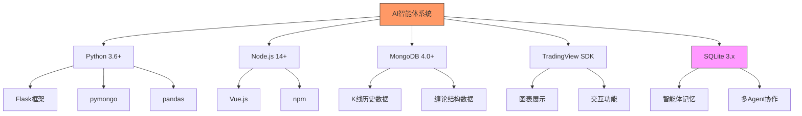

# AI智能体系统

<cite>
**本文档引用的文件**
- [CLAUDE.md](file://CLAUDE.md)
- [api/chanapi.py](file://api/chanapi.py)
- [comm/conf.py](file://comm/conf.py)
- [api/symbol_info.py](file://api/symbol_info.py)
- [utils/dtlib.py](file://utils/dtlib.py)
- [utils/nlchan.py](file://utils/nlchan.py)
</cite>

## 目录

1. [简介](#简介)
2. [项目结构](#项目结构)
3. [核心组件](#核心组件)
4. [架构概述](#架构概述)
5. [详细组件分析](#详细组件分析)
6. [依赖分析](#依赖分析)
7. [性能考虑](#性能考虑)
8. [故障排除指南](#故障排除指南)
9. [结论](#结论)

## 简介

AI智能体系统是ChanVis缠论量化研究可视化平台的重要组成部分，旨在通过AI技术增强缠论分析能力。该系统基于TradingView本地SDK构建，为缠论研究者和量化交易者提供专业的几何交易分析工具。系统集成了Swarm多智能体协作系统和Claude工作流监控机制，通过SQLite数据库实现AI记忆存储和辅助分析功能。本系统支持缠论模式识别、策略建议生成和自动化报告等高级功能，但需强调所有AI分析结果仅供参考，不构成投资建议。

## 项目结构

ChanVis项目采用前后端分离架构，结合TradingView强大的图表展示能力，为缠论研究提供专业可视化解决方案。系统包含API服务、UI前端、公共配置、工具函数、数据ETL等多个模块，其中.swarm和.claude-flow目录专门用于AI智能体系统的实现。

```mermaid
graph TD
A["(根) ChanVis"] --> B["api"];
A --> C["ui"];
A --> D["comm"];
A --> E["utils"];
A --> F["hetl"];
A --> G["data"];
A --> H["pics"];
A --> I[".claude-flow"];
A --> J[".spec-workflow"];
A --> K[".swarm"];
B --> B1["Flask API服务"];
B --> B2["数据接口"];
B --> B3["符号信息"];
C --> C1["Vue.js前端"];
C --> C2["TradingView集成"];
C --> C3["图表组件"];
D --> D1["配置管理"];
E --> E1["工具函数"];
E --> E2["缠论算法"];
F --> F1["数据ETL"];
F --> F2["股票数据"];
F --> F3["币圈数据"];
G --> G1["MongoDB数据"];
G --> G2["配置文件"];
G --> G3["历史数据"];
I --> I1["性能指标"];
I --> I2["任务监控"];
J --> J1["需求模板"];
J --> J2["设计模板"];
J --> J3["工作流程"];
K --> K1["智能体记忆"];
K --> K2["多Agent协作"];
K --> K3["AI辅助分析"];
click B "./api/CLAUDE.md" "查看 API 模块文档"
click C "./ui/CLAUDE.md" "查看 UI 模块文档"
click D "./comm/CLAUDE.md" "查看 comm 模块文档"
click E "./utils/CLAUDE.md" "查看 utils 模块文档"
click F "./hetl/CLAUDE.md" "查看 hetl 模块文档"
click G "./data/CLAUDE.md" "查看 data 模块文档"
click H "./pics/CLAUDE.md" "查看 pics 模块文档"
click I "./.claude-flow/CLAUDE.md" "查看 AI工作流文档"
click J "./.spec-workflow/CLAUDE.md" "查看 规格化工作流文档"
click K "./.swarm/CLAUDE.md" "查看 Swarm智能体文档"
```



**图表来源**
- [CLAUDE.md](file://CLAUDE.md#L25-L80)

**本节来源**
- [CLAUDE.md](file://CLAUDE.md#L1-L254)

## 核心组件

AI智能体系统的核心组件包括基于SQLite的Swarm多Agent协作系统和Claude工作流监控系统。Swarm系统作为AI记忆存储和辅助分析引擎，支持多Agent协作，为缠论模式识别、策略建议生成和自动化报告提供支持。Claude工作流系统则负责监控AI工作流的性能指标和任务执行情况。这些组件与Flask API服务、MongoDB数据存储等协同工作，共同构建完整的AI辅助分析体系。

**本节来源**
- [CLAUDE.md](file://CLAUDE.md#L1-L254)
- [api/chanapi.py](file://api/chanapi.py#L1-L568)

## 架构概述

AI智能体系统采用模块化架构设计，各组件之间通过清晰的接口进行通信。系统以Swarm智能体为核心，通过SQLite数据库实现记忆存储和多Agent协作。Claude工作流系统监控整个AI辅助分析过程的性能指标。API服务作为系统与外部交互的桥梁，提供RESTful接口处理K线数据和缠论结构数据。整个架构支持本地部署和云端私有化部署，确保数据安全可控。

```mermaid
graph TD
subgraph "AI智能体系统"
Swarm["Swarm智能体\n(SQLite)"]
ClaudeFlow["Claude工作流\n(JSON)"]
SpecWorkflow["规格化工作流\n(Markdown)"]
end
subgraph "核心服务"
API["API服务\n(Flask)"]
MongoDB["MongoDB\n数据存储"]
end
subgraph "前端界面"
UI["UI前端\n(Vue.js)"]
TradingView["TradingView\n图表引擎"]
end
Swarm --> API : "提供AI辅助分析"
ClaudeFlow --> API : "监控性能指标"
SpecWorkflow --> API : "规范开发流程"
API --> MongoDB : "存储/读取数据"
API --> UI : "提供数据接口"
UI --> TradingView : "集成图表展示"
style Swarm fill:#f9f,stroke:#333
style ClaudeFlow fill:#bbf,stroke:#333
style SpecWorkflow fill:#f96,stroke:#333
```

**图表来源**
- [CLAUDE.md](file://CLAUDE.md#L25-L80)

**本节来源**
- [CLAUDE.md](file://CLAUDE.md#L1-L254)

## 详细组件分析

### Swarm智能体分析

Swarm智能体系统是基于SQLite的多Agent协作系统，作为AI记忆存储和辅助分析引擎。该系统支持缠论模式识别、策略建议生成和自动化报告等高级功能。通过多Agent协作，不同专业领域的智能体可以协同工作，提高分析的准确性和全面性。

#### Swarm智能体架构


**图表来源**
- [CLAUDE.md](file://CLAUDE.md#L37-L79)

**本节来源**
- [CLAUDE.md](file://CLAUDE.md#L1-L254)

### Claude工作流分析

Claude工作流系统支持AI工作流监控与性能指标追踪，确保AI辅助分析过程的可观察性和可优化性。该系统记录任务执行情况、性能指标和工作流程，为AI算法优化提供数据支持。

#### Claude工作流监控


**图表来源**
- [CLAUDE.md](file://CLAUDE.md#L35-L77)

**本节来源**
- [CLAUDE.md](file://CLAUDE.md#L1-L254)

### 缠论模式识别分析

Swarm智能体参与缠论模式识别、策略建议生成和自动化报告等高级功能。通过AI技术优化缠论算法，实现参数调优和智能推荐，提高分析效率和准确性。

#### 缠论AI分析流程


**图表来源**
- [CLAUDE.md](file://CLAUDE.md#L184-L197)

**本节来源**
- [CLAUDE.md](file://CLAUDE.md#L1-L254)

## 依赖分析

AI智能体系统依赖于多个关键技术组件，包括Python 3.6+、Node.js 14+、MongoDB 4.0+、TradingView Charting Library SDK和SQLite 3.x。这些依赖项共同支持系统的正常运行和功能实现。其中，SQLite作为Swarm智能体的记忆数据库，是AI辅助分析功能的核心依赖。



**图表来源**
- [CLAUDE.md](file://CLAUDE.md#L99-L104)

**本节来源**
- [CLAUDE.md](file://CLAUDE.md#L1-L254)

## 性能考虑

AI智能体系统的性能考虑主要包括数据库查询优化、API响应时间和AI分析效率。系统通过建立适当的索引优化MongoDB查询性能，使用缓存机制减少重复计算，并采用异步处理提高AI分析任务的执行效率。对于Swarm智能体系统，需要特别关注SQLite数据库的读写性能，确保多Agent协作的实时性。

**本节来源**
- [CLAUDE.md](file://CLAUDE.md#L177-L180)

## 故障排除指南

当AI智能体系统出现问题时，应首先检查各组件的运行状态和依赖关系。常见问题包括数据库连接失败、API接口异常和AI分析结果不准确。对于Swarm智能体系统，需要确保.memory.db文件存在且可访问。初始化memory.db的步骤如下：

```bash
# 初始化智能体数据库
python -c "
import sqlite3
conn = sqlite3.connect('.swarm/memory.db')
# 创建必要的表结构（参考 .swarm/CLAUDE.md）
conn.close()
"
```

**本节来源**
- [CLAUDE.md](file://CLAUDE.md#L131-L140)

## 结论

AI智能体系统通过集成Swarm多智能体协作系统和Claude工作流监控机制，为缠论量化研究提供了强大的AI辅助分析能力。系统基于SQLite实现AI记忆存储，支持缠论模式识别、策略建议生成和自动化报告等高级功能。未来可进一步探索AI在缠论算法优化、参数调优和智能推荐中的应用。需要强调的是，所有AI分析结果仅供参考，不构成投资建议，使用者应结合实际交易经验进行决策。