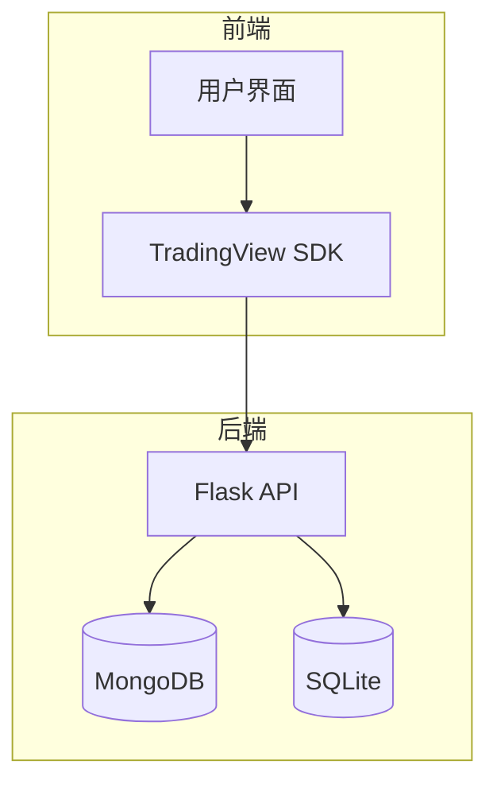
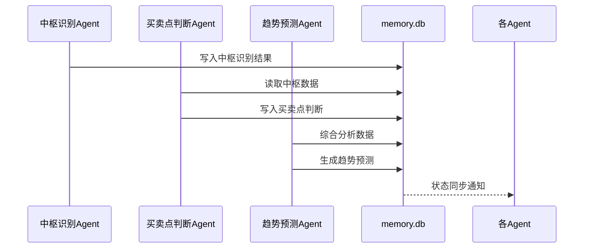
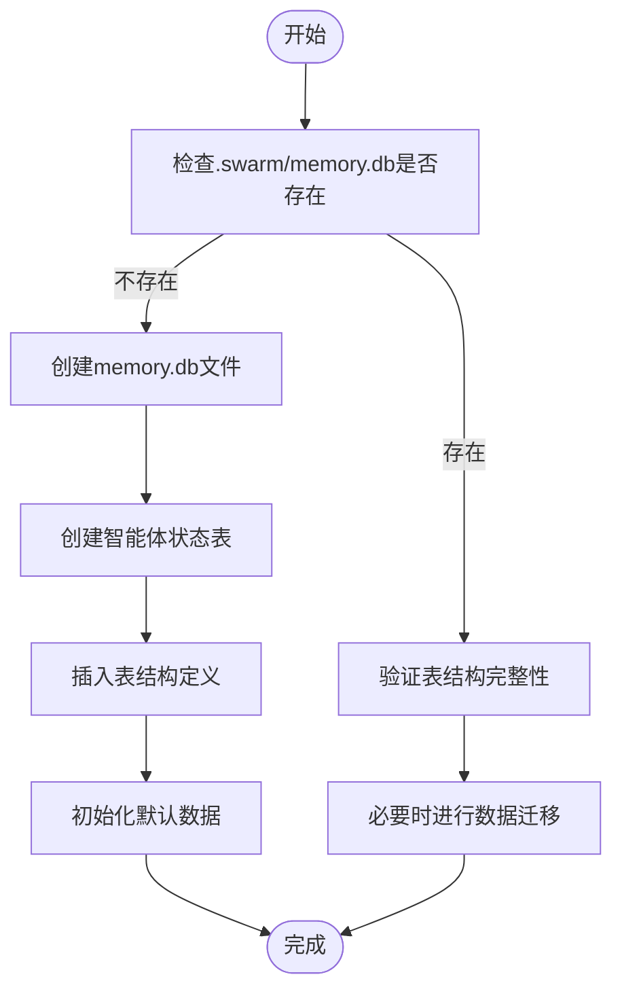
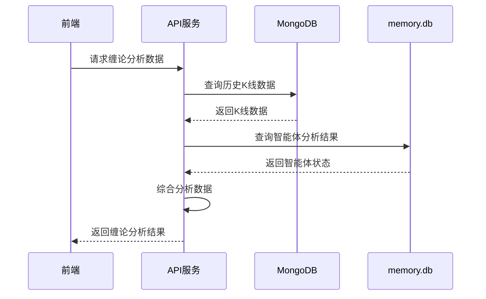
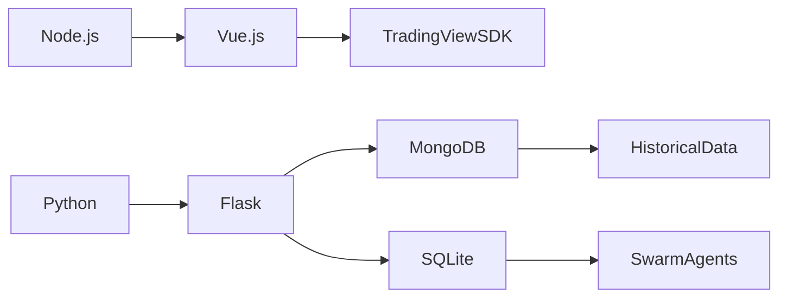

# 多智能体协作系统

<cite>
**本文档引用文件**  
- [CLAUDE.md](file://CLAUDE.md#L1-L254)
- [api/chanapi.py](file://api/chanapi.py#L1-L568)
- [comm/conf.py](file://comm/conf.py#L1-L166)
- [api/symbol_info.py](file://api/symbol_info.py#L1-L74)
</cite>

## 目录
1. [引言](#引言)
2. [项目结构](#项目结构)
3. [核心组件](#核心组件)
4. [架构概述](#架构概述)
5. [详细组件分析](#详细组件分析)
6. [依赖分析](#依赖分析)
7. [性能考虑](#性能考虑)
8. [故障排除指南](#故障排除指南)
9. [结论](#结论)

## 引言
本文档详细描述了基于缠论分析的多智能体协作系统，重点介绍位于.swarm/目录下通过SQLite实现的memory.db数据库架构。该系统设计用于支持多个AI智能体在缠论分析中的协同工作，包括中枢识别Agent、买卖点判断Agent和趋势预测Agent等角色分工。各智能体通过共享内存数据库进行状态同步与信息交换，实现复杂行情的综合研判并生成策略建议。系统当前处于实验阶段，所有AI输出结果均需结合人工验证，不构成投资依据。

## 项目结构
本项目采用前后端分离架构，结合TradingView本地SDK实现缠论量化研究的可视化功能。系统包含API服务、UI前端、公共配置、工具函数、数据ETL等多个模块，其中.swarm/目录专为AI智能体协作设计，使用SQLite作为智能体间共享的记忆数据库。

```mermaid
graph TD
A["(根) ChanVis"] --> B["api"];
A --> C["ui"];
A --> D["comm"];
A --> E["utils"];
A --> F["hetl"];
A --> G["data"];
A --> H["pics"];
A --> I[".claude-flow"];
A --> J[".spec-workflow"];
A --> K[".swarm"];
B --> B1["Flask API服务"];
B --> B2["数据接口"];
B --> B3["符号信息"];
C --> C1["Vue.js前端"];
C --> C2["TradingView集成"];
C --> C3["图表组件"];
D --> D1["配置管理"];
E --> E1["工具函数"];
E --> E2["缠论算法"];
F --> F1["数据ETL"];
F --> F2["股票数据"];
F --> F3["币圈数据"];
G --> G1["MongoDB数据"];
G --> G2["配置文件"];
G --> G3["历史数据"];
I --> I1["性能指标"];
I --> I2["任务监控"];
J --> J1["需求模板"];
J --> J2["设计模板"];
J --> J3["工作流程"];
K --> K1["智能体记忆"];
K --> K2["多Agent协作"];
K --> K3["AI辅助分析"];
```

**图示来源**  
- [CLAUDE.md](file://CLAUDE.md#L27-L80)

**本节来源**  
- [CLAUDE.md](file://CLAUDE.md#L1-L254)

## 核心组件
系统的核心组件包括基于Flask的API服务、Vue.js实现的前端界面、MongoDB存储的历史数据以及.swarm/目录下的智能体协作系统。其中，智能体系统通过SQLite数据库memory.db实现多Agent之间的状态同步与信息交换，为缠论分析提供AI辅助功能。

**本节来源**  
- [api/chanapi.py](file://api/chanapi.py#L1-L568)
- [comm/conf.py](file://comm/conf.py#L1-L166)

## 架构概述
系统采用模块化设计，前端基于Vue.js与TradingView SDK集成，后端使用Python Flask框架提供RESTful API接口。数据存储方面，历史K线数据和缠论结构数据存储于MongoDB，而智能体间的协作记忆则通过SQLite数据库memory.db实现。这种架构设计既保证了高性能的数据处理能力，又支持灵活的AI智能体扩展。

**图示来源**  
- [CLAUDE.md](file://CLAUDE.md#L13-L19)
- [api/chanapi.py](file://api/chanapi.py#L11-L13)

## 详细组件分析

### 智能体协作系统分析
.swarm/目录下的智能体系统是本项目的关键创新点，它通过SQLite数据库memory.db实现多Agent协作。系统规划了中枢识别Agent、买卖点判断Agent、趋势预测Agent等专业角色，各智能体通过共享内存数据库进行状态同步与信息交换。

#### 智能体通信机制

**图示来源**  
- [CLAUDE.md](file://CLAUDE.md#L95)
- [api/chanapi.py](file://api/chanapi.py#L244-L278)

#### 数据库初始化流程

**图示来源**  
- [CLAUDE.md](file://CLAUDE.md#L131-L140)

**本节来源**  
- [CLAUDE.md](file://CLAUDE.md#L95)
- [api/chanapi.py](file://api/chanapi.py#L244-L278)

### 缠论分析功能分析
系统通过API接口提供完整的缠论分析功能，包括线段标记、中枢识别、买卖点判断等核心功能。这些功能为智能体系统提供了基础数据支持。

#### 缠论分析API调用流程

**图示来源**  
- [api/chanapi.py](file://api/chanapi.py#L96-L234)
- [comm/conf.py](file://comm/conf.py#L143-L147)

**本节来源**  
- [api/chanapi.py](file://api/chanapi.py#L96-L234)
- [comm/conf.py](file://comm/conf.py#L143-L147)

## 依赖分析
系统依赖于多个关键技术组件，包括Python 3.6+、Node.js 14+、MongoDB 4.0+和SQLite 3.x。其中，SQLite专门用于.swarm/模块的智能体协作记忆存储。前后端通过RESTful API进行通信，数据流清晰明确。

**图示来源**  
- [CLAUDE.md](file://CLAUDE.md#L99-L104)
- [comm/conf.py](file://comm/conf.py#L143-L147)

**本节来源**  
- [CLAUDE.md](file://CLAUDE.md#L99-L104)
- [comm/conf.py](file://comm/conf.py#L143-L147)

## 性能考虑
系统在设计时充分考虑了性能因素。对于大量历史数据的处理，采用MongoDB进行高效存储和查询；对于智能体间的实时协作，则使用轻量级的SQLite数据库。API接口经过优化，能够快速响应前端请求，确保用户体验流畅。

## 故障排除指南
当系统运行出现问题时，可按照以下步骤进行排查：
1. 检查MongoDB服务是否正常运行
2. 验证SQLite数据库文件权限
3. 确认API服务端口未被占用
4. 检查前端与后端的网络连接
5. 查看日志文件定位具体错误

**本节来源**  
- [api/chanapi.py](file://api/chanapi.py#L560-L568)
- [comm/conf.py](file://comm/conf.py#L139-L140)

## 结论
本多智能体协作系统通过创新的架构设计，实现了缠论分析中多个AI智能体的协同工作。系统利用SQLite数据库作为智能体间的共享记忆，支持中枢识别、买卖点判断、趋势预测等专业角色的分工合作。尽管目前系统仍处于实验阶段，但其架构为AI辅助缠论分析提供了坚实的基础。未来可进一步完善智能体的功能和协作机制，提升系统的实用价值。