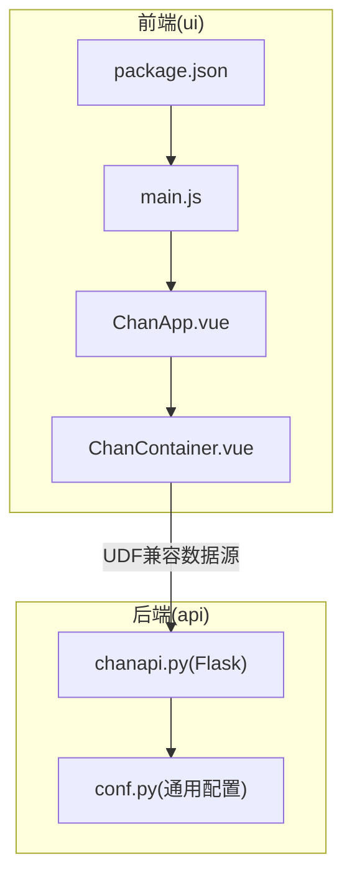
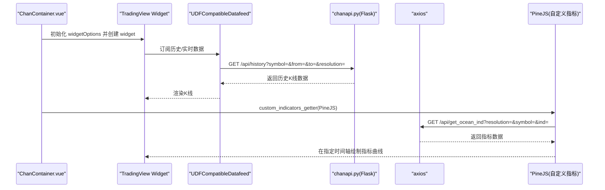
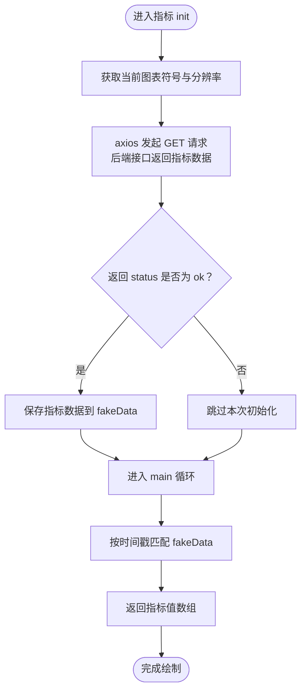
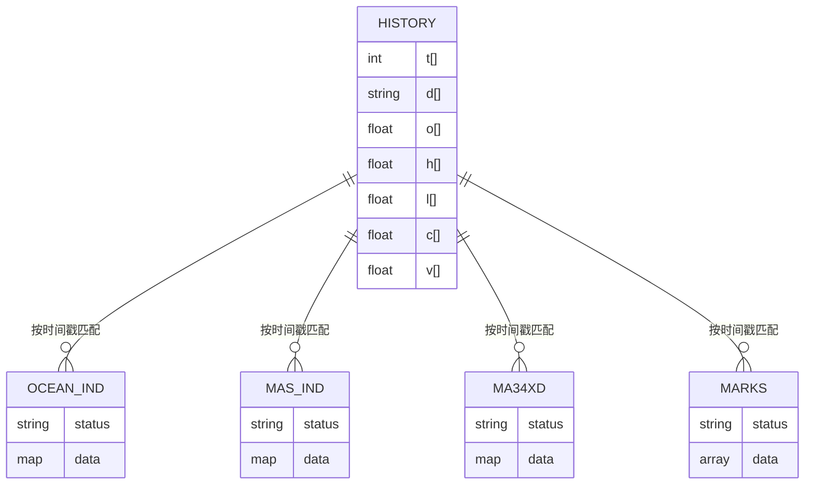
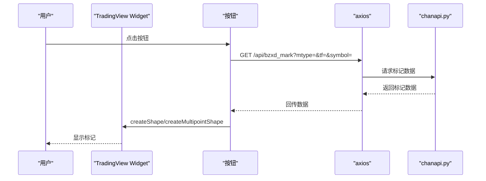
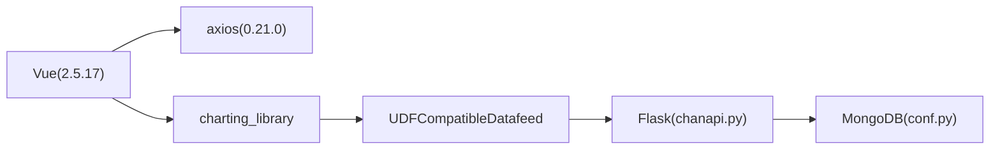

# TradingView图表容器集成

<cite>
**本文引用的文件**
- [ChanContainer.vue](file://ui/src/components/ChanContainer.vue)
- [ChanApp.vue](file://ui/src/ChanApp.vue)
- [main.js](file://ui/src/main.js)
- [chanapi.py](file://api/chanapi.py)
- [conf.py](file://comm/conf.py)
- [package.json](file://ui/package.json)
- [README.md](file://README.md)
</cite>

## 目录
1. [简介](#简介)
2. [项目结构](#项目结构)
3. [核心组件](#核心组件)
4. [架构总览](#架构总览)
5. [详细组件分析](#详细组件分析)
6. [依赖关系分析](#依赖关系分析)
7. [性能考量](#性能考量)
8. [故障排查指南](#故障排查指南)
9. [结论](#结论)
10. [附录](#附录)

## 简介
本文件系统化文档化 ChanContainer.vue 组件，作为 TradingView Charting Library 的封装器，重点说明以下方面：
- 所有 props 参数的用途与默认值，尤其是 datafeedUrl 指向本地 API 服务的配置
- widgetOptions 中自定义时间格式化、分辨率支持、主题样式覆盖等高级配置
- custom_indicators_getter 机制如何实现 NMA、NMM、NMC、NMS、NMC2、NDX、NST、NDX_NST、NXC、MSH、MA34XD 等自定义缠论指标的动态加载，以及通过 axios 从后端获取指标数据的异步流程
- TradingView SDK 通过 import { widget } from '../../public/charting_library' 的技术要求
- “全量画线错位”等问题的临时解决方案（刷新页面）

## 项目结构
ChanContainer.vue 位于前端工程 ui/src/components 下，作为图表容器承载 TradingView 图表实例；ChanApp.vue 作为根组件挂载该容器；后端 API 由 Python Flask 提供，位于 api/chanapi.py；通用配置位于 comm/conf.py。

**图表来源**
- [ChanApp.vue](file://ui/src/ChanApp.vue#L1-L20)
- [ChanContainer.vue](file://ui/src/components/ChanContainer.vue#L1-L120)
- [main.js](file://ui/src/main.js#L1-L12)
- [chanapi.py](file://api/chanapi.py#L1-L120)
- [conf.py](file://comm/conf.py#L1-L60)

**章节来源**
- [ChanApp.vue](file://ui/src/ChanApp.vue#L1-L20)
- [ChanContainer.vue](file://ui/src/components/ChanContainer.vue#L1-L120)
- [main.js](file://ui/src/main.js#L1-L12)
- [package.json](file://ui/package.json#L1-L30)
- [chanapi.py](file://api/chanapi.py#L1-L120)
- [conf.py](file://comm/conf.py#L1-L60)

## 核心组件
- ChanContainer.vue：负责创建 TradingView 图表实例、配置数据源与 UI 行为、注入自定义指标与标记工具按钮、设置主题与样式覆盖。
- ChanApp.vue：应用入口组件，仅包含一个子组件 ChanContainer.vue。
- main.js：Vue 应用入口，渲染 ChanApp.vue。
- chanapi.py：后端 API，提供历史数据、配置、标记等接口，供 TradingView UDF 数据源调用。
- conf.py：通用配置，如时间周期映射、MongoDB 连接、数据库集合名等。

**章节来源**
- [ChanContainer.vue](file://ui/src/components/ChanContainer.vue#L1-L120)
- [ChanApp.vue](file://ui/src/ChanApp.vue#L1-L20)
- [main.js](file://ui/src/main.js#L1-L12)
- [chanapi.py](file://api/chanapi.py#L1-L120)
- [conf.py](file://comm/conf.py#L1-L60)

## 架构总览
ChanContainer.vue 通过 UDFCompatibleDatafeed 将 TradingView 的历史/实时数据请求转发至本地 Flask API（/api/history、/api/config、/api/symbols 等）。同时，通过 custom_indicators_getter 注入自定义指标，这些指标在初始化阶段通过 axios 异步拉取后端指标数据（/api/get_ocean_ind、/api/get_mas_ind 等），并在 PineJS 上下文中按时间戳匹配绘制。

**图表来源**
- [ChanContainer.vue](file://ui/src/components/ChanContainer.vue#L70-L160)
- [chanapi.py](file://api/chanapi.py#L96-L235)
- [chanapi.py](file://api/chanapi.py#L420-L568)

**章节来源**
- [ChanContainer.vue](file://ui/src/components/ChanContainer.vue#L70-L160)
- [chanapi.py](file://api/chanapi.py#L96-L235)
- [chanapi.py](file://api/chanapi.py#L420-L568)

## 详细组件分析

### Props 参数与默认值
- symbol：默认交易品种，默认值为 '000001.XSHG'
- interval：默认时间周期，默认值为 '1D'
- containerId：图表容器 DOM ID，默认值为 'tv_chart_container'
- datafeedUrl：数据源地址，默认值为 'http://127.0.0.1:8421/api'
- libraryPath：Charting Library 路径，默认值为 '/charting_library/'
- chartsStorageUrl：图表存储服务地址，默认值为 'http://127.0.0.1:8000'
- chartsStorageApiVersion：图表存储 API 版本，默认值为 '1.1'
- clientId：客户端标识，默认值为 'quantchan.com'
- userId：用户标识，默认值为 'baihuo'
- fullscreen：全屏模式，默认值为 false
- autosize：自动适配大小，默认值为 true
- studiesOverrides：研究模板覆盖配置，类型为对象

上述参数均在组件选项中声明，用于构建 widgetOptions 并驱动 TradingView 初始化。

**章节来源**
- [ChanContainer.vue](file://ui/src/components/ChanContainer.vue#L21-L73)

### TradingView SDK 引入与技术要求
- 通过 import { widget } from '../../public/charting_library' 引入 TradingView 图表库
- 需要在 public 目录下放置 charting_library 及 datafeeds 相关资源
- 项目 .gitignore 中包含 public/charting_library/ 与 public/datafeeds/，表明资源需手动放置或构建时复制

**章节来源**
- [ChanContainer.vue](file://ui/src/components/ChanContainer.vue#L7-L10)
- [.gitignore](file://.gitignore#L1-L9)
- [README.md](file://README.md#L1-L120)

### widgetOptions 高级配置
- datafeed：使用 UDFCompatibleDatafeed，连接本地 datafeedUrl，并设置轮询间隔
- symbol、interval、container_id、library_path：基础图表参数
- locale：从 URL 查询参数解析语言，默认 'zh'
- enabled_features：启用研究模板等特性
- charts_storage_url、charts_storage_api_version、client_id、user_id：图表存储与鉴权
- fullscreen、autosize：UI 行为控制
- studies_overrides：研究模板覆盖
- debug：调试开关
- supported_resolution：支持的分辨率列表
- customFormatters：自定义时间与日期格式化器
- timeframe：初始数据窗口大小
- favorites：收藏的分辨率与图表类型
- overrides：主题与样式覆盖（背景、网格、刻度、水印、成交量面板大小、右侧刻度显隐等）

以上配置共同决定图表外观、行为与数据来源策略。

**章节来源**
- [ChanContainer.vue](file://ui/src/components/ChanContainer.vue#L75-L160)

### 自定义指标注入与异步数据加载
- custom_indicators_getter：在 PineJS 上下文中返回一组自定义指标定义数组
- 指标名称与元信息：NMA、NMM、NMC、NMS、NMC2、NDX、NST、NDX_NST、NXC、MSH、MA34XD
- 初始化流程：在每个指标的 init 中，读取当前图表符号与分辨率，通过 axios 异步请求后端接口获取指标数据
- 主函数 main：按时间戳匹配 fakeData，返回相应数值，用于绘制曲线

**图表来源**
- [ChanContainer.vue](file://ui/src/components/ChanContainer.vue#L144-L1571)

**章节来源**
- [ChanContainer.vue](file://ui/src/components/ChanContainer.vue#L144-L1571)

### 后端 API 接口与数据模型
- /api/history：历史数据接口，返回时间戳、开盘、最高、最低、收盘、成交量等字段
- /api/config：配置接口，声明支持的分辨率与时间范围
- /api/symbols：查询符号信息
- /api/get_ocean_ind：返回 NMA/NMM/NMC/NMS/NMC2/NDX/NST/NDX_NST/NXC 指标数据
- /api/get_mas_ind：返回 MSH 指标数据
- /api/get_ma34xd：返回 MA34XD 指标数据
- /api/bzxd_mark、/api/bzzs_mark：返回各类标记数据（转折K、中枢线、买卖点等）

**图表来源**
- [chanapi.py](file://api/chanapi.py#L96-L235)
- [chanapi.py](file://api/chanapi.py#L244-L568)

**章节来源**
- [chanapi.py](file://api/chanapi.py#L96-L235)
- [chanapi.py](file://api/chanapi.py#L244-L568)

### 图表交互与标记工具
- headerReady 后创建多个按钮，分别用于绘制 K 顶底、ma5 顶底、转折K、中枢线、线段中枢、量化买卖、本质虚线、本质线段、日线线段、本质中枢、三买点、独立日线等标记
- 每个按钮点击后，通过 axios 调用后端 /api/bzxd_mark 或 /api/bzzs_mark 获取标记数据，然后在图表上创建形状或趋势线

**图表来源**
- [ChanContainer.vue](file://ui/src/components/ChanContainer.vue#L1652-L2566)
- [chanapi.py](file://api/chanapi.py#L280-L568)

**章节来源**
- [ChanContainer.vue](file://ui/src/components/ChanContainer.vue#L1652-L2566)
- [chanapi.py](file://api/chanapi.py#L280-L568)

### 主题与样式覆盖
- 主题切换：changeTheme('Dark')
- 样式覆盖：通过 overrides 控制背景、网格颜色、刻度文本色、水印透明度、成交量面板大小、右侧刻度显隐等
- 刻度字体大小与图例显隐也可通过 overrides 调整

**章节来源**
- [ChanContainer.vue](file://ui/src/components/ChanContainer.vue#L2566-L2586)
- [ChanContainer.vue](file://ui/src/components/ChanContainer.vue#L130-L141)

### 生命周期与资源清理
- mounted：创建 widget，绑定事件，注册按钮与标记逻辑
- destroyed：移除 widget，释放资源

**章节来源**
- [ChanContainer.vue](file://ui/src/components/ChanContainer.vue#L1574-L1599)
- [ChanContainer.vue](file://ui/src/components/ChanContainer.vue#L2831-L2836)

## 依赖关系分析
- 前端依赖：Vue 2.5.17、axios 0.21.0、@vue/cli-service 等
- 后端依赖：Flask、pymongo、arrow、pandas 等
- 数据流：前端通过 UDFCompatibleDatafeed -> 后端 /api/history -> 前端渲染；自定义指标通过 axios -> 后端 /api/get_ocean_ind 等 -> PineJS 绘制

**图表来源**
- [package.json](file://ui/package.json#L1-L30)
- [chanapi.py](file://api/chanapi.py#L1-L40)
- [conf.py](file://comm/conf.py#L139-L148)
- [ChanContainer.vue](file://ui/src/components/ChanContainer.vue#L70-L160)

**章节来源**
- [package.json](file://ui/package.json#L1-L30)
- [chanapi.py](file://api/chanapi.py#L1-L40)
- [conf.py](file://comm/conf.py#L139-L148)
- [ChanContainer.vue](file://ui/src/components/ChanContainer.vue#L70-L160)

## 性能考量
- 数据轮询间隔：UDFCompatibleDatafeed 的轮询间隔为毫秒级，建议根据实际网络与后端性能调整
- 自定义指标初始化：每次切换符号或分辨率都会重新发起 axios 请求，建议在后端缓存热点指标数据
- 标记绘制：大量 createShape/createMultipointShape 会增加渲染压力，建议在大数据量场景下限制绘制数量或采用批量更新
- 主题与样式：overrides 中的透明度与字体大小会影响渲染性能，应按需调整

[本节为通用指导，不直接分析具体文件]

## 故障排查指南
- “全量画线错位”问题：当前实现中，自定义指标通过时间戳匹配绘制，若出现错位，可尝试刷新页面以重新拉取最新数据并重建指标上下文
- 数据源不可用：确认 datafeedUrl 指向正确且后端已启动；检查 /api/history、/api/config、/api/symbols 等接口响应
- 自定义指标未显示：检查 custom_indicators_getter 返回的指标定义是否正确，后端 /api/get_ocean_ind、/api/get_mas_ind、/api/get_ma34xd 是否返回 status 为 ok
- 标记按钮无反应：确认按钮事件绑定成功，后端 /api/bzxd_mark、/api/bzzs_mark 是否返回有效数据
- SDK 资源缺失：确保 public/charting_library 与 public/datafeeds 已放置，否则 import { widget } 将失败

**章节来源**
- [ChanContainer.vue](file://ui/src/components/ChanContainer.vue#L144-L1571)
- [chanapi.py](file://api/chanapi.py#L96-L235)
- [chanapi.py](file://api/chanapi.py#L420-L568)

## 结论
ChanContainer.vue 作为 TradingView Charting Library 的封装器，通过 UDFCompatibleDatafeed 与本地 Flask API 对接，实现了历史与实时数据的统一接入；通过 custom_indicators_getter 与 axios 异步拉取后端指标数据，结合 PineJS 上下文绘制自定义缠论指标；同时提供了丰富的 UI 交互与标记工具，满足复杂图表分析需求。针对“全量画线错位”等偶发问题，建议刷新页面以重建指标上下文。

[本节为总结性内容，不直接分析具体文件]

## 附录
- 重要接口路径
  - /api/history：历史数据
  - /api/config：配置信息
  - /api/symbols：符号信息
  - /api/get_ocean_ind：NMA/NMM/NMC/NMS/NMC2/NDX/NST/NDX_NST/NXC 指标
  - /api/get_mas_ind：MSH 指标
  - /api/get_ma34xd：MA34XD 指标
  - /api/bzxd_mark、/api/bzzs_mark：标记数据

**章节来源**
- [chanapi.py](file://api/chanapi.py#L96-L235)
- [chanapi.py](file://api/chanapi.py#L420-L568)