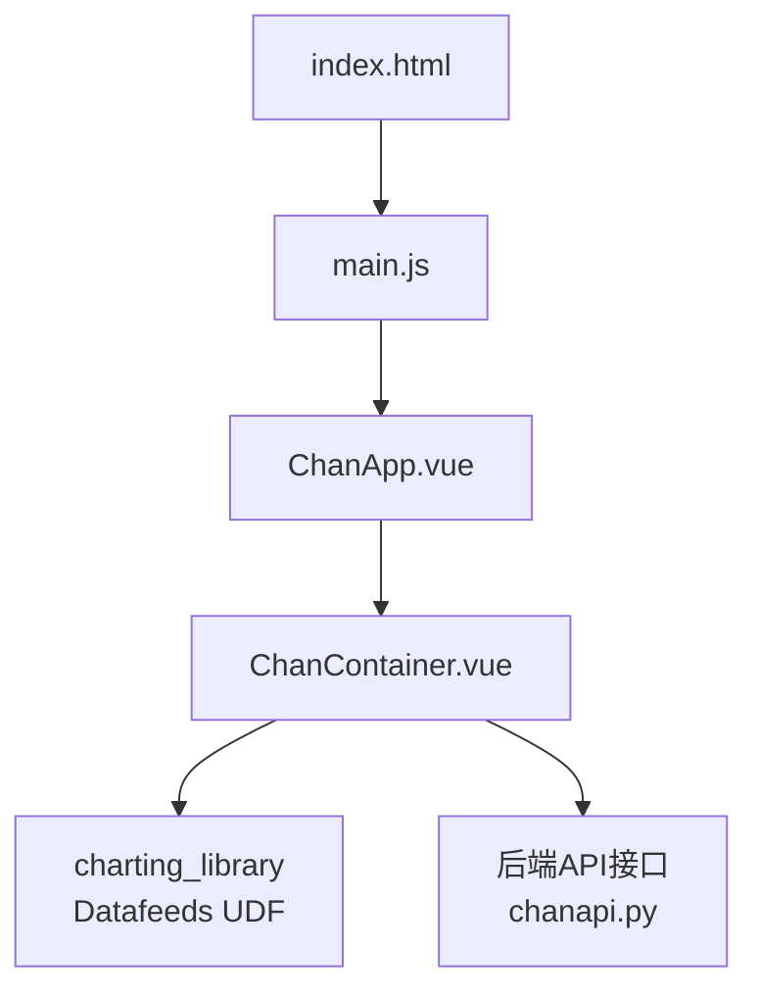
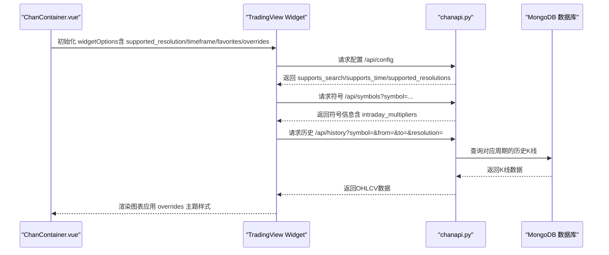
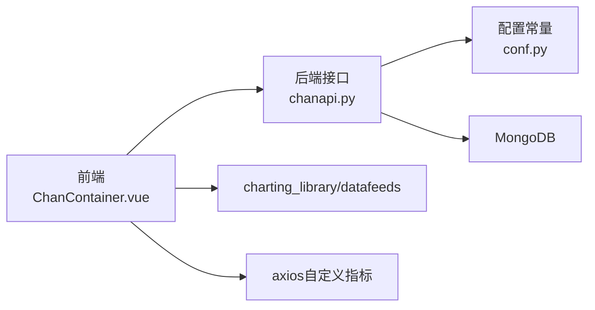

# UI与交互配置

<cite>
**本文引用的文件**
- [ChanContainer.vue](file://ui/src/components/ChanContainer.vue)
- [README.md](file://README.md)
- [package.json](file://ui/package.json)
- [index.html](file://ui/public/index.html)
- [chanapi.py](file://api/chanapi.py)
- [symbol_info.py](file://api/symbol_info.py)
- [conf.py](file://comm/conf.py)
- [dtlib.py](file://utils/dtlib.py)
</cite>

## 目录
1. [引言](#引言)
2. [项目结构](#项目结构)
3. [核心组件](#核心组件)
4. [架构总览](#架构总览)
5. [详细组件分析](#详细组件分析)
6. [依赖关系分析](#依赖关系分析)
7. [性能考量](#性能考量)
8. [故障排查指南](#故障排查指南)
9. [结论](#结论)
10. [附录](#附录)

## 引言
本文件围绕 TradingView 本地 SDK 的 UI 配置项进行系统化文档化，重点解释 widgetOptions 中的关键配置：
- supported_resolution 支持的时间周期列表（1,5,30,240,D）
- timeframe 初始数据窗口（250M）的意义
- customFormatters 中 timeFormatter 和 dateFormatter 对时间显示格式的定制化处理逻辑
- overrides 中主题样式覆盖的作用（背景色、网格颜色等）
- favorites 中用户偏好设置对界面操作体验的影响

同时结合后端接口与前端组件，给出这些配置如何影响实际图表行为与用户体验，并提供可视化流程图帮助理解。

## 项目结构
前端采用 Vue 2.x，使用 TradingView 本地 SDK（charting_library）渲染图表。核心入口为 ChanContainer.vue，在 mounted 生命周期内创建并初始化 TradingView Widget，传入 widgetOptions 完成 UI 与交互配置。

图表来源
- [index.html](file://ui/public/index.html#L1-L20)
- [package.json](file://ui/package.json#L1-L50)
- [ChanContainer.vue](file://ui/src/components/ChanContainer.vue#L75-L150)
- [chanapi.py](file://api/chanapi.py#L41-L59)

章节来源
- [README.md](file://README.md#L90-L136)
- [package.json](file://ui/package.json#L1-L50)
- [index.html](file://ui/public/index.html#L1-L20)

## 核心组件
- ChanContainer.vue：负责挂载 TradingView Widget，设置 widgetOptions，包含 supported_resolution、customFormatters、timeframe、favorites、overrides 等关键配置。
- 后端 API（chanapi.py）：提供 TradingView UDF 接口，返回历史数据、支持的分辨率、符号信息等，与前端 widgetOptions 的 supported_resolution 保持一致。
- 符号与分辨率信息（symbol_info.py）：定义支持的内盘倍数（intraday_multipliers），并与前端 supported_resolution 对齐。
- 配置与常量（conf.py）：提供时间周期映射、秒级映射、默认起止时间等，支撑后端数据查询与前端显示。

章节来源
- [ChanContainer.vue](file://ui/src/components/ChanContainer.vue#L75-L150)
- [chanapi.py](file://api/chanapi.py#L41-L59)
- [symbol_info.py](file://api/symbol_info.py#L37-L38)

## 架构总览
下图展示前端 widgetOptions 如何与后端 API 协作，以及时间格式化与样式覆盖如何影响最终图表呈现。

图表来源
- [ChanContainer.vue](file://ui/src/components/ChanContainer.vue#L75-L150)
- [chanapi.py](file://api/chanapi.py#L41-L59)
- [chanapi.py](file://api/chanapi.py#L96-L170)
- [symbol_info.py](file://api/symbol_info.py#L37-L38)

## 详细组件分析

### supported_resolution 支持的时间周期
- 前端定义：在 widgetOptions 中设置 supported_resolution 为 ["1","5","30","240","D"]，表示支持 1 分钟、5 分钟、30 分钟、240 分钟（即 4 小时）与日线。
- 后端接口：/api/config 返回 supported_resolutions，包含 ["1","5","30","240","1D","1W","1M"]，与前端保持一致。
- 符号信息：symbol_info.py 中 intraday_multipliers 为 ["1","5","30","240","D"]，确保前端与后端对内盘倍数的一致性。

意义与影响
- 影响图表工具栏的周期选择器可用选项。
- 控制前端请求历史数据时的 resolution 参数集合，避免无效或不受支持的周期导致请求失败。

章节来源
- [ChanContainer.vue](file://ui/src/components/ChanContainer.vue#L97-L97)
- [chanapi.py](file://api/chanapi.py#L41-L59)
- [symbol_info.py](file://api/symbol_info.py#L37-L38)

### timeframe 初始数据窗口（250M）
- 前端定义：timeframe 设置为 "250M"，表示首次加载时请求最近约 250 个月的数据窗口。
- 后端行为：/api/history 在收到 from/to 与 resolution 后，根据 TF_SEC_MAP 计算时间步长，查询对应周期的历史数据。虽然 timeframe 为 "250M"，但具体加载的起止时间由后端根据当前时间与周期映射计算得出。

意义与影响
- 决定图表初次加载时可见的历史范围，影响首屏加载时间与内存占用。
- 与 supported_resolution 协同工作，确保不同周期下都能获得合理的初始数据量。

章节来源
- [ChanContainer.vue](file://ui/src/components/ChanContainer.vue#L123-L123)
- [chanapi.py](file://api/chanapi.py#L96-L170)
- [conf.py](file://comm/conf.py#L23-L31)

### customFormatters 时间显示格式定制
- 前端定义：在 widgetOptions.customFormatters 中分别提供 timeFormatter 和 dateFormatter 的 format 函数，用于自定义时间轴上的时间与日期显示格式。
- 作用：将原生时间对象转换为用户友好的字符串格式，提升阅读体验。

定制逻辑要点
- timeFormatter：格式化时间为 HH:mm。
- dateFormatter：格式化日期为 YYYY-MM-DD 并追加空格，便于与时间显示区分。

章节来源
- [ChanContainer.vue](file://ui/src/components/ChanContainer.vue#L98-L121)

### overrides 主题样式覆盖
- 前端定义：overrides 中包含多组键值对，用于覆盖 TradingView 的主题样式与显示细节。
- 典型配置项与含义
  - paneProperties.background：主绘图区域背景色
  - paneProperties.vertGridProperties.color：垂直网格颜色
  - paneProperties.horzGridProperties.color：水平网格颜色
  - scalesProperties.textColor：刻度文字颜色
  - scalesProperties.fontSize：刻度文字大小
  - paneProperties.legendProperties.showLegend：是否显示图例
  - symbolWatermarkProperties.transparency/color：水印透明度与颜色
  - volumePaneSize：成交量面板尺寸
  - scalesProperties.showRightScale：是否显示右侧刻度

影响与效果
- 统一界面风格，提升可读性与一致性。
- 通过隐藏图例、调整刻度颜色与字体大小，减少视觉干扰，突出价格走势。

章节来源
- [ChanContainer.vue](file://ui/src/components/ChanContainer.vue#L130-L141)

### favorites 用户偏好设置
- 前端定义：favorites.intervals 与 favorites.chartTypes 提供用户常用周期与图表类型的快捷入口。
- 影响：在工具栏中优先展示这些选项，简化用户切换周期与图表类型的操作路径，提升交互效率。

章节来源
- [ChanContainer.vue](file://ui/src/components/ChanContainer.vue#L125-L128)

## 依赖关系分析
- 前端依赖
  - charting_library 与 datafeeds：用于本地 SDK 渲染与数据适配。
  - axios：用于自定义指标数据拉取（非 widgetOptions 配置，但体现前端扩展能力）。
- 后端依赖
  - MongoDB：存储历史K线与结构化数据。
  - Flask：提供 UDF 接口（/api/config、/api/history、/api/symbols）。
- 配置依赖
  - conf.py：提供时间周期映射与默认起止时间，支撑后端查询。
  - symbol_info.py：提供符号与内盘倍数信息，与前端 supported_resolution 对齐。

图表来源
- [ChanContainer.vue](file://ui/src/components/ChanContainer.vue#L75-L150)
- [chanapi.py](file://api/chanapi.py#L41-L59)
- [conf.py](file://comm/conf.py#L23-L31)
- [package.json](file://ui/package.json#L1-L50)

章节来源
- [README.md](file://README.md#L90-L136)
- [package.json](file://ui/package.json#L1-L50)

## 性能考量
- timeframe 与 supported_resolution 的组合会影响首次加载的数据量与渲染性能。较大的 timeframe 或较多的分辨率会增加网络请求与内存占用。
- 自定义指标（如 NMA/NMM/NMC/NMS/NMC2/NDX）通过 axios 拉取额外数据，建议控制请求频率与数据量，避免阻塞主线程。
- overrides 中的字体大小与面板尺寸应适度，避免过度拥挤导致渲染压力增大。

## 故障排查指南
- 周期不可用
  - 现象：工具栏周期选择异常或请求失败
  - 排查：确认前端 supported_resolution 与后端 /api/config.supported_resolutions 是否一致；检查 symbol_info.py.intraday_multipliers 是否包含目标周期
- 首次加载过慢
  - 现象：图表长时间无响应
  - 排查：适当降低 timeframe（例如从 "250M" 调整为较小值），或减少初始分辨率集合
- 时间显示不符合预期
  - 现象：时间轴显示格式不符合预期
  - 排查：检查 customFormatters 中 timeFormatter/dateFormatter 的 format 函数逻辑
- 主题样式未生效
  - 现象：背景色、网格颜色未变化
  - 排查：核对 overrides 键名是否正确（如 paneProperties.background、paneProperties.vertGridProperties.color 等）

章节来源
- [ChanContainer.vue](file://ui/src/components/ChanContainer.vue#L97-L141)
- [chanapi.py](file://api/chanapi.py#L41-L59)
- [symbol_info.py](file://api/symbol_info.py#L37-L38)

## 结论
本文系统梳理了 widgetOptions 中与 UI/交互密切相关的配置项：
- supported_resolution 与 timeframe 保证了周期选择与初始数据窗口的合理性
- customFormatters 提升了时间显示的可读性
- overrides 实现了统一的主题风格与细节控制
- favorites 优化了用户的日常操作路径

这些配置与后端 API、符号信息与配置常量共同协作，构成完整的可视化体验闭环。建议在实际部署中根据业务场景与数据规模，对 timeframe 与分辨率集合进行权衡，以获得最佳的性能与交互体验。

## 附录
- 术语说明
  - timeframe：初始数据窗口，如 "250M" 表示约 250 个月
  - supported_resolution：前端声明支持的周期集合
  - overrides：主题样式覆盖键值对集合
  - favorites：用户偏好设置（周期与图表类型）