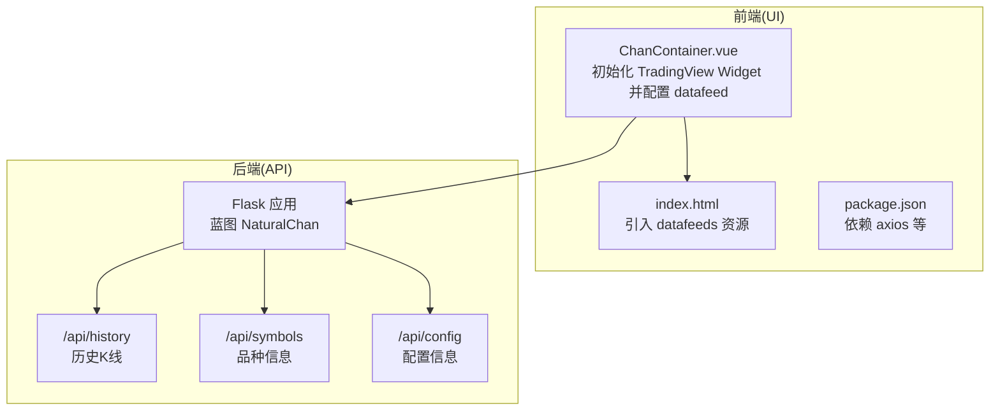
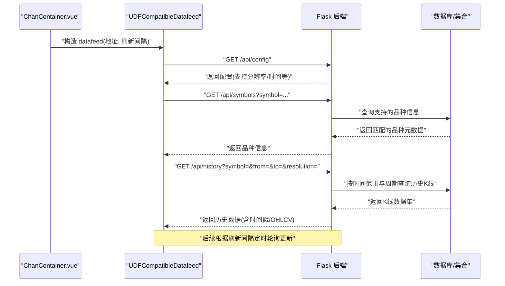
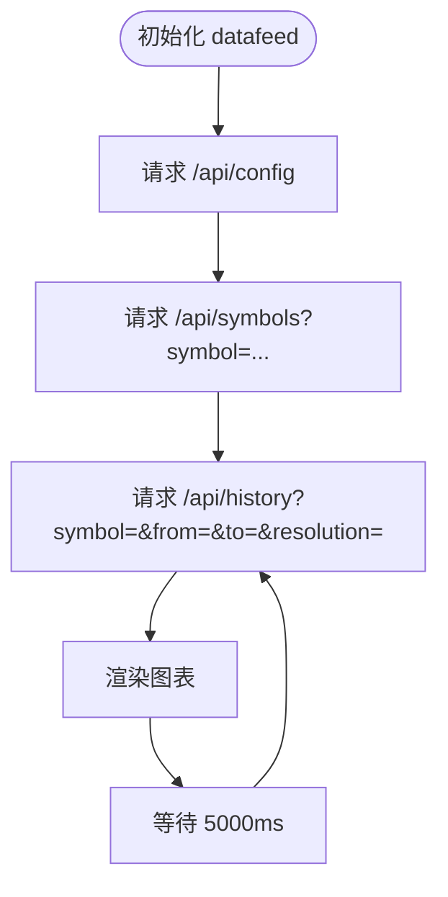
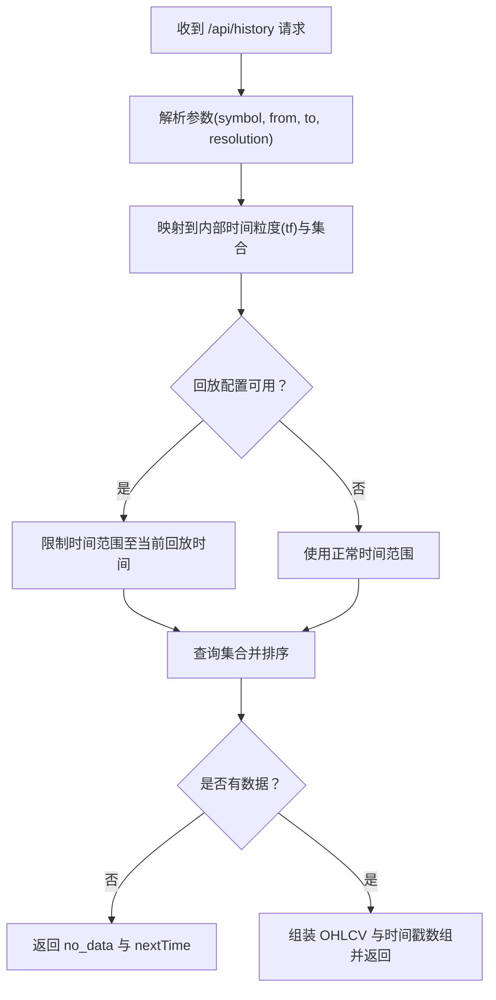
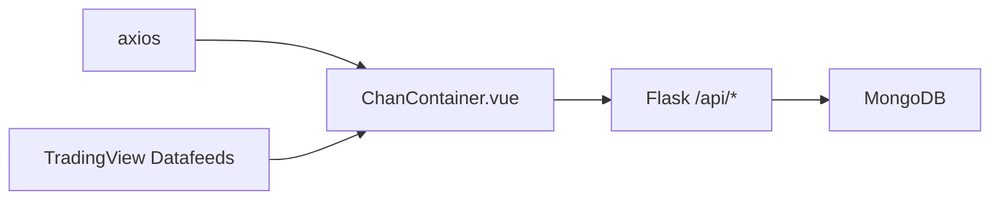

# 数据馈送配置

<cite>
**本文引用的文件**
- [ChanContainer.vue](file://ui/src/components/ChanContainer.vue)
- [chanapi.py](file://api/chanapi.py)
- [symbol_info.py](file://api/symbol_info.py)
- [index.html](file://ui/public/index.html)
- [package.json](file://ui/package.json)
- [CLAUDE.md](file://ui/CLAUDE.md)
</cite>

## 目录
1. [简介](#简介)
2. [项目结构](#项目结构)
3. [核心组件](#核心组件)
4. [架构总览](#架构总览)
5. [详细组件分析](#详细组件分析)
6. [依赖关系分析](#依赖关系分析)
7. [性能考量](#性能考量)
8. [故障排查指南](#故障排查指南)
9. [结论](#结论)

## 简介
本文聚焦于 ChanContainer.vue 中的 datafeed 配置与实现机制，系统阐述 UDFCompatibleDatafeed 如何与本地 API 服务（http://127.0.0.1:8421/api）交互，覆盖历史 K 线数据获取（/api/history）、品种信息查询（/api/symbols）、配置信息（/api/config）等接口的请求-响应模式；同时说明 5000ms 刷新间隔对实时数据更新的影响、跨域资源共享（CORS）配置需求，并给出数据馈送错误处理策略（网络中断时的重试机制与数据缓存方案）。

## 项目结构
- 前端采用 Vue 2.5 + TradingView Charting Library，数据馈送通过 UDFCompatibleDatafeed 适配 TradingView 的 UDF 协议。
- 后端基于 Flask，提供 /api/history、/api/symbols、/api/config 等接口，并启用 CORS 支持。
- 前端通过 public/index.html 引入 TradingView 的 datafeeds 资源，确保 UDFCompatibleDatafeed 可用。

**图表来源**
- [ChanContainer.vue](file://ui/src/components/ChanContainer.vue#L79-L128)
- [index.html](file://ui/public/index.html#L1-L19)
- [chanapi.py](file://api/chanapi.py#L41-L94)

**章节来源**
- [ChanContainer.vue](file://ui/src/components/ChanContainer.vue#L79-L128)
- [index.html](file://ui/public/index.html#L1-L19)
- [CLAUDE.md](file://ui/CLAUDE.md#L82-L120)

## 核心组件
- UDFCompatibleDatafeed：前端通过 TradingView 提供的 UDF 兼容数据馈送适配器，向后端 API 发起请求并接收响应，驱动图表渲染。
- 前端配置项：datafeedUrl、interval、libraryPath、chartsStorageUrl 等，决定数据来源与图表行为。
- 后端路由：/api/history、/api/symbols、/api/config，分别用于历史数据、品种信息与配置信息的查询。

**章节来源**
- [ChanContainer.vue](file://ui/src/components/ChanContainer.vue#L79-L128)
- [chanapi.py](file://api/chanapi.py#L41-L94)

## 架构总览
下图展示了前端与后端之间的交互流程，以及关键接口的调用顺序。

**图表来源**
- [ChanContainer.vue](file://ui/src/components/ChanContainer.vue#L79-L128)
- [chanapi.py](file://api/chanapi.py#L41-L94)
- [chanapi.py](file://api/chanapi.py#L96-L235)

## 详细组件分析

### UDFCompatibleDatafeed 与本地 API 的交互
- 数据馈送地址：datafeedUrl 指向 http://127.0.0.1:8421/api，前端通过 new window.Datafeeds.UDFCompatibleDatafeed(this.datafeedUrl, 5000) 初始化。
- 刷新间隔：第 80 行传入 5000（毫秒），表示每 5 秒触发一次数据轮询，用于拉取最新 K 线数据。
- 历史数据接口：/api/history 接收 symbol、from、to、resolution 参数，返回包含时间戳数组与 OHLCV 的 JSON。
- 品种信息接口：/api/symbols 返回匹配的品种元数据，包含价格精度、交易时段、时间周期等。
- 配置信息接口：/api/config 返回支持的分辨率、时间范围等配置。

**图表来源**
- [ChanContainer.vue](file://ui/src/components/ChanContainer.vue#L79-L128)
- [chanapi.py](file://api/chanapi.py#L41-L94)
- [chanapi.py](file://api/chanapi.py#L96-L235)

**章节来源**
- [ChanContainer.vue](file://ui/src/components/ChanContainer.vue#L79-L128)
- [chanapi.py](file://api/chanapi.py#L41-L94)
- [chanapi.py](file://api/chanapi.py#L96-L235)

### 品种信息与支持分辨率
- 品种信息由 symbol_info.py 构建，包含名称、代码、价格精度、交易时段、时间周期等字段，供 /api/symbols 返回。
- 支持的时间分辨率在 /api/config 中声明，前端据此选择合适的 K 线周期。

**章节来源**
- [symbol_info.py](file://api/symbol_info.py#L1-L74)
- [chanapi.py](file://api/chanapi.py#L41-L94)

### 历史 K 线数据获取逻辑
- /api/history 接口解析请求参数（symbol、from、to、resolution），映射到内部时间粒度与数据库集合，按时间范围查询并排序返回。
- 若无数据，返回状态码与 nextTime 字段，指示下次可继续拉取的时间点。
- 对于回放/回测场景，会根据回放配置与当前时间戳，处理“部分K线”（partial_k）逻辑，确保大周期的最后一个周期不越界。

**图表来源**
- [chanapi.py](file://api/chanapi.py#L96-L235)

**章节来源**
- [chanapi.py](file://api/chanapi.py#L96-L235)

### 5000ms 刷新间隔对实时更新的影响
- 刷新间隔为 5000ms，意味着前端每 5 秒会向后端发起一次历史数据请求，以获取最新 K 线片段或补全数据。
- 对于高频实时场景，该间隔可能略显保守；若需更快更新，可在前端调整刷新间隔（需权衡网络与后端压力）。
- 后端 /api/history 在回放/回测模式下会结合回放配置，避免越界访问未来数据，保证一致性。

**章节来源**
- [ChanContainer.vue](file://ui/src/components/ChanContainer.vue#L79-L128)
- [chanapi.py](file://api/chanapi.py#L112-L170)

### 跨域资源共享（CORS）配置需求
- 后端通过 Flask 的 CORS 扩展启用跨域支持，允许来自前端开发服务器（默认 8080）的请求访问 /api/* 接口。
- 前端通过 public/index.html 引入 TradingView 的 datafeeds 资源，确保 UDFCompatibleDatafeed 可被正确加载与使用。

**章节来源**
- [chanapi.py](file://api/chanapi.py#L562-L568)
- [index.html](file://ui/public/index.html#L1-L19)

### 错误处理策略与数据缓存方案
- 网络中断时的重试机制：当前代码未显式实现自动重试；建议在前端封装 axios 拦截器或在 UDFCompatibleDatafeed 的回调中增加指数退避重试，避免频繁失败导致 UI 卡顿。
- 数据缓存方案：可在前端维护一个轻量级内存缓存（按 symbol+resolution 分组），在每次请求成功后写入，失败时优先读取缓存，降低对后端的压力。
- 用户提示与降级：在网络异常或无数据时，向用户显示提示信息，并在必要时切换到离线/只读模式，避免图表空白。

[本节为通用实践建议，不直接分析具体文件，故不附“章节来源”]

## 依赖关系分析
- 前端依赖
  - axios：用于非 UDF 的自定义指标数据请求（例如 get_ocean_ind、get_mas_ind 等）。
  - TradingView Charting Library：通过 public/index.html 引入 datafeeds 资源，使 UDFCompatibleDatafeed 可用。
- 后端依赖
  - Flask：提供 RESTful 接口。
  - Flask-CORS：启用跨域支持。
  - MongoDB：通过 PyMongo 访问历史数据与配置集合。

**图表来源**
- [package.json](file://ui/package.json#L1-L50)
- [index.html](file://ui/public/index.html#L1-L19)
- [chanapi.py](file://api/chanapi.py#L562-L568)

**章节来源**
- [package.json](file://ui/package.json#L1-L50)
- [index.html](file://ui/public/index.html#L1-L19)
- [chanapi.py](file://api/chanapi.py#L562-L568)

## 性能考量
- 刷新频率：5000ms 的轮询频率在大多数场景下可接受，但应避免过低导致数据陈旧、过高导致后端压力。
- 查询范围：/api/history 会按 from/to 限定范围，建议前端仅请求必要的时间窗口，减少数据传输与解析开销。
- 回放/回测：回放配置会影响最终查询范围与是否返回部分 K 线，避免一次性拉取过多历史数据。

[本节为通用指导，不直接分析具体文件，故不附“章节来源”]

## 故障排查指南
- 症状：图表不加载或空白
  - 检查后端服务是否启动且监听 8421 端口。
  - 确认 /api/config、/api/symbols、/api/history 是否可访问。
  - 检查浏览器控制台是否存在跨域错误。
- 症状：历史数据缺失
  - 核对 symbol 与 resolution 是否在支持列表内。
  - 检查 from/to 参数是否合理，是否被回放配置限制。
- 症状：实时更新不及时
  - 调整前端刷新间隔（谨慎评估后端负载）。
  - 确保网络稳定，必要时增加重试与缓存策略。

**章节来源**
- [CLAUDE.md](file://ui/CLAUDE.md#L132-L156)
- [chanapi.py](file://api/chanapi.py#L41-L94)
- [chanapi.py](file://api/chanapi.py#L96-L235)

## 结论
ChanContainer.vue 通过 UDFCompatibleDatafeed 将 TradingView 图表与本地 API 服务紧密耦合，实现了历史 K 线、品种信息与配置信息的标准化交互。5000ms 的刷新间隔在稳定性与实时性之间取得平衡，配合后端的回放/回测逻辑，确保了数据一致性。CORS 的启用解决了跨域访问问题。为进一步提升用户体验，建议补充前端重试与缓存策略，并在必要时优化刷新频率与查询范围。