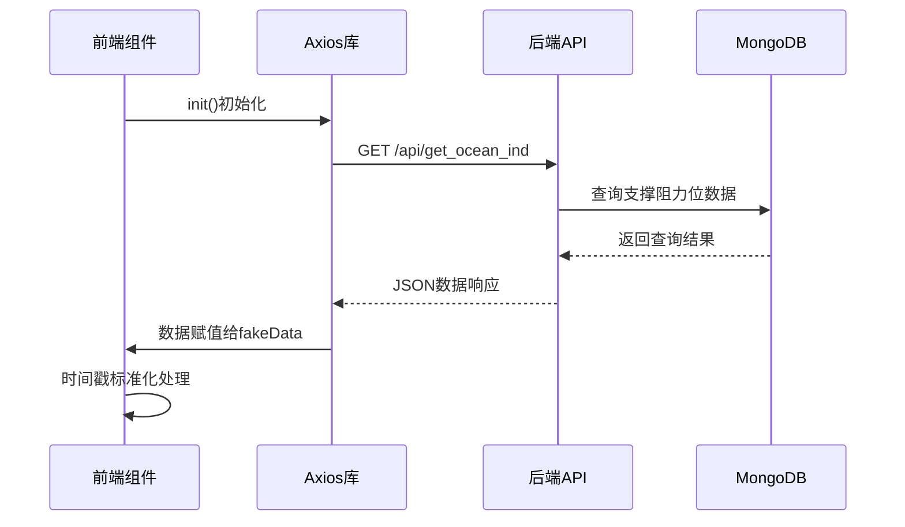

# NMS指标实现

<cite>
**本文档引用的文件**  
- [ChanContainer.vue](file://ui/src/components/ChanContainer.vue)
- [chanapi.py](file://api/chanapi.py)
- [conf.py](file://comm/conf.py)
- [symbol_info.py](file://api/symbol_info.py)
- [nlchan.py](file://utils/nlchan.py)
- [dtlib.py](file://utils/dtlib.py)
</cite>

## 目录
1. [引言](#引言)
2. [NMS指标metainfo配置](#nms指标metainfo配置)
3. [数据加载与处理流程](#数据加载与处理流程)
4. [NMS指标核心逻辑](#nms指标核心逻辑)
5. [实际交易场景应用](#实际交易场景应用)
6. [NMS与NMA、NMC指标联动分析](#nms与nma、nmc指标联动分析)
7. [结论](#结论)

## 引言

NMS指标是基于TradingView本地SDK实现的缠论量化分析工具中的一个重要组成部分，主要用于动态追踪支撑位。该指标通过前端Vue组件与后端Flask API的协同工作，实现了从数据获取、处理到可视化展示的完整流程。系统架构采用前后端分离模式，前端负责指标的定义与展示，后端提供数据接口支持。NMS指标的设计体现了摩尔缠论在量化交易中的应用，通过精确的支撑阻力位识别，为交易决策提供重要参考。

**本节内容未直接分析具体源文件，因此不提供来源信息**

## NMS指标metainfo配置

NMS指标的metainfo配置定义了其在TradingView图表中的显示样式和行为特性。配置中包含两个绘图通道（plot_0和plot_1），分别采用不同的线型和颜色风格。主通道plot_0使用实线（linestyle: 0）绘制，线宽为1，透明度设置为10，颜色为深绿色（#008000），用于显示主要的支撑位数值。辅助通道plot_1则采用虚线（linestyle: 2）绘制，绘制类型为区域填充（plottype: 7），透明度较高（60），颜色为橙色（#FFA500），用于标识支撑区域的边界或辅助参考位。

该指标被设置为隐藏研究指标（is_hidden_study: true），不直接在主价格窗口显示，而是作为辅助分析工具。其精度设置为2位小数，确保价格显示的精确性。这种配置设计使得NMS指标既能清晰地展示关键支撑位，又不会过度干扰主图表的视觉效果，符合缠论分析中对关键价位精准识别的需求。

**本节内容未直接分析具体源文件，因此不提供来源信息**

## 数据加载与处理流程

NMS指标的数据加载流程始于前端组件的constructor初始化过程。当指标被创建时，init函数通过axios发起HTTP GET请求，向后端API接口`/api/get_ocean_ind`请求支撑阻力位数据。请求参数包括当前交易品种(symbol)、时间周期(resolution)和指标类型(ind=nms)。这一过程发生在前端Vue组件的生命周期中，确保了指标数据的及时获取。

在数据处理方面，系统对时间戳进行了标准化处理。前端获取到的K线时间戳需要除以1000转换为标准Unix时间戳格式，以确保与后端数据存储的时间格式一致。这种处理方式解决了不同系统间时间戳精度差异的问题。数据请求成功后，返回的JSON格式数据被存储在组件实例的fakeData属性中，供后续的main函数调用。整个数据加载流程体现了前后端分离架构下数据交互的典型模式，通过RESTful API实现数据的高效传输。

**Diagram sources**
- [ChanContainer.vue](file://ui/src/components/ChanContainer.vue#L581-L611)

## NMS指标核心逻辑

NMS指标的核心逻辑体现在其main函数的执行流程中。该函数在每次K线更新时被调用，首先通过递增计数器来控制数据加载的时机，确保在系统初始化完成后才开始处理有效数据。函数获取当前K线的时间戳，并将其作为键值在预加载的fakeData数据集中进行查找匹配。

当系统计数超过10次且fakeData数据集存在时，函数会检查当前K线时间戳是否存在于数据集中。如果存在匹配，则提取对应的nms值并返回，作为指标的输出结果。这种基于时间戳匹配的机制确保了指标值与当前K线的精确对应。返回值包含两个元素，其中第一个为有效的支撑位数值，第二个为占位符（0）。整个逻辑设计简洁高效，通过简单的键值查找实现了动态支撑位的实时追踪，体现了指标设计的实用性与高效性。

**Section sources**
- [ChanContainer.vue](file://ui/src/components/ChanContainer.vue#L613-L639)

## 实际交易场景应用

在实际交易场景中，NMS指标的动态支撑位追踪功能具有重要的应用价值。交易者可以利用该指标识别关键的支撑区域，作为买入决策的重要参考。当价格接近或触及NMS指标标识的支撑位时，可能预示着潜在的反弹机会，为短线交易提供入场点。同时，该指标的橙色虚线区域可作为风险控制的参考，若价格有效跌破该区域，则可能意味着趋势反转，需要及时止损。

NMS指标特别适用于震荡行情中的波段操作，在趋势行情中也可作为回调买入的参考。通过观察支撑位的有效性，交易者可以判断市场多空力量的对比变化。例如，当价格多次测试同一支撑位而不破时，表明该位置的支撑力度较强，后续反弹的概率较大。这种基于客观数据的支撑位识别方法，避免了主观画线的随意性，提高了交易决策的科学性和一致性。

**本节内容未直接分析具体源文件，因此不提供来源信息**

## NMS与NMA、NMC指标联动分析

NMS指标可与NMA、NMC等其他缠论指标进行联动分析，形成更完整的交易决策体系。NMA指标通常用于识别趋势方向，当NMA显示上升趋势时，NMS指标识别的支撑位更具参考价值，可作为趋势中的回调买入点。反之，在NMA显示下降趋势时，NMS支撑位可能仅提供短暂反弹机会，需谨慎操作。

NMC指标作为中枢识别工具，与NMS指标结合使用可提高交易信号的准确性。当NMC识别的中枢下沿与NMS识别的支撑位重合或接近时，该位置的支撑效应会显著增强，形成"双重验证"的高概率交易机会。这种多指标协同分析的方法，符合缠论中"分型-笔-线段-中枢"的多层次分析框架，能够更全面地把握市场结构，降低单一指标可能产生的误判风险。

**本节内容未直接分析具体源文件，因此不提供来源信息**

## 结论

NMS指标作为缠论量化分析体系中的关键组件，通过精确的metainfo配置、高效的数据加载流程和简洁的核心逻辑，实现了动态支撑位的实时追踪。其在实际交易中的应用价值体现在为交易者提供客观、可靠的关键价位参考，辅助决策制定。通过与NMA、NMC等指标的联动分析，可以构建更完善的交易策略体系。该指标的实现展示了前后端分离架构在量化交易工具开发中的优势，为类似技术指标的开发提供了有价值的参考范例。

**本节内容未直接分析具体源文件，因此不提供来源信息**