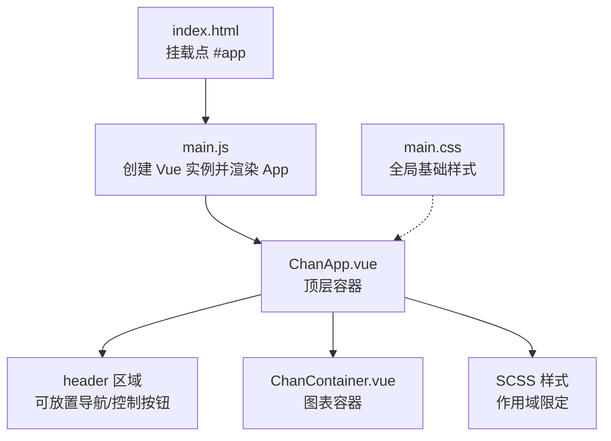
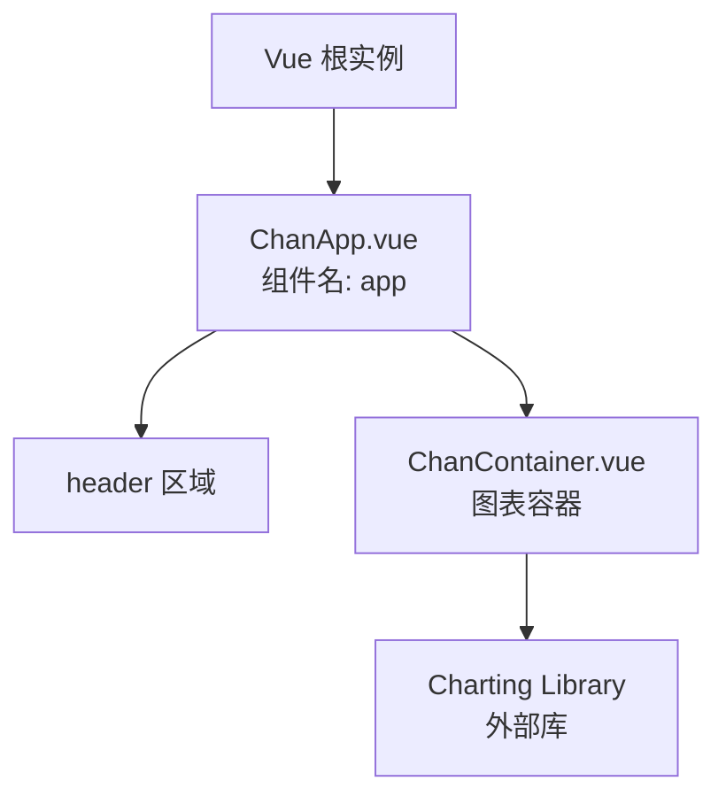
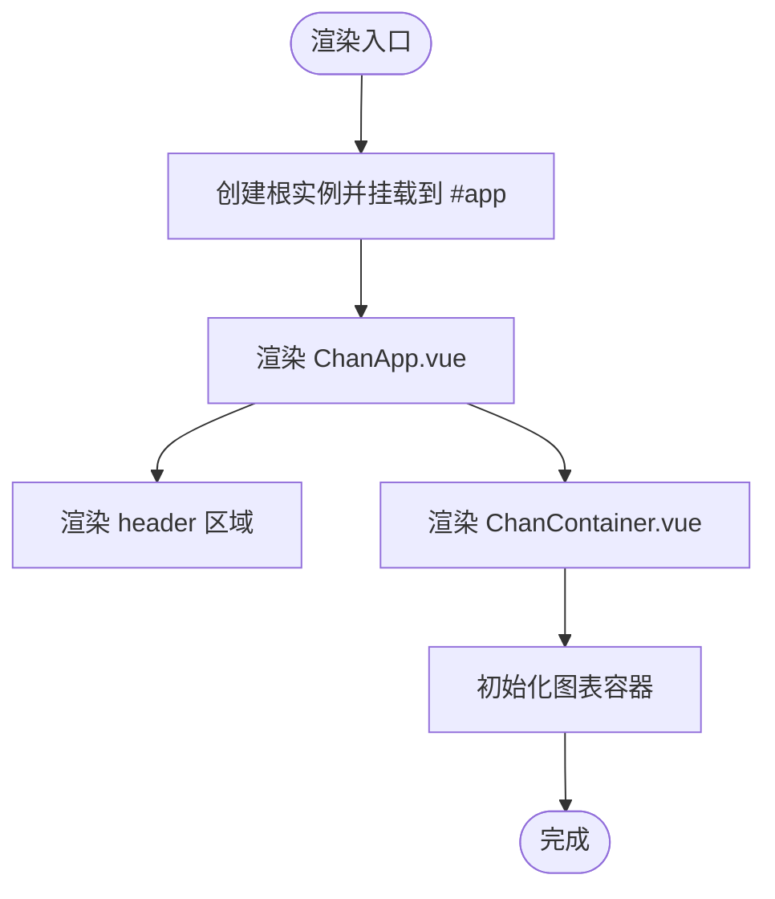
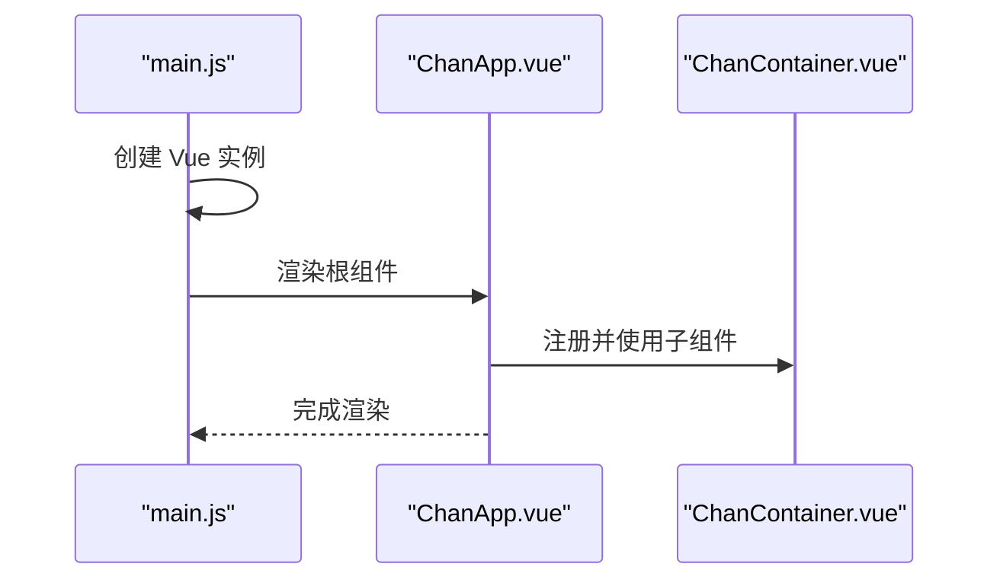
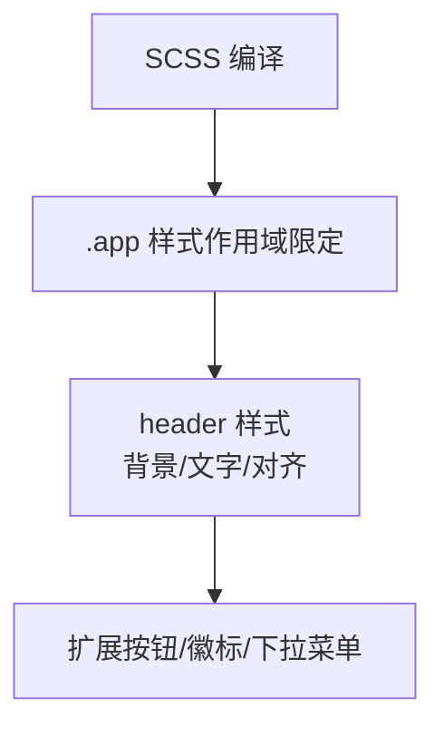
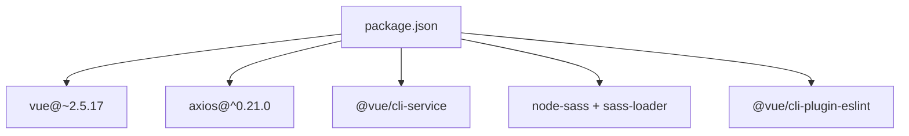

# 主应用组件结构

<cite>
**本文引用的文件**
- [ChanApp.vue](file://ui/src/ChanApp.vue)
- [ChanContainer.vue](file://ui/src/components/ChanContainer.vue)
- [main.js](file://ui/src/main.js)
- [main.css](file://ui/src/main.css)
- [index.html](file://ui/public/index.html)
- [package.json](file://ui/package.json)
</cite>

## 目录
1. [引言](#引言)
2. [项目结构](#项目结构)
3. [核心组件](#核心组件)
4. [架构总览](#架构总览)
5. [详细组件分析](#详细组件分析)
6. [依赖关系分析](#依赖关系分析)
7. [性能考虑](#性能考虑)
8. [故障排查指南](#故障排查指南)
9. [结论](#结论)
10. [附录](#附录)

## 引言
本文件聚焦于前端主应用组件 ChanApp.vue 的实现细节，系统性解析其模板结构、脚本注册流程与样式组织方式；同时阐明其在组件树中的顶层地位、header 区域的隐藏标题设计意图，并给出扩展主界面 UI 元素的实践建议。此外，还将结合 ChanContainer.vue 的职责边界，说明主应用如何通过该容器承载核心图表能力。

## 项目结构
ChanApp.vue 所在的前端工程位于 ui/src 目录，采用典型的单页应用结构：
- 入口文件 main.js 负责挂载根组件
- 根组件 ChanApp.vue 作为顶层容器，内部包含 header 与图表容器
- 图表容器 ChanContainer.vue 封装 TradingView Charting Library 的集成逻辑
- 样式方面，main.css 提供基础全局样式，ChanApp.vue 使用 SCSS 实现局部样式与作用域隔离

**图表来源**
- [index.html](file://ui/public/index.html#L16-L16)
- [main.js](file://ui/src/main.js#L9-L11)
- [ChanApp.vue](file://ui/src/ChanApp.vue#L1-L41)
- [ChanContainer.vue](file://ui/src/components/ChanContainer.vue#L1-L20)
- [main.css](file://ui/src/main.css#L1-L6)

**章节来源**
- [main.js](file://ui/src/main.js#L9-L11)
- [index.html](file://ui/public/index.html#L16-L16)
- [package.json](file://ui/package.json#L1-L24)

## 核心组件
本节从三个维度深入剖析 ChanApp.vue：
- 模板结构：通过 <ChanContainer /> 引入核心图表容器，header 区域预留 UI 扩展点
- 脚本注册：导入并注册 ChanContainer 组件，设置组件名称为 app
- 样式组织：使用 SCSS 编写局部样式，采用 BEM 风格与作用域隔离

关键要点：
- 模板层仅包含 header 与图表容器，体现“最小可用”的顶层布局
- header 中的标题被注释保留，便于后续按需启用
- 组件名称为 app，符合 Vue 命名规范，利于调试与工具链识别
- 样式采用 scoped 与 SCSS，避免全局污染，提升维护性

**章节来源**
- [ChanApp.vue](file://ui/src/ChanApp.vue#L1-L41)

## 架构总览
ChanApp.vue 在组件树中处于顶层位置，负责：
- 定义页面骨架与全局样式占位
- 作为图表容器的父级，向下传递必要的上下文或配置
- 为后续扩展 UI 控件（如菜单、工具栏、侧边栏等）提供挂载点

**图表来源**
- [main.js](file://ui/src/main.js#L9-L11)
- [ChanApp.vue](file://ui/src/ChanApp.vue#L1-L41)
- [ChanContainer.vue](file://ui/src/components/ChanContainer.vue#L1-L20)

## 详细组件分析

### 模板结构与布局设计
- 顶层容器使用类名 app，header 子节点用于放置标题或控制按钮
- header 内部标题默认被注释，体现了“隐藏标题”的设计意图：在不破坏结构的前提下，允许未来按需启用标题或替换为其他内容（如 Logo、导航）
- 图表容器通过 <ChanContainer /> 引入，作为唯一子节点承载核心可视化能力

**图表来源**
- [index.html](file://ui/public/index.html#L16-L16)
- [main.js](file://ui/src/main.js#L9-L11)
- [ChanApp.vue](file://ui/src/ChanApp.vue#L1-L41)
- [ChanContainer.vue](file://ui/src/components/ChanContainer.vue#L1-L20)

**章节来源**
- [ChanApp.vue](file://ui/src/ChanApp.vue#L1-L41)

### 脚本注册与组件树定位
- 导入路径指向 ./components/ChanContainer.vue，确保组件就近管理
- 注册组件后，可在模板中直接使用 <ChanContainer /> 标签
- 组件名称设置为 app，便于开发者工具与调试器识别

**图表来源**
- [main.js](file://ui/src/main.js#L9-L11)
- [ChanApp.vue](file://ui/src/ChanApp.vue#L12-L20)
- [ChanContainer.vue](file://ui/src/components/ChanContainer.vue#L1-L20)

**章节来源**
- [ChanApp.vue](file://ui/src/ChanApp.vue#L12-L20)
- [main.js](file://ui/src/main.js#L9-L11)

### 样式组织与主题风格
- 使用 SCSS 并开启 scoped，确保样式作用域限定在当前组件
- 采用 BEM 风格命名（例如 app__header、app__title），增强可读性与可维护性
- header 区域背景色与文字颜色形成对比，便于后续扩展控制按钮或徽标

**图表来源**
- [ChanApp.vue](file://ui/src/ChanApp.vue#L22-L41)
- [main.css](file://ui/src/main.css#L1-L6)

**章节来源**
- [ChanApp.vue](file://ui/src/ChanApp.vue#L22-L41)
- [main.css](file://ui/src/main.css#L1-L6)

### 头部区域隐藏标题的设计意图
- 当前 header 内标题被注释，保留了结构但不渲染文本，体现“留白即设计”的理念
- 设计意图包括：
  - 保持 header 的高度与间距，为后续放置 Logo 或控制按钮预留空间
  - 通过注释保留标题文案，便于未来快速启用
  - 降低首次加载的视觉复杂度，突出图表主体

**章节来源**
- [ChanApp.vue](file://ui/src/ChanApp.vue#L3-L7)

### 扩展主界面 UI 元素的实践建议
以下为基于现有结构的扩展指导，不直接展示具体代码，仅提供可操作的步骤与参考路径：
- 在 header 区域添加控制按钮或下拉菜单
  - 参考路径：[ChanApp.vue](file://ui/src/ChanApp.vue#L3-L7)
  - 建议：使用语义化标签与 aria 属性，配合 SCSS 定义尺寸与间距
- 在 header 内添加徽标或标题
  - 参考路径：[ChanApp.vue](file://ui/src/ChanApp.vue#L3-L7)
  - 建议：取消注释并调整样式，或新增一个标题元素，保持与 header 高度一致
- 在图表容器外增加侧边栏或工具面板
  - 参考路径：[ChanApp.vue](file://ui/src/ChanApp.vue#L1-L41)、[ChanContainer.vue](file://ui/src/components/ChanContainer.vue#L1-L20)
  - 建议：通过 props 向 ChanContainer 传递配置，或在 ChanApp.vue 中监听事件并更新状态
- 为按钮组或菜单项编写样式
  - 参考路径：[ChanApp.vue](file://ui/src/ChanApp.vue#L22-L41)
  - 建议：遵循 BEM 命名，使用 SCSS 变量统一颜色与字号

**章节来源**
- [ChanApp.vue](file://ui/src/ChanApp.vue#L1-L41)
- [ChanContainer.vue](file://ui/src/components/ChanContainer.vue#L1-L20)

## 依赖关系分析
- 运行时依赖
  - Vue 2.x：用于组件化与渲染
  - axios：用于图表指标数据请求（由 ChanContainer.vue 使用）
- 开发时依赖
  - @vue/cli-service：构建与开发服务器
  - node-sass 与 sass-loader：支持 SCSS 编译
  - eslint 插件：代码质量保障

**图表来源**
- [package.json](file://ui/package.json#L10-L24)

**章节来源**
- [package.json](file://ui/package.json#L10-L24)

## 性能考虑
- 组件拆分清晰，顶层仅承担布局职责，有利于按需渲染与懒加载
- SCSS 作用域避免样式冲突，减少重绘与回流
- 图表初始化由子组件负责，顶层不直接处理复杂逻辑，降低主线程压力

[本节为通用建议，无需特定文件引用]

## 故障排查指南
- 页面空白或未渲染
  - 检查入口挂载点是否存在：[index.html](file://ui/public/index.html#L16-L16)
  - 确认根组件渲染是否正确：[main.js](file://ui/src/main.js#L9-L11)
- 样式异常或覆盖
  - 确认 scoped 与 BEM 命名是否正确：[ChanApp.vue](file://ui/src/ChanApp.vue#L22-L41)
  - 检查全局样式是否影响局部组件：[main.css](file://ui/src/main.css#L1-L6)
- 图表未加载
  - 确认子组件已注册并正确渲染：[ChanApp.vue](file://ui/src/ChanApp.vue#L12-L20)
  - 检查外部库资源是否加载成功：[index.html](file://ui/public/index.html#L7-L9)

**章节来源**
- [index.html](file://ui/public/index.html#L7-L9)
- [main.js](file://ui/src/main.js#L9-L11)
- [ChanApp.vue](file://ui/src/ChanApp.vue#L12-L20)
- [main.css](file://ui/src/main.css#L1-L6)

## 结论
ChanApp.vue 以简洁的模板与明确的职责划分，构建了图表应用的顶层容器。通过 SCSS 与作用域样式保证了可维护性，通过 header 区域的“隐藏标题”设计为后续 UI 扩展预留了空间。配合 ChanContainer.vue 的图表集成，整体架构层次清晰、易于扩展与演进。

[本节为总结性内容，无需特定文件引用]

## 附录
- 组件命名规范
  - 组件名称为 app，符合 Vue 命名约定，便于调试与工具链识别
- 入口与挂载
  - 根实例挂载到 #app，确保页面渲染入口稳定
- 样式与主题
  - SCSS 与 BEM 命名提升可读性与可维护性；header 区域提供主题色与对比度的基础

**章节来源**
- [ChanApp.vue](file://ui/src/ChanApp.vue#L12-L20)
- [index.html](file://ui/public/index.html#L16-L16)