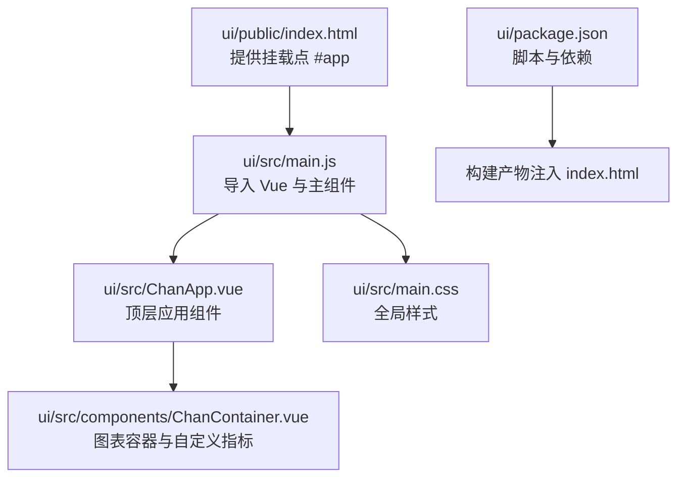
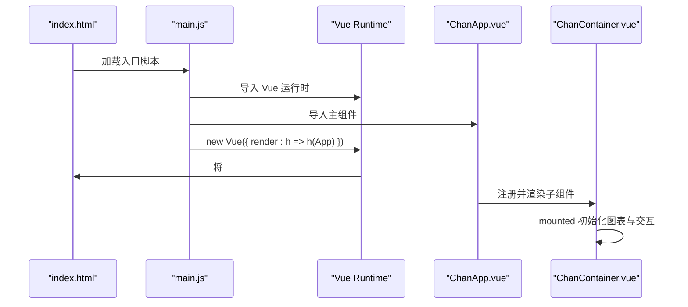
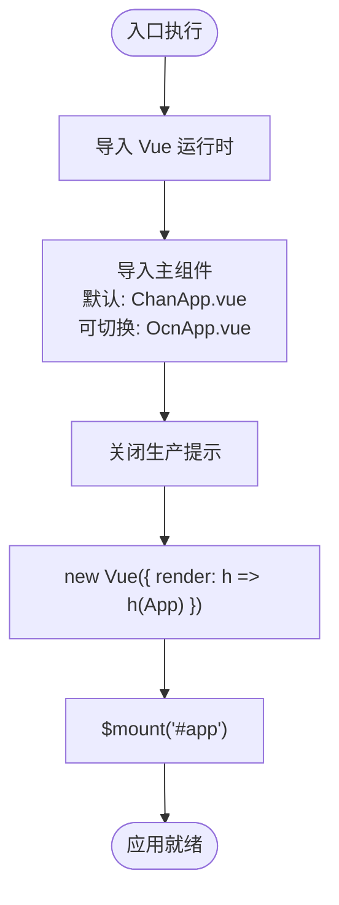
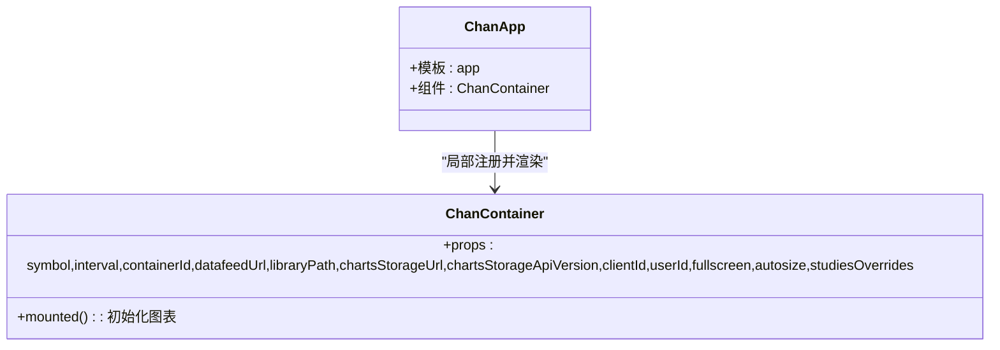
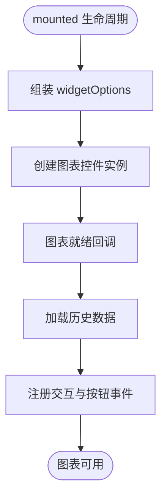
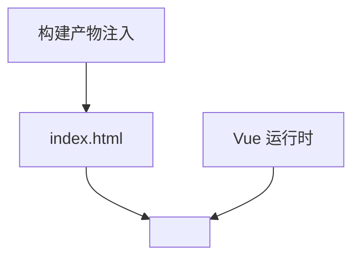
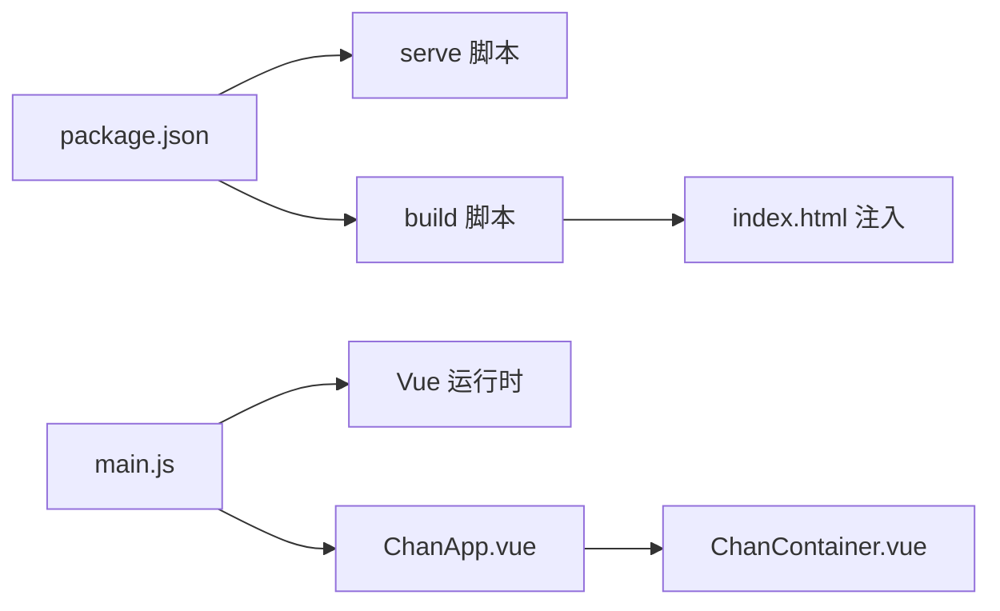

# 前端入口与应用初始化

<cite>
**本文引用的文件列表**
- [ui/src/main.js](file://ui/src/main.js)
- [ui/src/ChanApp.vue](file://ui/src/ChanApp.vue)
- [ui/src/components/ChanContainer.vue](file://ui/src/components/ChanContainer.vue)
- [ui/public/index.html](file://ui/public/index.html)
- [ui/package.json](file://ui/package.json)
- [ui/src/main.css](file://ui/src/main.css)
</cite>

## 目录
1. [引言](#引言)
2. [项目结构](#项目结构)
3. [核心组件](#核心组件)
4. [架构总览](#架构总览)
5. [详细组件分析](#详细组件分析)
6. [依赖关系分析](#依赖关系分析)
7. [性能考量](#性能考量)
8. [故障排查指南](#故障排查指南)
9. [结论](#结论)
10. [附录](#附录)

## 引言
本文件围绕前端入口文件 main.js 展开，系统性说明其作为 Vue 应用启动点的角色、初始化流程、与模板页面的挂载机制，以及在构建流程中的职责。同时给出常见问题排查方法与切换主应用组件的实践建议，帮助开发者快速理解并高效维护前端入口层。

## 项目结构
- 入口文件位于 ui/src/main.js，负责导入 Vue 运行时与主组件，关闭生产提示，并通过渲染函数挂载到 DOM。
- 主组件 ui/src/ChanApp.vue 是顶层容器，内部包含图表容器组件 ChanContainer.vue。
- 模板页面 ui/public/index.html 提供挂载点 div#app，由构建工具注入打包产物。
- 样式 ui/src/main.css 为全局基础样式。
- 构建与运行脚本由 ui/package.json 提供，基于 @vue/cli-service。

**图表来源**
- [ui/public/index.html](file://ui/public/index.html#L1-L20)
- [ui/src/main.js](file://ui/src/main.js#L1-L12)
- [ui/src/ChanApp.vue](file://ui/src/ChanApp.vue#L1-L41)
- [ui/src/components/ChanContainer.vue](file://ui/src/components/ChanContainer.vue#L1-L120)
- [ui/src/main.css](file://ui/src/main.css#L1-L6)
- [ui/package.json](file://ui/package.json#L1-L50)

**章节来源**
- [ui/src/main.js](file://ui/src/main.js#L1-L12)
- [ui/public/index.html](file://ui/public/index.html#L1-L20)
- [ui/package.json](file://ui/package.json#L1-L50)

## 核心组件
- main.js：应用启动入口
  - 导入 Vue 运行时与主组件（默认指向 ChanApp.vue；注释处展示了可切换至 OcnApp.vue 的方式）
  - 关闭生产提示，避免不必要的控制台提示干扰
  - 使用渲染函数创建根实例，并将实例挂载到 id 为 app 的 DOM 节点
- ChanApp.vue：顶层应用组件
  - 包含一个局部注册的子组件 ChanContainer
  - 提供基础布局与样式
- ChanContainer.vue：图表容器组件
  - 引入外部图表库资源
  - 在 mounted 生命周期内初始化图表控件，配置数据源、语言、覆盖项等
  - 提供多种自定义指标与标注按钮，通过 axios 与后端 API 交互
- index.html：模板页面
  - 提供挂载点 div#app
  - 注入外部数据源脚本与图标资源
- main.css：全局样式
  - 设置基础字体与边距
- package.json：构建与运行脚本
  - 提供 serve/build/lint 等命令，依赖 @vue/cli-service

**章节来源**
- [ui/src/main.js](file://ui/src/main.js#L1-L12)
- [ui/src/ChanApp.vue](file://ui/src/ChanApp.vue#L1-L41)
- [ui/src/components/ChanContainer.vue](file://ui/src/components/ChanContainer.vue#L1-L120)
- [ui/public/index.html](file://ui/public/index.html#L1-L20)
- [ui/src/main.css](file://ui/src/main.css#L1-L6)
- [ui/package.json](file://ui/package.json#L1-L50)

## 架构总览
下图展示从入口到挂载的关键路径与组件关系，体现 main.js 如何驱动应用启动与渲染。

**图表来源**
- [ui/public/index.html](file://ui/public/index.html#L1-L20)
- [ui/src/main.js](file://ui/src/main.js#L1-L12)
- [ui/src/ChanApp.vue](file://ui/src/ChanApp.vue#L1-L41)
- [ui/src/components/ChanContainer.vue](file://ui/src/components/ChanContainer.vue#L1-L120)

## 详细组件分析

### 入口文件 main.js 分析
- 导入与配置
  - 导入 Vue 运行时与主组件（默认导入 ChanApp.vue，注释处展示了可切换至 OcnApp.vue 的方式）
  - 关闭生产提示，减少开发期冗余输出
- 实例创建与挂载
  - 通过渲染函数 h => h(App) 创建根实例
  - 使用 $mount('#app') 将实例挂载到模板中的挂载点
- 与构建流程的关系
  - 构建工具会将打包后的 JS/CSS 注入到 index.html 的 body 中
  - 入口文件被构建系统识别并作为应用的起点

**图表来源**
- [ui/src/main.js](file://ui/src/main.js#L1-L12)

**章节来源**
- [ui/src/main.js](file://ui/src/main.js#L1-L12)

### 主组件 ChanApp.vue 分析
- 结构与职责
  - 顶层布局容器，内部包含子组件 ChanContainer
  - 提供基础样式与标题占位
- 组件关系
  - 通过局部注册的方式引入 ChanContainer
  - 作为应用的根节点，承载图表容器

**图表来源**
- [ui/src/ChanApp.vue](file://ui/src/ChanApp.vue#L1-L41)
- [ui/src/components/ChanContainer.vue](file://ui/src/components/ChanContainer.vue#L1-L120)

**章节来源**
- [ui/src/ChanApp.vue](file://ui/src/ChanApp.vue#L1-L41)

### 图表容器 ChanContainer.vue 分析
- 初始化与图表库集成
  - 在 mounted 生命周期中创建图表控件实例，设置数据源、语言、功能特性、存储地址、用户标识、尺寸与覆盖项等
- 数据与交互
  - 通过 axios 与后端 API 交互，获取指标数据与标注信息
  - 提供多种自定义按钮，用于绘制分型、中枢、买卖点等图形标记
- 复杂度与性能
  - 初始化阶段涉及大量配置与异步请求，需关注首屏加载时间与网络延迟
  - 指标与标注逻辑较为复杂，建议按需启用与懒加载

**图表来源**
- [ui/src/components/ChanContainer.vue](file://ui/src/components/ChanContainer.vue#L1-L120)

**章节来源**
- [ui/src/components/ChanContainer.vue](file://ui/src/components/ChanContainer.vue#L1-L120)

### 模板页面 index.html 与挂载机制
- 挂载点
  - 页面中存在 id 为 app 的 div，作为 Vue 实例的挂载目标
- 资源注入
  - 构建工具会在打包完成后自动注入构建产物
  - 页面头部引入外部数据源脚本与图标资源，确保图表功能正常

**图表来源**
- [ui/public/index.html](file://ui/public/index.html#L1-L20)

**章节来源**
- [ui/public/index.html](file://ui/public/index.html#L1-L20)

## 依赖关系分析
- 入口对运行时与组件的依赖
  - main.js 依赖 Vue 运行时与主组件
  - 主组件依赖子组件 ChanContainer
- 构建与运行链路
  - package.json 提供 serve/build/lint 脚本
  - 构建工具将入口文件与组件打包，并注入到 index.html
- 外部资源
  - 图表容器依赖外部数据源脚本与图表库资源

**图表来源**
- [ui/package.json](file://ui/package.json#L1-L50)
- [ui/src/main.js](file://ui/src/main.js#L1-L12)
- [ui/src/ChanApp.vue](file://ui/src/ChanApp.vue#L1-L41)
- [ui/src/components/ChanContainer.vue](file://ui/src/components/ChanContainer.vue#L1-L120)
- [ui/public/index.html](file://ui/public/index.html#L1-L20)

**章节来源**
- [ui/package.json](file://ui/package.json#L1-L50)

## 性能考量
- 首屏加载
  - 图表初始化涉及较多配置与异步请求，建议在路由或组件层面做懒加载，减少初始包体积
- 资源优化
  - 外部数据源脚本与图表库资源应按需加载，避免阻塞主线程
- 开发体验
  - 关闭生产提示可减少控制台噪音，便于调试
- 构建优化
  - 使用构建工具提供的压缩与分包策略，提升加载速度

[本节为通用指导，不直接分析具体文件，故无“章节来源”]

## 故障排查指南
- 组件未正确加载
  - 检查入口文件是否导入了正确的主组件（默认为 ChanApp.vue；注释处展示了可切换至 OcnApp.vue 的方式）
  - 确认 index.html 中存在 id 为 app 的挂载点
  - 查看浏览器控制台是否存在模块解析错误或运行时异常
- 图表不显示或报错
  - 检查外部数据源脚本与图表库资源是否成功注入
  - 确认 mounted 生命周期内的初始化逻辑是否执行
  - 关注网络面板，确认后端 API 可访问且返回格式正确
- 生产提示与调试
  - 若需要更详细的运行时信息，可在入口关闭生产提示的语句处临时注释，观察控制台输出
- 切换主应用组件进行调试
  - 在入口文件中将导入的主组件从 ChanApp.vue 切换到 OcnApp.vue（参考入口文件中的注释行），重新构建并运行

**章节来源**
- [ui/src/main.js](file://ui/src/main.js#L1-L12)
- [ui/public/index.html](file://ui/public/index.html#L1-L20)
- [ui/src/components/ChanContainer.vue](file://ui/src/components/ChanContainer.vue#L1-L120)

## 结论
main.js 作为 Vue 应用的启动入口，承担着导入运行时、导入主组件、关闭生产提示与挂载实例的关键职责。结合模板页面的挂载点与构建工具的注入机制，应用得以顺利启动并渲染主组件及其子组件。通过合理的依赖管理、资源优化与调试策略，可以有效提升应用的稳定性与开发效率。

[本节为总结性内容，不直接分析具体文件，故无“章节来源”]

## 附录
- 切换主应用组件
  - 在入口文件中将导入的主组件从 ChanApp.vue 切换到 OcnApp.vue（参考入口文件中的注释行），重新构建并运行
- 构建与运行
  - 使用 package.json 中提供的 serve/build/lint 脚本进行本地开发与打包

**章节来源**
- [ui/src/main.js](file://ui/src/main.js#L1-L12)
- [ui/package.json](file://ui/package.json#L1-L50)