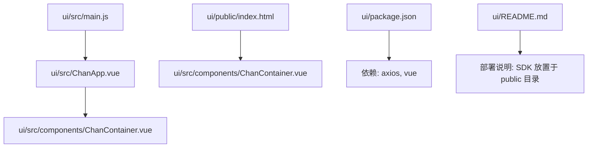
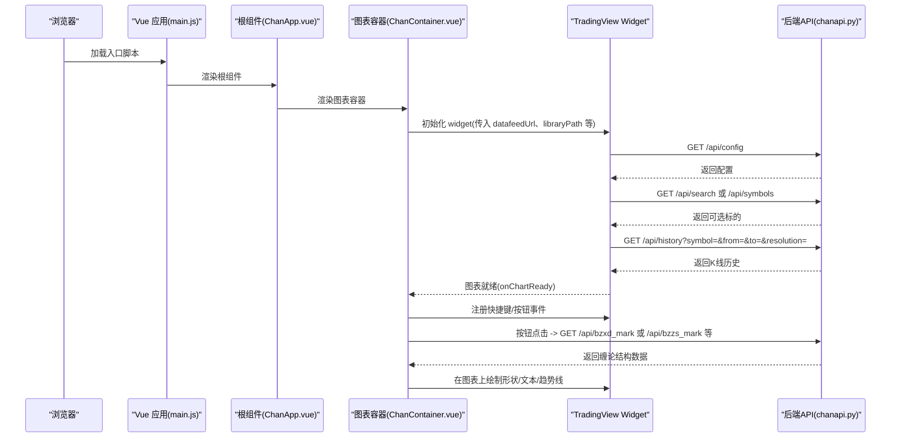
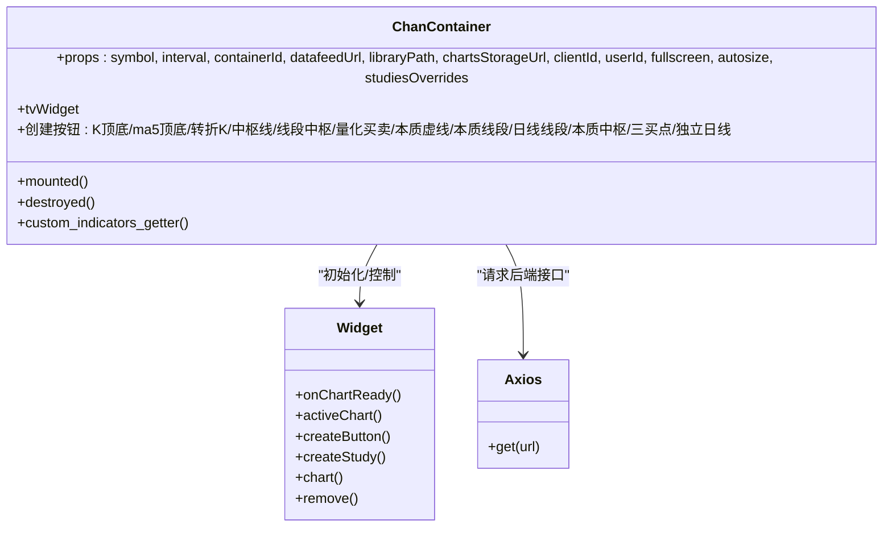
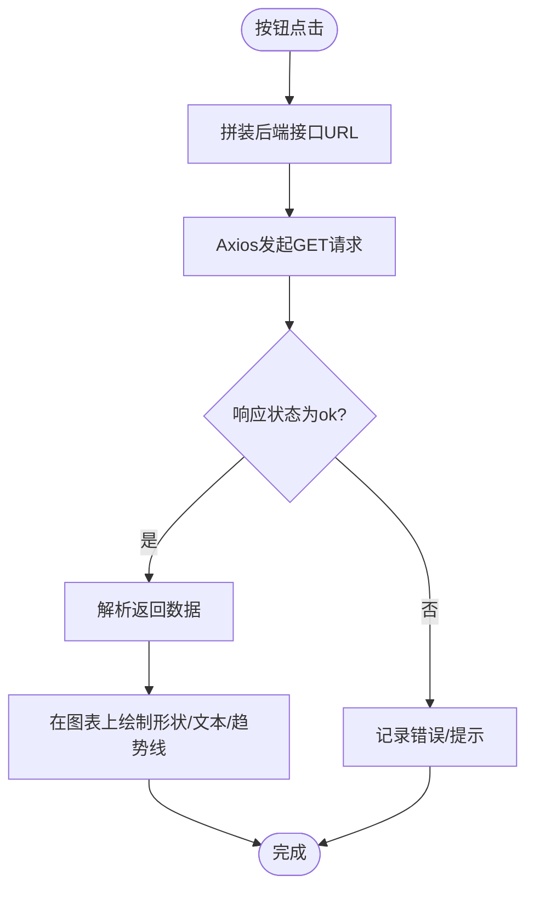
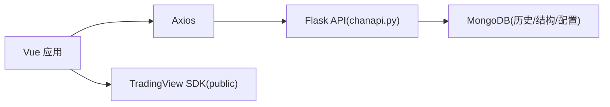

# 前端架构与组件设计

<cite>
**本文引用的文件**
- [ui/src/main.js](file://ui/src/main.js)
- [ui/src/ChanApp.vue](file://ui/src/ChanApp.vue)
- [ui/src/components/ChanContainer.vue](file://ui/src/components/ChanContainer.vue)
- [ui/public/index.html](file://ui/public/index.html)
- [ui/package.json](file://ui/package.json)
- [ui/src/main.css](file://ui/src/main.css)
- [ui/README.md](file://ui/README.md)
- [api/chanapi.py](file://api/chanapi.py)
- [comm/conf.py](file://comm/conf.py)
</cite>

## 目录
1. [引言](#引言)
2. [项目结构](#项目结构)
3. [核心组件](#核心组件)
4. [架构总览](#架构总览)
5. [详细组件分析](#详细组件分析)
6. [依赖关系分析](#依赖关系分析)
7. [性能考量](#性能考量)
8. [故障排查指南](#故障排查指南)
9. [结论](#结论)
10. [附录](#附录)

## 引言
本文件面向前端工程师与产品/运营人员，系统性梳理基于 Vue.js 的前端架构与组件设计，重点覆盖以下方面：
- 入口文件如何初始化应用
- 主组件结构与生命周期
- 图表容器组件如何封装 TradingView Charting Library 并集成自定义按钮与指标
- 前端如何通过 Axios 调用后端 API 获取 symbol、history、config 等数据，并将缠论结构渲染到图表上
- 组件间通信机制、props 传递、事件触发
- TradingView SDK 的放置要求与注意事项
- 常见问题与临时解决方案（例如“全量画线错位”的临时刷新）

## 项目结构
前端位于 ui 目录，采用 Vue CLI 3.x 构建，核心文件组织如下：
- 入口与根组件：main.js、ChanApp.vue
- 图表容器：ChanContainer.vue（封装 TradingView）
- HTML 模板：index.html（引入 TradingView 数据源脚本）
- 依赖与构建：package.json
- 样式：main.css
- 部署说明：README.md

**图表来源**
- [ui/src/main.js](file://ui/src/main.js#L1-L12)
- [ui/src/ChanApp.vue](file://ui/src/ChanApp.vue#L1-L41)
- [ui/src/components/ChanContainer.vue](file://ui/src/components/ChanContainer.vue#L1-L120)
- [ui/public/index.html](file://ui/public/index.html#L1-L20)
- [ui/package.json](file://ui/package.json#L1-L50)
- [ui/README.md](file://ui/README.md#L1-L38)

**章节来源**
- [ui/src/main.js](file://ui/src/main.js#L1-L12)
- [ui/src/ChanApp.vue](file://ui/src/ChanApp.vue#L1-L41)
- [ui/src/components/ChanContainer.vue](file://ui/src/components/ChanContainer.vue#L1-L120)
- [ui/public/index.html](file://ui/public/index.html#L1-L20)
- [ui/package.json](file://ui/package.json#L1-L50)
- [ui/README.md](file://ui/README.md#L1-L38)

## 核心组件
- 入口与根组件
  - main.js：创建 Vue 实例并挂载根组件 ChanApp.vue
  - ChanApp.vue：承载页面头部与图表容器，负责组件注册与样式
- 图表容器
  - ChanContainer.vue：封装 TradingView Charting Library，完成图表初始化、主题与图表类型设置、自定义按钮与指标集成、数据加载回调与事件绑定

**章节来源**
- [ui/src/main.js](file://ui/src/main.js#L1-L12)
- [ui/src/ChanApp.vue](file://ui/src/ChanApp.vue#L1-L41)
- [ui/src/components/ChanContainer.vue](file://ui/src/components/ChanContainer.vue#L1-L120)

## 架构总览
前端通过 Vue 应用启动后，渲染根组件，根组件内嵌图表容器。图表容器内部实例化 TradingView Widget，并通过 UDF Compatible Datafeed 与后端 API 对接，实现 symbol、history、config 等数据的获取与展示。同时，容器内置多种自定义按钮，用于在图表上绘制缠论结构（如线段、中枢、买卖点等），并通过 Axios 请求后端接口获取结构数据。

**图表来源**
- [ui/src/main.js](file://ui/src/main.js#L1-L12)
- [ui/src/ChanApp.vue](file://ui/src/ChanApp.vue#L1-L41)
- [ui/src/components/ChanContainer.vue](file://ui/src/components/ChanContainer.vue#L70-L120)
- [api/chanapi.py](file://api/chanapi.py#L41-L94)
- [api/chanapi.py](file://api/chanapi.py#L96-L235)
- [api/chanapi.py](file://api/chanapi.py#L280-L420)
- [api/chanapi.py](file://api/chanapi.py#L422-L491)

## 详细组件分析

### 入口与根组件
- 入口文件 main.js
  - 引入 Vue 与全局样式
  - 创建 Vue 实例并渲染根组件 ChanApp.vue
  - 将实例挂载到 DOM 节点 #app
- 根组件 ChanApp.vue
  - 提供基础布局与样式
  - 注册子组件 ChanContainer.vue
  - 通过模板将图表容器嵌入页面

**章节来源**
- [ui/src/main.js](file://ui/src/main.js#L1-L12)
- [ui/src/ChanApp.vue](file://ui/src/ChanApp.vue#L1-L41)

### 图表容器组件（ChanContainer.vue）
- 图表初始化与配置
  - 通过 props 接收 symbol、interval、containerId、datafeedUrl、libraryPath、chartsStorageUrl、clientId、userId、fullscreen、autosize、studiesOverrides 等参数
  - 使用 widget(options) 初始化 TradingView Widget
  - 设置语言、功能开关、存储、用户标识、尺寸、偏好等
- 数据源对接
  - 使用 UDF Compatible Datafeed，向后端 API 发起请求
  - 通过 /api/config、/api/search、/api/symbols、/api/history 获取配置、标的与历史数据
- 自定义按钮与事件
  - 在图表就绪后，通过 headerReady 创建多个按钮，分别用于：
    - K顶底、ma5顶底、转折K、中枢线、线段中枢、量化买卖、本质虚线、本质线段、日线线段、本质中枢、三买点、独立日线等
  - 每个按钮点击后，通过 Axios 请求后端接口（如 /api/bzxd_mark、/api/bzzs_mark 等），解析返回数据并在图表上绘制形状或文本
- 指标集成
  - 通过 custom_indicators_getter 注册自定义 PineScript 指标（如 NMA、NMM、NMC、NMS、NMC2、NDX、NST、NDX_NST、NXC、MSH、MA34XD 等）
  - 指标内部通过 Axios 请求后端接口（如 /api/get_ocean_ind、/api/get_mas_ind、/api/get_ma34xd）获取数据，按时间戳映射到图表
- 生命周期与资源清理
  - mounted 中初始化图表与按钮
  - destroyed 中移除图表实例，避免内存泄漏

**图表来源**
- [ui/src/components/ChanContainer.vue](file://ui/src/components/ChanContainer.vue#L1-L120)
- [ui/src/components/ChanContainer.vue](file://ui/src/components/ChanContainer.vue#L1570-L1599)
- [ui/src/components/ChanContainer.vue](file://ui/src/components/ChanContainer.vue#L1600-L1650)
- [ui/src/components/ChanContainer.vue](file://ui/src/components/ChanContainer.vue#L1743-L2076)
- [ui/src/components/ChanContainer.vue](file://ui/src/components/ChanContainer.vue#L2078-L2193)
- [ui/src/components/ChanContainer.vue](file://ui/src/components/ChanContainer.vue#L2195-L2376)
- [ui/src/components/ChanContainer.vue](file://ui/src/components/ChanContainer.vue#L2378-L2444)
- [ui/src/components/ChanContainer.vue](file://ui/src/components/ChanContainer.vue#L2446-L2492)
- [ui/src/components/ChanContainer.vue](file://ui/src/components/ChanContainer.vue#L2494-L2541)
- [ui/src/components/ChanContainer.vue](file://ui/src/components/ChanContainer.vue#L2566-L2590)
- [ui/src/components/ChanContainer.vue](file://ui/src/components/ChanContainer.vue#L2590-L2830)

**章节来源**
- [ui/src/components/ChanContainer.vue](file://ui/src/components/ChanContainer.vue#L1-L120)
- [ui/src/components/ChanContainer.vue](file://ui/src/components/ChanContainer.vue#L1570-L1599)
- [ui/src/components/ChanContainer.vue](file://ui/src/components/ChanContainer.vue#L1600-L1650)
- [ui/src/components/ChanContainer.vue](file://ui/src/components/ChanContainer.vue#L1743-L2076)
- [ui/src/components/ChanContainer.vue](file://ui/src/components/ChanContainer.vue#L2078-L2193)
- [ui/src/components/ChanContainer.vue](file://ui/src/components/ChanContainer.vue#L2195-L2376)
- [ui/src/components/ChanContainer.vue](file://ui/src/components/ChanContainer.vue#L2378-L2444)
- [ui/src/components/ChanContainer.vue](file://ui/src/components/ChanContainer.vue#L2446-L2492)
- [ui/src/components/ChanContainer.vue](file://ui/src/components/ChanContainer.vue#L2494-L2541)
- [ui/src/components/ChanContainer.vue](file://ui/src/components/ChanContainer.vue#L2566-L2590)
- [ui/src/components/ChanContainer.vue](file://ui/src/components/ChanContainer.vue#L2590-L2830)

### API 调用流程（Axios）
- 历史数据
  - 路径：/api/history
  - 参数：symbol、from、to、resolution
  - 返回：K线时间序列与 OHLCV 数据
- 配置
  - 路径：/api/config
  - 返回：支持的分辨率、时间等配置
- 标的搜索与详情
  - 路径：/api/search、/api/symbols
  - 返回：支持的标的列表或指定标的详情
- 缠论结构标注
  - 路径：/api/bzxd_mark、/api/bzzs_mark
  - 返回：线段/中枢/买卖点等结构数据
- 指标数据
  - 路径：/api/get_ocean_ind、/api/get_mas_ind、/api/get_ma34xd
  - 返回：自定义指标所需的数据字典

**图表来源**
- [api/chanapi.py](file://api/chanapi.py#L41-L94)
- [api/chanapi.py](file://api/chanapi.py#L96-L235)
- [api/chanapi.py](file://api/chanapi.py#L280-L420)
- [api/chanapi.py](file://api/chanapi.py#L422-L491)

**章节来源**
- [api/chanapi.py](file://api/chanapi.py#L41-L94)
- [api/chanapi.py](file://api/chanapi.py#L96-L235)
- [api/chanapi.py](file://api/chanapi.py#L280-L420)
- [api/chanapi.py](file://api/chanapi.py#L422-L491)

### 组件间通信与事件
- 父子通信
  - 父组件 ChanApp.vue 通过模板包含子组件 ChanContainer.vue
  - 子组件通过 props 接收父层传入的 symbol、interval、datafeedUrl 等参数
- 事件绑定
  - mounted 生命周期内注册 onChartReady、headerReady、activeChart().onDataLoaded 等事件
  - headerReady 内部创建按钮并绑定 click 事件，事件内部通过 Axios 请求后端接口并绘制图表元素
- 全局变量
  - 在 mounted 中将 tvWidget、axios 等挂载到 window，便于在控制台调试与外部访问

**章节来源**
- [ui/src/ChanApp.vue](file://ui/src/ChanApp.vue#L1-L41)
- [ui/src/components/ChanContainer.vue](file://ui/src/components/ChanContainer.vue#L1570-L1599)
- [ui/src/components/ChanContainer.vue](file://ui/src/components/ChanContainer.vue#L1600-L1650)
- [ui/src/components/ChanContainer.vue](file://ui/src/components/ChanContainer.vue#L1652-L1676)

### TradingView SDK 技术要求
- SDK 必须放置于 public 目录
  - index.html 中通过 script 标签引入 datafeeds 的 bundle.js
  - ChanContainer.vue 通过 libraryPath 指向 /charting_library/
- 本地开发默认 datafeedUrl 指向 127.0.0.1:8421/api
- 若需中文文档与 SDK 来源说明，请参考 ui/README.md

**章节来源**
- [ui/public/index.html](file://ui/public/index.html#L1-L20)
- [ui/src/components/ChanContainer.vue](file://ui/src/components/ChanContainer.vue#L37-L45)
- [ui/README.md](file://ui/README.md#L1-L38)

## 依赖关系分析
- 前端依赖
  - axios：用于调用后端 API
  - vue：框架运行时
- 后端依赖
  - Flask：提供 /api/* 接口
  - MongoDB：存储历史数据与缠论结构
  - 配置映射：分辨率与时间周期映射、数据库连接等

**图表来源**
- [ui/package.json](file://ui/package.json#L1-L50)
- [api/chanapi.py](file://api/chanapi.py#L1-L60)
- [comm/conf.py](file://comm/conf.py#L1-L60)

**章节来源**
- [ui/package.json](file://ui/package.json#L1-L50)
- [api/chanapi.py](file://api/chanapi.py#L1-L60)
- [comm/conf.py](file://comm/conf.py#L1-L60)

## 性能考量
- 数据加载策略
  - 使用 UDF Compatible Datafeed，按需拉取历史数据，避免一次性加载全量数据
  - timeframe 设置为较短窗口，减少初始渲染压力
- 指标计算
  - 自定义指标通过后端接口返回数据，避免在前端进行复杂计算
- 图表绘制
  - 按钮点击触发局部绘制，避免重复全量重绘
- 资源管理
  - destroyed 生命周期中移除图表实例，防止内存泄漏

[本节为通用建议，不直接分析具体文件]

## 故障排查指南
- “全量画线错位”
  - 现象：在切换时间周期或全量加载后，之前绘制的线段/中枢与当前K线对不上
  - 临时方案：刷新页面，重新加载图表与数据
  - 原因定位：可能与时间戳映射、分辨率切换导致的索引不同步有关
- SDK 未找到
  - 现象：图表空白或报错
  - 检查：确认 public 目录下存在 charting_library 与 datafeeds，并且 index.html 已正确引入
- API 无法访问
  - 现象：历史数据或标注无法加载
  - 检查：确认后端服务已启动，端口与路径一致；检查跨域配置
- 按钮无响应
  - 现象：点击按钮无任何变化
  - 检查：确认 headerReady 已执行；检查按钮事件绑定与 Axios 请求返回

**章节来源**
- [ui/README.md](file://ui/README.md#L1-L38)
- [ui/src/components/ChanContainer.vue](file://ui/src/components/ChanContainer.vue#L1652-L1676)

## 结论
本前端架构以 Vue 为核心，通过 ChanContainer.vue 将 TradingView Charting Library 与后端 API 有机整合，实现了缠论结构的可视化标注与自定义指标集成。组件职责清晰、生命周期管理完善、事件驱动明确，具备良好的扩展性与可维护性。部署时务必遵循 SDK 放置要求，并结合后端配置与数据源，确保图表与标注的准确性与时序一致性。

[本节为总结性内容，不直接分析具体文件]

## 附录
- 开发与运行
  - 安装依赖：yarn/npm
  - 启动服务：yarn serve 或 npm run serve
  - 访问地址：http://127.0.0.1:8080/
- SDK 来源与中文文档链接请参考 ui/README.md

**章节来源**
- [ui/README.md](file://ui/README.md#L1-L38)