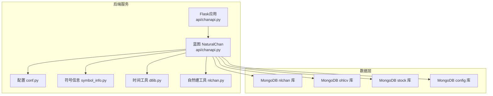
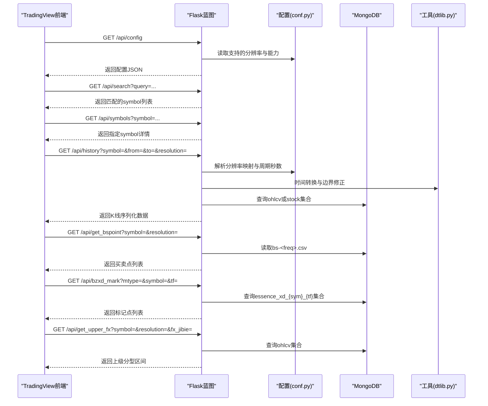
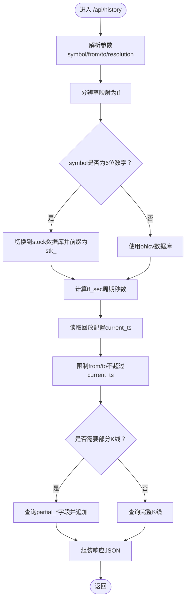
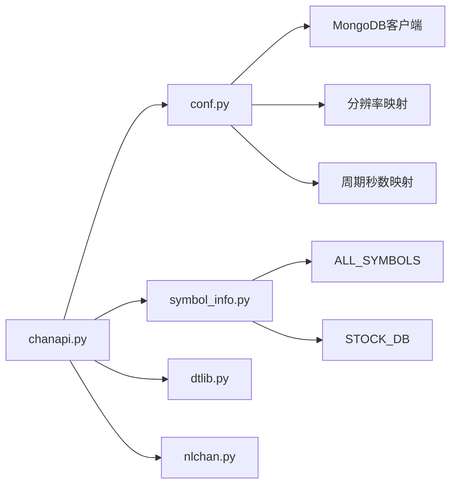

# API端点详解

<cite>
**本文引用的文件**
- [chanapi.py](file://api/chanapi.py)
- [symbol_info.py](file://api/symbol_info.py)
- [conf.py](file://comm/conf.py)
- [dtlib.py](file://utils/dtlib.py)
- [nlchan.py](file://utils/nlchan.py)
- [README.md](file://README.md)
</cite>

## 目录
1. [简介](#简介)
2. [项目结构](#项目结构)
3. [核心组件](#核心组件)
4. [架构总览](#架构总览)
5. [详细端点说明](#详细端点说明)
6. [依赖关系分析](#依赖关系分析)
7. [性能与扩展性](#性能与扩展性)
8. [故障排查指南](#故障排查指南)
9. [结论](#结论)
10. [附录：调用示例与集成要点](#附录调用示例与集成要点)

## 简介
本文件面向开发者与使用者，系统性梳理后端API模块（位于 api/chanapi.py）提供的RESTful接口，覆盖以下端点：
- /api/config：返回图表库支持的分辨率与搜索能力等配置
- /api/search：按关键词搜索支持的交易品种
- /api/symbols：获取指定symbol的详细信息
- /api/history：获取历史K线数据，解析from/to/resolution并说明MongoDB查询逻辑
- /api/get_bspoint：获取买卖点数据，说明CSV文件读取逻辑
- /api/bzxd_mark：获取线段标记数据，解释不同mtype参数的处理逻辑
- /api/get_upper_fx：获取上级分型数据

同时解释这些API如何与TradingView Charting Library集成，以及数据序列化与时间戳处理机制。

## 项目结构
后端采用Flask蓝图组织路由，核心文件如下：
- api/chanapi.py：定义所有REST端点与业务逻辑
- api/symbol_info.py：构建支持的symbol列表与描述信息
- comm/conf.py：全局配置，含MongoDB连接、分辨率映射、时间周期映射等
- utils/dtlib.py：时间戳与日期转换工具
- utils/nlchan.py：符号精度计算等辅助

**图表来源**
- [chanapi.py](file://api/chanapi.py#L23-L60)
- [conf.py](file://comm/conf.py#L143-L158)

**章节来源**
- [chanapi.py](file://api/chanapi.py#L23-L60)
- [conf.py](file://comm/conf.py#L143-L158)

## 核心组件
- Flask蓝图：统一注册路由前缀与CORS跨域支持
- MongoDB客户端：通过配置连接nlchan、ohlcv、stock、config库
- 分辨率映射：将前端传入的分辨率字符串映射到内部时间周期标识
- 时间周期映射：将时间周期映射为秒数，用于边界与偏移计算
- 符号信息：构建支持的symbol列表，包含名称、价格刻度、交易时段等

**章节来源**
- [chanapi.py](file://api/chanapi.py#L23-L60)
- [conf.py](file://comm/conf.py#L12-L31)
- [symbol_info.py](file://api/symbol_info.py#L1-L74)

## 架构总览
后端通过蓝图集中管理路由，各端点按职责划分：
- 配置与符号：/api/config、/api/search、/api/symbols
- 历史数据：/api/history
- 标记与买卖点：/api/get_bspoint、/api/bzxd_mark
- 上级分型：/api/get_upper_fx

**图表来源**
- [chanapi.py](file://api/chanapi.py#L41-L558)
- [conf.py](file://comm/conf.py#L12-L31)
- [dtlib.py](file://utils/dtlib.py#L148-L154)

## 详细端点说明

### /api/config
- 方法：GET
- 功能：返回图表库支持的能力配置，如分辨率、是否支持搜索、是否支持时间轴等
- 请求参数：无
- 响应格式：JSON对象，包含支持的分辨率数组、搜索能力、时间轴支持等键
- 错误码：无显式错误码，失败由HTTP状态码体现
- 实际调用示例：GET http://host:port/api/config

**章节来源**
- [chanapi.py](file://api/chanapi.py#L41-L59)

### /api/search
- 方法：GET
- 功能：根据query关键词过滤支持的symbol列表；query=all时返回全部
- 请求参数：
  - query：字符串，关键词或“all”
- 响应格式：JSON数组，元素为symbol对象
- 错误码：无显式错误码
- 实际调用示例：GET http://host:port/api/search?query=BTC

**章节来源**
- [chanapi.py](file://api/chanapi.py#L61-L75)
- [symbol_info.py](file://api/symbol_info.py#L1-L74)

### /api/symbols
- 方法：GET
- 功能：返回指定symbol的详细信息（名称、交易所、价格刻度、类型等）
- 请求参数：
  - symbol：字符串，目标symbol
- 响应格式：JSON对象，包含symbol详情；未匹配返回空对象
- 错误码：无显式错误码
- 实际调用示例：GET http://host:port/api/symbols?symbol=BTC

**章节来源**
- [chanapi.py](file://api/chanapi.py#L77-L94)
- [symbol_info.py](file://api/symbol_info.py#L1-L74)

### /api/history
- 方法：GET
- 功能：获取历史K线数据，解析from/to/resolution并从MongoDB查询
- 请求参数：
  - symbol：字符串，标的代码（币种或股票代码）
  - from：整数，起始Unix时间戳
  - to：整数，结束Unix时间戳
  - resolution：字符串，如“1”、“5”、“30”、“240”、“1D”、“1W”、“1M”
- 响应格式：JSON对象，包含状态码、时间数组、日期数组、开盘价数组、最高价数组、最低价数组、收盘价数组、成交量数组
- 错误码：
  - s=no_data：表示无数据，返回nextTime为最新时间戳
- 数据库查询逻辑：
  - 解析resolution为内部周期tf（通过分辨率映射）
  - 若symbol为6位数字，则视为股票，切换到stock数据库并前缀为stk_
  - 计算tf_sec（周期秒数），并与回放配置中的current_ts对比，必要时截断to并插入部分K线
  - 查询集合<symbol>_<tf>，按ts升序返回
- 时间戳与序列化：
  - ts字段为整数Unix时间戳
  - datetime字段为字符串格式“YYYY-MM-DD HH:MM:SS”
- 实际调用示例：GET http://host:port/api/history?symbol=BTC&from=1690000000&to=1690006000&resolution=1D

**图表来源**
- [chanapi.py](file://api/chanapi.py#L96-L234)
- [conf.py](file://comm/conf.py#L12-L31)
- [dtlib.py](file://utils/dtlib.py#L148-L154)

**章节来源**
- [chanapi.py](file://api/chanapi.py#L96-L234)
- [conf.py](file://comm/conf.py#L12-L31)
- [dtlib.py](file://utils/dtlib.py#L148-L154)

### /api/get_bspoint
- 方法：GET
- 功能：获取买卖点数据，来源于CSV文件
- 请求参数：
  - symbol：字符串，币种或市场（BTC/BHCoin映射为btc；SH映射为sh）
  - resolution：字符串，前端分辨率字符串
- 响应格式：JSON对象，包含status与data数组；data元素为{dt, bs_type}
- CSV读取逻辑：
  - 将前端resolution映射为tf（如1D映射为1440，1W映射为10080）
  - 读取DATA_PATH/<sym>/bs-<freq>.csv，逐行解析，提取日期与买卖类型
- 实际调用示例：GET http://host:port/api/get_bspoint?symbol=BTC&resolution=1D

**章节来源**
- [chanapi.py](file://api/chanapi.py#L244-L278)
- [conf.py](file://comm/conf.py#L10-L11)

### /api/bzxd_mark
- 方法：GET
- 功能：获取线段标记数据，支持多种mtype筛选
- 请求参数：
  - mtype：字符串，标记类型，如zzk、ma5_dg、xd_dg、xd_dg_extended、kline_dg、zs_line、xdzs、bspoint
  - symbol：字符串，标的代码
  - tf：字符串，前端时间周期
- 响应格式：JSON对象，包含status与data数组
- mtype处理逻辑：
  - zzk：筛选包含xddg_ind且xd_dg状态为ok/merged/extended/divergence的zzk字段
  - ma5_dg：筛选包含xddg_ind且xd_dg状态为ok/merged/extended/divergence的ma5字段
  - xd_dg：筛选包含xddg_ind且xd_dg状态为ok/last的xd_dg字段
  - xd_dg_extended：筛选包含xddg_ind且xd_dg状态为ok/last/extended/merged/divergence，附加前后中枢存在标记
  - kline_dg：筛选包含xddg_ind且xd_dg状态为ok/merged/extended/divergence的xd_dg字段
  - zs_line：返回包含zs_line的对象，合并low/high等字段
  - xdzs：返回xdzs列表，过滤非ok状态，拼接zstype为zstext
  - bspoint：直接查询bs_point_{sym}_{tf}集合
- 实际调用示例：GET http://host:port/api/bzxd_mark?mtype=zzk&symbol=BTC&tf=1

**章节来源**
- [chanapi.py](file://api/chanapi.py#L280-L419)

### /api/get_upper_fx
- 方法：GET
- 功能：获取上级分型数据，按父级别或祖级别构造区间
- 请求参数：
  - symbol：字符串，标的代码
  - resolution：字符串，当前级别
  - fx_jibie：字符串，层级选择（father或grandpa）
- 响应格式：JSON对象，包含status与data数组；每项包含start_dt、end_dt、high、low
- 处理逻辑：
  - 根据fx_jibie与resolution映射到更高一级的tf
  - 查询<symbol>_<tf>集合，按ts升序取最近400条记录
  - 两两配对构造相邻区间的start_dt/end_dt与high/low
- 实际调用示例：GET http://host:port/api/get_upper_fx?symbol=BTC&resolution=1&fx_jibie=father

**章节来源**
- [chanapi.py](file://api/chanapi.py#L494-L558)

## 依赖关系分析

**图表来源**
- [chanapi.py](file://api/chanapi.py#L17-L21)
- [conf.py](file://comm/conf.py#L12-L31)
- [symbol_info.py](file://api/symbol_info.py#L1-L74)

**章节来源**
- [chanapi.py](file://api/chanapi.py#L17-L21)
- [conf.py](file://comm/conf.py#L12-L31)
- [symbol_info.py](file://api/symbol_info.py#L1-L74)

## 性能与扩展性
- MongoDB索引建议：history查询基于ts字段排序与过滤，建议在集合<symbol>_<tf>上建立ts升序索引
- 分页与批量：当前history返回全量数据，建议在前端或后端增加分页参数（如limit/nextTime）以降低内存压力
- CSV读取：get_bspoint按行解析CSV，建议缓存或预处理以减少IO开销
- 回放配置：历史数据受回放配置影响，确保current_ts与tf一致，避免越界查询
- 时间戳处理：统一使用整数Unix时间戳，避免时区转换误差

[本节为通用建议，无需特定文件引用]

## 故障排查指南
- /api/history无数据
  - 检查from/to是否超过current_ts；确认symbol是否为6位数字（股票）并正确切换数据库
  - 确认resolution映射正确，集合命名<symbol>_<tf>是否存在
- /api/get_bspoint读取不到数据
  - 检查DATA_PATH路径与CSV文件名格式bs-<freq>.csv
  - 确认symbol映射（BTC/BHCoin→btc；SH→sh）
- /api/bzxd_mark返回空
  - 检查mtype是否合法，确认essence_xd_{sym}_{tf}集合存在且包含相应字段
- /api/get_upper_fx区间异常
  - 检查fx_jibie与resolution映射关系，确认查询集合存在且有足够历史数据

**章节来源**
- [chanapi.py](file://api/chanapi.py#L96-L234)
- [chanapi.py](file://api/chanapi.py#L244-L278)
- [chanapi.py](file://api/chanapi.py#L280-L419)
- [chanapi.py](file://api/chanapi.py#L494-L558)

## 结论
本API模块围绕TradingView Charting Library提供了完整的数据接入能力，涵盖配置、搜索、符号详情、历史K线、标记与买卖点、上级分型等。通过清晰的分辨率映射、回放配置与MongoDB集合命名规范，实现了与缠论结构数据的无缝对接。建议在生产环境进一步完善分页、缓存与索引策略，以提升性能与稳定性。

[本节为总结性内容，无需特定文件引用]

## 附录：调用示例与集成要点

- 与TradingView Charting Library集成要点
  - 使用/datafeeds/1.0/下的数据源适配器，调用/api/config、/api/search、/api/symbols、/api/history等端点
  - 历史数据返回的字段顺序与格式需与TV数据源协议保持一致（时间、开盘、最高、最低、收盘、成交量）
  - 标记点与买卖点通过/api/bzxd_mark与/api/get_bspoint返回，前端可直接渲染

- 时间戳与序列化
  - ts为整数Unix时间戳，datetime为字符串“YYYY-MM-DD HH:MM:SS”
  - 历史数据返回包含t（时间数组）、d（日期数组）、o/h/l/c/v（OHLCV数组）

- 实际调用示例（路径）
  - GET /api/config
  - GET /api/search?query=BTC
  - GET /api/symbols?symbol=BTC
  - GET /api/history?symbol=BTC&from=1690000000&to=1690006000&resolution=1D
  - GET /api/get_bspoint?symbol=BTC&resolution=1D
  - GET /api/bzxd_mark?mtype=zzk&symbol=BTC&tf=1
  - GET /api/get_upper_fx?symbol=BTC&resolution=1&fx_jibie=father

**章节来源**
- [chanapi.py](file://api/chanapi.py#L41-L558)
- [README.md](file://README.md#L91-L106)