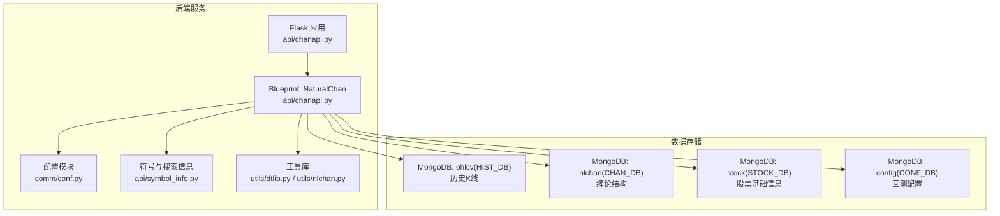
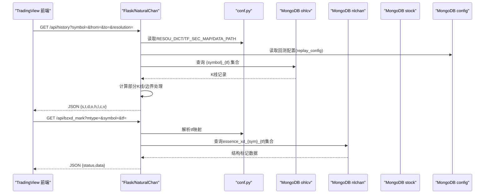
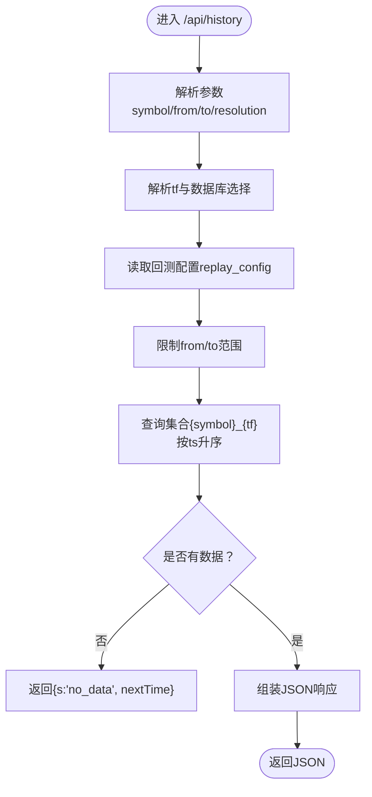
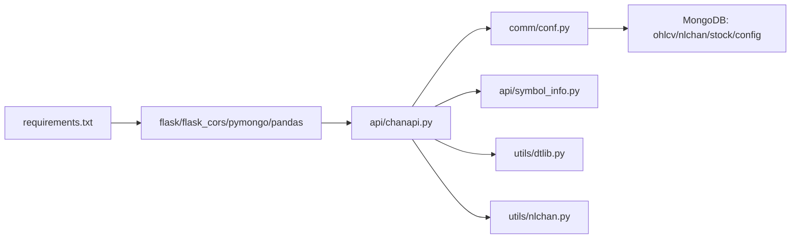

# 后端服务与API接口

<cite>
**本文引用的文件**
- [chanapi.py](file://api/chanapi.py)
- [symbol_info.py](file://api/symbol_info.py)
- [conf.py](file://comm/conf.py)
- [dtlib.py](file://utils/dtlib.py)
- [nlchan.py](file://utils/nlchan.py)
- [requirements.txt](file://api/requirements.txt)
- [README.md](file://README.md)
- [binance_syms.txt](file://hetl/selcoin/binance_syms.txt)
</cite>

## 目录
1. [简介](#简介)
2. [项目结构](#项目结构)
3. [核心组件](#核心组件)
4. [架构总览](#架构总览)
5. [详细组件分析](#详细组件分析)
6. [依赖分析](#依赖分析)
7. [性能考虑](#性能考虑)
8. [故障排查指南](#故障排查指南)
9. [结论](#结论)
10. [附录](#附录)

## 简介
本文件面向后端架构与API接口文档目标，聚焦于Flask应用的实现机制，系统性阐述以下内容：
- 在chanapi.py中暴露的RESTful API端点：/api/config、/api/search、/api/symbols、/api/history、/api/get_bspoint、/api/bzxd_mark等，包括HTTP方法、请求参数、响应格式及业务逻辑。
- symbol_info.py如何加载股票名称用于搜索功能。
- conf.py如何管理数据库连接和全局配置。
- API如何从MongoDB查询K线数据和缠论结构并序列化为JSON返回。
- API调用示例与错误处理策略。
- 如何通过修改配置切换数据源或调整服务端口。

## 项目结构
后端服务采用“Flask + Blueprint + MongoDB”的分层设计，核心入口位于api/chanapi.py，配置集中于comm/conf.py，搜索与符号信息由api/symbol_info.py提供，时间与数据转换工具位于utils/dtlib.py与utils/nlchan.py。

图表来源
- [chanapi.py](file://api/chanapi.py#L23-L60)
- [conf.py](file://comm/conf.py#L143-L147)

章节来源
- [README.md](file://README.md#L91-L136)

## 核心组件
- Flask应用与蓝图：在chanapi.py中创建Flask实例与Blueprint，注册多个路由端点，统一处理跨域与本地调试运行。
- 配置中心：conf.py集中管理MongoDB连接、时间分辨率映射、数据路径、符号清单与常量。
- 符号与搜索：symbol_info.py从配置与MongoDB加载币种与股票信息，生成前端可搜索的符号列表。
- 工具库：dtlib提供时间戳与字符串互转、历史数据标准化；nlchan提供价格精度计算。

章节来源
- [chanapi.py](file://api/chanapi.py#L23-L60)
- [conf.py](file://comm/conf.py#L12-L31)
- [symbol_info.py](file://api/symbol_info.py#L1-L70)
- [dtlib.py](file://utils/dtlib.py#L148-L164)
- [nlchan.py](file://utils/nlchan.py#L6-L25)

## 架构总览
后端服务通过Flask Blueprint对外提供REST API，内部依赖conf.py中的数据库连接与配置映射，数据来源于MongoDB的ohlcv、nlchan、stock、config四个库。API负责将MongoDB查询结果序列化为JSON返回给前端。

图表来源
- [chanapi.py](file://api/chanapi.py#L96-L234)
- [chanapi.py](file://api/chanapi.py#L280-L419)
- [conf.py](file://comm/conf.py#L12-L31)
- [conf.py](file://comm/conf.py#L143-L147)

## 详细组件分析

### 组件A：Flask应用与蓝图
- 应用初始化：创建Flask实例与Blueprint，注册CORS中间件，本地调试时绑定host与port。
- 蓝图注册：将各路由函数注册到NaturalChan蓝图，统一URL前缀。
- 错误处理：提供通用参数校验函数，返回标准JSON错误体。

章节来源
- [chanapi.py](file://api/chanapi.py#L23-L60)
- [chanapi.py](file://api/chanapi.py#L28-L39)
- [chanapi.py](file://api/chanapi.py#L560-L568)

### 组件B：配置管理(conf.py)
- 数据库连接：通过MongoClient建立连接，分别指向ohlcv、nlchan、stock、config数据库。
- 分辨率映射：RESOU_DICT将前端分辨率字符串映射到数据库集合后缀；TF_SEC_MAP提供周期秒数映射。
- 数据路径与集合命名：DATA_PATH指向data目录；ESSENCE_XD_COL/LNCHAN_XD_COL等模板用于构造集合名。
- 符号与时间范围：从hetl/selcoin/binance_syms.txt读取币种清单；维护日期起始时间戳映射。

章节来源
- [conf.py](file://comm/conf.py#L143-L147)
- [conf.py](file://comm/conf.py#L12-L20)
- [conf.py](file://comm/conf.py#L23-L31)
- [conf.py](file://comm/conf.py#L88-L109)
- [binance_syms.txt](file://hetl/selcoin/binance_syms.txt#L1-L118)

### 组件C：符号与搜索(symbol_info.py)
- 币种符号：从ALL_SYMBOLS构建SUPPORT_SYMBOLS，包含name、symbol、description、pricescale等字段。
- 股票符号：从STOCK_DB.stock_names读取股票名称，拼装成支持搜索的股票符号列表。
- 价格精度：利用utils/nlchan.sym_float根据minmov计算pricescale。

章节来源
- [symbol_info.py](file://api/symbol_info.py#L1-L70)
- [nlchan.py](file://utils/nlchan.py#L6-L25)
- [conf.py](file://comm/conf.py#L143-L147)

### 组件D：API端点详解

#### 端点：/api/config
- 方法：GET
- 作用：返回前端所需的配置信息，如支持的分辨率、是否支持marks、是否支持时间等。
- 响应：JSON对象，包含supports_search、supported_resolutions、supports_time等键。

章节来源
- [chanapi.py](file://api/chanapi.py#L41-L58)

#### 端点：/api/search
- 方法：GET
- 请求参数：
  - query：搜索关键字，若为all则返回全部支持的符号；否则按名称模糊匹配。
- 业务逻辑：基于正则表达式对SUPPORT_SYMBOLS进行过滤。
- 响应：JSON数组，元素为符号对象。

章节来源
- [chanapi.py](file://api/chanapi.py#L61-L73)
- [symbol_info.py](file://api/symbol_info.py#L1-L70)

#### 端点：/api/symbols
- 方法：GET
- 请求参数：
  - symbol：前端传入的符号片段，用于匹配name或symbol。
- 业务逻辑：遍历SUPPORT_SYMBOLS，使用正则匹配name或symbol，返回首个匹配项。
- 响应：JSON对象或空对象。

章节来源
- [chanapi.py](file://api/chanapi.py#L77-L94)
- [symbol_info.py](file://api/symbol_info.py#L1-L70)

#### 端点：/api/history
- 方法：GET
- 请求参数：
  - symbol：标的代码或名称（股票代码以数字开头会被识别为股票）。
  - from/to：Unix时间戳，查询起止时间。
  - resolution：K线周期，如1、5、30、240、1D、1W等。
- 业务逻辑：
  - 解析resolution到tf（如1D→1d），并根据symbol类型选择HIST_DB或STOCK_DB。
  - 读取回测配置replay_config，限制查询时间范围，必要时插入部分K线。
  - 查询集合{symbol}_{tf}，按ts升序返回。
  - 若无数据，返回状态码与nextTime。
- 响应：JSON对象，包含状态码、时间序列、开盘价、最高价、最低价、收盘价、成交量等字段。

图表来源
- [chanapi.py](file://api/chanapi.py#L96-L234)
- [conf.py](file://comm/conf.py#L12-L20)
- [conf.py](file://comm/conf.py#L143-L147)

章节来源
- [chanapi.py](file://api/chanapi.py#L96-L234)

#### 端点：/api/get_bspoint
- 方法：GET
- 请求参数：
  - symbol：标的名称（BTC/BHCoin等会被归一化为btc；SH归一化为sh）。
  - resolution：分辨率字符串，映射到tf后缀。
- 业务逻辑：读取DATA_PATH下对应CSV文件，解析买卖点标记，返回列表。
- 响应：JSON对象，包含status与data数组。

章节来源
- [chanapi.py](file://api/chanapi.py#L244-L277)
- [conf.py](file://comm/conf.py#L10-L11)

#### 端点：/api/bzxd_mark
- 方法：GET
- 请求参数：
  - mtype：标记类型，支持zzk、ma5_dg、xd_dg、xd_dg_extended、kline_dg、zs_line、xdzs、bspoint等。
  - symbol：标的名称。
  - tf：时间周期，映射到tf后缀。
- 业务逻辑：
  - 根据mtype选择不同查询条件与投影字段。
  - 对于xdzs、bspoint等特殊类型，构造复合数据结构。
  - 读取回测配置，限制dt不超过当前时间。
- 响应：JSON对象，包含status与data数组。

章节来源
- [chanapi.py](file://api/chanapi.py#L280-L419)
- [conf.py](file://comm/conf.py#L143-L147)

#### 其他端点
- /api/time：返回固定时间戳字符串。
- /api/bzzs_mark：与bzxd_mark类似，但处理线段中枢相关标记。
- /api/get_upper_fx：根据父级别或祖父级别分辨率，返回上层K线区段。

章节来源
- [chanapi.py](file://api/chanapi.py#L237-L242)
- [chanapi.py](file://api/chanapi.py#L422-L491)
- [chanapi.py](file://api/chanapi.py#L494-L558)

## 依赖分析
- Flask与CORS：本地调试启用CORS，便于前端跨域访问。
- MongoDB连接：通过conf.py集中管理，避免硬编码。
- 时间与数据转换：dtlib提供时间戳与字符串互转、历史数据标准化；nlchan提供价格精度计算。
- 依赖声明：requirements.txt列出flask、flask_cors、arrow、pymongo、pandas等。

图表来源
- [requirements.txt](file://api/requirements.txt#L1-L9)
- [chanapi.py](file://api/chanapi.py#L1-L20)
- [conf.py](file://comm/conf.py#L143-L147)

章节来源
- [requirements.txt](file://api/requirements.txt#L1-L9)
- [chanapi.py](file://api/chanapi.py#L1-L20)

## 性能考虑
- 查询排序与索引：history端点按ts升序查询，建议在集合{symbol}_{tf}上为ts建立索引以提升查询效率。
- 部分K线处理：回测场景下可能插入部分K线，注意避免重复与越界，确保时间范围限制逻辑正确。
- CSV读取：/api/get_bspoint依赖文件系统，建议缓存或异步加载，避免阻塞请求。
- 分辨率映射：RESOU_DICT与TF_SEC_MAP需与实际数据一致，避免查询集合名不匹配导致的性能问题。

## 故障排查指南
- 参数为空：通用参数校验函数返回标准错误JSON，检查前端是否传递必需参数。
- 无数据返回：history端点在无数据时返回状态码与nextTime，确认from/to与resolution是否合理。
- 符号不存在：/api/symbols与/search端点返回空对象或空数组，检查SUPPORT_SYMBOLS构建是否正确。
- 数据库连接失败：确认MongoDB服务运行与conf.py中的连接参数；检查数据库名称与集合命名模板。
- 时间范围异常：回测配置replay_config缺失或字段不完整会导致时间范围异常，检查config库中replay_config集合。

章节来源
- [chanapi.py](file://api/chanapi.py#L28-L39)
- [chanapi.py](file://api/chanapi.py#L215-L234)
- [symbol_info.py](file://api/symbol_info.py#L1-L70)
- [conf.py](file://comm/conf.py#L143-L147)

## 结论
本后端服务以Flask+Blueprint为核心，结合conf.py集中配置与MongoDB数据存储，实现了面向TradingView的K线与缠论结构API。通过清晰的端点划分、参数校验与响应格式，满足前端可视化与回测需求。建议在生产环境中完善索引、缓存与监控，确保高并发下的稳定性与性能。

## 附录

### API调用示例（不含具体代码）
- 获取配置
  - 请求：GET /api/config
  - 响应：包含supports_search、supported_resolutions等字段的JSON对象
- 搜索符号
  - 请求：GET /api/search?query=all 或 /api/search?query=关键词
  - 响应：符号列表JSON
- 获取符号详情
  - 请求：GET /api/symbols?symbol=关键词
  - 响应：符号对象或空对象
- 获取历史K线
  - 请求：GET /api/history?symbol=标的&from=起始时间戳&to=结束时间戳&resolution=周期
  - 响应：包含状态码与时间序列、OHLC、成交量的JSON对象
- 获取买卖点
  - 请求：GET /api/get_bspoint?symbol=标的&resolution=周期
  - 响应：包含status与data数组的JSON对象
- 获取线段标记
  - 请求：GET /api/bzxd_mark?mtype=标记类型&symbol=标的&tf=周期
  - 响应：包含status与data数组的JSON对象

### 错误处理策略
- 参数校验：对空参数返回标准错误JSON，包含code与msg字段。
- 无数据处理：history端点在无数据时返回状态码与nextTime，避免前端无限重试。
- 符号匹配：/api/symbols与/search端点返回空对象或空数组，提示前端重新输入。

### 修改配置切换数据源或调整端口
- 切换数据源：在conf.py中修改MongoDB连接参数（host/port/数据库名），确保集合命名模板与实际数据一致。
- 调整服务端口：在chanapi.py末尾的run函数中修改host与port参数，仅用于本地调试。

章节来源
- [chanapi.py](file://api/chanapi.py#L560-L568)
- [conf.py](file://comm/conf.py#L143-L147)