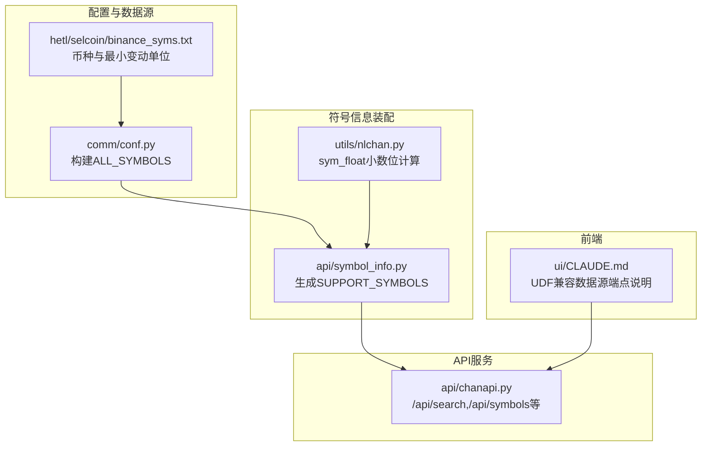
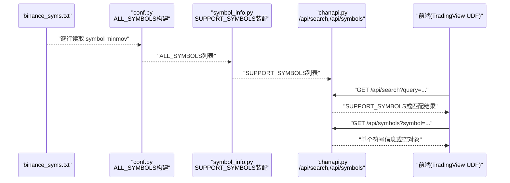
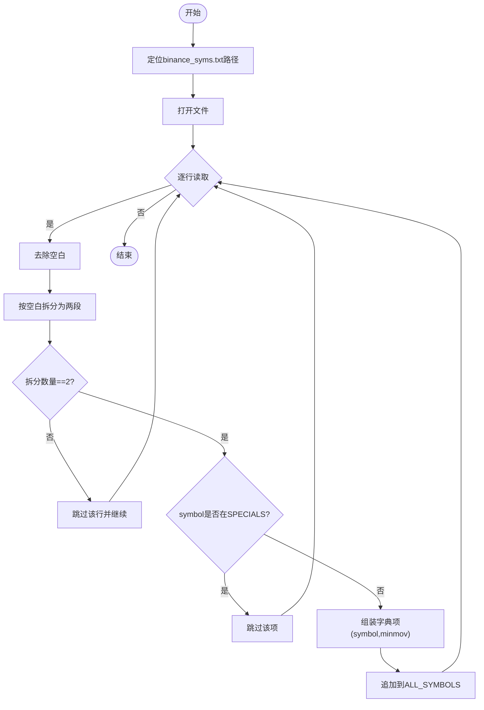
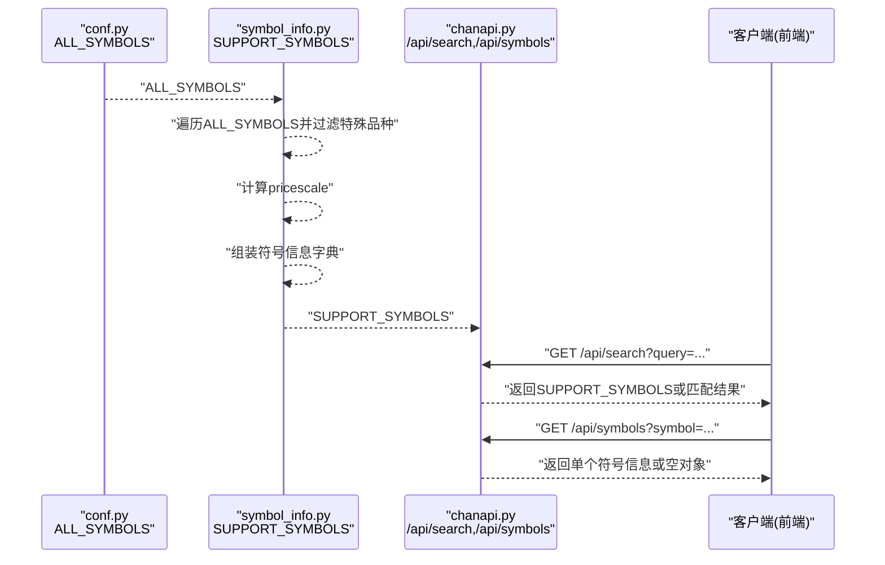
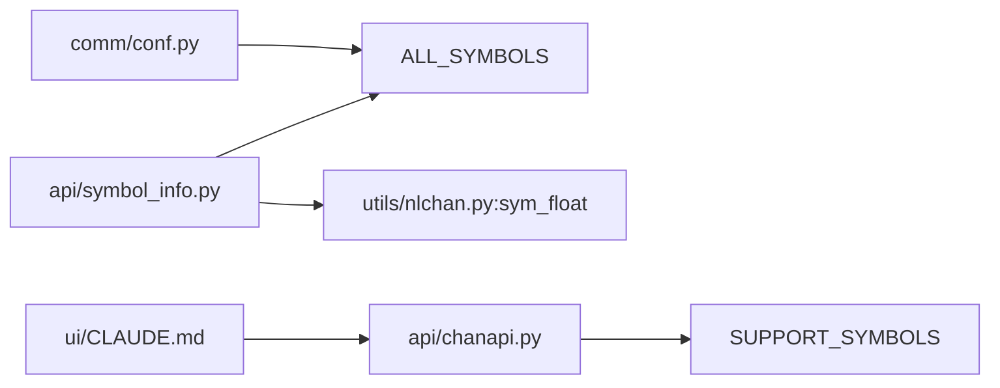

# 交易品种处理逻辑

<cite>
**本文引用的文件**
- [comm/conf.py](file://comm/conf.py)
- [api/symbol_info.py](file://api/symbol_info.py)
- [api/chanapi.py](file://api/chanapi.py)
- [hetl/selcoin/binance_syms.txt](file://hetl/selcoin/binance_syms.txt)
- [utils/nlchan.py](file://utils/nlchan.py)
- [ui/CLAUDE.md](file://ui/CLAUDE.md)
</cite>

## 目录
1. [简介](#简介)
2. [项目结构](#项目结构)
3. [核心组件](#核心组件)
4. [架构总览](#架构总览)
5. [详细组件分析](#详细组件分析)
6. [依赖关系分析](#依赖关系分析)
7. [性能考量](#性能考量)
8. [故障排查指南](#故障排查指南)
9. [结论](#结论)
10. [附录](#附录)

## 简介
本文件围绕交易品种处理逻辑展开，重点解析以下内容：
- conf.py 中 ALL_SYMBOLS 列表的构建流程：从文件读取、逐行解析、字段提取到字典结构组装的全过程。
- SPECIALS 特殊品种过滤机制的实现原理与业务意义。
- symbol_info.py 如何导入并利用 ALL_SYMBOLS 生成 SUPPORT_SYMBOLS 搜索支持列表，以及其对 /api/search 和 /api/symbols API 响应数据的影响路径。
- 结合代码片段路径展示数据流转过程，并讨论异常处理（如文件不存在、格式错误）的潜在风险与应对策略。

## 项目结构
该项目采用按功能模块划分的组织方式，与交易品种处理直接相关的核心文件如下：
- 配置与符号来源：comm/conf.py、hetl/selcoin/binance_syms.txt
- 符号信息装配：api/symbol_info.py、utils/nlchan.py
- API 接口：api/chanapi.py
- 前端集成说明：ui/CLAUDE.md（包含 /api/symbols 等端点说明）

**图表来源**
- [comm/conf.py](file://comm/conf.py#L90-L109)
- [hetl/selcoin/binance_syms.txt](file://hetl/selcoin/binance_syms.txt#L1-L118)
- [api/symbol_info.py](file://api/symbol_info.py#L1-L74)
- [utils/nlchan.py](file://utils/nlchan.py#L1-L25)
- [api/chanapi.py](file://api/chanapi.py#L61-L94)
- [ui/CLAUDE.md](file://ui/CLAUDE.md#L102-L116)

**章节来源**
- [comm/conf.py](file://comm/conf.py#L90-L109)
- [api/symbol_info.py](file://api/symbol_info.py#L1-L74)
- [api/chanapi.py](file://api/chanapi.py#L61-L94)
- [ui/CLAUDE.md](file://ui/CLAUDE.md#L102-L116)

## 核心组件
- ALL_SYMBOLS 构建器（conf.py）：负责从 binance_syms.txt 读取每行，拆分出 symbol 与 minmov，过滤 SPECIALS 后组装为字典项并加入 ALL_SYMBOLS。
- SUPPORT_SYMBOLS 生成器（symbol_info.py）：基于 ALL_SYMBOLS 逐项装配前端所需的符号信息结构，并额外注入股票信息，形成最终的搜索支持列表。
- API 层（chanapi.py）：提供 /api/search 与 /api/symbols 端点，前者返回全部或匹配的 SUPPORT_SYMBOLS，后者按查询参数返回单个符号信息。
- 工具函数（nlchan.py）：提供 sym_float，用于根据最小变动单位推导价格精度（pricescale）。

**章节来源**
- [comm/conf.py](file://comm/conf.py#L90-L109)
- [api/symbol_info.py](file://api/symbol_info.py#L1-L74)
- [api/chanapi.py](file://api/chanapi.py#L61-L94)
- [utils/nlchan.py](file://utils/nlchan.py#L1-L25)

## 架构总览
下图展示了从符号来源到 API 响应的关键数据流：

**图表来源**
- [hetl/selcoin/binance_syms.txt](file://hetl/selcoin/binance_syms.txt#L1-L118)
- [comm/conf.py](file://comm/conf.py#L90-L109)
- [api/symbol_info.py](file://api/symbol_info.py#L1-L74)
- [api/chanapi.py](file://api/chanapi.py#L61-L94)

## 详细组件分析

### ALL_SYMBOLS 构建流程（conf.py）
- 文件定位与读取
  - 根据 DEBUG 状态选择 debug 或正式文件路径，随后打开文件进行迭代读取。
- 行解析与字段提取
  - 对每行执行去空白处理，按空白字符拆分为两段，分别映射为 symbol 与 minmov。
- 特殊品种过滤（SPECIALS）
  - 若 symbol 在 SPECIALS 列表中，则跳过该项，不加入 ALL_SYMBOLS。
- 字典结构组装
  - 将 symbol 与 minmov 组装为字典项并追加到 ALL_SYMBOLS。
- 复杂度与性能
  - 时间复杂度 O(N)，N 为文件行数；空间复杂度 O(N)。
- 异常风险与应对
  - 文件不存在：open() 将抛出异常，需在启动阶段捕获并提示。
  - 行格式错误：split() 可能产生元素数量不一致，需增加断言或 try-except。
  - 建议：在读取前校验文件存在性与可读性；对每行进行严格格式校验；对异常进行统一处理并记录日志。

**图表来源**
- [comm/conf.py](file://comm/conf.py#L90-L109)

**章节来源**
- [comm/conf.py](file://comm/conf.py#L90-L109)

### SPECIALS 特殊品种过滤机制
- 实现位置：conf.py 中对读取到的 symbol 进行 in SPECIALS 判断，命中即跳过。
- 业务意义：
  - DAI、TUSD 等稳定币通常不参与传统“价格波动”分析，过滤可减少无关数据对后续处理的干扰。
  - 保证 SUPPORT_SYMBOLS 的纯净性，避免前端搜索结果中出现非目标交易对象。
- 与 symbol_info.py 的差异：
  - symbol_info.py 在生成 SUPPORT_SYMBOLS 时再次对 TUSD 进行过滤，确保最终输出不含该符号。
  - 这种双重过滤增强了健壮性，避免因配置变更导致的遗漏。

**章节来源**
- [comm/conf.py](file://comm/conf.py#L90-L109)
- [api/symbol_info.py](file://api/symbol_info.py#L1-L40)

### SUPPORT_SYMBOLS 生成与 API 影响路径
- 数据来源
  - 来自 conf.py 构建的 ALL_SYMBOLS。
- 生成逻辑
  - 遍历 ALL_SYMBOLS，取出 symbol 与 minmov。
  - 对 TUSD 再次过滤（与 SPECIALS 过滤互补）。
  - 使用 utils.nlchan.sym_float(minmov) 计算 pricescale。
  - 组装标准符号信息字典（包含 name、symbol、description、exchange、minmov、minmov2、pricescale、has_intraday、type、ticker、session、timezone、intraday_multipliers 等字段）。
  - 追加至 SUPPORT_SYMBOLS。
- 股票信息补充
  - 从 STOCK_DB 中查询股票基础信息，组装为股票类型的符号信息并追加到 SUPPORT_SYMBOLS。
- 对 /api/search 的影响
  - GET /api/search?query=all 返回完整 SUPPORT_SYMBOLS。
  - GET /api/search?query=xxx 返回按名称正则匹配的结果集。
- 对 /api/symbols 的影响
  - GET /api/symbols?symbol=xxx 返回与名称或代码匹配的第一个符号信息，否则返回空对象。

**图表来源**
- [api/symbol_info.py](file://api/symbol_info.py#L1-L74)
- [api/chanapi.py](file://api/chanapi.py#L61-L94)

**章节来源**
- [api/symbol_info.py](file://api/symbol_info.py#L1-L74)
- [api/chanapi.py](file://api/chanapi.py#L61-L94)

### sym_float 小数位计算（utils/nlchan.py）
- 功能：根据最小变动单位字符串推导价格精度（pricescale）与小数位数。
- 输入：minmov（字符串形式的最小变动单位）。
- 输出：(pricescale, bits)。
- 作用：为 SUPPORT_SYMBOLS 中的 pricescale 字段提供数值来源，确保前端显示与后端数据一致。

**章节来源**
- [utils/nlchan.py](file://utils/nlchan.py#L1-L25)

## 依赖关系分析
- conf.py 依赖
  - 文件系统：读取 hetl/selcoin/binance_syms.txt。
  - 第三方库：arrow（时间戳计算）、pymongo（数据库连接，但此处未直接使用）。
- symbol_info.py 依赖
  - 从 conf.py 导入 ALL_SYMBOLS 与 STOCK_DB。
  - 从 utils.nlchan 导入 sym_float。
- chanapi.py 依赖
  - 从 symbol_info 导入 SUPPORT_SYMBOLS。
  - 从 comm.conf 导入 RESOU_DICT、MAX_XD_LEN、STOCK_DB、TF_SEC_MAP、CHAN_DB、HIST_DB、CONF_DB 等配置与数据库连接。
- 前端依赖
  - ui/CLAUDE.md 明确了 TradingView UDF 兼容数据源端点，包括 /api/symbols。

**图表来源**
- [comm/conf.py](file://comm/conf.py#L90-L109)
- [api/symbol_info.py](file://api/symbol_info.py#L1-L74)
- [utils/nlchan.py](file://utils/nlchan.py#L1-L25)
- [api/chanapi.py](file://api/chanapi.py#L1-L40)
- [ui/CLAUDE.md](file://ui/CLAUDE.md#L102-L116)

**章节来源**
- [comm/conf.py](file://comm/conf.py#L90-L109)
- [api/symbol_info.py](file://api/symbol_info.py#L1-L74)
- [api/chanapi.py](file://api/chanapi.py#L1-L40)
- [ui/CLAUDE.md](file://ui/CLAUDE.md#L102-L116)

## 性能考量
- 文件读取与解析
  - 读取 binance_syms.txt 为 O(N) 操作，建议在应用启动时一次性完成，避免重复 IO。
- 字典组装与过滤
  - 过滤与组装均为 O(1) 操作，整体为 O(N)。
- SUPPORT_SYMBOLS 生成
  - 遍历 ALL_SYMBOLS，每次计算 pricescale 为 O(L)（L 为 minmov 字符串长度），总体 O(N*L)。
- 查询性能
  - /api/search 与 /api/symbols 为内存内查找，正则匹配在小规模数据集上开销可控；若数据量增大，建议：
    - 对 SUPPORT_SYMBOLS 建立索引（如 name、symbol 字段）。
    - 引入缓存层（Redis）以减少重复计算与数据库访问。
    - 优化正则表达式，必要时改为前缀匹配或精确匹配。

[本节为通用性能建议，不直接分析具体文件，故无“章节来源”]

## 故障排查指南
- 文件不存在
  - 现象：启动时报错，无法打开 binance_syms.txt。
  - 排查：确认文件路径与权限；检查 DEBUG 状态是否切换到正确文件名。
  - 应对：在启动入口处捕获异常并记录日志，提供默认值或退出码。
- 行格式错误
  - 现象：某行 split() 后元素数量不为 2，导致解包失败。
  - 排查：检查该行是否有多余空白、注释或空行。
  - 应对：在解析前进行断言或 try-except，记录异常行并跳过；或在导入脚本中预清洗。
- 特殊品种过滤不一致
  - 现象：SPECIALS 与 symbol_info.py 的过滤规则不一致，导致最终输出差异。
  - 排查：核对 SPECIALS 列表与 symbol_info.py 的过滤条件。
  - 应对：统一过滤逻辑，建议仅保留 conf.py 的 SPECIALS 过滤，symbol_info.py 的过滤作为兜底。
- pricescale 计算异常
  - 现象：minmov 格式不符合预期，导致 pricescale 计算错误。
  - 排查：检查 binance_syms.txt 中 minmov 的格式一致性。
  - 应对：在 conf.py 中对 minmov 进行格式校验，或在 symbol_info.py 中对 pricescale 计算增加边界保护。
- API 响应为空
  - 现象：/api/symbols 返回空对象。
  - 排查：确认 query 参数是否正确；确认 SUPPORT_SYMBOLS 是否已生成且包含目标符号。
  - 应对：在 API 层增加参数校验与默认返回值，便于前端调试。

**章节来源**
- [comm/conf.py](file://comm/conf.py#L90-L109)
- [api/symbol_info.py](file://api/symbol_info.py#L1-L74)
- [api/chanapi.py](file://api/chanapi.py#L61-L94)

## 结论
- ALL_SYMBOLS 的构建流程清晰、高效，遵循“文件读取—行解析—字段提取—过滤—组装”的线性步骤。
- SPECIALS 过滤与 symbol_info.py 的二次过滤共同保障了 SUPPORT_SYMBOLS 的纯净性，满足前端搜索与符号查询需求。
- /api/search 与 /api/symbols 的响应数据直接受 SUPPORT_SYMBOLS 影响，建议在生产环境中加强异常处理与性能优化，确保稳定与可维护性。

[本节为总结性内容，不直接分析具体文件，故无“章节来源”]

## 附录
- 前端 UDF 端点说明
  - /api/symbols：用于提供符号信息，供 TradingView UDF 数据源使用。
  - /api/config：提供配置信息（分辨率、时间范围等）。
  - /api/history：提供历史数据。
  - /api/search：提供搜索支持列表。

**章节来源**
- [ui/CLAUDE.md](file://ui/CLAUDE.md#L102-L116)