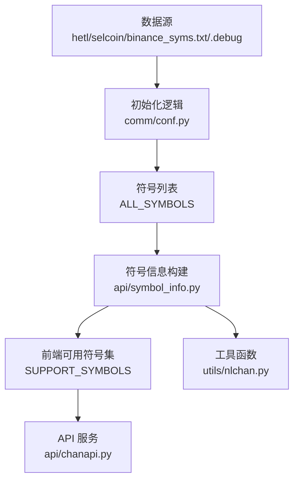
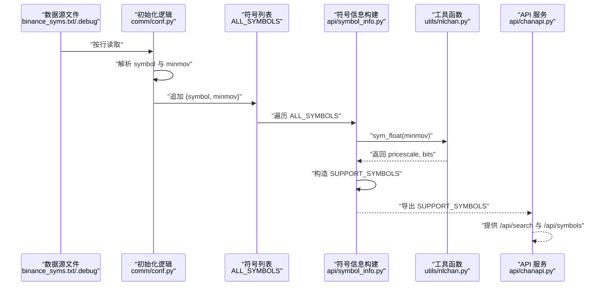
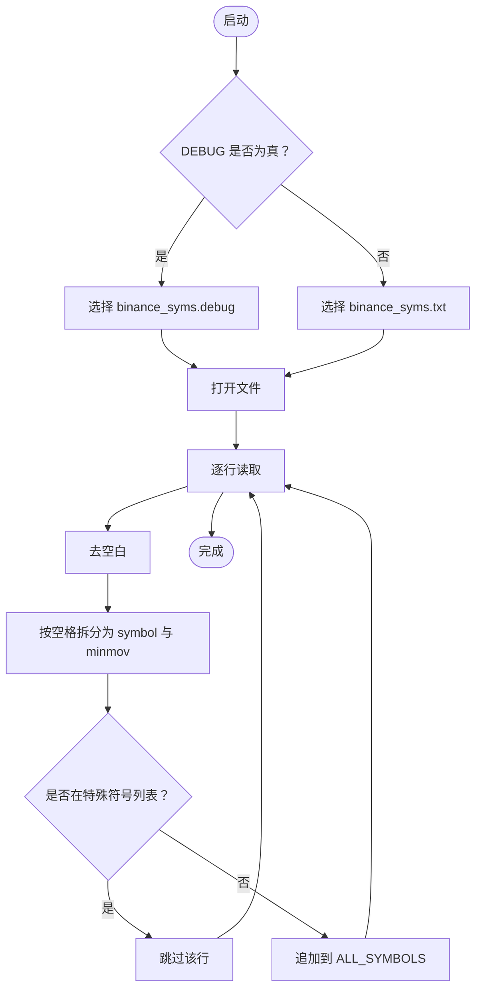
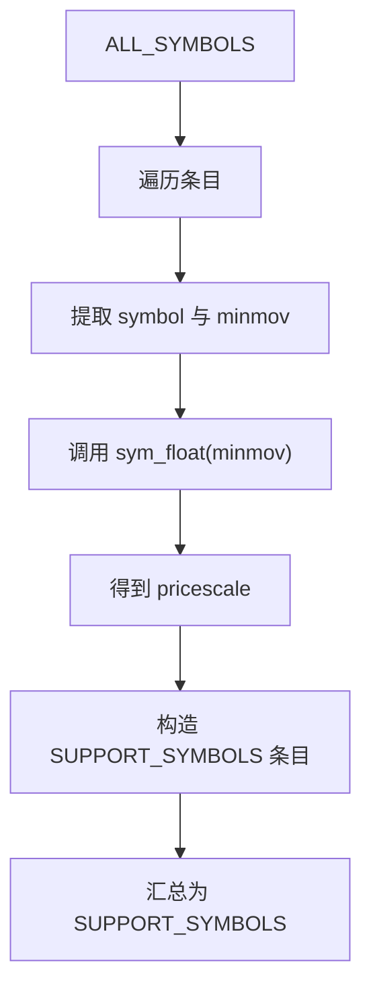
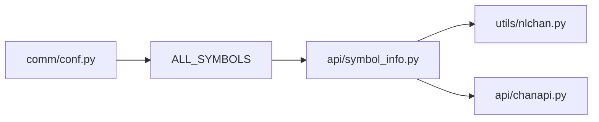

# 交易品种数据源管理

<cite>
**本文引用的文件**
- [binance_syms.txt](file://hetl/selcoin/binance_syms.txt)
- [binance_syms.debug](file://hetl/selcoin/binance_syms.debug)
- [conf.py](file://comm/conf.py)
- [symbol_info.py](file://api/symbol_info.py)
- [chanapi.py](file://api/chanapi.py)
- [nlchan.py](file://utils/nlchan.py)
</cite>

## 目录
1. [简介](#简介)
2. [项目结构](#项目结构)
3. [核心组件](#核心组件)
4. [架构总览](#架构总览)
5. [详细组件分析](#详细组件分析)
6. [依赖关系分析](#依赖关系分析)
7. [性能考量](#性能考量)
8. [故障排查指南](#故障排查指南)
9. [结论](#结论)
10. [附录](#附录)

## 简介
本文件围绕“交易品种数据源”展开，重点说明以下内容：
- binance_syms.txt 的结构与格式规范：每行包含交易对符号与最小变动单位（minmov），采用空格分隔。
- conf.py 中的初始化逻辑如何读取该文件，包括 DEBUG 模式下动态选择 binance_syms.debug 或 binance_syms.txt。
- 字段含义与用途：symbol 用于标识交易对，minmov 用于精度控制与价格对齐。
- 后续处理链路：minmov 在 symbol_info.py 中被转换为 pricescale，供前端图表显示使用。
- 维护与变更操作示例：新增、修改、删除交易品种的步骤与注意事项（文件编码、分隔符等）。

## 项目结构
与本主题直接相关的文件与职责如下：
- 数据源文件：hetl/selcoin/binance_syms.txt（生产环境）、hetl/selcoin/binance_syms.debug（调试环境）
- 初始化与配置：comm/conf.py
- 符号信息构建：api/symbol_info.py
- 工具函数：utils/nlchan.py
- API 服务入口：api/chanapi.py

图示来源
- [binance_syms.txt](file://hetl/selcoin/binance_syms.txt#L1-L118)
- [binance_syms.debug](file://hetl/selcoin/binance_syms.debug#L1-L200)
- [conf.py](file://comm/conf.py#L87-L109)
- [symbol_info.py](file://api/symbol_info.py#L1-L40)
- [nlchan.py](file://utils/nlchan.py#L6-L25)
- [chanapi.py](file://api/chanapi.py#L1-L40)

章节来源
- [binance_syms.txt](file://hetl/selcoin/binance_syms.txt#L1-L118)
- [conf.py](file://comm/conf.py#L87-L109)
- [symbol_info.py](file://api/symbol_info.py#L1-L40)
- [nlchan.py](file://utils/nlchan.py#L6-L25)
- [chanapi.py](file://api/chanapi.py#L1-L40)

## 核心组件
- binance_syms.txt/.debug：文本型数据源，每行记录一个交易对符号与其最小变动单位（minmov），以空格分隔。
- conf.py：负责在启动时读取上述文件，构建 ALL_SYMBOLS 列表，其中包含 symbol 与 minmov 字段。
- symbol_info.py：遍历 ALL_SYMBOLS，基于 minmov 计算 pricescale 并构造前端可用的 SUPPORT_SYMBOLS。
- nlchan.py：提供 sym_float 函数，从 minmov 推导出价格缩放倍数（pricescale）与小数位数。
- chanapi.py：通过 Flask 提供 API，向前端返回支持的符号列表与历史数据等。

章节来源
- [conf.py](file://comm/conf.py#L87-L109)
- [symbol_info.py](file://api/symbol_info.py#L1-L40)
- [nlchan.py](file://utils/nlchan.py#L6-L25)
- [chanapi.py](file://api/chanapi.py#L1-L40)

## 架构总览
下面的序列图展示了从数据源到前端符号列表的关键流程。

图示来源
- [binance_syms.txt](file://hetl/selcoin/binance_syms.txt#L1-L118)
- [binance_syms.debug](file://hetl/selcoin/binance_syms.debug#L1-L200)
- [conf.py](file://comm/conf.py#L87-L109)
- [symbol_info.py](file://api/symbol_info.py#L1-L40)
- [nlchan.py](file://utils/nlchan.py#L6-L25)
- [chanapi.py](file://api/chanapi.py#L61-L94)

## 详细组件分析

### 文件格式与结构规范（binance_syms.txt/.debug）
- 行格式：每行由两部分组成，以空格分隔。
  - 第一部分：symbol（交易对符号，例如 BTC、ETH 等）
  - 第二部分：minmov（最小变动单位，字符串形式的小数）
- 编码与换行：建议使用 UTF-8 编码，行尾使用 LF（Unix 风格）。
- 分隔符：必须使用 ASCII 空格分隔 symbol 与 minmov；避免使用制表符或其他空白字符。
- 注释与空行：文件末尾可保留空行，但不建议添加注释行；若需注释，请使用独立文件或外部文档。
- 特殊符号过滤：在 conf.py 中会跳过特定符号（如某些稳定币），详见“初始化逻辑”。

章节来源
- [binance_syms.txt](file://hetl/selcoin/binance_syms.txt#L1-L118)
- [binance_syms.debug](file://hetl/selcoin/binance_syms.debug#L1-L200)
- [conf.py](file://comm/conf.py#L92-L109)

### 初始化逻辑与文件路径动态构建（conf.py）
- DEBUG 模式：
  - 当 DEBUG 为真时，程序从 ROOT_PATH 下的 hetl/selcoin/binance_syms.debug 读取。
- 生产模式：
  - 当 DEBUG 为假时，程序从 hetl/selcoin/binance_syms.txt 读取。
- 读取与解析：
  - 打开文件后逐行处理，去除首尾空白，按空格拆分为 symbol 与 minmov。
  - 对于特殊符号（如 SPECILS 中列出的），跳过不纳入 ALL_SYMBOLS。
  - 将每个条目构造成字典并追加到 ALL_SYMBOLS。
- 结果：
  - ALL_SYMBOLS 是一个包含多个字典的列表，每个字典包含 symbol 与 minmov 键。

图示来源
- [conf.py](file://comm/conf.py#L87-L109)

章节来源
- [conf.py](file://comm/conf.py#L87-L109)

### 字段含义与后续处理（symbol_info.py 与 nlchan.py）
- symbol：交易对符号，用于唯一标识某一交易品种。
- minmov：最小变动单位，字符串形式的小数，表示该品种报价的最小步进。
- pricescale：由 minmov 推导而来，用于前端图表的价格刻度缩放，确保显示精度与实际报价一致。
- 处理流程：
  - 遍历 ALL_SYMBOLS，取出 symbol 与 minmov。
  - 调用 sym_float(minmov)，得到 pricescale 与小数位数。
  - 构造 SUPPORT_SYMBOLS，包含前端所需的字段（如 name、symbol、description、pricescale 等）。

图示来源
- [symbol_info.py](file://api/symbol_info.py#L1-L40)
- [nlchan.py](file://utils/nlchan.py#L6-L25)

章节来源
- [symbol_info.py](file://api/symbol_info.py#L1-L40)
- [nlchan.py](file://utils/nlchan.py#L6-L25)

### API 层集成（chanapi.py）
- /api/search：返回所有 SUPPORT_SYMBOLS，支持模糊查询。
- /api/symbols：根据 symbol 查询并返回单个符号的详细信息。
- 这些接口依赖于 symbol_info.py 导出的 SUPPORT_SYMBOLS。

章节来源
- [chanapi.py](file://api/chanapi.py#L61-L94)

## 依赖关系分析
- conf.py 依赖文件系统读取 binance_syms.txt/.debug，并构建 ALL_SYMBOLS。
- symbol_info.py 依赖 conf.py 的 ALL_SYMBOLS 与数据库连接（STOCK_DB），并依赖 utils/nlchan.py 的 sym_float。
- chanapi.py 依赖 symbol_info.py 的 SUPPORT_SYMBOLS 以及 conf.py 的数据库连接与常量。

图示来源
- [conf.py](file://comm/conf.py#L87-L109)
- [symbol_info.py](file://api/symbol_info.py#L1-L40)
- [nlchan.py](file://utils/nlchan.py#L6-L25)
- [chanapi.py](file://api/chanapi.py#L1-L40)

章节来源
- [conf.py](file://comm/conf.py#L87-L109)
- [symbol_info.py](file://api/symbol_info.py#L1-L40)
- [nlchan.py](file://utils/nlchan.py#L6-L25)
- [chanapi.py](file://api/chanapi.py#L1-L40)

## 性能考量
- 文件读取：binance_syms.txt/.debug 通常较小，逐行读取的开销可以忽略。
- 内存占用：ALL_SYMBOLS 与 SUPPORT_SYMBOLS 的规模取决于交易对数量，建议保持符号列表精简。
- 前端渲染：pricescale 的正确性直接影响图表渲染精度，避免因错误的缩放导致显示异常。
- I/O 与网络：API 层的查询与历史数据请求应结合数据库索引与分页策略优化（本仓库未涉及具体索引配置）。

## 故障排查指南
- 文件路径问题
  - 现象：DEBUG 模式下找不到 binance_syms.debug。
  - 排查：确认 conf.py 中的 ROOT_PATH 与 hetl/selcoin/binance_syms.debug 的相对路径是否正确。
  - 参考：[conf.py](file://comm/conf.py#L92-L95)
- 解析错误
  - 现象：某行无法拆分为 symbol 与 minmov。
  - 排查：检查该行是否包含多余空格或非 ASCII 空白字符；确保仅以 ASCII 空格分隔。
  - 参考：[conf.py](file://comm/conf.py#L98-L100)
- 特殊符号过滤
  - 现象：某些符号未出现在 SUPPORT_SYMBOLS。
  - 排查：确认该符号是否在 SPECILS 列表中，会被跳过。
  - 参考：[conf.py](file://comm/conf.py#L90-L104)
- pricescale 异常
  - 现象：图表显示精度不正确。
  - 排查：检查 minmov 的格式是否为合法小数字符串；确认 sym_float 返回的 pricescale 合理。
  - 参考：[symbol_info.py](file://api/symbol_info.py#L23-L31)、[nlchan.py](file://utils/nlchan.py#L6-L25)
- API 查询无结果
  - 现象：/api/search 或 /api/symbols 返回空。
  - 排查：确认 ALL_SYMBOLS 是否成功构建；确认 SUPPORT_SYMBOLS 是否已生成。
  - 参考：[chanapi.py](file://api/chanapi.py#L61-L94)

章节来源
- [conf.py](file://comm/conf.py#L90-L109)
- [symbol_info.py](file://api/symbol_info.py#L1-L40)
- [nlchan.py](file://utils/nlchan.py#L6-L25)
- [chanapi.py](file://api/chanapi.py#L61-L94)

## 结论
binance_syms.txt/.debug 作为交易品种数据源，提供了简洁而稳定的格式约定。通过 conf.py 的初始化逻辑，系统能够可靠地读取并解析符号与最小变动单位；随后在 symbol_info.py 中将 minmov 转换为前端可用的 pricescale，最终由 API 层提供给前端展示。维护时只需遵循统一的格式与编码规范，即可安全地新增、修改或删除交易品种。

## 附录

### 新增交易品种操作示例
- 在 binance_syms.txt/.debug 中添加一行，格式为“symbol minmov”，例如“ABC 0.00010000”。
- 确保 symbol 与 minmov 之间仅有一个 ASCII 空格。
- minmov 必须为合法的小数字符串，且与交易所报价精度一致。
- 重启应用使 conf.py 重新加载数据源，ALL_SYMBOLS 与 SUPPORT_SYMBOLS 将自动更新。
- 参考：[conf.py](file://comm/conf.py#L92-L109)、[symbol_info.py](file://api/symbol_info.py#L1-L40)

章节来源
- [conf.py](file://comm/conf.py#L92-L109)
- [symbol_info.py](file://api/symbol_info.py#L1-L40)

### 修改交易品种操作示例
- 修改 binance_syms.txt/.debug 中某行的 minmov 值，确保其与实际报价精度一致。
- 如需调整 symbol 名称，请同步修改相关历史数据命名与查询逻辑（本仓库未提供自动映射机制）。
- 重启应用以重新构建 ALL_SYMBOLS 与 SUPPORT_SYMBOLS。
- 参考：[conf.py](file://comm/conf.py#L92-L109)、[symbol_info.py](file://api/symbol_info.py#L1-L40)

章节来源
- [conf.py](file://comm/conf.py#L92-L109)
- [symbol_info.py](file://api/symbol_info.py#L1-L40)

### 删除交易品种操作示例
- 从 binance_syms.txt/.debug 中移除对应行。
- 若该符号属于 SPECILS 列表，将被自动跳过；若不在该列表，仍需确保不会影响历史数据命名与查询。
- 重启应用以刷新 ALL_SYMBOLS 与 SUPPORT_SYMBOLS。
- 参考：[conf.py](file://comm/conf.py#L90-L104)、[symbol_info.py](file://api/symbol_info.py#L1-L40)

章节来源
- [conf.py](file://comm/conf.py#L90-L104)
- [symbol_info.py](file://api/symbol_info.py#L1-L40)

### 维护注意事项
- 文件编码：建议使用 UTF-8，避免使用带 BOM 的编码。
- 行尾：使用 LF（Unix 风格），避免 CRLF。
- 分隔符：严格使用 ASCII 空格，避免制表符或其他空白字符。
- minmov 格式：确保为合法小数字符串，且与交易所报价精度一致。
- 特殊符号：如需排除某些符号，可在 SPECILS 中维护，避免误入 ALL_SYMBOLS。
- 变更验证：每次变更后重启应用，检查 /api/search 与 /api/symbols 的返回结果。

章节来源
- [conf.py](file://comm/conf.py#L90-L109)
- [symbol_info.py](file://api/symbol_info.py#L1-L40)
- [nlchan.py](file://utils/nlchan.py#L6-L25)