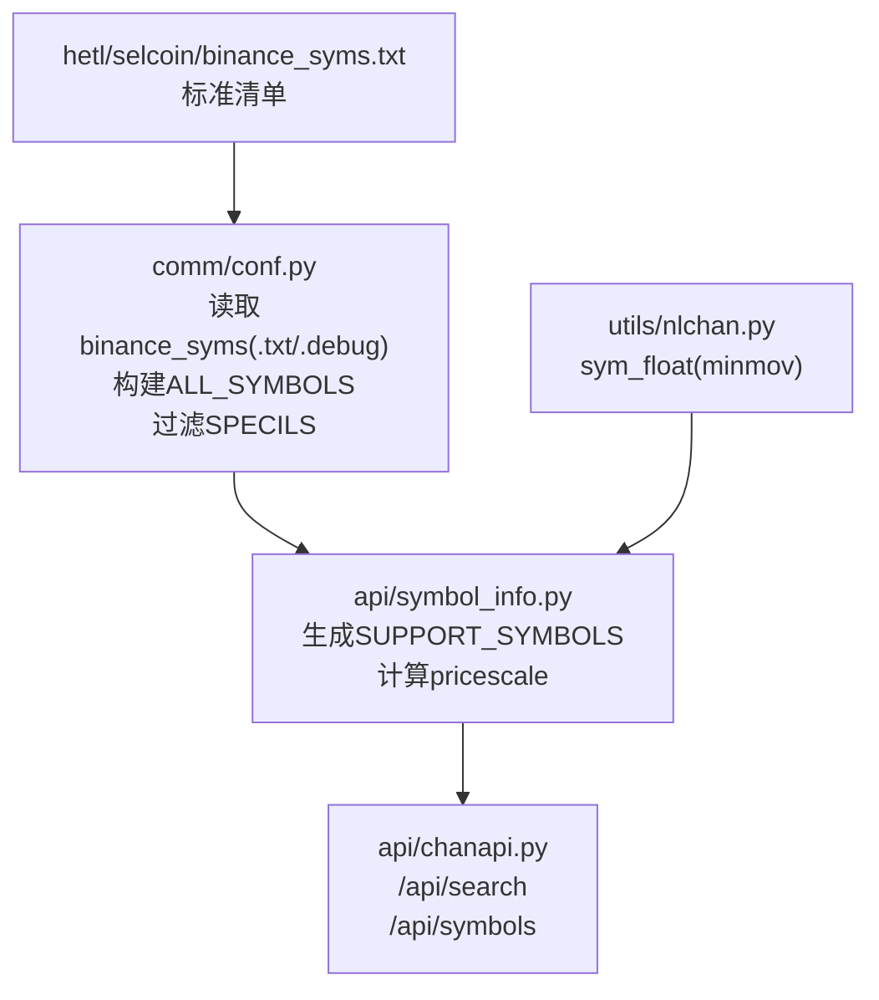
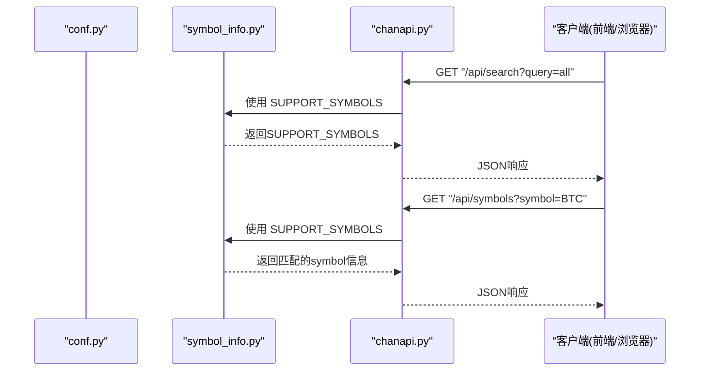
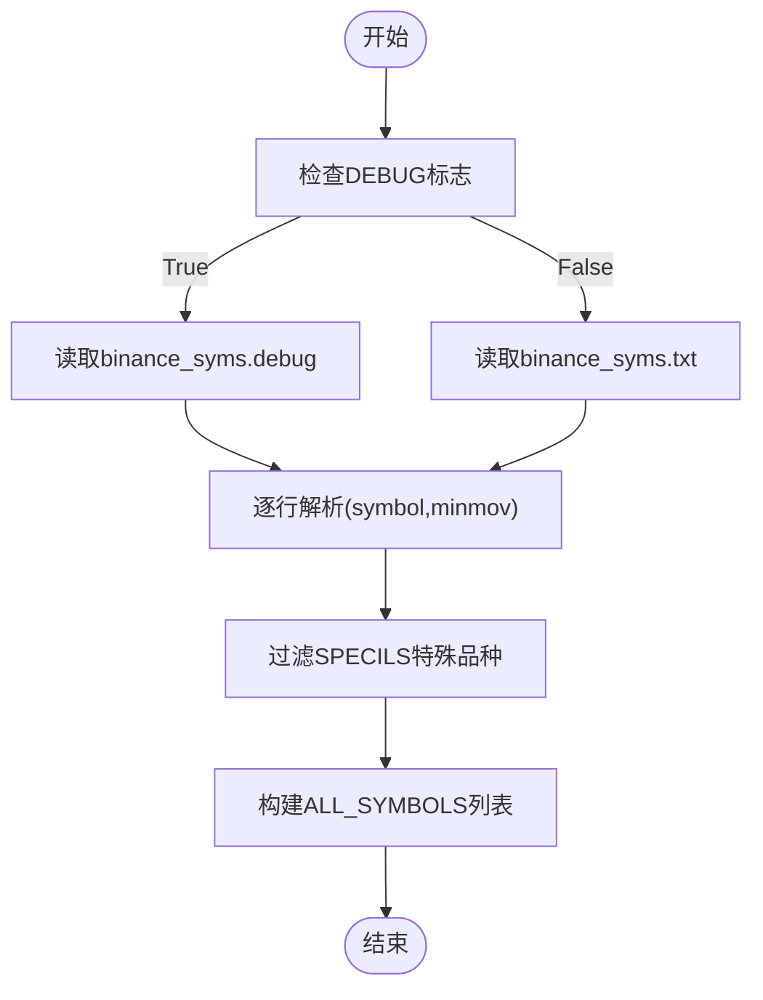
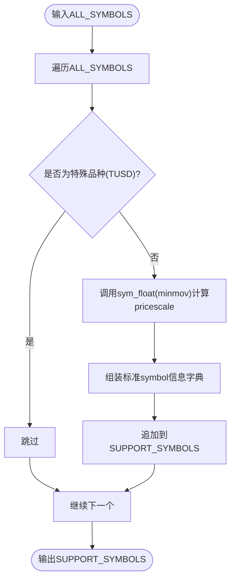
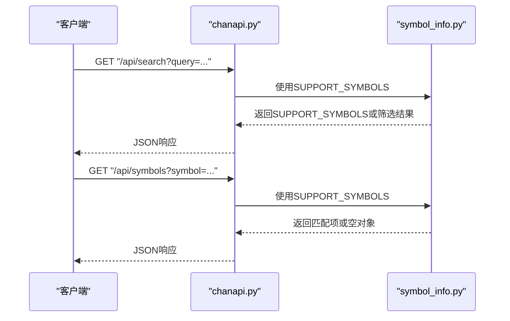
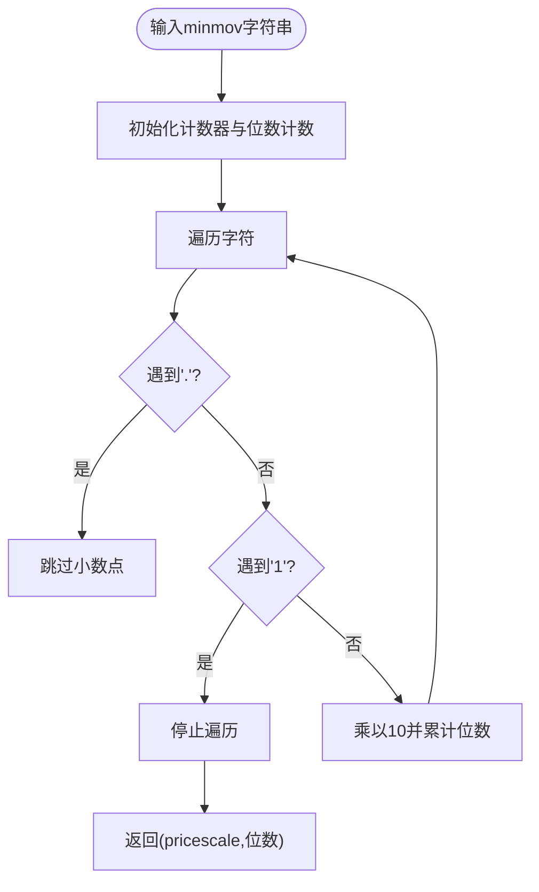
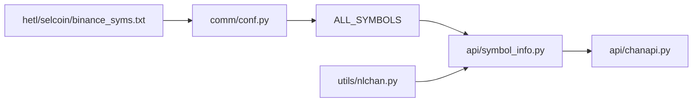

# 交易品种配置

<cite>
**本文引用的文件**
- [conf.py](file://comm/conf.py)
- [symbol_info.py](file://api/symbol_info.py)
- [chanapi.py](file://api/chanapi.py)
- [nlchan.py](file://utils/nlchan.py)
- [binance_syms.txt](file://hetl/selcoin/binance_syms.txt)
</cite>

## 目录
1. [引言](#引言)
2. [项目结构](#项目结构)
3. [核心组件](#核心组件)
4. [架构总览](#架构总览)
5. [详细组件分析](#详细组件分析)
6. [依赖关系分析](#依赖关系分析)
7. [性能考量](#性能考量)
8. [故障排查指南](#故障排查指南)
9. [结论](#结论)
10. [附录](#附录)

## 引言
本文件围绕“交易品种配置机制”展开，重点说明以下内容：
- ALL_SYMBOLS 列表如何从 hetl/selcoin/binance_syms.txt 文件中读取加密货币交易对及其最小变动单位（minmov）。
- 如何过滤 SPECILS 中的特殊品种（如 TUSD）。
- 该配置如何被 symbol_info.py 用于生成 SUPPORT_SYMBOLS 搜索列表，从而影响 /api/search 和 /api/symbols API 端点的响应内容。
- 添加新交易品种、调整最小变动单位的完整操作流程。
- 在 DEBUG 模式下加载测试文件 binance_syms.debug 的用途说明。

## 项目结构
与交易品种配置直接相关的文件与职责如下：
- comm/conf.py：负责读取 binance_syms.txt 或 binance_syms.debug，构建 ALL_SYMBOLS，并定义 SPECILS 过滤规则。
- api/symbol_info.py：消费 ALL_SYMBOLS，生成 SUPPORT_SYMBOLS（含价格精度 pricescale 等字段），供前端搜索与展示使用。
- api/chanapi.py：对外提供 /api/search 与 /api/symbols 接口，内部直接使用 SUPPORT_SYMBOLS 返回结果。
- utils/nlchan.py：提供 sym_float 辅助函数，用于从 minmov 计算价格精度（pricescale）。
- hetl/selcoin/binance_syms.txt：标准交易对清单，每行格式为“交易对 最小变动单位”。

图表来源
- [conf.py](file://comm/conf.py#L87-L109)
- [symbol_info.py](file://api/symbol_info.py#L1-L40)
- [chanapi.py](file://api/chanapi.py#L61-L94)
- [nlchan.py](file://utils/nlchan.py#L6-L25)
- [binance_syms.txt](file://hetl/selcoin/binance_syms.txt#L1-L118)

章节来源
- [conf.py](file://comm/conf.py#L87-L109)
- [symbol_info.py](file://api/symbol_info.py#L1-L40)
- [chanapi.py](file://api/chanapi.py#L61-L94)
- [nlchan.py](file://utils/nlchan.py#L6-L25)
- [binance_syms.txt](file://hetl/selcoin/binance_syms.txt#L1-L118)

## 核心组件
- ALL_SYMBOLS 构建与过滤
  - 从文件读取每行，拆分为 symbol 与 minmov。
  - 过滤 SPECILS 中的特殊品种（例如 TUSD）。
  - 生成包含 symbol 与 minmov 的字典项，加入 ALL_SYMBOLS 列表。
- SUPPORT_SYMBOLS 生成
  - 遍历 ALL_SYMBOLS，跳过特定名称（如 TUSD）。
  - 使用 sym_float(minmov) 计算 pricescale。
  - 组装标准字段（name、symbol、description、exchange、minmov、minmov2、pricescale、type、ticker、session、timezone、intraday_multipliers 等）。
- API 响应
  - /api/search：当 query 为 all 时返回全部 SUPPORT_SYMBOLS；否则按正则匹配 name 字段筛选。
  - /api/symbols：按 symbol 参数进行正则匹配，返回第一条匹配项或空对象。

章节来源
- [conf.py](file://comm/conf.py#L90-L109)
- [symbol_info.py](file://api/symbol_info.py#L6-L39)
- [chanapi.py](file://api/chanapi.py#L61-L94)

## 架构总览
交易品种配置的端到端流程如下：

图表来源
- [chanapi.py](file://api/chanapi.py#L61-L94)
- [symbol_info.py](file://api/symbol_info.py#L1-L40)

## 详细组件分析

### 组件A：ALL_SYMBOLS 读取与过滤（conf.py）
- 文件读取与解析
  - 根据 DEBUG 状态选择加载路径：DEBUG 模式加载 binance_syms.debug，否则加载 binance_syms.txt。
  - 每行按空白分割得到 symbol 与 minmov。
- 过滤规则
  - SPECILS 中的特殊品种会被跳过（例如 TUSD）。
- 数据结构
  - 每条记录为字典：包含 symbol 与 minmov 两个键。

图表来源
- [conf.py](file://comm/conf.py#L90-L109)

章节来源
- [conf.py](file://comm/conf.py#L90-L109)

### 组件B：SUPPORT_SYMBOLS 生成（symbol_info.py）
- 输入来源
  - 从 conf.ALL_SYMBOLS 读取 symbol 与 minmov。
- 过滤与转换
  - 对特定名称（如 TUSD）进行跳过。
  - 使用 sym_float(minmov) 计算 pricescale。
- 输出结构
  - 生成包含 name、symbol、description、exchange、minmov、minmov2、pricescale、type、ticker、session、timezone、intraday_multipliers 等字段的标准字典列表。

图表来源
- [symbol_info.py](file://api/symbol_info.py#L6-L39)
- [nlchan.py](file://utils/nlchan.py#L6-L25)

章节来源
- [symbol_info.py](file://api/symbol_info.py#L6-L39)
- [nlchan.py](file://utils/nlchan.py#L6-L25)

### 组件C：API 响应（chanapi.py）
- /api/search
  - query=all：返回全部 SUPPORT_SYMBOLS。
  - 其他值：按正则匹配 SUPPORT_SYMBOLS 的 name 字段进行筛选。
- /api/symbols
  - 根据 symbol 参数进行正则匹配，优先匹配 name，其次匹配 symbol，返回第一条匹配项或空对象。

图表来源
- [chanapi.py](file://api/chanapi.py#L61-L94)
- [symbol_info.py](file://api/symbol_info.py#L1-L40)

章节来源
- [chanapi.py](file://api/chanapi.py#L61-L94)

### 组件D：最小变动单位到价格精度的转换（utils/nlchan.py）
- 功能
  - 从字符串形式的 minmov 中提取有效数字位数，计算 pricescale。
- 复杂度
  - 线性扫描 minmov 字符串，时间复杂度 O(L)，空间复杂度 O(1)。

图表来源
- [nlchan.py](file://utils/nlchan.py#L6-L25)

章节来源
- [nlchan.py](file://utils/nlchan.py#L6-L25)

## 依赖关系分析
- conf.py 依赖文件系统读取 binance_syms.txt 或 binance_syms.debug。
- symbol_info.py 依赖 conf.ALL_SYMBOLS 与 utils.nlchan.sym_float。
- chanapi.py 依赖 symbol_info.SUPPORT_SYMBOLS 提供搜索与详情查询。
- utils/nlchan.py 为 symbol_info.py 提供价格精度计算。

图表来源
- [conf.py](file://comm/conf.py#L90-L109)
- [symbol_info.py](file://api/symbol_info.py#L1-L40)
- [chanapi.py](file://api/chanapi.py#L61-L94)
- [nlchan.py](file://utils/nlchan.py#L6-L25)
- [binance_syms.txt](file://hetl/selcoin/binance_syms.txt#L1-L118)

章节来源
- [conf.py](file://comm/conf.py#L90-L109)
- [symbol_info.py](file://api/symbol_info.py#L1-L40)
- [chanapi.py](file://api/chanapi.py#L61-L94)
- [nlchan.py](file://utils/nlchan.py#L6-L25)
- [binance_syms.txt](file://hetl/selcoin/binance_syms.txt#L1-L118)

## 性能考量
- 文件读取
  - 仅在模块导入时读取一次，避免重复 IO。
- 列表构建
  - 顺序遍历文件，时间复杂度 O(N)，N 为交易对数量。
- 过滤与转换
  - 过滤 SPECILS 为常量时间检查；pricescale 计算为 O(L)（L 为 minmov 字符长度）。
- API 查询
  - /api/search：当 query=all 时直接返回完整列表；否则按 name 正则匹配，时间复杂度近似 O(M×K)（M 为 SUPPORT_SYMBOLS 数量，K 为平均匹配代价）。
  - /api/symbols：正则匹配 symbol/name，最坏 O(M×K)。

[本节为通用性能讨论，不直接分析具体文件，故无章节来源]

## 故障排查指南
- /api/search 返回为空
  - 检查 SUPPORT_SYMBOLS 是否为空（确认 conf.py 是否成功读取文件且未被 SPECILS 过滤清空）。
  - 确认 query=all 时是否正确返回。
- /api/symbols 返回空对象
  - 检查传入的 symbol 参数是否与 SUPPORT_SYMBOLS 中的 name 或 symbol 匹配。
  - 确认 symbol_info.py 是否跳过了某些名称（如 TUSD）。
- DEBUG 模式未生效
  - 确认 conf.DEBUG 是否为 True，且存在 hetl/selcoin/binance_syms.debug 文件。
  - 若文件不存在，DEBUG 模式将报错或行为异常。
- pricescale 不正确
  - 检查 minmov 字符串格式是否符合预期（例如以 0.x 开头的有效数字）。
  - 确认 utils/nlchan.sym_float 的实现与预期一致。

章节来源
- [conf.py](file://comm/conf.py#L90-L109)
- [symbol_info.py](file://api/symbol_info.py#L6-L39)
- [chanapi.py](file://api/chanapi.py#L61-L94)
- [nlchan.py](file://utils/nlchan.py#L6-L25)

## 结论
- 交易品种配置的关键在于：从文件读取 symbol 与 minmov，过滤特殊品种，再由 symbol_info.py 生成前端可用的 SUPPORT_SYMBOLS。
- /api/search 与 /api/symbols 的响应内容直接受 SUPPORT_SYMBOLS 影响。
- DEBUG 模式允许在开发阶段切换到测试文件，便于快速验证配置变更。

[本节为总结性内容，不直接分析具体文件，故无章节来源]

## 附录

### 添加新交易品种的操作流程
- 在 hetl/selcoin/binance_syms.txt 中新增一行，格式为“交易对 最小变动单位”，例如“ABC 0.00010000”。
- 如果该交易对属于特殊品种（如 TUSD），需确保其出现在 SPECILS 中以便被过滤。
- 启动服务后，conf.py 会在导入时重新读取文件并更新 ALL_SYMBOLS，随后 symbol_info.py 生成新的 SUPPORT_SYMBOLS。
- 通过 /api/search?query=all 或 /api/symbols?symbol=ABC 验证新交易对是否生效。

章节来源
- [conf.py](file://comm/conf.py#L90-L109)
- [binance_syms.txt](file://hetl/selcoin/binance_syms.txt#L1-L118)
- [symbol_info.py](file://api/symbol_info.py#L6-L39)
- [chanapi.py](file://api/chanapi.py#L61-L94)

### 调整最小变动单位（minmov）的流程
- 修改 hetl/selcoin/binance_syms.txt 中对应交易对的 minmov 值。
- 重启服务使 conf.py 重新加载文件并更新 ALL_SYMBOLS。
- symbol_info.py 重新计算 pricescale 并更新 SUPPORT_SYMBOLS。
- 通过 /api/symbols?symbol=XXX 验证 pricescale 是否按预期变化。

章节来源
- [conf.py](file://comm/conf.py#L90-L109)
- [binance_syms.txt](file://hetl/selcoin/binance_syms.txt#L1-L118)
- [symbol_info.py](file://api/symbol_info.py#L23-L39)
- [nlchan.py](file://utils/nlchan.py#L6-L25)

### DEBUG 模式的用途
- 当 conf.DEBUG 为 True 时，conf.py 会加载 hetl/selcoin/binance_syms.debug 文件而非 binance_syms.txt。
- 该机制用于开发与测试阶段，便于在不改动主清单的情况下快速验证配置与 API 行为。
- 若 binance_syms.debug 不存在，DEBUG 模式将导致读取失败或异常行为。

章节来源
- [conf.py](file://comm/conf.py#L90-L109)