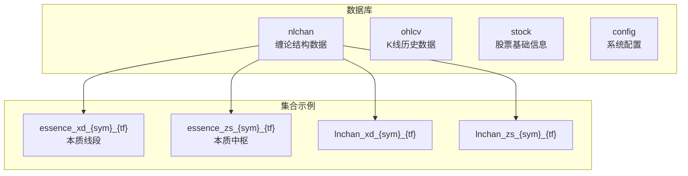
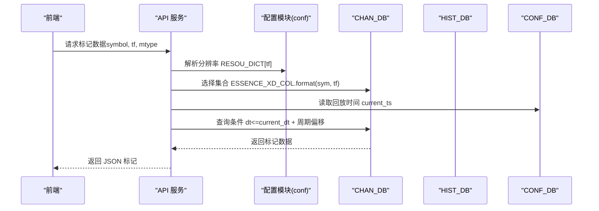
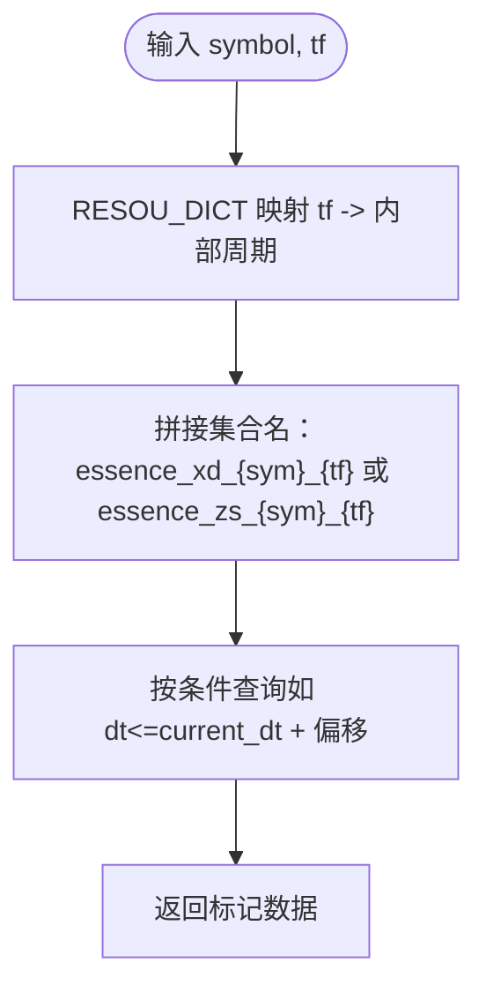
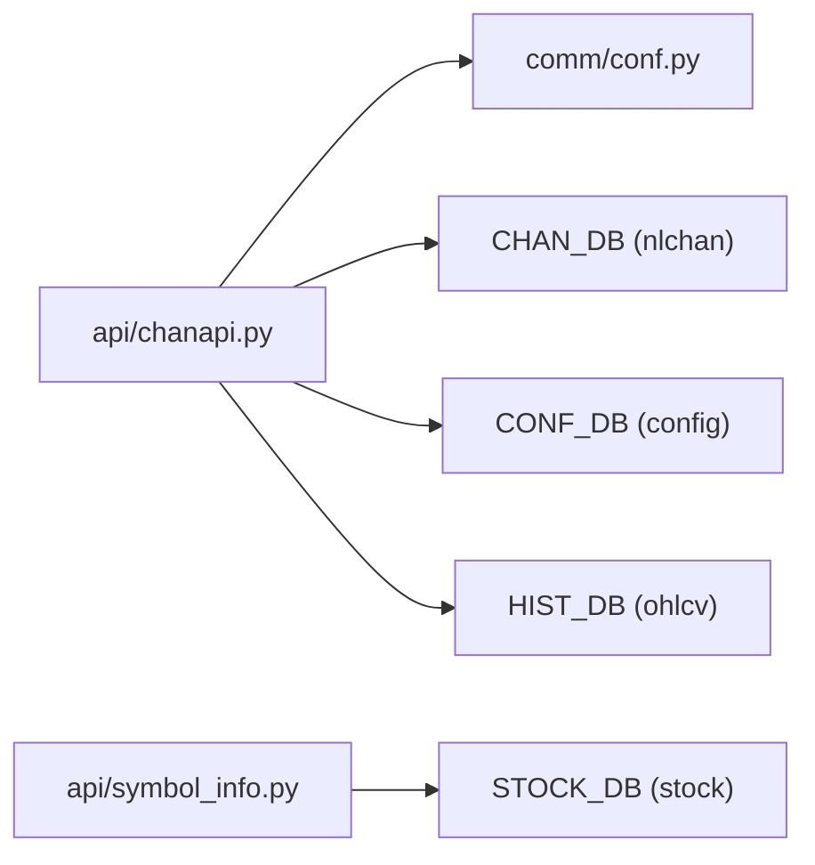

# CHAN_DB 缠论结构数据库

<cite>
**本文引用的文件**
- [comm/conf.py](file://comm/conf.py)
- [api/chanapi.py](file://api/chanapi.py)
- [api/symbol_info.py](file://api/symbol_info.py)
- [utils/nlchan.py](file://utils/nlchan.py)
- [data/CLAUDE.md](file://data/CLAUDE.md)
- [data/nlchan/essence_xd_000001.XSHG_1d.metadata.json](file://data/nlchan/essence_xd_000001.XSHG_1d.metadata.json)
- [hetl/hmgo/restore_chanvis_mongo.sh](file://hetl/hmgo/restore_chanvis_mongo.sh)
</cite>

## 目录
1. [简介](#简介)
2. [项目结构](#项目结构)
3. [核心组件](#核心组件)
4. [架构总览](#架构总览)
5. [详细组件分析](#详细组件分析)
6. [依赖关系分析](#依赖关系分析)
7. [性能考虑](#性能考虑)
8. [故障排查指南](#故障排查指南)
9. [结论](#结论)
10. [附录](#附录)

## 简介
本文件系统化文档化 CHAN_DB 缠论结构数据库的配置与用途，该数据库通过 client.nlchan 实例化，专门用于存储缠论分析的核心结构数据。重点说明其包含的集合命名规则（essence_xd_{sym}_{tf} 与 essence_zs_{sym}_{tf}），解释 {sym}（交易品种）与 {tf}（时间周期）动态参数的含义与来源，并阐述该数据库在系统中的角色：支持线段识别、中枢生成及多周期联动分析。同时提供数据访问示例、查询性能优化建议（索引设计）、数据生命周期管理策略，并结合 api/symbol_info.py 中的实际查询逻辑说明如何读取缠论结构数据。

## 项目结构
- 数据库与集合分布
  - CHAN_DB（nlchan）：存放缠论结构数据，如本质线段与中枢集合。
  - HIST_DB（ohlcv）：存放原始K线历史数据。
  - STOCK_DB（stock）：存放股票基础信息。
  - CONF_DB（config）：存放系统配置与回放配置。
- 关键集合命名规则
  - essence_xd_{sym}_{tf}：本质线段集合
  - essence_zs_{sym}_{tf}：本质中枢集合
  - 其他 lnchan_* 集合用于缠论中间结果或扩展结构（在配置中定义）

**图表来源**
- [comm/conf.py](file://comm/conf.py#L143-L158)

**章节来源**
- [comm/conf.py](file://comm/conf.py#L143-L158)
- [data/CLAUDE.md](file://data/CLAUDE.md#L40-L70)

## 核心组件
- 数据库连接与命名
  - 通过本地 MongoDB 连接创建 client，绑定 CHAN_DB、HIST_DB、STOCK_DB、CONF_DB。
  - 定义集合命名模板：essence_xd_{sym}_{tf}、essence_zs_{sym}_{tf}、lnchan_xd_{sym}_{tf}、lnchan_zs_{sym}_{tf}。
- 时间周期映射
  - RESOU_DICT：将外部分辨率字符串映射到内部周期标识。
  - TF_SEC_MAP：周期到秒数映射，用于计算高低点之间K线数量与回放边界。
- 交易品种与时间范围
  - ALL_SYMBOLS：从外部文件加载的交易品种列表（过滤特殊品种）。
  - DATE_START_TS：各周期数据起始时间戳映射，用于回放与数据边界控制。

**章节来源**
- [comm/conf.py](file://comm/conf.py#L12-L20)
- [comm/conf.py](file://comm/conf.py#L23-L31)
- [comm/conf.py](file://comm/conf.py#L111-L121)
- [comm/conf.py](file://comm/conf.py#L143-L158)

## 架构总览
CHAN_DB 在系统中的定位是“缠论结构数据层”，承载本质线段与中枢等核心分析结果，供 API 层按需检索并渲染到前端图表。API 层通过 RESOU_DICT 将外部分辨率转换为内部周期，再以 {sym} 与 {tf} 组合形成集合名，最终从 CHAN_DB 查询所需标记数据。

**图表来源**
- [api/chanapi.py](file://api/chanapi.py#L280-L420)
- [comm/conf.py](file://comm/conf.py#L12-L20)
- [comm/conf.py](file://comm/conf.py#L143-L158)

## 详细组件分析

### CHAN_DB 集合命名规则与动态参数
- {sym}（交易品种）
  - 来源于请求参数 symbol，经 RESOU_DICT 映射后作为集合名的一部分。
  - 示例：股票代码（如 000001.XSHG）或加密货币符号（如 btc）。
- {tf}（时间周期）
  - 来源于请求参数 resolution，经 RESOU_DICT 映射为内部周期标识（如 1m、5m、30m、1h、4h、1d、1w）。
  - 用于区分不同时间尺度下的本质线段与中枢集合。
- 集合类型
  - essence_xd_{sym}_{tf}：本质线段集合，存储线段标记、中枢状态、买卖点等。
  - essence_zs_{sym}_{tf}：本质中枢集合，存储中枢形态、级别与状态。
  - lnchan_*：中间结果或扩展结构集合（在配置中定义）。

**图表来源**
- [api/chanapi.py](file://api/chanapi.py#L280-L420)
- [comm/conf.py](file://comm/conf.py#L12-L20)
- [comm/conf.py](file://comm/conf.py#L151-L154)

**章节来源**
- [comm/conf.py](file://comm/conf.py#L151-L154)
- [api/chanapi.py](file://api/chanapi.py#L280-L420)

### 数据访问示例（基于现有 API）
- 获取线段标记
  - 接口：/api/bzxd_mark
  - 参数：symbol（交易品种）、tf（分辨率）、mtype（标记类型）
  - 逻辑要点：
    - 使用 RESOU_DICT 将 tf 映射为内部周期。
    - 选择集合 ESSENCE_XD_COL.format(sym, tf)。
    - 读取 CONF_DB 中的回放时间 current_ts，构造 dt<=current_dt+偏移的查询条件。
    - 根据 mtype 过滤字段与条件，返回标记数据。
- 获取中枢标记
  - 接口：/api/bzzs_mark
  - 参数：symbol、tf、mtype
  - 逻辑要点：
    - 同上，但针对中枢相关字段与状态进行筛选。
- 获取买卖点
  - 接口：/api/get_bspoint
  - 逻辑要点：
    - 将 symbol 与 tf 映射为内部周期，读取 CSV 文件生成买卖点标记（演示数据）。

**章节来源**
- [api/chanapi.py](file://api/chanapi.py#L280-L420)
- [api/chanapi.py](file://api/chanapi.py#L422-L492)
- [api/chanapi.py](file://api/chanapi.py#L244-L278)

### 数据结构与用途（结合实际集合）
- essence_xd_{sym}_{tf}
  - 存储本质线段相关标记与状态，如线段方向、中枢状态、独立背驰、买卖点等。
  - 元数据示例：集合名称、索引信息等。
- essence_zs_{sym}_{tf}
  - 存储本质中枢相关标记与状态，如中枢级别、形态、状态等。
- 数据来源与恢复
  - 通过 hetl/hmgo/restore_chanvis_mongo.sh 导入 nlchan 数据库与集合。
  - data/CLAUDE.md 对 nlchan 目录下集合命名与数据类型进行了说明。

**章节来源**
- [data/nlchan/essence_xd_000001.XSHG_1d.metadata.json](file://data/nlchan/essence_xd_000001.XSHG_1d.metadata.json#L1-L1)
- [data/CLAUDE.md](file://data/CLAUDE.md#L40-L70)
- [hetl/hmgo/restore_chanvis_mongo.sh](file://hetl/hmgo/restore_chanvis_mongo.sh#L22-L29)

### 与 symbol_info.py 的关联
- symbol_info.py 通过 STOCK_DB['stock_names'] 查询股票基础信息，构建 SUPPORT_SYMBOLS 列表，供前端搜索与展示。
- 虽不直接访问 CHAN_DB，但为 API 提供了可用的 symbol 列表，间接影响 CHAN_DB 查询的 symbol 参数来源。

**章节来源**
- [api/symbol_info.py](file://api/symbol_info.py#L47-L70)

## 依赖关系分析
- 模块耦合
  - api/chanapi.py 依赖 comm/conf.py 中的 RESOU_DICT、TF_SEC_MAP、ESSENCE_* 模板、CHAN_DB、CONF_DB。
  - api/symbol_info.py 依赖 STOCK_DB['stock_names']，用于构建 symbol 列表。
- 外部依赖
  - MongoDB：本地 27017 端口，nlchan、ohlcv、stock、config 数据库。
  - 数据恢复脚本：hetl/hmgo/restore_chanvis_mongo.sh 用于导入 nlchan 数据。

**图表来源**
- [api/chanapi.py](file://api/chanapi.py#L17-L21)
- [comm/conf.py](file://comm/conf.py#L143-L158)
- [api/symbol_info.py](file://api/symbol_info.py#L1-L10)

**章节来源**
- [api/chanapi.py](file://api/chanapi.py#L17-L21)
- [comm/conf.py](file://comm/conf.py#L143-L158)
- [api/symbol_info.py](file://api/symbol_info.py#L1-L10)

## 性能考虑
- 索引设计建议
  - 针对集合 essence_xd_{sym}_{tf} 与 essence_zs_{sym}_{tf}，建议在常用查询字段上建立复合索引：
    - dt（时间字段）：升序索引，满足时间范围查询与回放边界控制。
    - status/状态字段：如 czxd_status、bzzs、xddg_ind.status 等，用于过滤有效标记。
    - 符号字段：sym（若同一集合跨 symbol 存储，可考虑复合索引）。
  - 元数据参考：集合 metadata 中包含默认 _id 索引，可根据查询模式增加 dt 等字段索引。
- 查询优化
  - 使用 RESOU_DICT 与 TF_SEC_MAP 控制查询时间窗口，避免全表扫描。
  - 仅投影必要字段（如 _id=False, dt=True 等），减少网络与内存开销。
  - 对高频标记类型（如线段、中枢）建立专用索引，降低过滤成本。
- 数据分片与归档
  - 对历史数据按时间分片或归档，定期清理过期数据，保持查询性能稳定。

**章节来源**
- [data/nlchan/essence_xd_000001.XSHG_1d.metadata.json](file://data/nlchan/essence_xd_000001.XSHG_1d.metadata.json#L1-L1)
- [api/chanapi.py](file://api/chanapi.py#L280-L420)

## 故障排查指南
- 无法连接 MongoDB
  - 确认本地 MongoDB 已启动且监听 27017 端口。
  - 检查 CHAN_DB、HIST_DB、STOCK_DB、CONF_DB 是否成功绑定。
- 集合不存在或数据缺失
  - 使用 hetl/hmgo/restore_chanvis_mongo.sh 导入 nlchan 数据库与集合。
  - 确认集合命名符合 ESSENCE_* 模板（essence_xd_{sym}_{tf}、essence_zs_{sym}_{tf}）。
- 查询无结果
  - 检查 RESOU_DICT 与 TF_SEC_MAP 映射是否正确。
  - 确认 dt 查询条件与 CONF_DB 中 current_ts 设置一致。
  - 核对 mtype 与集合字段是否匹配（如 czxd_dg、xddg_ind、bzzs 等）。
- symbol 列表异常
  - 确认 api/symbol_info.py 从 STOCK_DB['stock_names'] 读取的股票列表是否正确。
  - 检查 ALL_SYMBOLS 来源文件与过滤逻辑。

**章节来源**
- [comm/conf.py](file://comm/conf.py#L143-L158)
- [hetl/hmgo/restore_chanvis_mongo.sh](file://hetl/hmgo/restore_chanvis_mongo.sh#L22-L29)
- [api/chanapi.py](file://api/chanapi.py#L280-L420)
- [api/symbol_info.py](file://api/symbol_info.py#L47-L70)

## 结论
CHAN_DB 作为缠论结构数据的核心存储层，通过标准化的集合命名规则（essence_xd_{sym}_{tf}、essence_zs_{sym}_{tf}）与清晰的周期映射体系，支撑了线段识别、中枢生成与多周期联动分析。配合 API 层的条件过滤与投影优化，可在保证查询性能的同时，为前端提供丰富的标记数据。建议进一步完善索引设计、数据生命周期管理与自动化更新机制，以提升系统的稳定性与可维护性。

## 附录
- 数据恢复与导入
  - 使用 hetl/hmgo/restore_chanvis_mongo.sh 导入 nlchan 数据库与集合。
  - data/CLAUDE.md 提供了 nlchan 目录结构、集合命名与数据类型说明。
- 价格精度辅助
  - utils/nlchan.py 提供 sym_float 辅助函数，用于解析价格精度（与 symbol_info.py 的 pricescale 计算相关）。

**章节来源**
- [hetl/hmgo/restore_chanvis_mongo.sh](file://hetl/hmgo/restore_chanvis_mongo.sh#L22-L29)
- [data/CLAUDE.md](file://data/CLAUDE.md#L40-L70)
- [utils/nlchan.py](file://utils/nlchan.py#L1-L25)