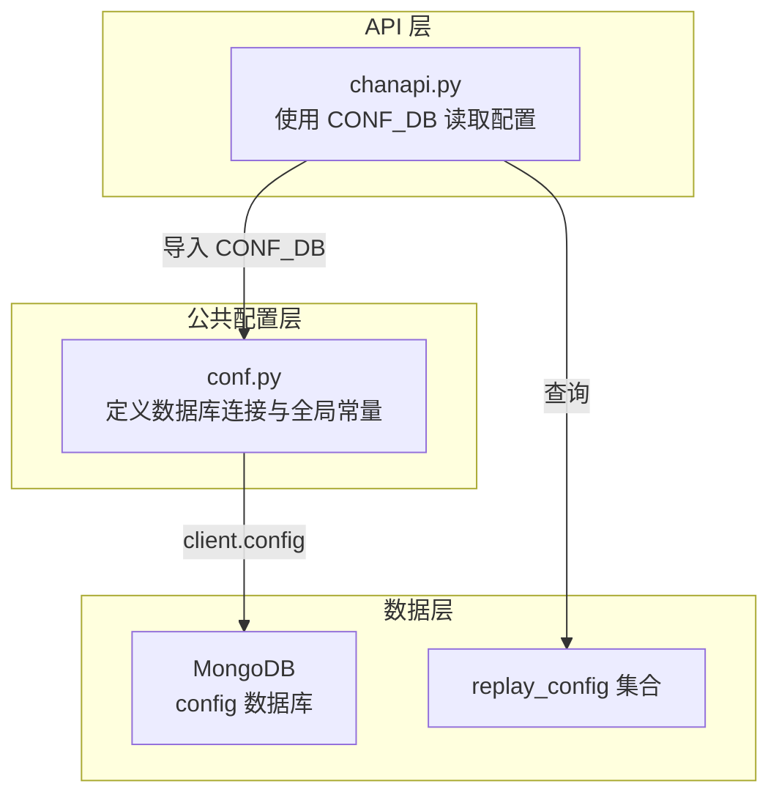
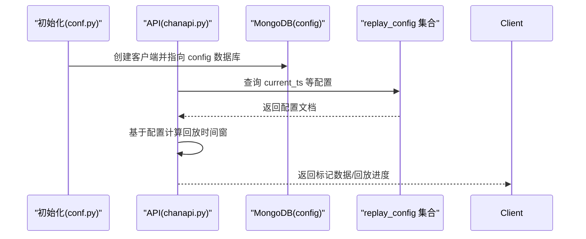
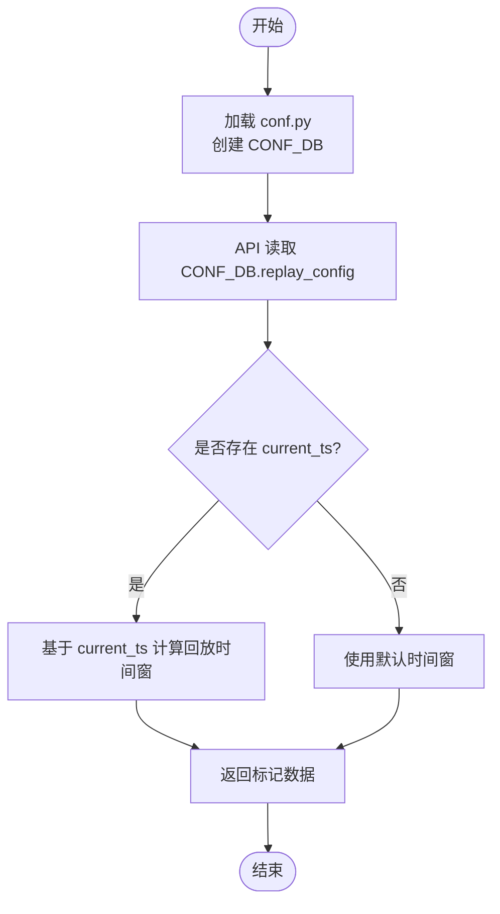
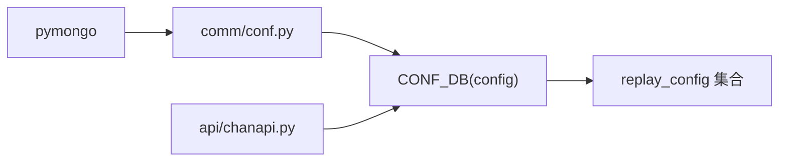

# CONF_DB 系统配置数据库

<cite>
**本文引用的文件**
- [comm/conf.py](file://comm/conf.py)
- [api/chanapi.py](file://api/chanapi.py)
- [data/config/replay_config.metadata.json](file://data/config/replay_config.metadata.json)
- [data/CLAUDE.md](file://data/CLAUDE.md)
- [api/CLAUDE.md](file://api/CLAUDE.md)
- [CLAUDE.md](file://CLAUDE.md)
</cite>

## 目录
1. [简介](#简介)
2. [项目结构](#项目结构)
3. [核心组件](#核心组件)
4. [架构总览](#架构总览)
5. [组件详解](#组件详解)
6. [依赖关系分析](#依赖关系分析)
7. [性能考量](#性能考量)
8. [故障排查指南](#故障排查指南)
9. [结论](#结论)
10. [附录](#附录)

## 简介
本文件围绕 conf.py 中的 CONF_DB 数据库进行系统化文档化，重点说明其在系统中的定位、配置与用途、与内存配置（如 ALL_TIMEFRAMES、DTRANGE）的区别与互补关系、在多用户或分布式部署中的配置同步作用，以及安全访问控制与版本化管理建议。同时结合系统启动流程，解释配置加载优先级与缓存机制。

## 项目结构
- CONF_DB 属于 comm 模块的公共配置层，负责数据库连接与全局常量定义。
- API 层通过 comm.conf 导入 CONF_DB，用于读取系统级配置（例如回放当前时间等）。
- data/config 目录包含 MongoDB 配置数据集合的元信息，用于数据恢复与一致性维护。

**图表来源**
- [comm/conf.py](file://comm/conf.py#L143-L147)
- [api/chanapi.py](file://api/chanapi.py#L19-L23)
- [data/config/replay_config.metadata.json](file://data/config/replay_config.metadata.json#L1-L1)

**章节来源**
- [comm/conf.py](file://comm/conf.py#L143-L147)
- [api/chanapi.py](file://api/chanapi.py#L19-L23)
- [data/config/replay_config.metadata.json](file://data/config/replay_config.metadata.json#L1-L1)

## 核心组件
- CONF_DB：MongoDB 中的 config 数据库，用于持久化系统级配置信息。
- replay_config 集合：存储回放相关的时间游标与配置片段，API 层通过 CONF_DB 查询该集合以控制回放进度。
- 内存配置：ALL_TIMEFRAMES、DTRANGE 等常量定义在 conf.py 中，属于进程内配置，用于业务逻辑与数据范围控制。

**章节来源**
- [comm/conf.py](file://comm/conf.py#L66-L86)
- [comm/conf.py](file://comm/conf.py#L111-L121)
- [api/chanapi.py](file://api/chanapi.py#L295-L300)

## 架构总览
CONF_DB 在系统中的位置如下：
- 初始化阶段：comm/conf.py 创建 MongoDB 客户端并指向 config 数据库，形成 CONF_DB。
- 运行阶段：API 层在需要时读取 CONF_DB.replay_config，以决定回放的当前时间点等配置。
- 数据恢复：data/config 目录包含 replay_config 的元信息，便于数据恢复与一致性校验。

**图表来源**
- [comm/conf.py](file://comm/conf.py#L143-L147)
- [api/chanapi.py](file://api/chanapi.py#L295-L300)

## 组件详解

### CONF_DB 数据库与 replay_config 集合
- CONF_DB 由 conf.py 中的 client.config 实例化，用于持久化系统级配置。
- API 层在获取标记数据时，会查询 CONF_DB.replay_config，读取 current_ts 等字段，从而限定查询的时间边界，避免越界或重复回放。
- data/config 目录下的 replay_config.metadata.json 描述了集合的索引与 UUID 等元信息，有助于数据恢复与一致性校验。

**图表来源**
- [comm/conf.py](file://comm/conf.py#L143-L147)
- [api/chanapi.py](file://api/chanapi.py#L295-L300)
- [data/config/replay_config.metadata.json](file://data/config/replay_config.metadata.json#L1-L1)

**章节来源**
- [comm/conf.py](file://comm/conf.py#L143-L147)
- [api/chanapi.py](file://api/chanapi.py#L295-L300)
- [data/config/replay_config.metadata.json](file://data/config/replay_config.metadata.json#L1-L1)

### 与内存配置（ALL_TIMEFRAMES、DTRANGE）的关系
- ALL_TIMEFRAMES：定义系统支持的时间周期集合，用于业务逻辑选择与数据聚合策略。它属于进程内常量，不涉及持久化。
- DTRANGE：定义特定分析场景的时间范围，同样为内存常量，用于约束数据查询范围。
- CONF_DB：持久化系统级配置，如回放游标 current_ts，用于控制回放进度与边界，避免重复或越界。

区别与互补：
- 内存配置（ALL_TIMEFRAMES、DTRANGE）决定“做什么”和“在什么范围内做”，侧重业务规则与数据范围。
- CONF_DB 决定“做到哪一步了”，侧重运行态的进度与状态，二者互补，共同保证回放与分析的正确性与一致性。

**章节来源**
- [comm/conf.py](file://comm/conf.py#L66-L86)
- [comm/conf.py](file://comm/conf.py#L111-L121)

### 多用户与分布式部署中的配置同步
- 当前代码中，CONF_DB 通过本地 MongoDB 连接（localhost:27017）创建，未显式体现多租户或多用户隔离策略。
- 在分布式部署中，建议：
  - 将 MongoDB 连接改为可配置的连接字符串，支持用户名/密码与 SSL。
  - 为不同租户/用户组划分独立数据库或集合，或在文档中增加租户标识字段，实现逻辑隔离。
  - 对 CONF_DB.replay_config 引入版本号字段，配合 API 层的版本协商，避免跨版本配置冲突。
  - 使用配置中心（如 Consul、etcd 或 Kubernetes ConfigMap）集中管理 CONF_DB 连接与关键配置，实现灰度发布与动态更新。

[本节为概念性建议，不直接分析具体文件，故不附加“章节来源”]

### 安全访问控制与版本化管理建议
- 访问控制：
  - 限制 MongoDB 用户权限，仅授予 CONF_DB.replay_config 的只读/写权限。
  - 在 API 层增加鉴权中间件，确保只有授权用户可触发回放或修改配置。
- 版本化管理：
  - 在 CONF_DB.replay_config 中引入 version 字段，API 层在读取时校验版本，若不匹配则拒绝或提示升级。
  - 对配置变更采用“滚动更新”策略，先写入新版本配置，再切换 current_ts，最后清理旧版本，降低回放中断风险。

[本节为概念性建议，不直接分析具体文件，故不附加“章节来源”]

### 系统启动流程与配置加载优先级、缓存机制
- 启动流程：
  - 后端启动时，comm/conf.py 首先执行，创建 MongoDB 客户端并指向 config 数据库，形成 CONF_DB。
  - API 路由在请求到达时，按需查询 CONF_DB.replay_config，以决定回放时间窗。
- 加载优先级：
  - conf.py 中的常量（如 ALL_TIMEFRAMES、DTRANGE）在模块导入时即生效，属于“静态配置”。
  - CONF_DB 中的配置（如 current_ts）属于“动态配置”，在每次请求时读取，优先级更高，用于覆盖静态配置的运行态边界。
- 缓存机制：
  - 当前代码未显式实现 CONF_DB 查询缓存。
  - 建议：
    - 对 replay_config 的热点字段（如 current_ts）在 API 层做短期缓存（如 LRU），减少数据库压力。
    - 对静态配置（ALL_TIMEFRAMES、DTRANGE）可在进程内缓存，避免重复解析。

**章节来源**
- [comm/conf.py](file://comm/conf.py#L143-L147)
- [api/chanapi.py](file://api/chanapi.py#L295-L300)

## 依赖关系分析
- conf.py 依赖 pymongo，创建 client 并指向 config 数据库，形成 CONF_DB。
- API 层在路由中导入 CONF_DB，用于查询 replay_config。
- data/config 目录包含 replay_config 的元信息，便于数据恢复与一致性校验。

**图表来源**
- [comm/conf.py](file://comm/conf.py#L143-L147)
- [api/chanapi.py](file://api/chanapi.py#L19-L23)
- [data/config/replay_config.metadata.json](file://data/config/replay_config.metadata.json#L1-L1)

**章节来源**
- [comm/conf.py](file://comm/conf.py#L143-L147)
- [api/chanapi.py](file://api/chanapi.py#L19-L23)
- [data/config/replay_config.metadata.json](file://data/config/replay_config.metadata.json#L1-L1)

## 性能考量
- 查询优化：
  - 为 replay_config 建立必要的索引（如 current_ts），提升查询效率。
- 缓存策略：
  - 对高频读取的配置（如 current_ts）在 API 层做短期缓存，降低数据库压力。
- 分页与范围控制：
  - 结合 ALL_TIMEFRAMES、DTRANGE 与 CONF_DB 的 current_ts，严格限定查询范围，避免全表扫描。

[本节提供一般性指导，不直接分析具体文件，故不附加“章节来源”]

## 故障排查指南
- 无法连接 MongoDB：
  - 检查 conf.py 中的连接字符串与 MongoDB 服务状态。
  - 确认防火墙与网络连通性。
- replay_config 查询为空：
  - 确认数据是否已导入 data/config 目录，或通过恢复脚本恢复 config 数据库。
  - 检查集合名称与索引是否正确。
- 回放进度异常：
  - 检查 CONF_DB.replay_config 中的 current_ts 是否被正确更新。
  - 核对 API 层对 current_ts 的使用逻辑，避免越界或重复。

**章节来源**
- [comm/conf.py](file://comm/conf.py#L143-L147)
- [data/CLAUDE.md](file://data/CLAUDE.md#L75-L93)
- [api/chanapi.py](file://api/chanapi.py#L295-L300)

## 结论
CONF_DB 作为系统级配置的持久化载体，在回放与分析流程中承担“进度与边界”的关键角色。它与内存配置（ALL_TIMEFRAMES、DTRANGE）形成互补：前者决定“做到哪一步了”，后者决定“做什么与在什么范围内做”。在多用户与分布式场景下，应加强访问控制与版本化管理，并通过缓存与索引优化提升性能与稳定性。

[本节为总结性内容，不直接分析具体文件，故不附加“章节来源”]

## 附录
- 相关文档与模块：
  - [comm 模块文档](file://comm/CLAUDE.md)
  - [API 模块文档](file://api/CLAUDE.md)
  - [数据模块文档](file://data/CLAUDE.md)
  - [项目总览文档](file://CLAUDE.md)

**章节来源**
- [comm/CLAUDE.md](file://comm/CLAUDE.md#L1-L174)
- [api/CLAUDE.md](file://api/CLAUDE.md#L86-L121)
- [data/CLAUDE.md](file://data/CLAUDE.md#L45-L123)
- [CLAUDE.md](file://CLAUDE.md#L25-L180)