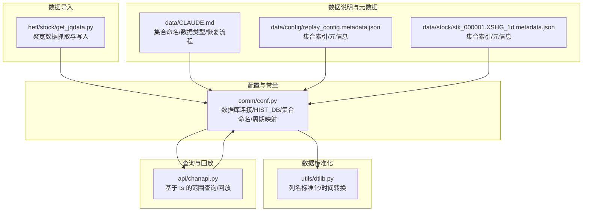
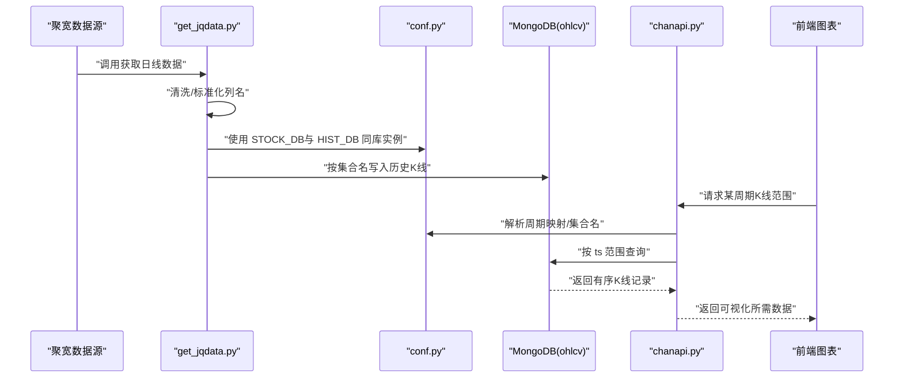
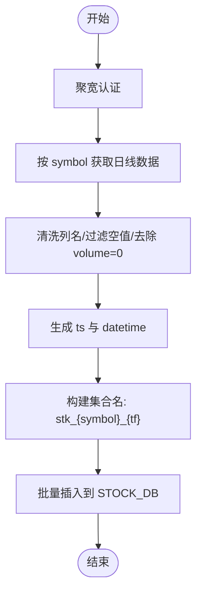
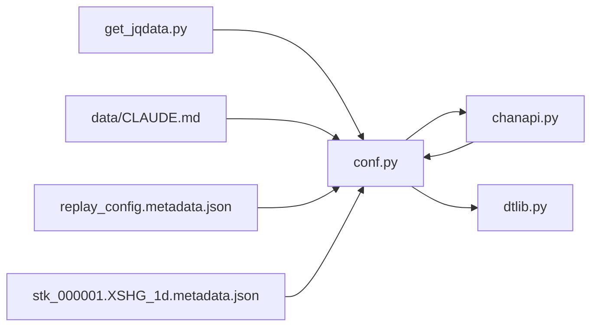

# HIST_DB 历史K线数据库

<cite>
**本文引用的文件**
- [comm/conf.py](file://comm/conf.py)
- [hetl/stock/get_jqdata.py](file://hetl/stock/get_jqdata.py)
- [utils/dtlib.py](file://utils/dtlib.py)
- [api/chanapi.py](file://api/chanapi.py)
- [data/CLAUDE.md](file://data/CLAUDE.md)
- [data/config/replay_config.metadata.json](file://data/config/replay_config.metadata.json)
- [data/stock/stk_000001.XSHG_1d.metadata.json](file://data/stock/stk_000001.XSHG_1d.metadata.json)
</cite>

## 目录
1. [简介](#简介)
2. [项目结构](#项目结构)
3. [核心组件](#核心组件)
4. [架构总览](#架构总览)
5. [详细组件分析](#详细组件分析)
6. [依赖关系分析](#依赖关系分析)
7. [性能考量](#性能考量)
8. [故障排查指南](#故障排查指南)
9. [结论](#结论)
10. [附录](#附录)

## 简介
本文件系统化文档化 HIST_DB 历史K线数据库的配置与用途，重点覆盖以下方面：
- HIST_DB 的数据库实例化与命名空间划分
- 支持的数据源格式与标准化字段体系
- 不同时间周期（1m、5m、1d 等）的数据存储结构与集合命名规则
- 在数据回放、技术指标计算与缠论生成中的基础作用
- 结合 hetl/stock/get_jqdata.py 的数据导入流程，说明写入机制
- 提供高效时间范围查询的示例与索引优化建议

## 项目结构
围绕 HIST_DB 的关键文件与职责如下：
- 配置与常量：comm/conf.py 定义了数据库连接、集合命名规则、时间周期映射、列名规范等
- 数据导入：hetl/stock/get_jqdata.py 从聚宽数据源抓取日线数据并写入 STOCK_DB（与 HIST_DB 同属同一 MongoDB 实例）
- 数据标准化：utils/dtlib.py 提供多种数据源列名到标准列的转换函数
- 查询与回放：api/chanapi.py 展示了基于 ts 字段的高效时间范围查询与回放逻辑
- 数据说明与元数据：data/CLAUDE.md 描述了数据类型、集合命名与恢复流程；metadata.json 展示集合索引与元信息

图表来源
- [comm/conf.py](file://comm/conf.py#L1-L166)
- [hetl/stock/get_jqdata.py](file://hetl/stock/get_jqdata.py#L1-L100)
- [utils/dtlib.py](file://utils/dtlib.py#L1-L163)
- [api/chanapi.py](file://api/chanapi.py#L112-L214)
- [data/CLAUDE.md](file://data/CLAUDE.md#L1-L123)
- [data/config/replay_config.metadata.json](file://data/config/replay_config.metadata.json#L1-L1)
- [data/stock/stk_000001.XSHG_1d.metadata.json](file://data/stock/stk_000001.XSHG_1d.metadata.json#L1-L1)

章节来源
- [comm/conf.py](file://comm/conf.py#L1-L166)
- [data/CLAUDE.md](file://data/CLAUDE.md#L1-L123)

## 核心组件
- 数据库实例化与命名空间
  - 通过本地 MongoDB 连接客户端实例化多个数据库命名空间，其中 HIST_DB 指向 ohlcv 数据库，用于存放原始市场行情K线数据
  - 同时存在 CHAN_DB（nlchan）、STOCK_DB（stock）、CONF_DB（config），分别承载缠论分析结果、股票数据与配置
- 时间周期与集合命名
  - 时间周期映射字典将分辨率字符串映射到标准周期标识（如 1 分钟、5 分钟、1 小时、1 天、1 周）
  - 集合命名采用“{symbol}_{tf}”的模式，例如 BTC 的 1 小时周期集合名为 “BTC_1h”
  - 缠论本质线段与中枢集合采用“essence_xd_{sym}_{tf}”、“essence_zs_{sym}_{tf}”等命名
- 列名标准化
  - 定义了多组数据源列名映射（如 HB_KDATA_COLUMNS、OK_KDATA_COLUMNS、BA_KDATA_COLUMNS、E_KDATA_COLUMNS、GP_KDATA_COLUMNS、DAY_COLUMNS）
  - 统一的标准列名为 STAND_KDATA_COLUMNS，包含 id、datetime、open、high、low、close、volume、amount
- 时间范围与起始时间戳
  - DATE_START_TS 为各周期设定起始时间戳，用于控制数据保留范围
  - TF_SEC_MAP 将周期映射为秒级粒度，便于计算高低点之间的K线数量与回放步进

章节来源
- [comm/conf.py](file://comm/conf.py#L1-L166)

## 架构总览
HIST_DB 在系统中的角色是“原始K线数据仓库”，为上层的回放引擎、技术指标计算与缠论生成提供统一、标准化的数据访问入口。下图展示了从数据导入到查询回放的关键交互路径。

图表来源
- [hetl/stock/get_jqdata.py](file://hetl/stock/get_jqdata.py#L1-L100)
- [comm/conf.py](file://comm/conf.py#L1-L166)
- [api/chanapi.py](file://api/chanapi.py#L112-L214)

## 详细组件分析

### HIST_DB 数据库与集合命名
- 数据库实例化
  - 通过本地 MongoDB 客户端连接，HIST_DB 指向 ohlcv 数据库，用于存放原始K线数据
- 集合命名规则
  - 原始K线集合："{symbol}_{tf}"，如 "BTC_1h"、"ETH_5m"
  - 缠论本质线段/中枢集合：essence_xd_{sym}_{tf}、essence_zs_{sym}_{tf}
  - 自然缠论线段/中枢集合：lnchan_xd_{sym}_{tf}、lnchan_zs_{sym}_{tf}
- 时间周期映射
  - 分辨率字符串到标准周期标识的映射，如 "1"->"1m"、"5"->"5m"、"60"->"1h"、"1D"->"1d"、"1W"->"1w"

章节来源
- [comm/conf.py](file://comm/conf.py#L1-L166)

### 数据源格式与标准化字段
- 多数据源列名映射
  - HB_KDATA_COLUMNS：适用于某些币圈数据源，包含 id、datetime、open、high、low、close、count、vol、amount
  - OK_KDATA_COLUMNS：Okex/OKCoin 数据源列名，包含 ts、datetime、open、high、low、close、cnt、volume、currency_volume
  - BA_KDATA_COLUMNS：Binance 数据源列名，包含 id、open、high、low、close、volume、amount
  - E_KDATA_COLUMNS、GP_KDATA_COLUMNS、DAY_COLUMNS：其他数据源或日线数据列名
- 标准化字段 STAND_KDATA_COLUMNS
  - 统一为 id、datetime、open、high、low、close、volume、amount，便于跨数据源的一致化处理
- 标准化流程
  - utils/dtlib.py 提供 make_hist、okex_make_hist、binance_make_hist 等函数，将不同数据源的列名映射到 STAND_KDATA_COLUMNS，并进行类型转换与重命名

章节来源
- [comm/conf.py](file://comm/conf.py#L44-L65)
- [utils/dtlib.py](file://utils/dtlib.py#L65-L133)

### 不同时间周期的数据存储结构与分区策略
- 存储结构
  - 每个 symbol 在每个 tf 下对应一个集合，文档字段遵循 STAND_KDATA_COLUMNS
  - 文档包含时间戳 ts（秒级）、人类可读 datetime、OHLCV 等字段
- 分区策略
  - 代码未显式实现集合级分区（如按月/年拆分集合），但通过 DATE_START_TS 与 TF_SEC_MAP 控制各周期的数据保留范围与回放步进
  - 建议在应用层按 symbol+tf 维度进行数据归档与清理，避免单集合无限增长

章节来源
- [comm/conf.py](file://comm/conf.py#L114-L121)
- [comm/conf.py](file://comm/conf.py#L23-L31)

### 在数据回放、技术指标计算与缠论生成中的基础作用
- 数据回放
  - api/chanapi.py 展示了基于 ts 字段的范围查询与“部分K线”回放逻辑，确保从最小级别（1 分钟）到大级别（如 1 小时、1 天、1 周）的回放一致性
  - 回放配置集合 replay_config 记录当前 ts 与 symbol/tf 状态，驱动回放进度
- 技术指标计算
  - 通过统一的 STAND_KDATA_COLUMNS 与 ts 排序，指标计算可稳定地按时间顺序处理K线序列
- 缠论生成
  - 缠论本质线段/中枢集合（essence_xd、essence_zs）与自然缠论集合（lnchan_xd、lnchan_zs）均以 symbol+tf 为维度组织，支撑多周期分析

章节来源
- [api/chanapi.py](file://api/chanapi.py#L112-L214)
- [api/chanapi.py](file://api/chanapi.py#L503-L545)
- [comm/conf.py](file://comm/conf.py#L143-L158)
- [data/CLAUDE.md](file://data/CLAUDE.md#L1-L123)

### 数据导入流程（基于 hetl/stock/get_jqdata.py）
- 数据源：聚宽 jqdatasdk
- 导入步骤
  - 获取股票/指数/基金列表并写入 STOCK_DB.stock_names
  - 按 symbol 与 tf（此处为 1d）拉取日线历史，清洗列名与空值，生成 ts 与 datetime
  - 写入 STOCK_DB.stk_{symbol}_{tf} 集合（注意：此处为 STOCK_DB，非 HIST_DB）
- 与 HIST_DB 的关系
  - 代码中使用的是 STOCK_DB，而非 HIST_DB；若需将日线写入 HIST_DB，可在导入流程中调整目标数据库与集合命名

图表来源
- [hetl/stock/get_jqdata.py](file://hetl/stock/get_jqdata.py#L1-L100)

章节来源
- [hetl/stock/get_jqdata.py](file://hetl/stock/get_jqdata.py#L1-L100)

### 高效时间范围查询与索引优化建议
- 查询要点
  - 使用 ts 字段进行范围查询，配合升序排序，确保时间序列的正确性
  - 回放场景中，先按 ts 范围查询，再根据需要追加“部分K线”片段
- 索引建议
  - 在集合上建立复合索引：{symbol: 1, tf: 1, ts: 1}
  - 或针对 symbol+tf 维度建立唯一索引，保证每周期内 ts 的唯一性
  - 对高频查询字段（如 ts）建立单字段索引，提升范围查询性能
- 元数据参考
  - data/config/replay_config.metadata.json、data/stock/stk_000001.XSHG_1d.metadata.json 展示了集合索引与元信息，可用于确认现有索引情况

章节来源
- [api/chanapi.py](file://api/chanapi.py#L173-L177)
- [api/chanapi.py](file://api/chanapi.py#L208-L213)
- [data/config/replay_config.metadata.json](file://data/config/replay_config.metadata.json#L1-L1)
- [data/stock/stk_000001.XSHG_1d.metadata.json](file://data/stock/stk_000001.XSHG_1d.metadata.json#L1-L1)

## 依赖关系分析
- 配置依赖
  - api/chanapi.py 依赖 conf.py 中的周期映射、集合命名与数据库实例
  - utils/dtlib.py 依赖 conf.py 中的列名映射与标准化字段
- 数据库依赖
  - HIST_DB 与 STOCK_DB 同属同一 MongoDB 实例，但导入脚本默认写入 STOCK_DB
- 元数据依赖
  - data/CLAUDE.md 与 metadata.json 为数据结构与集合命名提供外部说明与索引信息

图表来源
- [comm/conf.py](file://comm/conf.py#L1-L166)
- [api/chanapi.py](file://api/chanapi.py#L112-L214)
- [utils/dtlib.py](file://utils/dtlib.py#L1-L163)
- [hetl/stock/get_jqdata.py](file://hetl/stock/get_jqdata.py#L1-L100)
- [data/CLAUDE.md](file://data/CLAUDE.md#L1-L123)
- [data/config/replay_config.metadata.json](file://data/config/replay_config.metadata.json#L1-L1)
- [data/stock/stk_000001.XSHG_1d.metadata.json](file://data/stock/stk_000001.XSHG_1d.metadata.json#L1-L1)

章节来源
- [comm/conf.py](file://comm/conf.py#L1-L166)
- [api/chanapi.py](file://api/chanapi.py#L112-L214)
- [utils/dtlib.py](file://utils/dtlib.py#L1-L163)
- [hetl/stock/get_jqdata.py](file://hetl/stock/get_jqdata.py#L1-L100)
- [data/CLAUDE.md](file://data/CLAUDE.md#L1-L123)
- [data/config/replay_config.metadata.json](file://data/config/replay_config.metadata.json#L1-L1)
- [data/stock/stk_000001.XSHG_1d.metadata.json](file://data/stock/stk_000001.XSHG_1d.metadata.json#L1-L1)

## 性能考量
- 查询性能
  - 使用 ts 字段范围查询与升序排序，避免全表扫描
  - 对 symbol+tf+ts 建立复合索引，减少回放与分析时的查询成本
- 数据规模
  - 单集合无限增长会带来查询与维护压力，建议按 symbol+tf 维度进行定期归档与清理
- 类型与字段
  - 统一使用 STAND_KDATA_COLUMNS，减少字段歧义与类型转换开销
- 回放步进
  - 借助 TF_SEC_MAP 与 DATE_START_TS 控制回放步长与数据范围，避免越界查询

[本节为通用性能建议，不直接分析具体文件]

## 故障排查指南
- 无数据返回
  - 检查集合是否存在与命名是否符合“{symbol}_{tf}”
  - 确认 ts 范围是否正确，以及是否需要追加“部分K线”
- 查询慢
  - 确认是否建立了合适的复合索引（symbol、tf、ts）
  - 检查是否有不必要的字段投影或排序
- 数据导入异常
  - 确认聚宽认证与接口可用性
  - 检查列名映射与标准化流程是否一致
- 回放进度异常
  - 检查 replay_config 集合中的当前 ts 与 symbol/tf 状态

章节来源
- [api/chanapi.py](file://api/chanapi.py#L173-L177)
- [api/chanapi.py](file://api/chanapi.py#L208-L213)
- [data/config/replay_config.metadata.json](file://data/config/replay_config.metadata.json#L1-L1)

## 结论
HIST_DB 作为原始K线数据仓库，通过统一的集合命名、标准化字段与基于 ts 的高效查询，为回放、指标计算与缠论生成提供了坚实基础。结合数据导入流程与索引优化建议，可进一步提升系统的稳定性与性能表现。若需将日线数据写入 HIST_DB，可在导入脚本中调整目标数据库与集合命名，确保与 conf.py 的命名规则保持一致。

[本节为总结性内容，不直接分析具体文件]

## 附录
- 关键路径参考
  - HIST_DB 实例化与集合命名：[comm/conf.py](file://comm/conf.py#L143-L158)
  - 时间周期映射与起始时间戳：[comm/conf.py](file://comm/conf.py#L23-L31), [comm/conf.py](file://comm/conf.py#L114-L121)
  - 标准化列名映射与转换：[comm/conf.py](file://comm/conf.py#L44-L65), [utils/dtlib.py](file://utils/dtlib.py#L65-L133)
  - 日线导入流程（STOCK_DB）：[hetl/stock/get_jqdata.py](file://hetl/stock/get_jqdata.py#L1-L100)
  - 基于 ts 的范围查询与回放：[api/chanapi.py](file://api/chanapi.py#L173-L177), [api/chanapi.py](file://api/chanapi.py#L208-L213)
  - 数据类型与集合命名说明：[data/CLAUDE.md](file://data/CLAUDE.md#L1-L123)
  - 元数据与索引信息：[data/config/replay_config.metadata.json](file://data/config/replay_config.metadata.json#L1-L1), [data/stock/stk_000001.XSHG_1d.metadata.json](file://data/stock/stk_000001.XSHG_1d.metadata.json#L1-L1)