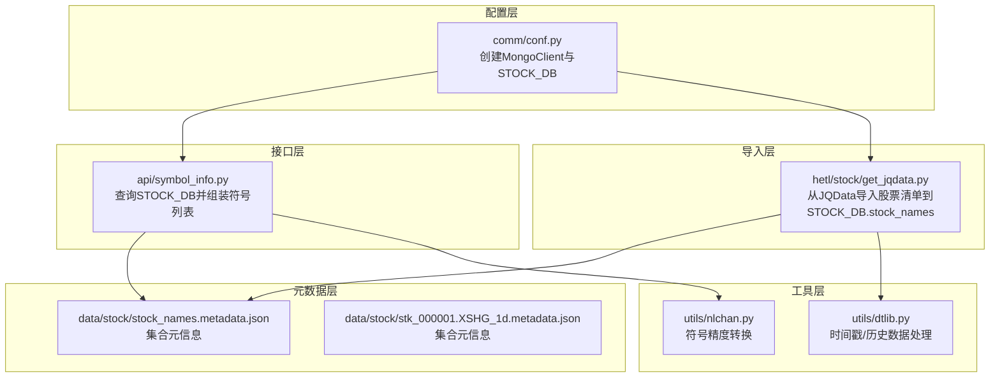
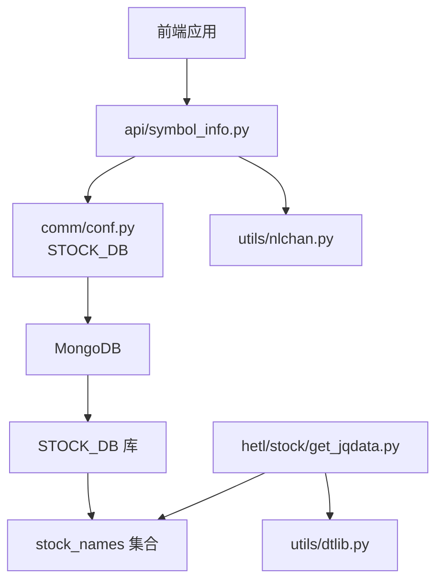
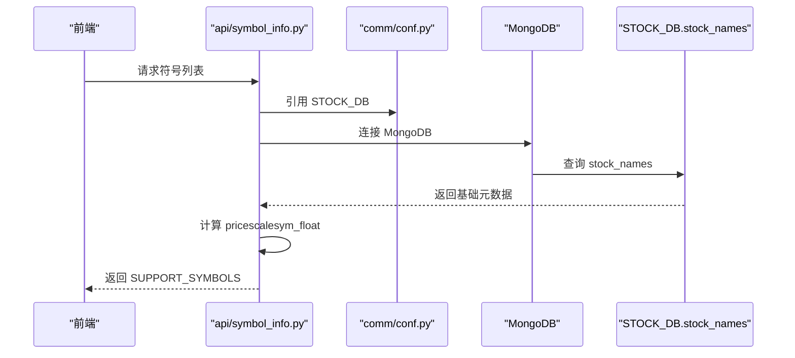
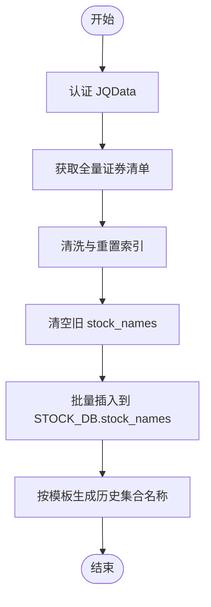
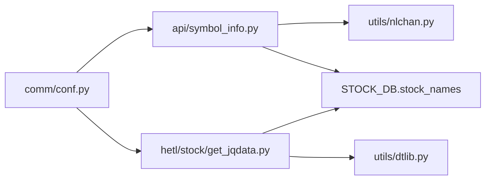

# STOCK_DB 股票基础信息数据库

<cite>
**本文引用的文件**
- [comm/conf.py](file://comm/conf.py)
- [api/symbol_info.py](file://api/symbol_info.py)
- [hetl/stock/get_jqdata.py](file://hetl/stock/get_jqdata.py)
- [data/stock/stock_names.metadata.json](file://data/stock/stock_names.metadata.json)
- [data/stock/stk_000001.XSHG_1d.metadata.json](file://data/stock/stk_000001.XSHG_1d.metadata.json)
- [utils/nlchan.py](file://utils/nlchan.py)
- [utils/dtlib.py](file://utils/dtlib.py)
</cite>

## 目录
1. [简介](#简介)
2. [项目结构](#项目结构)
3. [核心组件](#核心组件)
4. [架构总览](#架构总览)
5. [详细组件分析](#详细组件分析)
6. [依赖关系分析](#依赖关系分析)
7. [性能考量](#性能考量)
8. [故障排查指南](#故障排查指南)
9. [结论](#结论)
10. [附录](#附录)

## 简介
本文件系统性地文档化了 STOCK_DB 数据库在项目中的配置与用途。STOCK_DB 通过 MongoDB 客户端连接创建，承载股票市场的基础元数据，主要来源于 JQData 的全量股票/指数/基金清单，并持久化到名为 stock_names 的集合中。该数据库在前端“品种搜索”“符号解析”“数据关联查询”等场景中发挥关键作用：前端通过 symbol_info 接口获取支持的股票符号列表，后端从 STOCK_DB 中读取基础元数据，结合本地元数据文件与历史数据集合，完成符号标准化、描述生成与价格精度映射，从而支撑可视化与回测分析。

## 项目结构
围绕 STOCK_DB 的相关文件组织如下：
- 配置层：comm/conf.py 定义数据库客户端与命名空间，暴露 STOCK_DB 实例
- 接口层：api/symbol_info.py 使用 STOCK_DB 查询股票基础信息，组装前端可用的符号列表
- 导入层：hetl/stock/get_jqdata.py 从 JQData 获取全量证券清单，写入 STOCK_DB.stock_names
- 元数据层：data/stock/*.metadata.json 展示 stock_names 与具体股票历史集合的集合元信息
- 工具层：utils/nlchan.py 提供符号精度转换工具；utils/dtlib.py 提供时间戳转换与历史数据格式化工具

图表来源
- [comm/conf.py](file://comm/conf.py#L143-L146)
- [api/symbol_info.py](file://api/symbol_info.py#L1-L74)
- [hetl/stock/get_jqdata.py](file://hetl/stock/get_jqdata.py#L1-L100)
- [data/stock/stock_names.metadata.json](file://data/stock/stock_names.metadata.json#L1-L1)
- [data/stock/stk_000001.XSHG_1d.metadata.json](file://data/stock/stk_000001.XSHG_1d.metadata.json#L1-L1)
- [utils/nlchan.py](file://utils/nlchan.py#L1-L25)
- [utils/dtlib.py](file://utils/dtlib.py#L1-L207)

章节来源
- [comm/conf.py](file://comm/conf.py#L143-L146)
- [api/symbol_info.py](file://api/symbol_info.py#L1-L74)
- [hetl/stock/get_jqdata.py](file://hetl/stock/get_jqdata.py#L1-L100)
- [data/stock/stock_names.metadata.json](file://data/stock/stock_names.metadata.json#L1-L1)
- [data/stock/stk_000001.XSHG_1d.metadata.json](file://data/stock/stk_000001.XSHG_1d.metadata.json#L1-L1)
- [utils/nlchan.py](file://utils/nlchan.py#L1-L25)
- [utils/dtlib.py](file://utils/dtlib.py#L1-L207)

## 核心组件
- STOCK_DB 实例：由 comm/conf.py 创建，指向 MongoDB 的 stock 数据库命名空间
- stock_names 集合：存储股票/指数/基金的基础元数据，包含代码、显示名、名称等字段
- 符号查询接口：api/symbol_info.py 从 STOCK_DB 读取 stock_names，组装前端所需的符号描述与参数
- 数据导入流程：hetl/stock/get_jqdata.py 从 JQData 获取全量清单，清洗后批量写入 stock_names
- 历史数据集合：按“stk_{code}.{market}_{tf}”命名，用于存放各股票的历史K线数据
- 工具函数：utils/nlchan.py 提供符号精度转换；utils/dtlib.py 提供时间戳与历史数据格式化

章节来源
- [comm/conf.py](file://comm/conf.py#L143-L146)
- [api/symbol_info.py](file://api/symbol_info.py#L47-L69)
- [hetl/stock/get_jqdata.py](file://hetl/stock/get_jqdata.py#L18-L32)
- [data/stock/stock_names.metadata.json](file://data/stock/stock_names.metadata.json#L1-L1)
- [data/stock/stk_000001.XSHG_1d.metadata.json](file://data/stock/stk_000001.XSHG_1d.metadata.json#L1-L1)
- [utils/nlchan.py](file://utils/nlchan.py#L1-L25)
- [utils/dtlib.py](file://utils/dtlib.py#L1-L207)

## 架构总览
STOCK_DB 在系统中的角色是“基础元数据中心”。它与以下模块协同工作：
- 配置层：提供数据库连接与命名空间
- 导入层：负责将外部数据源（JQData）的全量清单导入 stock_names
- 接口层：对外提供符号查询能力，支撑前端搜索与解析
- 工具层：提供精度与时间转换，保证数据一致性

图表来源
- [comm/conf.py](file://comm/conf.py#L143-L146)
- [api/symbol_info.py](file://api/symbol_info.py#L1-L74)
- [hetl/stock/get_jqdata.py](file://hetl/stock/get_jqdata.py#L1-L100)
- [utils/nlchan.py](file://utils/nlchan.py#L1-L25)
- [utils/dtlib.py](file://utils/dtlib.py#L1-L207)

## 详细组件分析

### STOCK_DB 配置与命名空间
- 数据库连接：通过 MongoClient 连接本地 MongoDB，默认端口 27017
- 命名空间：STOCK_DB 指向数据库 stock，后续可在此下创建或访问集合
- 其他命名空间：同一文件还定义了 CHAN_DB、HIST_DB、CONF_DB 等，便于多库隔离

章节来源
- [comm/conf.py](file://comm/conf.py#L143-L146)

### stock_names 集合与字段
- 集合名称：stock_names
- 元数据文件：data/stock/stock_names.metadata.json 描述集合索引与UUID等元信息
- 字段来源：hetl/stock/get_jqdata.py 从 JQData 导入时，将代码、显示名、名称等字段写入集合
- 字段用途：api/symbol_info.py 读取 code、display_name、name，用于前端符号描述与展示

章节来源
- [data/stock/stock_names.metadata.json](file://data/stock/stock_names.metadata.json#L1-L1)
- [hetl/stock/get_jqdata.py](file://hetl/stock/get_jqdata.py#L18-L32)
- [api/symbol_info.py](file://api/symbol_info.py#L47-L69)

### 符号查询接口（api/symbol_info.py）
- 查询逻辑：从 STOCK_DB.stock_names 查询基础元数据，过滤不需要的类型或特殊项
- 组装规则：根据 code、display_name、name 生成前端所需字段（如 name、symbol、description、pricescale 等）
- 价格精度：使用 utils/nlchan.sym_float 计算 pricescale，确保前端图表正确缩放
- 返回结构：SUPPORT_SYMBOLS 列表，供前端“品种搜索”“符号解析”使用

图表来源
- [api/symbol_info.py](file://api/symbol_info.py#L1-L74)
- [comm/conf.py](file://comm/conf.py#L143-L146)
- [utils/nlchan.py](file://utils/nlchan.py#L1-L25)

章节来源
- [api/symbol_info.py](file://api/symbol_info.py#L1-L74)
- [utils/nlchan.py](file://utils/nlchan.py#L1-L25)

### 数据导入流程（hetl/stock/get_jqdata.py）
- 来源：JQData 全量股票/指数/基金清单
- 清洗：重置索引、列名规范化
- 写入：清空旧数据后批量插入到 STOCK_DB.stock_names
- 历史数据：按“stk_{code}.{market}_{tf}”命名写入历史K线集合（如 stk_000001.XSHG_1d）

图表来源
- [hetl/stock/get_jqdata.py](file://hetl/stock/get_jqdata.py#L18-L32)
- [data/stock/stk_000001.XSHG_1d.metadata.json](file://data/stock/stk_000001.XSHG_1d.metadata.json#L1-L1)

章节来源
- [hetl/stock/get_jqdata.py](file://hetl/stock/get_jqdata.py#L18-L32)
- [data/stock/stk_000001.XSHG_1d.metadata.json](file://data/stock/stk_000001.XSHG_1d.metadata.json#L1-L1)

### 历史数据集合命名规范
- 命名模式：stk_{code}.{market}_{tf}
- 示例：stk_000001.XSHG_1d 表示上证指数 000001 的日线数据
- 元信息：data/stock/stk_000001.XSHG_1d.metadata.json 展示集合索引与UUID等元信息

章节来源
- [hetl/stock/get_jqdata.py](file://hetl/stock/get_jqdata.py#L52-L57)
- [data/stock/stk_000001.XSHG_1d.metadata.json](file://data/stock/stk_000001.XSHG_1d.metadata.json#L1-L1)

## 依赖关系分析
- 配置依赖：api/symbol_info.py 与 hetl/stock/get_jqdata.py 均依赖 comm/conf.py 中的 STOCK_DB
- 工具依赖：api/symbol_info.py 依赖 utils/nlchan.sym_float 进行价格精度计算
- 数据依赖：STOCK_DB.stock_names 作为符号查询与描述生成的数据源
- 历史数据依赖：按命名规范生成的历史集合用于后续可视化与分析

图表来源
- [comm/conf.py](file://comm/conf.py#L143-L146)
- [api/symbol_info.py](file://api/symbol_info.py#L1-L74)
- [hetl/stock/get_jqdata.py](file://hetl/stock/get_jqdata.py#L1-L100)
- [utils/nlchan.py](file://utils/nlchan.py#L1-L25)
- [utils/dtlib.py](file://utils/dtlib.py#L1-L207)

章节来源
- [comm/conf.py](file://comm/conf.py#L143-L146)
- [api/symbol_info.py](file://api/symbol_info.py#L1-L74)
- [hetl/stock/get_jqdata.py](file://hetl/stock/get_jqdata.py#L1-L100)
- [utils/nlchan.py](file://utils/nlchan.py#L1-L25)
- [utils/dtlib.py](file://utils/dtlib.py#L1-L207)

## 性能考量
- 查询优化
  - 对 STOCK_DB.stock_names 建立必要的索引，以提升符号查询与过滤性能
  - 控制返回字段范围，仅选择前端需要的 code、display_name、name 等字段
- 批量写入
  - 导入阶段使用批量插入，避免逐条写入带来的网络与事务开销
- 数据规模
  - 股票/指数/基金数量较大，建议分批导入与增量更新策略
- 缓存策略
  - 前端对符号列表进行缓存，减少重复请求
  - 后端可对热点符号的描述信息进行短期缓存

[本节为通用指导，不直接分析具体文件]

## 故障排查指南
- MongoDB 连接失败
  - 确认本地 MongoDB 已启动且端口 27017 可达
  - 检查 comm/conf.py 中的连接参数是否正确
- stock_names 集合为空
  - 确认 hetl/stock/get_jqdata.py 是否成功执行导入
  - 检查 JQData 认证信息与网络连通性
- 符号列表异常
  - 检查 api/symbol_info.py 的过滤逻辑与 pricescale 计算
  - 确认 utils/nlchan.sym_float 的输入格式与边界条件
- 历史数据缺失
  - 检查 hetl/stock/get_jqdata.py 的历史写入逻辑与集合命名
  - 确认 utils/dtlib.py 的时间戳转换与列映射是否一致

章节来源
- [comm/conf.py](file://comm/conf.py#L143-L146)
- [hetl/stock/get_jqdata.py](file://hetl/stock/get_jqdata.py#L18-L32)
- [api/symbol_info.py](file://api/symbol_info.py#L1-L74)
- [utils/nlchan.py](file://utils/nlchan.py#L1-L25)
- [utils/dtlib.py](file://utils/dtlib.py#L1-L207)

## 结论
STOCK_DB 作为股票基础信息的核心数据源，承担着“符号元数据”的统一管理职责。通过 comm/conf.py 的集中配置、hetl/stock/get_jqdata.py 的标准化导入、api/symbol_info.py 的高效查询与组装，以及 utils/nlchan.py、utils/dtlib.py 的辅助工具，形成了从前端搜索到后端数据关联的完整链路。建议持续完善索引、缓存与增量更新机制，以保障大规模数据下的稳定与性能。

[本节为总结性内容，不直接分析具体文件]

## 附录
- 最佳实践
  - 数据同步：定期执行导入脚本，保持 stock_names 与外部数据源一致
  - 维护策略：对 stock_names 建立唯一索引（如 code），并定期清理无效/重复记录
  - 版本控制：对导入脚本与元数据文件进行版本管理，便于回溯与审计
  - 监控告警：对导入失败、连接异常、查询超时等关键指标进行监控

[本节为通用指导，不直接分析具体文件]