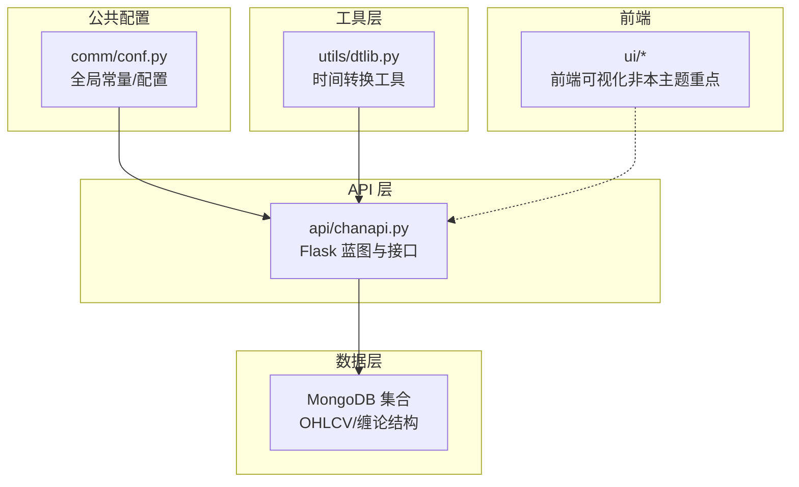
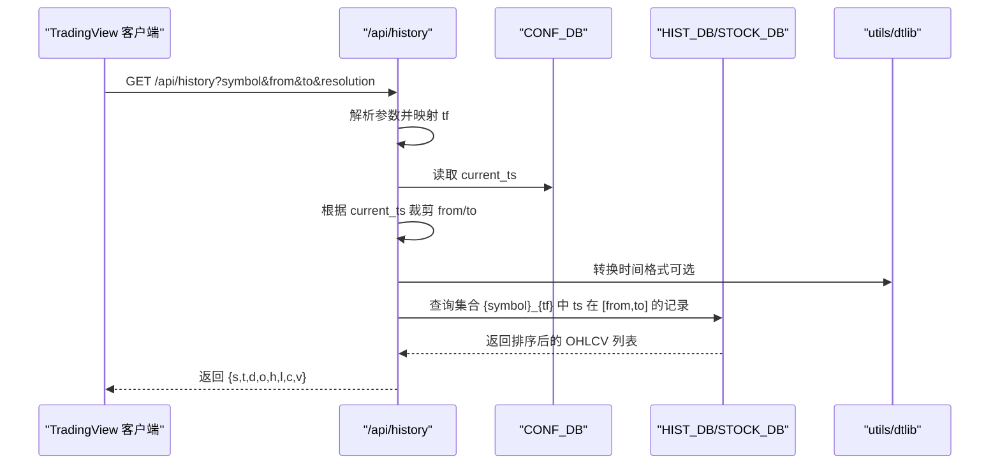
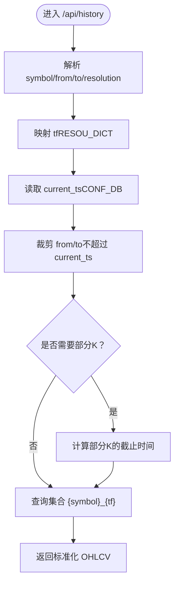
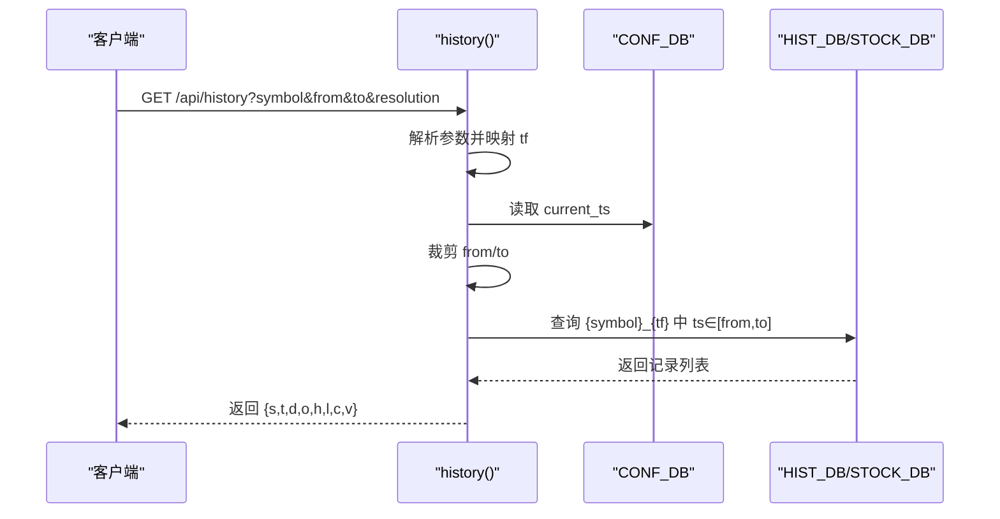
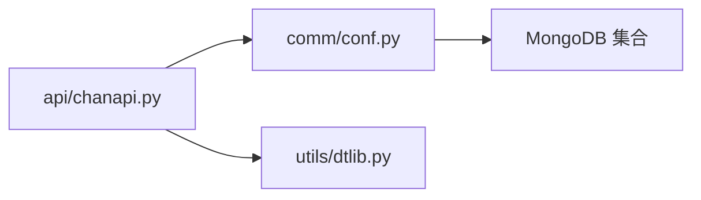

# 数据范围配置

<cite>
**本文引用的文件**
- [comm/conf.py](file://comm/conf.py)
- [api/chanapi.py](file://api/chanapi.py)
- [utils/dtlib.py](file://utils/dtlib.py)
- [api/symbol_info.py](file://api/symbol_info.py)
- [comm/CLAUDE.md](file://comm/CLAUDE.md)
- [README.md](file://README.md)
</cite>

## 目录
1. [引言](#引言)
2. [项目结构](#项目结构)
3. [核心组件](#核心组件)
4. [架构总览](#架构总览)
5. [详细组件分析](#详细组件分析)
6. [依赖分析](#依赖分析)
7. [性能考量](#性能考量)
8. [故障排查指南](#故障排查指南)
9. [结论](#结论)
10. [附录](#附录)

## 引言
本文件围绕“数据范围配置”这一主题，系统说明以下内容：
- DATE_START_TS 字典如何控制各时间周期的数据查询起始时间戳，并解释其对 /api/history 等 API 端点返回数据范围的影响。
- 基于 arrow.now() 与 base_days 的动态计算设计原理，以及为何不同周期采用不同的回溯天数（例如 5m 为 60 天，30m 为 360 天）。
- MAX_XD_LEN 参数如何限制线段数据的最大返回条数以优化性能与内存使用。
- 提供调整这些参数以适配不同数据分析需求的实践建议。

## 项目结构
本项目采用分层组织：公共配置位于 comm，API 接口位于 api，通用工具位于 utils，前端位于 ui，数据位于 data。与本主题直接相关的文件如下：
- 公共配置：comm/conf.py（包含 DATE_START_TS、MAX_XD_LEN、时间周期映射等）
- API 接口：api/chanapi.py（历史数据接口 /api/history 的实现）
- 工具函数：utils/dtlib.py（时间戳与字符串互转等）
- 符号与周期：api/symbol_info.py（支持的周期列表）
- 文档：comm/CLAUDE.md（配置说明）、README.md（项目背景）

图表来源
- [comm/conf.py](file://comm/conf.py#L1-L166)
- [api/chanapi.py](file://api/chanapi.py#L1-L235)
- [utils/dtlib.py](file://utils/dtlib.py#L1-L207)

章节来源
- [README.md](file://README.md#L90-L136)

## 核心组件
- DATE_START_TS：各时间周期的默认起始时间戳字典，用于限定历史数据查询的最早边界。
- MAX_XD_LEN：线段数据的最大返回条数，用于限制前端或分析侧的展示规模。
- TF_SEC_MAP：时间周期到秒数的映射，用于将 TradingView 周期换算为秒级粒度，支撑查询与回测逻辑。
- RESOU_DICT：TradingView 周期字符串到内部周期标识的映射，用于统一处理不同分辨率。
- TF_DAY_KLINE_CNT：一天内各周期的 K 线数量，用于估算数据密度与回溯范围。

章节来源
- [comm/conf.py](file://comm/conf.py#L23-L41)
- [comm/conf.py](file://comm/conf.py#L111-L133)
- [comm/CLAUDE.md](file://comm/CLAUDE.md#L41-L65)

## 架构总览
/api/history 接口在收到请求后，会：
- 解析 symbol、from、to、resolution 参数。
- 通过 RESOU_DICT 将 TradingView 周期映射为内部周期 tf。
- 通过 TF_SEC_MAP 计算 tf 对应的秒数，用于回测与部分 K 线处理。
- 从配置数据库读取回测当前时间 current_ts，并据此裁剪 from/to。
- 查询对应集合（symbol_tf），返回标准化后的 OHLCV 数据。

图表来源
- [api/chanapi.py](file://api/chanapi.py#L96-L235)
- [utils/dtlib.py](file://utils/dtlib.py#L148-L163)
- [comm/conf.py](file://comm/conf.py#L139-L148)

## 详细组件分析

### DATE_START_TS：各周期起始时间戳的控制机制
- 设计要点
  - 采用字典形式为每个周期提供固定或动态的起始时间戳。
  - 对于 1m 周期，使用固定时间戳；对于其他周期，使用当前时间减去若干天的动态计算。
  - base_days 作为统一的回溯基准天数，不同周期乘以不同的倍数，从而实现“越长周期回溯越远”的策略。
- 影响范围
  - 在 /api/history 中，若客户端未显式传入 from/to，系统会结合 DATE_START_TS 与当前时间生成合理的默认范围，避免无界查询导致的性能问题。
  - 对于回测场景，current_ts 会进一步约束查询范围，确保不会越界访问未来数据。
- 不同周期回溯天数差异的原因
  - 5m：base_days（60 天）
  - 30m：base_days × 6（360 天）
  - 1h：base_days × 12（720 天）
  - 4h：base_days × 48（2880 天）
  - 1d/1w：base_days × 48（2880 天）
  - 设计意图：长周期数据通常用于中长期分析，需要更长的历史窗口；短周期数据用于高频分析，回溯范围相对较小，避免数据冗余。

图表来源
- [api/chanapi.py](file://api/chanapi.py#L96-L235)
- [comm/conf.py](file://comm/conf.py#L111-L121)

章节来源
- [comm/conf.py](file://comm/conf.py#L111-L121)
- [comm/CLAUDE.md](file://comm/CLAUDE.md#L81-L90)

### /api/history 对数据范围的影响
- 输入参数
  - symbol：标的代码或名称。
  - from/to：Unix 时间戳，表示查询的时间范围。
  - resolution：周期字符串（如 1、5、30、240、D、W）。
- 处理流程
  - 将 resolution 映射为内部 tf。
  - 若为股票代码，切换到 STOCK_DB 并前缀化 symbol。
  - 读取 CONF_DB 中的 current_ts，并据此裁剪 from/to，防止越界。
  - 使用 TF_SEC_MAP 将 tf 转换为秒数，用于部分 K 线处理与回测一致性。
  - 查询集合 {symbol}_{tf}，按 ts 升序返回。
- 输出结构
  - 包含状态码 s、时间戳数组 t、日期字符串数组 d、开盘价 o、最高价 h、最低价 l、收盘价 c、成交量 v。
  - 若无数据，返回状态 no_data 与 nextTime。

图表来源
- [api/chanapi.py](file://api/chanapi.py#L96-L235)

章节来源
- [api/chanapi.py](file://api/chanapi.py#L96-L235)

### 基于 arrow.now() 与 base_days 的动态计算设计原理
- 设计目标
  - 以 base_days 为基准，按周期倍数生成不同回溯天数，兼顾短期高频分析与长期趋势分析。
  - 1m 使用固定时间戳，保证特定历史起点；其他周期使用动态计算，随运行时间变化。
- 实现位置
  - DATE_START_TS 的计算与赋值位于公共配置文件中。
  - 通过 arrow.now() 获取当前时间，再按 days=-base_days×倍数 进行偏移。
- 与回测的关系
  - 回测时 current_ts 会覆盖默认起始时间，确保查询范围不超出回测窗口。

章节来源
- [comm/conf.py](file://comm/conf.py#L111-L121)
- [api/chanapi.py](file://api/chanapi.py#L126-L170)

### 为什么不同周期采用不同的回溯天数（如 5m 为 60 天，30m 为 360 天）
- 数据密度与分析粒度
  - 短周期（如 1m、5m）K 线数量巨大，回溯过远会导致数据冗余与查询压力。
  - 长周期（如 30m、1h、4h、日线、周线）K 线数量较少，需要更长的历史窗口以支撑趋势分析。
- 倍数设计
  - 5m：1 倍（60 天）
  - 30m：6 倍（360 天）
  - 1h：12 倍（720 天）
  - 4h：48 倍（2880 天）
  - 日/周：48 倍（2880 天）
- 目标
  - 在保证分析有效性的前提下，尽量减少不必要的数据传输与内存占用。

章节来源
- [comm/conf.py](file://comm/conf.py#L111-L121)

### MAX_XD_LEN：线段数据的最大返回条数
- 定义位置
  - MAX_XD_LEN 在公共配置中定义为 500，用于限制线段数据的最大返回条数。
- 作用范围
  - 用于线段标记类接口（如 /api/bzxd_mark、/api/bzzs_mark）等，避免一次性返回过多线段导致前端渲染卡顿或内存压力。
- 性能与内存优化
  - 通过限制返回条数，降低网络传输与前端处理负担，提升交互流畅度。
  - 若业务需要查看更多线段，可在接口层进行分页或增量拉取。

章节来源
- [comm/conf.py](file://comm/conf.py#L131-L133)

### 与 TradingView 周期的映射与支持
- 周期映射
  - RESOU_DICT 将 TradingView 的 "1"、"5"、"30"、"240"、"D"、"W" 等映射为内部周期标识（如 "1m"、"5m"、"30m"、"4h"、"1d"、"1w"）。
- 支持周期
  - symbol_info.py 中的 intraday_multipliers 指定前端可用的周期列表，与后端映射保持一致。
- 影响
  - 保证前端与后端在周期层面的一致性，避免出现后端不支持的周期导致查询失败。

章节来源
- [comm/conf.py](file://comm/conf.py#L12-L21)
- [api/symbol_info.py](file://api/symbol_info.py#L25-L39)

## 依赖分析
- 组件耦合
  - api/chanapi.py 依赖 comm/conf.py 中的 RESOU_DICT、TF_SEC_MAP、HIST_DB、STOCK_DB、CONF_DB 等。
  - utils/dtlib.py 为时间转换提供辅助函数，被 api/chanapi.py 在日志输出与调试中使用。
- 外部依赖
  - MongoDB：OHLCV 历史数据与缠论结构数据存储。
  - Arrow：时间计算与偏移。
- 潜在风险
  - 若 DATE_START_TS 的倍数设计不合理，可能导致长周期数据不足或短周期数据过多。
  - 若 MAX_XD_LEN 设置过小，可能影响分析完整性；过大则影响性能。

图表来源
- [api/chanapi.py](file://api/chanapi.py#L1-L60)
- [comm/conf.py](file://comm/conf.py#L1-L40)
- [utils/dtlib.py](file://utils/dtlib.py#L1-L40)

章节来源
- [api/chanapi.py](file://api/chanapi.py#L1-L60)
- [comm/conf.py](file://comm/conf.py#L1-L40)
- [utils/dtlib.py](file://utils/dtlib.py#L1-L40)

## 性能考量
- 查询范围控制
  - 通过 DATE_START_TS 与 current_ts 裁剪查询范围，避免全量扫描。
- 部分 K 线处理
  - 在回测场景下，使用 use_partial_k 与 partial_kline，确保大周期只使用已完成的 K 线，避免未来数据泄漏。
- 数据量限制
  - MAX_XD_LEN 控制线段返回条数，避免前端渲染压力。
- 建议
  - 对高频分析（1m/5m）适当缩小回溯范围；对中长期分析（日线/周线）扩大回溯范围。
  - 结合业务需求调整 MAX_XD_LEN，必要时采用分页或增量拉取策略。

[本节为通用性能建议，无需具体文件分析]

## 故障排查指南
- 常见问题
  - 无数据返回：检查 from/to 是否超过 current_ts，或集合是否存在对应 {symbol}_{tf}。
  - 数据不完整：确认是否触发了 use_partial_k，导致最后 K 线为部分数据。
  - 周期不匹配：确认 resolution 是否在 intraday_multipliers 中，且 RESOU_DICT 映射正确。
- 排查步骤
  - 在日志中查看 GET DATA 输出，确认查询范围与返回长度。
  - 校验 CONF_DB 中 current_ts 是否正确更新。
  - 检查 symbol 前缀（股票需加 stk_ 前缀）与集合命名规则。

章节来源
- [api/chanapi.py](file://api/chanapi.py#L126-L214)

## 结论
- DATE_START_TS 通过固定与动态组合的方式，为不同周期提供了合理的默认起始时间，配合 current_ts 与 TF_SEC_MAP，确保 /api/history 的查询范围可控、回测一致性良好。
- 不同周期采用不同的回溯天数倍数，体现了对数据密度与分析粒度的平衡考虑。
- MAX_XD_LEN 作为线段数据的上限，有助于在性能与分析完整性之间取得平衡。
- 建议根据实际业务需求与数据规模，灵活调整 base_days、倍数与 MAX_XD_LEN，并结合分页策略进一步优化性能。

[本节为总结性内容，无需具体文件分析]

## 附录

### 参数调整建议
- 调整回溯天数
  - 若分析周期偏向短期高频，可适当降低 base_days 或减少倍数；若偏向中长期趋势，可增大倍数。
  - 注意：长周期倍数越大，查询范围越广，需关注数据库索引与查询性能。
- 调整 MAX_XD_LEN
  - 若前端渲染卡顿，可降低 MAX_XD_LEN；若分析完整性要求高，可采用分页或增量拉取。
- 周期映射与支持
  - 确保 TradingView 周期与 RESOU_DICT、symbol_info.py 的 intraday_multipliers 保持一致，避免后端不支持的周期导致异常。

章节来源
- [comm/conf.py](file://comm/conf.py#L111-L133)
- [api/symbol_info.py](file://api/symbol_info.py#L25-L39)
- [comm/CLAUDE.md](file://comm/CLAUDE.md#L41-L65)