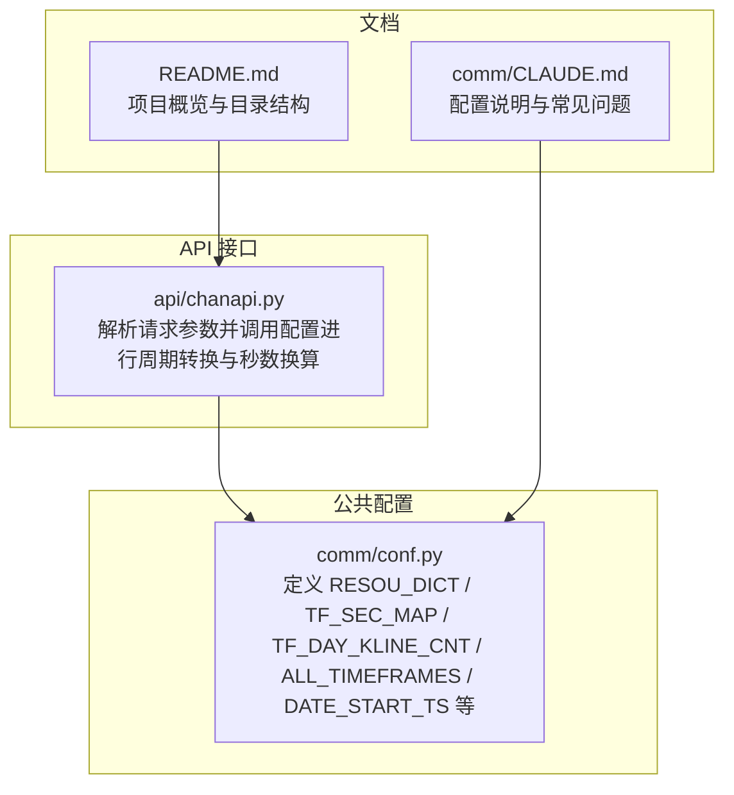
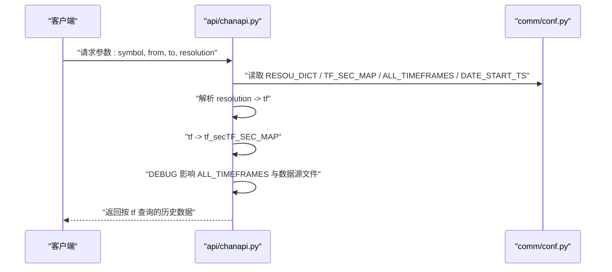
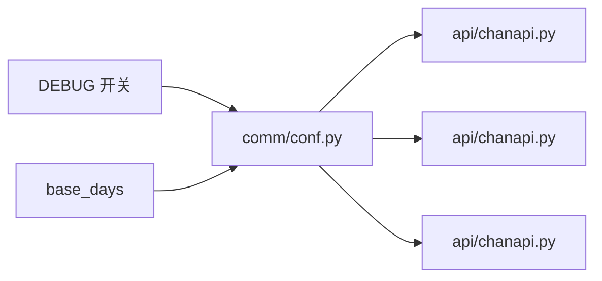

# 时间周期配置

<cite>
**本文引用的文件**
- [comm/conf.py](file://comm/conf.py)
- [api/chanapi.py](file://api/chanapi.py)
- [comm/CLAUDE.md](file://comm/CLAUDE.md)
- [README.md](file://README.md)
</cite>

## 目录
1. [简介](#简介)
2. [项目结构](#项目结构)
3. [核心组件](#核心组件)
4. [架构总览](#架构总览)
5. [详细组件分析](#详细组件分析)
6. [依赖分析](#依赖分析)
7. [性能考虑](#性能考虑)
8. [故障排查指南](#故障排查指南)
9. [结论](#结论)
10. [附录](#附录)

## 简介
本文件系统化梳理时间周期相关配置，重点解释以下内容：
- RESOU_DICT 分辨率映射字典如何将 API 参数（如“1m”）转换为界面显示名称
- TF_SEC_MAP 如何定义各周期对应的秒数以支持缠论结构计算
- TF_DAY_KLINE_CNT 如何预估每日 K 线数量用于数据完整性校验
- ALL_TIMEFRAMES 元组如何控制平台支持的时间周期范围
- DEBUG 模式对周期选择的影响
- 自定义新时间周期（如“2h”）的完整配置步骤

## 项目结构
时间周期配置集中在公共配置模块中，API 层在多个接口中使用这些配置进行解析与计算。

图表来源
- [comm/conf.py](file://comm/conf.py#L1-L166)
- [api/chanapi.py](file://api/chanapi.py#L100-L339)
- [comm/CLAUDE.md](file://comm/CLAUDE.md#L1-L174)
- [README.md](file://README.md#L107-L136)

章节来源
- [comm/conf.py](file://comm/conf.py#L1-L166)
- [api/chanapi.py](file://api/chanapi.py#L100-L339)
- [comm/CLAUDE.md](file://comm/CLAUDE.md#L1-L174)
- [README.md](file://README.md#L107-L136)

## 核心组件
- RESOU_DICT：将 API 输入的分辨率字符串映射为内部统一的周期标识（如“1m”、“5m”等），用于后续查询与展示。
- TF_SEC_MAP：将周期标识映射为秒数，用于计算高低点之间跨越的 K 线数量、对齐时间边界等。
- TF_DAY_KLINE_CNT：估算每日各周期应有多少根 K 线，用于数据完整性校验与异常检测。
- ALL_TIMEFRAMES：声明平台支持的全部时间周期集合，决定 UI 与回测/分析的可用范围。
- DATE_START_TS：各周期数据起始时间戳，配合 base_days 控制默认拉取窗口。
- DEBUG：调试模式开关，影响周期集合与数据源文件的选择。

章节来源
- [comm/conf.py](file://comm/conf.py#L1-L166)
- [api/chanapi.py](file://api/chanapi.py#L100-L339)
- [comm/CLAUDE.md](file://comm/CLAUDE.md#L112-L127)

## 架构总览
下图展示了 API 请求如何利用配置进行周期解析与秒数换算，以及 DEBUG 对周期集合的影响。

图表来源
- [api/chanapi.py](file://api/chanapi.py#L100-L339)
- [comm/conf.py](file://comm/conf.py#L1-L166)

## 详细组件分析

### RESOU_DICT：API 参数到界面显示名称的映射
- 作用：将来自前端或 API 的分辨率字符串（如“1m”、“5m”、“15”、“30”、“60”、“240”、“1D”、“1W”）映射为内部统一的周期标识（如“1m”、“5m”、“15m”、“30m”、“1h”、“4h”、“1d”、“1w”）。
- 使用场景：在历史数据查询、买卖点标记、中枢/线段标记等接口中，先通过 RESOU_DICT 将输入标准化，再进行后续处理。
- 示例调用位置：
  - 历史数据接口：解析 resolution 并映射为 tf
  - 买卖点标记接口：解析 resolution 并映射为 freq
  - 线段/中枢标记接口：解析 tf 并映射为 tf

章节来源
- [comm/conf.py](file://comm/conf.py#L12-L20)
- [api/chanapi.py](file://api/chanapi.py#L100-L110)
- [api/chanapi.py](file://api/chanapi.py#L244-L277)
- [api/chanapi.py](file://api/chanapi.py#L280-L300)

### TF_SEC_MAP：周期到秒数映射，支撑缠论结构计算
- 作用：将周期标识映射为秒数，用于：
  - 计算高低点之间跨越的 K 线数量（K 线连续）
  - 对齐时间边界（如按周期起点对齐）
  - 回测/回放时的小级别推进与大级别同步
- 使用场景：在历史数据查询、线段/中枢标记、上轨下轨标记等接口中，通过 TF_SEC_MAP 获取 tf_sec，再进行时间对齐与部分 K 线处理。

章节来源
- [comm/conf.py](file://comm/conf.py#L23-L31)
- [api/chanapi.py](file://api/chanapi.py#L140-L170)
- [api/chanapi.py](file://api/chanapi.py#L280-L300)
- [api/chanapi.py](file://api/chanapi.py#L494-L558)

### TF_DAY_KLINE_CNT：每日 K 线数量预估，用于数据完整性校验
- 作用：估算每日各周期应有多少根 K 线，便于：
  - 数据完整性检查（如某日是否缺失 K 线）
  - 异常检测（如某周期连续多日 K 线数异常）
- 注意：该字段在当前仓库中存在但未在代码中直接使用。建议在数据入库/回放/校验流程中结合该映射进行完整性校验。

章节来源
- [comm/conf.py](file://comm/conf.py#L33-L40)

### ALL_TIMEFRAMES：平台支持的时间周期范围
- 作用：声明平台支持的全部时间周期集合，决定：
  - UI 可选周期列表
  - 回测/分析默认可用周期
  - 数据准备与回放的周期覆盖范围
- DEBUG 影响：在 DEBUG 模式下，ALL_TIMEFRAMES 的值会被调整为更小的集合，便于快速验证与调试；在非 DEBUG 模式下，使用完整的周期集合。

章节来源
- [comm/conf.py](file://comm/conf.py#L81-L86)
- [comm/CLAUDE.md](file://comm/CLAUDE.md#L112-L118)

### DATE_START_TS：各周期数据起始时间戳
- 作用：为各周期设定默认数据起始时间戳，配合 base_days 控制默认拉取窗口长度。
- 使用场景：在历史数据查询接口中，若未显式传入起始时间，则使用 DATE_START_TS 作为默认起点。

章节来源
- [comm/conf.py](file://comm/conf.py#L111-L121)

### DEBUG 模式对周期选择的影响
- 行为差异：
  - 在 DEBUG 模式下，ALL_TIMEFRAMES 采用更短的周期集合，减少数据体量，提升调试效率
  - 在非 DEBUG 模式下，ALL_TIMEFRAMES 采用完整周期集合
- 文件来源差异：DEBUG 模式下会从调试专用的符号文件加载数据源，而非生产文件

章节来源
- [comm/conf.py](file://comm/conf.py#L81-L109)
- [comm/CLAUDE.md](file://comm/CLAUDE.md#L119-L127)

### 自定义新时间周期（以“2h”为例）的完整配置步骤
- 步骤 1：在 RESOU_DICT 中添加映射
  - 将 API 输入的“2h”映射为内部周期标识“2h”
  - 参考路径：[comm/conf.py](file://comm/conf.py#L12-L20)
- 步骤 2：在 TF_SEC_MAP 中添加映射
  - 定义“2h”对应的秒数（例如 2 小时的秒数）
  - 参考路径：[comm/conf.py](file://comm/conf.py#L23-L31)
- 步骤 3：在 TF_DAY_KLINE_CNT 中添加映射（可选）
  - 估算每日“2h”周期的 K 线数量（如 1440 / 120）
  - 参考路径：[comm/conf.py](file://comm/conf.py#L33-L40)
- 步骤 4：在 ALL_TIMEFRAMES 中加入“2h”
  - 确保“2h”出现在支持的周期集合中，以便 UI 与回测使用
  - 参考路径：[comm/conf.py](file://comm/conf.py#L81-L86)
- 步骤 5：在 API 层适配调用
  - 在历史数据查询、买卖点标记、线段/中枢标记等接口中，确保能正确解析“2h”并调用 TF_SEC_MAP 获取 tf_sec
  - 参考路径：
    - [api/chanapi.py](file://api/chanapi.py#L100-L110)
    - [api/chanapi.py](file://api/chanapi.py#L244-L277)
    - [api/chanapi.py](file://api/chanapi.py#L280-L300)
- 步骤 6：数据准备与回放
  - 确保数据源已生成“2h”周期的 K 线集合（集合命名通常为 {symbol}_{tf}）
  - 参考集合命名规则：[comm/conf.py](file://comm/conf.py#L151-L158)

章节来源
- [comm/conf.py](file://comm/conf.py#L12-L40)
- [comm/conf.py](file://comm/conf.py#L81-L86)
- [comm/conf.py](file://comm/conf.py#L151-L158)
- [api/chanapi.py](file://api/chanapi.py#L100-L110)
- [api/chanapi.py](file://api/chanapi.py#L244-L277)
- [api/chanapi.py](file://api/chanapi.py#L280-L300)

## 依赖分析
- API 层对配置层的依赖：
  - 历史数据查询：依赖 RESOU_DICT 进行分辨率映射，依赖 TF_SEC_MAP 进行秒数换算
  - 买卖点/线段/中枢标记：依赖 RESOU_DICT 进行频率映射，依赖 TF_SEC_MAP 进行时间对齐
- 配置层对运行模式的依赖：
  - DEBUG 模式影响 ALL_TIMEFRAMES 与数据源文件选择
  - DATE_START_TS 与 base_days 共同决定默认数据窗口

图表来源
- [comm/conf.py](file://comm/conf.py#L1-L166)
- [api/chanapi.py](file://api/chanapi.py#L100-L339)

章节来源
- [comm/conf.py](file://comm/conf.py#L1-L166)
- [api/chanapi.py](file://api/chanapi.py#L100-L339)

## 性能考虑
- 周期粒度越细（如“1m”），K 线数量越多，查询与渲染压力越大；合理使用 ALL_TIMEFRAMES 与 TF_SEC_MAP 可降低不必要的数据量。
- 使用 TF_SEC_MAP 对齐时间边界，避免跨周期查询中的重复与越界，提高查询效率。
- 在 DEBUG 模式下缩小 ALL_TIMEFRAMES，有助于快速定位问题，减少 IO 压力。

## 故障排查指南
- 周期无法识别
  - 检查 RESOU_DICT 是否包含新增周期映射
  - 参考路径：[comm/conf.py](file://comm/conf.py#L12-L20)
- 秒数换算错误
  - 检查 TF_SEC_MAP 中对应周期的秒数是否正确
  - 参考路径：[comm/conf.py](file://comm/conf.py#L23-L31)
- 数据缺失或不完整
  - 结合 TF_DAY_KLINE_CNT 进行每日 K 线数量校验
  - 参考路径：[comm/conf.py](file://comm/conf.py#L33-L40)
- 周期不可用
  - 检查 DEBUG 模式下的 ALL_TIMEFRAMES 是否包含目标周期
  - 参考路径：[comm/conf.py](file://comm/conf.py#L81-L86)
- 默认起始时间不符合预期
  - 检查 DATE_START_TS 与 base_days 的设置
  - 参考路径：[comm/conf.py](file://comm/conf.py#L111-L121)

章节来源
- [comm/conf.py](file://comm/conf.py#L12-L40)
- [comm/conf.py](file://comm/conf.py#L81-L86)
- [comm/conf.py](file://comm/conf.py#L111-L121)

## 结论
- RESOU_DICT、TF_SEC_MAP、TF_DAY_KLINE_CNT、ALL_TIMEFRAMES、DATE_START_TS、DEBUG 共同构成时间周期配置的核心闭环。
- API 层通过 RESOU_DICT 将外部输入标准化，再借助 TF_SEC_MAP 完成秒数换算与时间对齐，最终实现对缠论结构的稳定支持。
- 新增周期需同时维护映射表与周期集合，并在 API 层进行适配；DEBUG 模式可显著提升开发与调试效率。

## 附录
- 常见问题（FAQ）
  - 如何添加新的时间周期？请同时更新 RESOU_DICT 与 TF_SEC_MAP，并在 ALL_TIMEFRAMES 中加入新周期
  - DEBUG 模式有什么区别？DEBUG 模式使用更少的数据与不同的周期集合，便于快速验证
  - 如何调整数据起始时间？可通过 DATE_START_TS 或 base_days 进行调整

章节来源
- [comm/CLAUDE.md](file://comm/CLAUDE.md#L142-L156)
- [comm/conf.py](file://comm/conf.py#L81-L121)