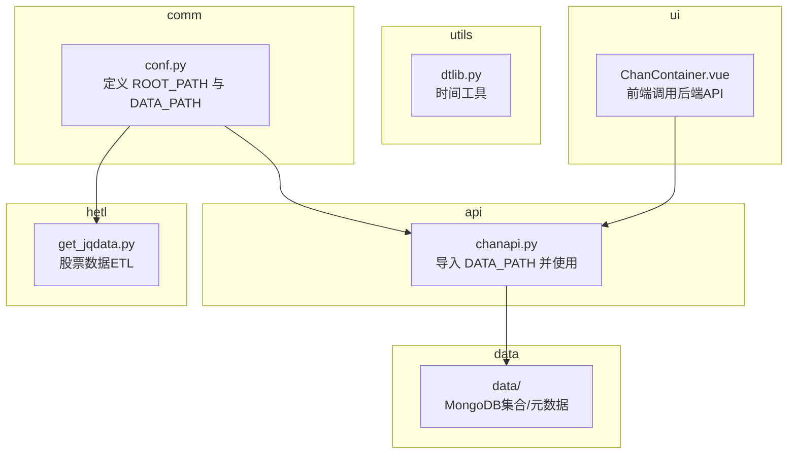
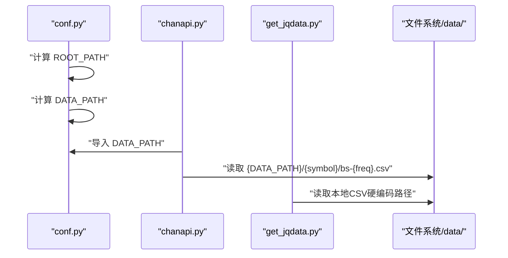
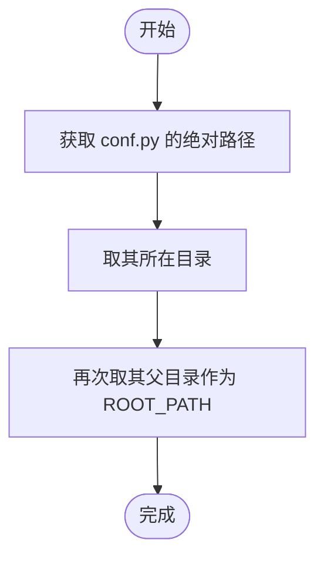
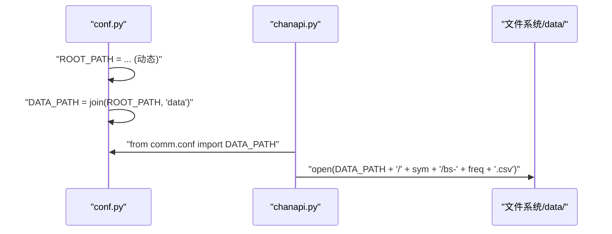
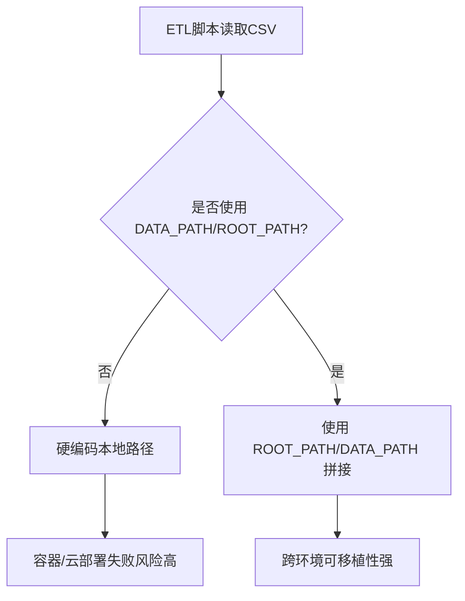
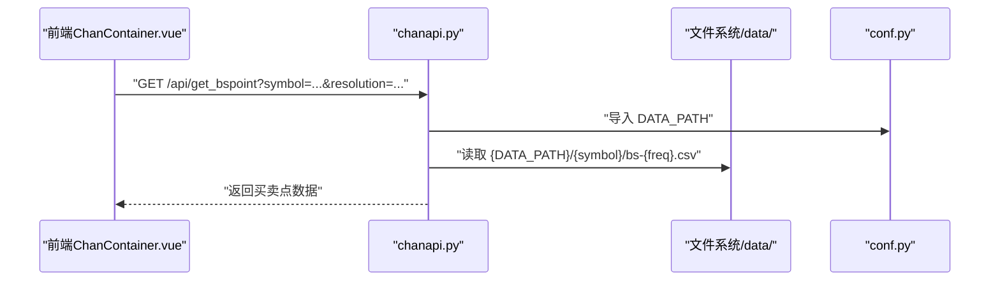
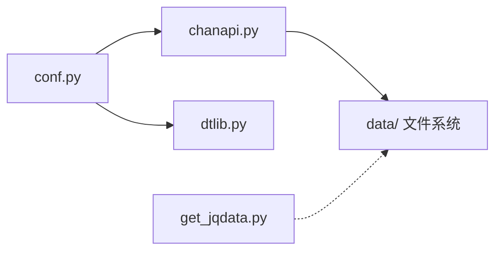

# 路径配置

<cite>
**本文引用的文件**
- [comm/conf.py](file://comm/conf.py)
- [api/chanapi.py](file://api/chanapi.py)
- [utils/dtlib.py](file://utils/dtlib.py)
- [hetl/stock/get_jqdata.py](file://hetl/stock/get_jqdata.py)
- [README.md](file://README.md)
- [ui/src/components/ChanContainer.vue](file://ui/src/components/ChanContainer.vue)
</cite>

## 目录
1. [引言](#引言)
2. [项目结构](#项目结构)
3. [核心组件](#核心组件)
4. [架构总览](#架构总览)
5. [详细组件分析](#详细组件分析)
6. [依赖关系分析](#依赖关系分析)
7. [性能考量](#性能考量)
8. [故障排查指南](#故障排查指南)
9. [结论](#结论)
10. [附录](#附录)

## 引言
本文件聚焦于项目中的路径配置机制，特别是 ROOT_PATH 如何通过 os.path.dirname 和 __file__ 动态确定项目根目录，以及 DATA_PATH 如何基于 ROOT_PATH 构建指向 data/ 目录的绝对路径。我们将解释这种设计对项目可移植性与部署灵活性的意义，并给出在 Docker 容器、云服务器等不同部署环境下的实践建议，同时说明路径变更对 ETL 流程与 API 数据读取的影响。

## 项目结构
从仓库目录可见，数据存储位于 data/，配置与常量集中于 comm/conf.py，API 服务位于 api/chanapi.py，前端位于 ui/，工具函数位于 utils/，ETL 相关脚本位于 hetl/。路径配置的核心在于 comm/conf.py 中的 ROOT_PATH 与 DATA_PATH，它们为上层模块提供统一的绝对路径基础。

图表来源
- [comm/conf.py](file://comm/conf.py#L1-L166)
- [api/chanapi.py](file://api/chanapi.py#L1-L568)
- [hetl/stock/get_jqdata.py](file://hetl/stock/get_jqdata.py#L1-L100)
- [ui/src/components/ChanContainer.vue](file://ui/src/components/ChanContainer.vue#L720-L1544)

章节来源
- [README.md](file://README.md#L107-L137)

## 核心组件
- ROOT_PATH：通过 os.path.dirname(os.path.dirname(os.path.abspath(__file__))) 计算得到，确保无论脚本从哪个位置运行，都能稳定定位到项目根目录。
- DATA_PATH：基于 ROOT_PATH 使用 os.path.join 构建 data/ 绝对路径，保证跨平台兼容与可移植性。

这些变量在以下模块中被广泛使用：
- API 层：api/chanapi.py 导入 DATA_PATH，并在读取买卖点 CSV 等场景中使用该路径。
- 配置层：comm/conf.py 内部使用 ROOT_PATH 读取 hetl/selcoin 下的符号配置文件。
- 工具层：utils/dtlib.py 间接依赖 comm/conf 的列名等常量，但不直接参与路径计算。
- ETL 层：hetl/stock/get_jqdata.py 显式硬编码了本地 CSV 文件路径，与 DATA_PATH 无直接关联。

章节来源
- [comm/conf.py](file://comm/conf.py#L1-L166)
- [api/chanapi.py](file://api/chanapi.py#L1-L568)
- [hetl/stock/get_jqdata.py](file://hetl/stock/get_jqdata.py#L1-L100)
- [utils/dtlib.py](file://utils/dtlib.py#L1-L207)

## 架构总览
下图展示了 ROOT_PATH 与 DATA_PATH 的计算与使用关系，以及它们在 API 与 ETL 流程中的影响。

图表来源
- [comm/conf.py](file://comm/conf.py#L1-L166)
- [api/chanapi.py](file://api/chanapi.py#L1-L568)
- [hetl/stock/get_jqdata.py](file://hetl/stock/get_jqdata.py#L1-L100)

## 详细组件分析

### ROOT_PATH 的动态确定机制
- 计算步骤
  - os.path.abspath(__file__) 获取 conf.py 的绝对路径。
  - 外层 os.path.dirname 得到 conf.py 所在目录。
  - 再次外层 os.path.dirname 得到项目根目录。
- 设计意义
  - 不依赖固定工作目录，避免因相对路径导致的运行失败。
  - 便于在不同部署环境中移动项目目录或子模块位置而不影响路径解析。

图表来源
- [comm/conf.py](file://comm/conf.py#L1-L166)

章节来源
- [comm/conf.py](file://comm/conf.py#L1-L166)

### DATA_PATH 的构建与使用
- 构建方式：DATA_PATH = os.path.join(ROOT_PATH, 'data')
- 使用场景
  - API 层：在读取买卖点 CSV 时，使用 f'{DATA_PATH}/{sym}/bs-{freq}.csv' 拼接绝对路径。
  - 配置层：在加载符号配置文件时，使用 f'{ROOT_PATH}/hetl/selcoin/...' 拼接绝对路径。

图表来源
- [comm/conf.py](file://comm/conf.py#L1-L166)
- [api/chanapi.py](file://api/chanapi.py#L1-L568)

章节来源
- [comm/conf.py](file://comm/conf.py#L1-L166)
- [api/chanapi.py](file://api/chanapi.py#L1-L568)

### 对 ETL 流程的影响
- 当前 ETL 脚本（如 hetl/stock/get_jqdata.py）存在硬编码的本地 CSV 路径，未使用 DATA_PATH 或 ROOT_PATH，这会带来以下问题：
  - 在容器化或远程部署时，若 data/ 目录不在默认位置，脚本无法找到 CSV。
  - 跨平台路径分隔符与权限问题可能引发异常。
- 建议改造
  - 将硬编码路径替换为基于 ROOT_PATH 或 DATA_PATH 的拼接，确保路径与项目根目录解耦。
  - 在容器中挂载数据卷至 data/，或通过环境变量传入数据根目录，再由 conf.py 动态计算 ROOT_PATH/DATA_PATH。

图表来源
- [hetl/stock/get_jqdata.py](file://hetl/stock/get_jqdata.py#L1-L100)
- [comm/conf.py](file://comm/conf.py#L1-L166)

章节来源
- [hetl/stock/get_jqdata.py](file://hetl/stock/get_jqdata.py#L1-L100)
- [comm/conf.py](file://comm/conf.py#L1-L166)

### 对 API 数据读取的影响
- API 层通过 DATA_PATH 读取买卖点 CSV，路径随 ROOT_PATH/DATA_PATH 的变化而自动调整，无需手动修改。
- 若 DATA_PATH 发生变更（例如迁移到容器数据卷），只需在 conf.py 中保持 ROOT_PATH/DATA_PATH 的计算逻辑不变，即可无缝适配。

图表来源
- [ui/src/components/ChanContainer.vue](file://ui/src/components/ChanContainer.vue#L720-L1544)
- [api/chanapi.py](file://api/chanapi.py#L1-L568)
- [comm/conf.py](file://comm/conf.py#L1-L166)

章节来源
- [ui/src/components/ChanContainer.vue](file://ui/src/components/ChanContainer.vue#L720-L1544)
- [api/chanapi.py](file://api/chanapi.py#L1-L568)
- [comm/conf.py](file://comm/conf.py#L1-L166)

## 依赖关系分析
- conf.py 为全局配置中心，被 api/chanapi.py 与 utils/dtlib.py 等模块间接依赖。
- api/chanapi.py 直接使用 DATA_PATH 进行文件读写。
- utils/dtlib.py 依赖 conf 中的列名常量，但不直接参与路径计算。
- hetl/stock/get_jqdata.py 与 DATA_PATH 无直接耦合，存在硬编码路径风险。

图表来源
- [comm/conf.py](file://comm/conf.py#L1-L166)
- [api/chanapi.py](file://api/chanapi.py#L1-L568)
- [utils/dtlib.py](file://utils/dtlib.py#L1-L207)
- [hetl/stock/get_jqdata.py](file://hetl/stock/get_jqdata.py#L1-L100)

章节来源
- [comm/conf.py](file://comm/conf.py#L1-L166)
- [api/chanapi.py](file://api/chanapi.py#L1-L568)
- [utils/dtlib.py](file://utils/dtlib.py#L1-L207)
- [hetl/stock/get_jqdata.py](file://hetl/stock/get_jqdata.py#L1-L100)

## 性能考量
- 路径计算仅在模块导入时执行一次，开销极低，不会对运行时性能造成影响。
- 使用绝对路径可减少路径解析与拼接错误带来的重试与异常处理成本。
- 在容器化部署中，建议将 data/ 目录挂载为只读卷，避免频繁 I/O 写入影响性能。

## 故障排查指南
- 症状：API 读取买卖点 CSV 报错，提示找不到文件。
  - 排查要点：确认 DATA_PATH 是否正确，确认 data/{symbol}/bs-{freq}.csv 是否存在。
  - 参考路径：[api/chanapi.py](file://api/chanapi.py#L260-L278)
- 症状：ETL 脚本无法读取本地 CSV。
  - 排查要点：检查脚本中硬编码路径是否与实际 data/ 位置一致；建议改为基于 ROOT_PATH/DATA_PATH 的拼接。
  - 参考路径：[hetl/stock/get_jqdata.py](file://hetl/stock/get_jqdata.py#L60-L70)
- 症状：容器内路径访问异常。
  - 排查要点：确认容器数据卷挂载路径与 ROOT_PATH/DATA_PATH 的关系；必要时通过环境变量注入数据根目录，再由 conf.py 动态计算。

章节来源
- [api/chanapi.py](file://api/chanapi.py#L260-L278)
- [hetl/stock/get_jqdata.py](file://hetl/stock/get_jqdata.py#L60-L70)

## 结论
ROOT_PATH 与 DATA_PATH 的设计实现了“动态根目录 + 绝对路径”的组合，既保证了路径的可移植性，又简化了跨环境部署的复杂度。API 层已充分利用该机制，而 ETL 层仍存在硬编码路径的风险。建议在 ETL 层引入基于 ROOT_PATH/DATA_PATH 的路径策略，统一管理数据目录，提升整体系统的稳定性与可维护性。

## 附录

### 部署环境实践建议
- Docker 容器
  - 将宿主机的 data/ 目录挂载到容器内的 /app/data（假设 ROOT_PATH 为 /app），并在容器启动时确保该挂载路径存在且权限正确。
  - 若需隔离数据，可在 conf.py 中增加环境变量支持，例如通过环境变量覆盖 ROOT_PATH/DATA_PATH 的计算逻辑，从而在不同容器中灵活切换数据根目录。
- 云服务器
  - 将 data/ 放置于独立的云盘或对象存储挂载点，通过软链接或挂载映射到项目根目录，保持 ROOT_PATH/DATA_PATH 的一致性。
  - 在 CI/CD 中通过环境变量注入数据根目录，避免硬编码路径。
- 开发与测试
  - 在本地开发时，保持 data/ 目录与项目同级；在测试环境使用独立的 data/ 快照，确保测试数据隔离。

### 路径变更对 ETL 与 API 的影响
- ETL 流程
  - 若 DATA_PATH 发生变更，需同步更新 ETL 脚本中的数据读取逻辑，确保其基于 ROOT_PATH/DATA_PATH 拼接路径。
  - 对于外部 CSV 文件，建议通过配置文件或环境变量指定路径，避免硬编码。
- API 数据读取
  - API 层已通过 DATA_PATH 读取买卖点 CSV，路径变更后无需修改业务逻辑，只需确保 data/ 目录结构与预期一致。