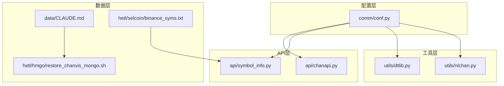
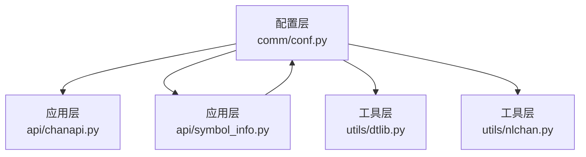
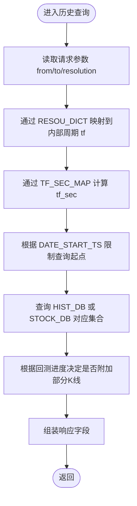
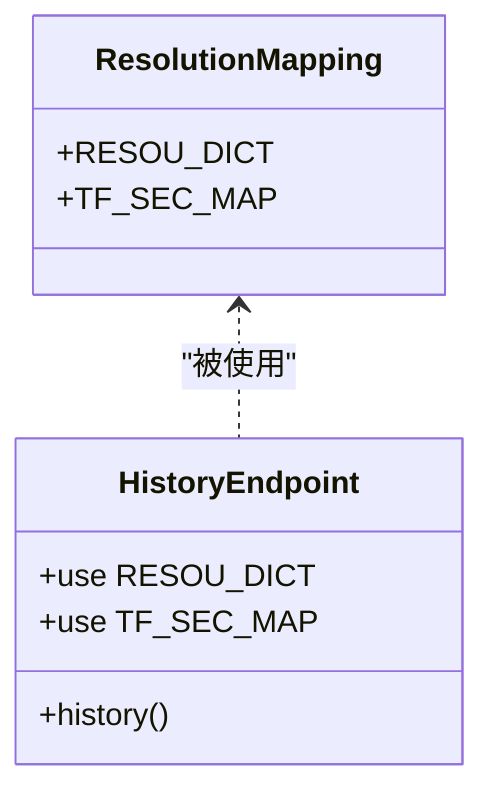
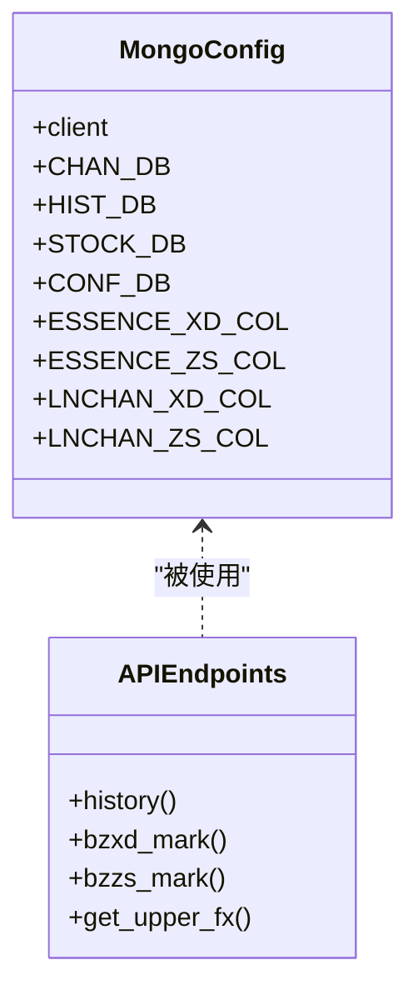
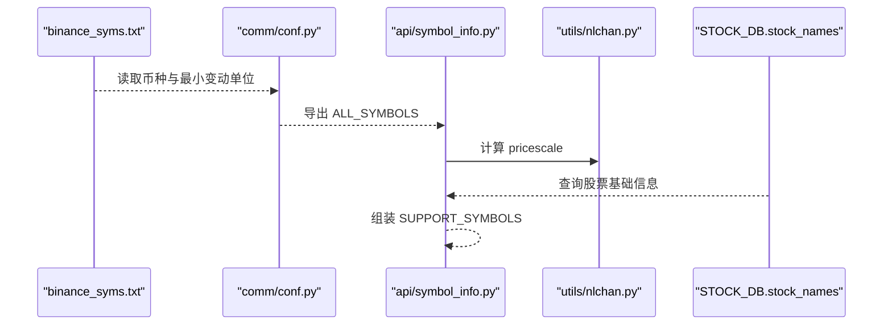
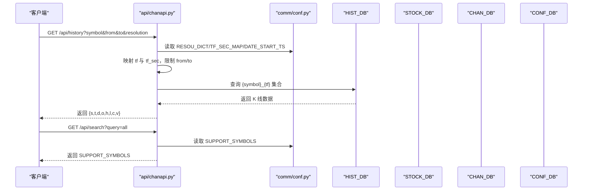
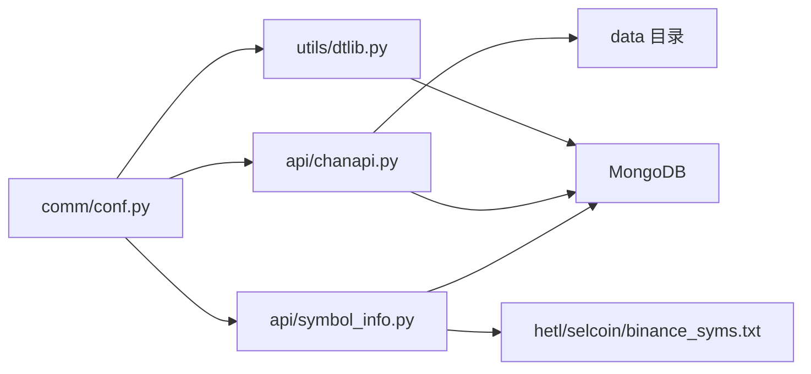

# 配置管理

<cite>
**本文引用的文件**
- [comm/conf.py](file://comm/conf.py)
- [api/symbol_info.py](file://api/symbol_info.py)
- [api/chanapi.py](file://api/chanapi.py)
- [hetl/selcoin/binance_syms.txt](file://hetl/selcoin/binance_syms.txt)
- [utils/dtlib.py](file://utils/dtlib.py)
- [utils/nlchan.py](file://utils/nlchan.py)
- [data/CLAUDE.md](file://data/CLAUDE.md)
- [hetl/hmgo/restore_chanvis_mongo.sh](file://hetl/hmgo/restore_chanvis_mongo.sh)
- [comm/CLAUDE.md](file://comm/CLAUDE.md)
- [api/CLAUDE.md](file://api/CLAUDE.md)
</cite>

## 目录
1. [简介](#简介)
2. [项目结构](#项目结构)
3. [核心组件](#核心组件)
4. [架构总览](#架构总览)
5. [详细组件分析](#详细组件分析)
6. [依赖关系分析](#依赖关系分析)
7. [性能考量](#性能考量)
8. [故障排查指南](#故障排查指南)
9. [结论](#结论)
10. [附录](#附录)

## 简介
本文件聚焦于配置管理，深入解析 comm/conf.py 中的全局配置机制，涵盖路径配置（ROOT_PATH、DATA_PATH）、分辨率映射（RESOU_DICT）、时间周期秒数映射（TF_SEC_MAP）、数据库连接（CHAN_DB、HIST_DB、STOCK_DB、CONF_DB）及其在系统中的用途；解释 ALL_SYMBOLS 如何从 binance_syms.txt 加载并用于 symbol_info.py 生成 SUPPORT_SYMBOLS 搜索列表；说明 DATE_START_TS 如何控制数据查询范围，以及 MAX_XD_LEN 等业务参数的意义；并提供修改配置以切换数据源或调整服务行为的实践指南，说明配置如何影响 API 端点的输出结果。

## 项目结构
- 配置集中于 comm/conf.py，被多个模块共享使用，包括 API 层（api/chanapi.py、api/symbol_info.py）、工具层（utils/dtlib.py、utils/nlchan.py），以及数据层（data/CLAUDE.md、hetl/hmgo/restore_chanvis_mongo.sh）。
- 数据来源与存储：
  - 加密货币交易对列表来自 hetl/selcoin/binance_syms.txt。
  - MongoDB 数据库包含 nlchan（缠论结构数据）、ohlcv（K线历史数据）、stock（股票基础信息）、config（配置数据）。
  - 数据恢复脚本用于将 BSON 数据导入 MongoDB。

图表来源
- [comm/conf.py](file://comm/conf.py#L1-L166)
- [api/chanapi.py](file://api/chanapi.py#L1-L568)
- [api/symbol_info.py](file://api/symbol_info.py#L1-L74)
- [utils/dtlib.py](file://utils/dtlib.py#L1-L207)
- [utils/nlchan.py](file://utils/nlchan.py#L1-L25)
- [data/CLAUDE.md](file://data/CLAUDE.md#L45-L123)
- [hetl/hmgo/restore_chanvis_mongo.sh](file://hetl/hmgo/restore_chanvis_mongo.sh#L1-L29)
- [hetl/selcoin/binance_syms.txt](file://hetl/selcoin/binance_syms.txt#L1-L118)

章节来源
- [comm/conf.py](file://comm/conf.py#L1-L166)
- [api/chanapi.py](file://api/chanapi.py#L1-L568)
- [api/symbol_info.py](file://api/symbol_info.py#L1-L74)
- [utils/dtlib.py](file://utils/dtlib.py#L1-L207)
- [utils/nlchan.py](file://utils/nlchan.py#L1-L25)
- [data/CLAUDE.md](file://data/CLAUDE.md#L45-L123)
- [hetl/hmgo/restore_chanvis_mongo.sh](file://hetl/hmgo/restore_chanvis_mongo.sh#L1-L29)
- [hetl/selcoin/binance_syms.txt](file://hetl/selcoin/binance_syms.txt#L1-L118)

## 核心组件
- 路径配置
  - ROOT_PATH：项目根目录。
  - DATA_PATH：指向 data 目录，用于本地文件读写（如 bs 点 CSV）。
- 分辨率映射
  - RESOU_DICT：将 TradingView 周期字符串映射到内部周期标识（如 "1"→"1m"）。
- 时间周期秒数映射
  - TF_SEC_MAP：将内部周期标识映射到秒数，用于计算高低点之间 K 线数量与时间边界。
- 数据库连接
  - CHAN_DB：nlchan 数据库，存放缠论结构数据。
  - HIST_DB：ohlcv 数据库，存放 K 线历史数据。
  - STOCK_DB：stock 数据库，存放股票基础信息。
  - CONF_DB：config 数据库，存放配置与回测相关数据。
- 交易对与符号
  - ALL_SYMBOLS：从 binance_syms.txt 加载的币种列表，过滤特殊币种后用于生成 SUPPORT_SYMBOLS。
- 时间范围与业务参数
  - DATE_START_TS：按周期设定的起始时间戳，控制历史数据查询范围。
  - MAX_XD_LEN：线段最大条数限制，影响分析结果长度。
- 日志与集合命名
  - logging.basicConfig：统一日志格式。
  - ESSENCE_XD_COL/LNCHAN_XD_COL 等：集合命名模板，按 symbol 和 tf 组合生成。

章节来源
- [comm/conf.py](file://comm/conf.py#L1-L166)
- [api/chanapi.py](file://api/chanapi.py#L1-L568)
- [api/symbol_info.py](file://api/symbol_info.py#L1-L74)

## 架构总览
配置贯穿系统三层：
- 配置层（comm/conf.py）：定义全局常量、映射、数据库连接与集合命名模板。
- 应用层（api/chanapi.py、api/symbol_info.py）：消费配置进行数据查询、集合访问与响应构造。
- 工具层（utils/dtlib.py、utils/nlchan.py）：提供时间转换、价格精度计算等辅助能力。

图表来源
- [comm/conf.py](file://comm/conf.py#L1-L166)
- [api/chanapi.py](file://api/chanapi.py#L1-L568)
- [api/symbol_info.py](file://api/symbol_info.py#L1-L74)
- [utils/dtlib.py](file://utils/dtlib.py#L1-L207)
- [utils/nlchan.py](file://utils/nlchan.py#L1-L25)

## 详细组件分析

### 路径与数据范围配置
- ROOT_PATH、DATA_PATH
  - ROOT_PATH 用于定位项目根目录，DATA_PATH 用于本地文件读取（例如 bs 点 CSV）。
- DATE_START_TS
  - 为每个周期设定起始时间戳，用于限制历史数据查询范围，避免无界查询导致性能问题。
  - 不同周期的起始时间由相对当前时间的偏移或固定时间戳构成，确保各周期数据覆盖合理范围。

图表来源
- [api/chanapi.py](file://api/chanapi.py#L96-L235)
- [comm/conf.py](file://comm/conf.py#L23-L40)
- [comm/conf.py](file://comm/conf.py#L111-L121)

章节来源
- [comm/conf.py](file://comm/conf.py#L1-L166)
- [api/chanapi.py](file://api/chanapi.py#L96-L235)

### 分辨率映射与时间周期秒数映射
- RESOU_DICT
  - 将 TradingView 的周期字符串（如 "1"、"5"、"30"、"240"、"D"、"W"）映射到内部周期标识（如 "1m"、"5m"、"4h"、"1d"、"1w"）。
- TF_SEC_MAP
  - 将内部周期标识映射到秒数，用于计算高低点之间的 K 线数量与时间边界，保证跨周期查询的准确性。

图表来源
- [comm/conf.py](file://comm/conf.py#L12-L40)
- [api/chanapi.py](file://api/chanapi.py#L96-L235)

章节来源
- [comm/conf.py](file://comm/conf.py#L12-L40)
- [api/chanapi.py](file://api/chanapi.py#L96-L235)

### 数据库连接与集合命名
- 数据库连接
  - 通过本地 MongoDB 连接，分别绑定 nlchan、ohlcv、stock、config 四个数据库。
- 集合命名模板
  - ESSENCE_XD_COL、ESSENCE_ZS_COL、LNCHAN_XD_COL、LNCHAN_ZS_COL 等模板，按 symbol 与 tf 组合生成集合名，用于缠论分析结果与线段/中枢集合的组织。

图表来源
- [comm/conf.py](file://comm/conf.py#L139-L158)
- [api/chanapi.py](file://api/chanapi.py#L1-L568)

章节来源
- [comm/conf.py](file://comm/conf.py#L139-L158)
- [api/chanapi.py](file://api/chanapi.py#L1-L568)

### 交易对加载与符号列表生成
- ALL_SYMBOLS
  - 从 hetl/selcoin/binance_syms.txt 读取币种与最小变动单位，过滤特殊币种（如 DAI、TUSD），构建 ALL_SYMBOLS 列表。
- SUPPORT_SYMBOLS
  - 在 api/symbol_info.py 中遍历 ALL_SYMBOLS，结合 utils/nlchan.sym_float 计算 pricescale，生成前端可搜索的 SUPPORT_SYMBOLS 列表。
  - 同时从 STOCK_DB.stock_names 查询股票基础信息，拼接到 SUPPORT_SYMBOLS。

图表来源
- [hetl/selcoin/binance_syms.txt](file://hetl/selcoin/binance_syms.txt#L1-L118)
- [comm/conf.py](file://comm/conf.py#L87-L109)
- [api/symbol_info.py](file://api/symbol_info.py#L1-L74)
- [utils/nlchan.py](file://utils/nlchan.py#L1-L25)

章节来源
- [comm/conf.py](file://comm/conf.py#L87-L109)
- [api/symbol_info.py](file://api/symbol_info.py#L1-L74)
- [utils/nlchan.py](file://utils/nlchan.py#L1-L25)
- [hetl/selcoin/binance_syms.txt](file://hetl/selcoin/binance_syms.txt#L1-L118)

### API 端点与配置的影响
- /api/history
  - 解析 symbol、from、to、resolution，映射到内部周期 tf 与 tf_sec，按 DATE_START_TS 限制查询范围，查询 HIST_DB 或 STOCK_DB 对应集合，必要时附加部分 K 线，最终返回标准字段。
- /api/search 与 /api/symbols
  - 基于 SUPPORT_SYMBOLS 返回可搜索列表与单个符号详情。
- /api/bzxd_mark、/api/bzzs_mark、/api/get_upper_fx
  - 使用 CHAN_DB 与 CONF_DB，按 symbol 与 tf 查询集合，返回标记或上轨数据。

图表来源
- [api/chanapi.py](file://api/chanapi.py#L96-L235)
- [api/chanapi.py](file://api/chanapi.py#L61-L94)
- [api/chanapi.py](file://api/chanapi.py#L280-L491)
- [comm/conf.py](file://comm/conf.py#L12-L40)
- [comm/conf.py](file://comm/conf.py#L111-L121)
- [api/symbol_info.py](file://api/symbol_info.py#L1-L74)

章节来源
- [api/chanapi.py](file://api/chanapi.py#L61-L235)
- [api/chanapi.py](file://api/chanapi.py#L280-L491)
- [api/symbol_info.py](file://api/symbol_info.py#L1-L74)
- [comm/conf.py](file://comm/conf.py#L12-L40)
- [comm/conf.py](file://comm/conf.py#L111-L121)

## 依赖关系分析
- 模块耦合
  - api/chanapi.py 直接依赖 comm/conf.py 的 RESOU_DICT、TF_SEC_MAP、DATA_PATH、CHAN_DB、HIST_DB、CONF_DB 等。
  - api/symbol_info.py 依赖 comm/conf.py 的 ALL_SYMBOLS 与 STOCK_DB。
  - utils/dtlib.py 依赖 comm/conf.py 的列定义常量，用于数据标准化。
- 外部依赖
  - MongoDB：本地 27017 端口，数据库 nlchan、ohlcv、stock、config。
  - 文件系统：hetl/selcoin/binance_syms.txt 与 data 目录下的本地文件。

图表来源
- [comm/conf.py](file://comm/conf.py#L1-L166)
- [api/chanapi.py](file://api/chanapi.py#L1-L568)
- [api/symbol_info.py](file://api/symbol_info.py#L1-L74)
- [utils/dtlib.py](file://utils/dtlib.py#L1-L207)
- [hetl/selcoin/binance_syms.txt](file://hetl/selcoin/binance_syms.txt#L1-L118)

章节来源
- [comm/conf.py](file://comm/conf.py#L1-L166)
- [api/chanapi.py](file://api/chanapi.py#L1-L568)
- [api/symbol_info.py](file://api/symbol_info.py#L1-L74)
- [utils/dtlib.py](file://utils/dtlib.py#L1-L207)
- [hetl/selcoin/binance_syms.txt](file://hetl/selcoin/binance_syms.txt#L1-L118)

## 性能考量
- 查询范围控制
  - DATE_START_TS 限制历史数据查询起点，避免全表扫描；建议根据业务需求调整各周期的起始时间。
- 集合命名与索引
  - 建议在 {ts} 字段建立索引，加速按时间范围查询。
- 部分 K 线策略
  - 回测场景下，使用部分 K 线策略减少越界数据，提高线上回测一致性。
- 日志与调试
  - DEBUG 模式会影响 ALL_TIMEFRAMES 与 binance_syms 文件路径，便于开发调试；生产环境关闭 DEBUG。

[本节为通用指导，不直接分析具体文件]

## 故障排查指南
- MongoDB 连接失败
  - 确认本地 MongoDB 已启动且监听 27017 端口；检查 CHAN_DB/HIST_DB/STOCK_DB/CONF_DB 是否存在。
  - 参考数据恢复脚本与文档，确认数据库与集合是否正确导入。
- 符号列表为空
  - 检查 hetl/selcoin/binance_syms.txt 是否存在且格式正确；确认未被过滤（如 DAI/TUSD）。
  - 确认 api/symbol_info.py 从 STOCK_DB.stock_names 查询成功。
- 历史数据为空
  - 检查 DATE_START_TS 与请求的 from/to 是否冲突；确认 symbol 与 tf 组合的集合是否存在。
  - 确认回测进度与部分 K 线逻辑是否影响了查询范围。
- 时间戳转换异常
  - 检查 utils/dtlib.py 的时间转换函数是否被正确调用；确认输入格式与时区处理。

章节来源
- [data/CLAUDE.md](file://data/CLAUDE.md#L45-L123)
- [hetl/hmgo/restore_chanvis_mongo.sh](file://hetl/hmgo/restore_chanvis_mongo.sh#L1-L29)
- [api/symbol_info.py](file://api/symbol_info.py#L1-L74)
- [api/chanapi.py](file://api/chanapi.py#L96-L235)
- [utils/dtlib.py](file://utils/dtlib.py#L1-L207)

## 结论
配置管理通过 comm/conf.py 将路径、映射、数据库连接与集合命名模板集中化，为 API 层与工具层提供一致的运行时上下文。ALL_SYMBOLS 与 SUPPORT_SYMBOLS 的生成链路清晰地将数据源（binance_syms.txt）与前端搜索能力衔接；DATE_START_TS 与 TF_SEC_MAP 确保历史查询的范围与精度可控；数据库连接与集合命名模板支撑了缠论分析结果的组织与检索。遵循本文提供的实践指南，可安全地调整配置以切换数据源或改变服务行为，并稳定地影响 API 输出。

[本节为总结，不直接分析具体文件]

## 附录

### 修改配置实践指南
- 切换数据源
  - 更改 binance_syms.txt 内容或路径（DEBUG 模式下使用 debug 文件），重新加载 ALL_SYMBOLS。
  - 若需切换股票数据源，更新 STOCK_DB.stock_names 集合内容。
- 调整时间范围
  - 修改 DATE_START_TS 中各周期的起始时间戳，以扩大或缩小历史数据查询范围。
- 调整时间周期
  - 修改 RESOU_DICT 与 TF_SEC_MAP，确保映射一致；同步调整 ALL_TIMEFRAMES 与相关查询逻辑。
- 调整业务参数
  - 修改 MAX_XD_LEN 控制线段最大条数；根据分析需求增减。
- 数据库连接
  - 如需远程 MongoDB，修改连接地址与端口；确保目标数据库与集合已导入。

章节来源
- [comm/conf.py](file://comm/conf.py#L12-L40)
- [comm/conf.py](file://comm/conf.py#L111-L121)
- [comm/conf.py](file://comm/conf.py#L139-L158)
- [api/chanapi.py](file://api/chanapi.py#L96-L235)
- [api/symbol_info.py](file://api/symbol_info.py#L1-L74)
- [data/CLAUDE.md](file://data/CLAUDE.md#L45-L123)
- [hetl/hmgo/restore_chanvis_mongo.sh](file://hetl/hmgo/restore_chanvis_mongo.sh#L1-L29)