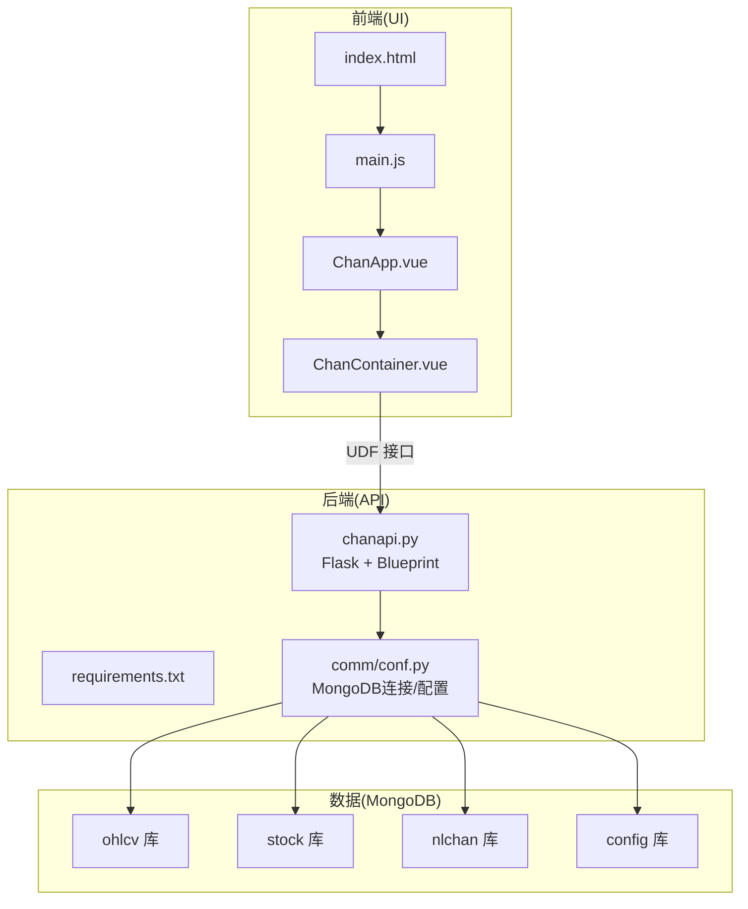
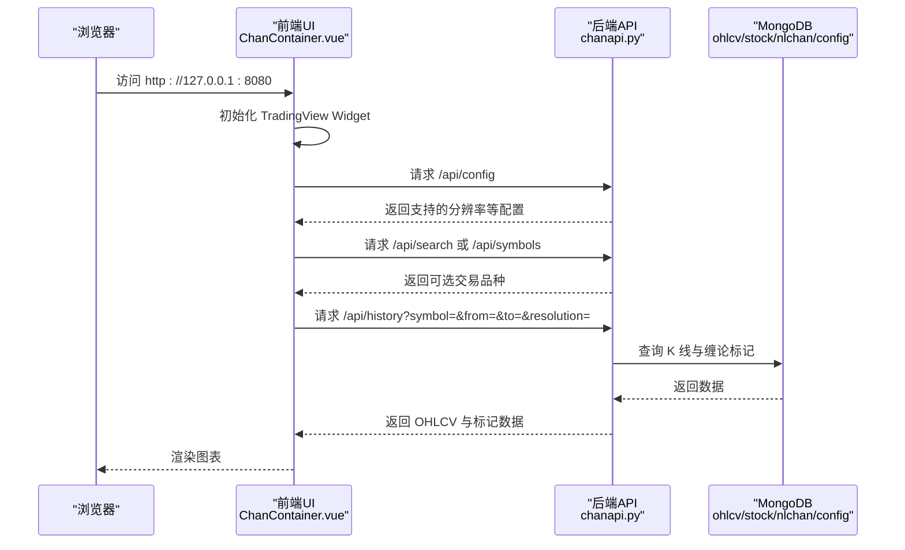
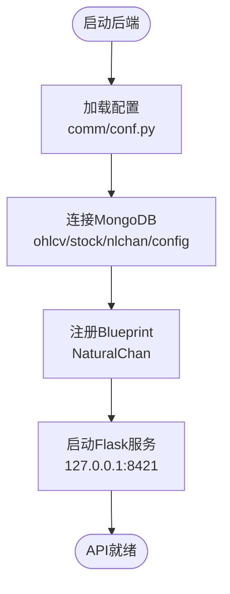
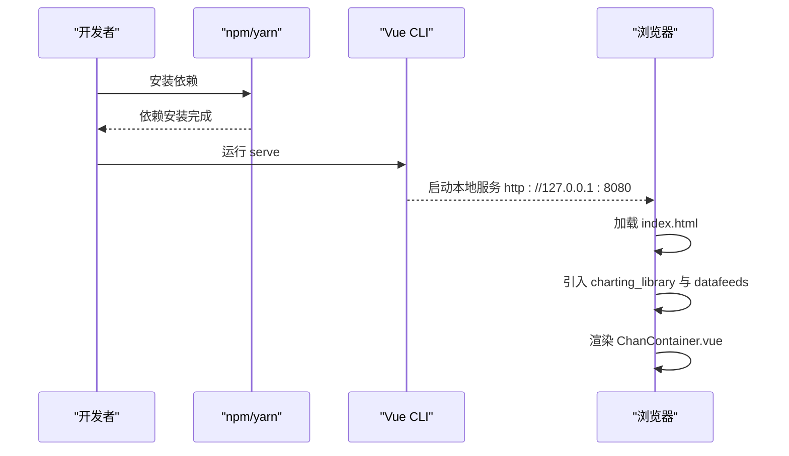
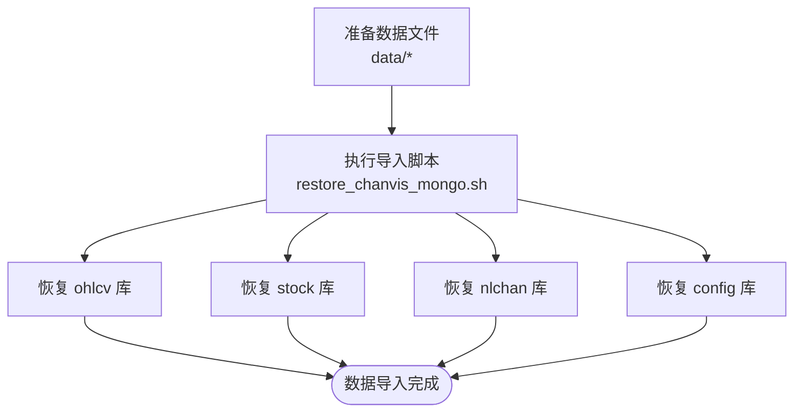
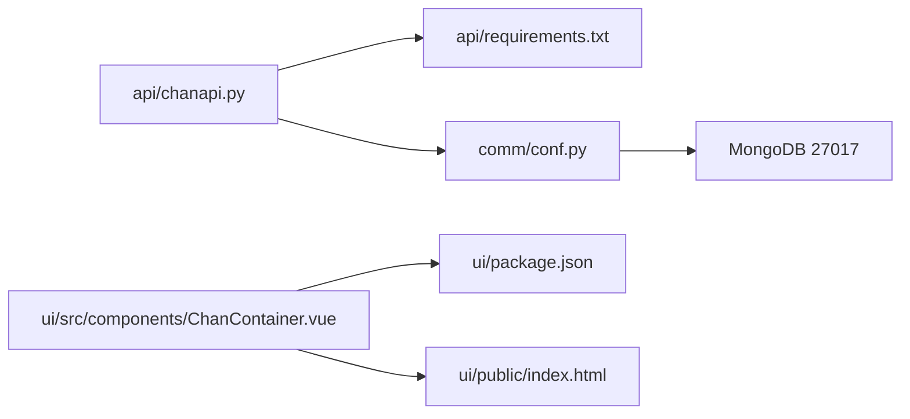

# 快速入门指南

<cite>
**本文引用的文件**
- [README.md](file://README.md)
- [api/chanapi.py](file://api/chanapi.py)
- [api/requirements.txt](file://api/requirements.txt)
- [comm/conf.py](file://comm/conf.py)
- [ui/README.md](file://ui/README.md)
- [ui/package.json](file://ui/package.json)
- [ui/public/index.html](file://ui/public/index.html)
- [ui/src/main.js](file://ui/src/main.js)
- [ui/src/ChanApp.vue](file://ui/src/ChanApp.vue)
- [ui/src/components/ChanContainer.vue](file://ui/src/components/ChanContainer.vue)
- [hetl/hmgo/restore_chanvis_mongo.sh](file://hetl/hmgo/restore_chanvis_mongo.sh)
- [data/CLAUDE.md](file://data/CLAUDE.md)
</cite>

## 目录
1. [简介](#简介)
2. [项目结构](#项目结构)
3. [核心组件](#核心组件)
4. [架构总览](#架构总览)
5. [详细组件分析](#详细组件分析)
6. [依赖关系分析](#依赖关系分析)
7. [性能注意事项](#性能注意事项)
8. [故障排查指南](#故障排查指南)
9. [结论](#结论)
10. [附录](#附录)

## 简介
本指南面向首次接触 ChanVis 的用户，帮助你在本地快速完成环境准备、后端与前端启动、MongoDB 数据导入，并成功访问前端界面进行可视化分析。同时提供常见问题排查与验证步骤，确保你能顺利看到图表并加载数据。

## 项目结构
ChanVis 采用前后端分离架构：
- 后端：基于 Python Flask 的 API 服务，提供 TradingView UDF 兼容接口，对接 MongoDB 存储历史 K 线与缠论结构数据。
- 前端：基于 Vue 的可视化界面，集成 TradingView 本地 SDK，通过 UDF 接口拉取数据并渲染图表。
- 数据层：MongoDB，包含 ohlcv（K 线）、stock（股票基础信息）、nlchan（缠论结构）、config（配置）等数据库与集合。

**图表来源**
- [ui/public/index.html](file://ui/public/index.html#L1-L20)
- [ui/src/main.js](file://ui/src/main.js#L1-L12)
- [ui/src/ChanApp.vue](file://ui/src/ChanApp.vue#L1-L41)
- [ui/src/components/ChanContainer.vue](file://ui/src/components/ChanContainer.vue#L1-L120)
- [api/chanapi.py](file://api/chanapi.py#L1-L120)
- [comm/conf.py](file://comm/conf.py#L139-L166)

**章节来源**
- [README.md](file://README.md#L90-L153)
- [ui/README.md](file://ui/README.md#L1-L38)

## 核心组件
- 后端 API 服务
  - 提供 TradingView UDF 兼容接口，包括配置、搜索、品种信息、历史数据、标记数据等。
  - 默认监听 127.0.0.1:8421。
- 前端可视化
  - 通过 TradingView 本地 SDK 渲染图表，数据来源于后端 API。
  - 默认前端访问地址为 http://127.0.0.1:8080。
- 数据层
  - 使用 MongoDB，包含 ohlcv（K 线）、stock（股票基础信息）、nlchan（缠论结构）、config（配置）等集合。
  - 提供导入脚本将示例数据恢复到本地数据库。

**章节来源**
- [api/chanapi.py](file://api/chanapi.py#L41-L120)
- [ui/README.md](file://ui/README.md#L1-L38)
- [comm/conf.py](file://comm/conf.py#L139-L166)
- [data/CLAUDE.md](file://data/CLAUDE.md#L45-L123)

## 架构总览
下图展示了从浏览器到后端 API，再到 MongoDB 的数据流向，以及前端如何通过 UDF 接口获取数据并渲染图表。

**图表来源**
- [ui/src/components/ChanContainer.vue](file://ui/src/components/ChanContainer.vue#L1-L120)
- [api/chanapi.py](file://api/chanapi.py#L41-L235)
- [comm/conf.py](file://comm/conf.py#L139-L166)

## 详细组件分析

### 后端 API（Flask + Blueprint）
- 路由与功能
  - /api/config：返回 TradingView 支持的分辨率与功能开关。
  - /api/search：按关键词搜索支持的交易品种。
  - /api/symbols：返回指定品种的详细信息。
  - /api/history：按时间范围与周期返回 K 线数据。
  - 其他标记类接口：如线段、中枢、买卖点等标记数据。
- 启动与端口
  - 默认监听 127.0.0.1:8421，可通过命令行直接运行。
- 依赖
  - Flask、CORS、Arrow、PyMongo、Pandas 等。

**图表来源**
- [api/chanapi.py](file://api/chanapi.py#L1-L120)
- [comm/conf.py](file://comm/conf.py#L139-L166)

**章节来源**
- [api/chanapi.py](file://api/chanapi.py#L41-L235)
- [api/requirements.txt](file://api/requirements.txt#L1-L9)

### 前端可视化（Vue + TradingView SDK）
- 启动方式
  - 使用 npm/yarn 安装依赖后，运行 serve 启动本地开发服务器，默认访问 http://127.0.0.1:8080。
- 关键文件
  - index.html 引入 TradingView 数据源脚本。
  - main.js 挂载根组件。
  - ChanApp.vue 作为应用容器。
  - ChanContainer.vue 初始化 TradingView Widget，并通过 UDF 接口请求后端 API。
- 重要提示
  - 需手动将 TradingView 本地 SDK 的 charting_library 与 datafeeds 目录复制到 ui/public 下。

**图表来源**
- [ui/README.md](file://ui/README.md#L1-L38)
- [ui/public/index.html](file://ui/public/index.html#L1-L20)
- [ui/src/main.js](file://ui/src/main.js#L1-L12)
- [ui/src/ChanApp.vue](file://ui/src/ChanApp.vue#L1-L41)
- [ui/src/components/ChanContainer.vue](file://ui/src/components/ChanContainer.vue#L1-L120)

**章节来源**
- [ui/README.md](file://ui/README.md#L1-L38)
- [ui/public/index.html](file://ui/public/index.html#L1-L20)
- [ui/src/main.js](file://ui/src/main.js#L1-L12)
- [ui/src/ChanApp.vue](file://ui/src/ChanApp.vue#L1-L41)
- [ui/src/components/ChanContainer.vue](file://ui/src/components/ChanContainer.vue#L1-L120)

### 数据导入（MongoDB）
- 使用脚本将示例数据恢复到本地数据库，包含 K 线与缠论结构等集合。
- 支持通过 mongorestore 恢复指定集合或整个数据库。

**图表来源**
- [hetl/hmgo/restore_chanvis_mongo.sh](file://hetl/hmgo/restore_chanvis_mongo.sh#L1-L30)
- [data/CLAUDE.md](file://data/CLAUDE.md#L45-L123)

**章节来源**
- [hetl/hmgo/restore_chanvis_mongo.sh](file://hetl/hmgo/restore_chanvis_mongo.sh#L1-L30)
- [data/CLAUDE.md](file://data/CLAUDE.md#L45-L123)

## 依赖关系分析
- 后端依赖
  - Flask、Flask-CORS、Arrow、PyMongo、Pandas 等。
- 前端依赖
  - Vue、axios、@vue/cli-service 等。
- 数据库
  - MongoDB，本地 27017 端口。

**图表来源**
- [api/requirements.txt](file://api/requirements.txt#L1-L9)
- [comm/conf.py](file://comm/conf.py#L139-L166)
- [ui/package.json](file://ui/package.json#L1-L50)
- [ui/public/index.html](file://ui/public/index.html#L1-L20)

**章节来源**
- [api/requirements.txt](file://api/requirements.txt#L1-L9)
- [ui/package.json](file://ui/package.json#L1-L50)
- [comm/conf.py](file://comm/conf.py#L139-L166)

## 性能注意事项
- 后端查询
  - 建议为常用查询字段建立索引，减少查询耗时。
  - 对大数据量分页查询，避免一次性返回过多数据。
- 前端渲染
  - 控制标记点数量，避免一次性渲染过多图形元素导致卡顿。
- 数据库
  - 确保 MongoDB 在本地稳定运行，网络延迟会影响前端交互体验。

[本节为通用建议，无需特定文件引用]

## 故障排查指南
- 端口占用
  - 后端默认端口 8421，前端默认端口 8080。若启动失败，请检查端口是否被占用。
- MongoDB 未启动
  - 确认本地 MongoDB 已安装并运行，且监听 27017 端口。
- TradingView SDK 未放置
  - 前端必须手动将 charting_library 与 datafeeds 目录复制到 ui/public 下，否则无法加载图表。
- 数据未加载
  - 确认已执行数据导入脚本，恢复示例数据到 ohlcv、stock、nlchan、config 等集合。
- API 响应异常
  - 检查后端日志输出，确认参数传递正确（symbol、from、to、resolution）。
- 图表空白或标记错位
  - 刷新页面后重试；若仍异常，检查后端返回的 K 线与标记数据格式。

**章节来源**
- [ui/README.md](file://ui/README.md#L1-L38)
- [data/CLAUDE.md](file://data/CLAUDE.md#L45-L123)
- [api/chanapi.py](file://api/chanapi.py#L96-L235)

## 结论
按照本指南完成环境准备、后端与前端启动、MongoDB 数据导入后，你可以在本地浏览器中访问前端界面并看到基于 TradingView SDK 的可视化图表。遇到问题时，可依据故障排查指南逐一核对端口、数据库、SDK 与数据导入等关键环节。

[本节为总结性内容，无需特定文件引用]

## 附录

### 分步部署与运行步骤
1) 准备环境
- 安装 Python（推荐使用 3.x）
- 安装 Node.js（推荐使用 LTS 版本）
- 安装 MongoDB（确保本地 27017 端口可用）

2) 启动后端服务
- 进入后端目录，安装依赖：
  - pip install -r api/requirements.txt
- 运行后端 API：
  - python api/chanapi.py
  - 默认监听 127.0.0.1:8421

3) 启动前端服务
- 进入前端目录，安装依赖：
  - npm install
- 启动开发服务器：
  - npm run serve
  - 默认访问 http://127.0.0.1:8080

4) 导入 MongoDB 数据
- 执行导入脚本：
  - ./hetl/hmgo/restore_chanvis_mongo.sh
  - 将示例数据恢复到 ohlcv、stock、nlchan、config 等集合

5) 访问前端界面
- 在浏览器打开 http://127.0.0.1:8080
- 确认 TradingView SDK 已放置到 ui/public 下（charting_library 与 datafeeds 目录）

6) 验证步骤
- 检查后端 API 响应：
  - 访问 http://127.0.0.1:8421/api/config
  - 访问 http://127.0.0.1:8421/api/search?query=all
  - 访问 http://127.0.0.1:8421/api/history?symbol=000001.XSHG&from=...&to=...&resolution=1D
- 检查前端图表：
  - 打开 http://127.0.0.1:8080
  - 确认图表正常渲染，K 线与标记点显示正确

**章节来源**
- [api/requirements.txt](file://api/requirements.txt#L1-L9)
- [api/chanapi.py](file://api/chanapi.py#L560-L568)
- [ui/README.md](file://ui/README.md#L1-L38)
- [hetl/hmgo/restore_chanvis_mongo.sh](file://hetl/hmgo/restore_chanvis_mongo.sh#L1-L30)
- [ui/public/index.html](file://ui/public/index.html#L1-L20)