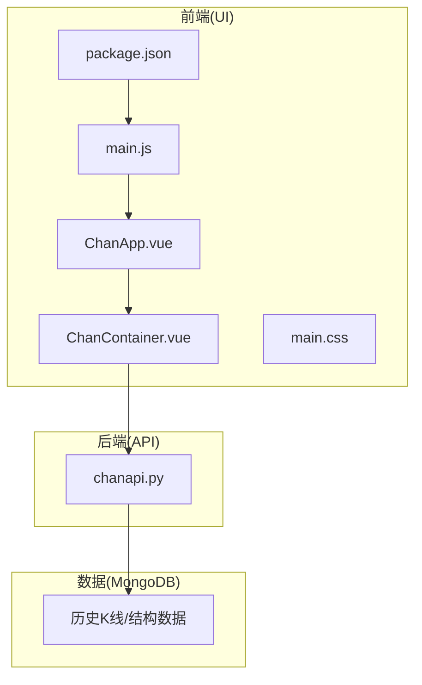
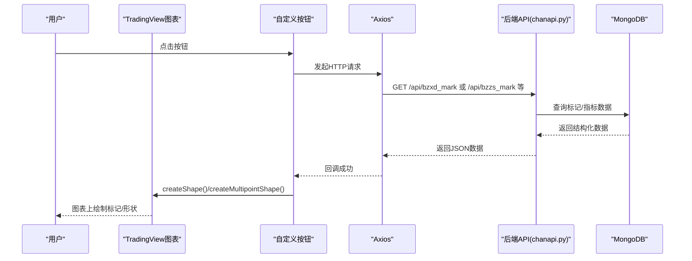
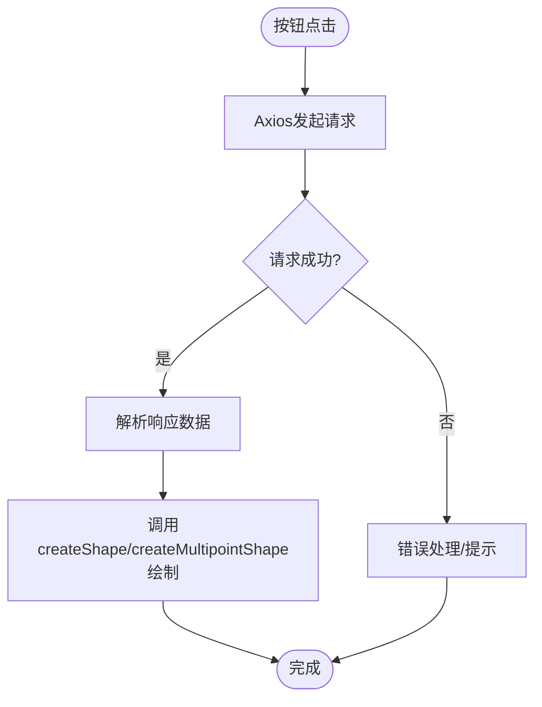
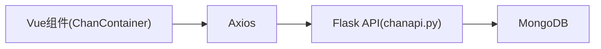
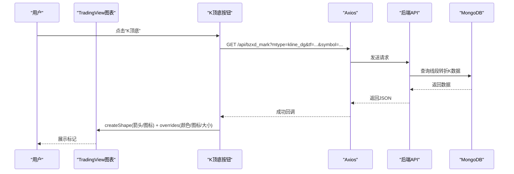

# 交互按钮与图形标记

<cite>
**本文引用的文件**
- [ChanContainer.vue](file://ui/src/components/ChanContainer.vue)
- [ChanApp.vue](file://ui/src/ChanApp.vue)
- [main.js](file://ui/src/main.js)
- [main.css](file://ui/src/main.css)
- [package.json](file://ui/package.json)
- [chanapi.py](file://api/chanapi.py)
- [README.md](file://README.md)
</cite>

## 目录
1. [简介](#简介)
2. [项目结构](#项目结构)
3. [核心组件](#核心组件)
4. [架构总览](#架构总览)
5. [详细组件分析](#详细组件分析)
6. [依赖关系分析](#依赖关系分析)
7. [性能考量](#性能考量)
8. [故障排查指南](#故障排查指南)
9. [结论](#结论)
10. [附录](#附录)

## 简介
本文件面向在 TradingView 图表界面中实现“自定义按钮 + 图形标记”的交互功能，围绕 ChanContainer.vue 的上下文，系统性讲解如何：
- 使用 tvWidget.addButton()（或更准确地说，通过 tvWidget.createButton()）添加工具栏按钮
- 为按钮绑定点击事件监听器
- 在事件回调中通过 Axios 请求后端 API（如买卖点、线段标记等）获取动态数据
- 在图表上绘制形状（图标、虚线、标签）与标记（markings），包括颜色、位置、图标代码（如 '\uf058'）、Z 轴层级等参数
- 管理图形元素的生命周期与清理，避免内存泄漏
- 提供从按钮创建到数据获取再到图表标注的完整示例流程
- 指导如何扩展 UI 交互功能，保持与现有 Vue 组件（如 ChanApp.vue）的良好集成与样式一致性

## 项目结构
本项目采用前后端分离架构：
- 前端：基于 Vue 的可视化界面，位于 ui/ 目录，核心图表容器组件为 ChanContainer.vue
- 后端：基于 Python Flask 的 API 服务，位于 api/ 目录，提供缠论相关标记与指标数据
- 数据：历史 K 线与结构数据由 MongoDB 存储，通过 API 查询返回

**图表来源**
- [ChanApp.vue](file://ui/src/ChanApp.vue#L1-L41)
- [ChanContainer.vue](file://ui/src/components/ChanContainer.vue#L1-L120)
- [main.js](file://ui/src/main.js#L1-L12)
- [main.css](file://ui/src/main.css#L1-L6)
- [package.json](file://ui/package.json#L1-L50)
- [chanapi.py](file://api/chanapi.py#L1-L120)

**章节来源**
- [README.md](file://README.md#L90-L153)
- [ChanApp.vue](file://ui/src/ChanApp.vue#L1-L41)
- [main.js](file://ui/src/main.js#L1-L12)
- [package.json](file://ui/package.json#L1-L50)

## 核心组件
- ChanContainer.vue：承载 TradingView 图表实例，负责：
  - 初始化 widgetOptions 并创建 tvWidget
  - 在图表就绪后注册快捷键、事件订阅
  - 在头部就绪后批量创建多个自定义按钮，并绑定点击事件
  - 在点击事件中通过 Axios 请求后端 API，解析响应后在图表上绘制形状与标记
  - 生命周期钩子中移除图表实例，防止内存泄漏
- ChanApp.vue：应用入口组件，包含 ChanContainer
- main.js：Vue 应用挂载入口
- package.json：声明 axios 依赖
- chanapi.py：后端 API，提供买卖点、线段标记、中枢标记、指标等数据

**章节来源**
- [ChanContainer.vue](file://ui/src/components/ChanContainer.vue#L1-L120)
- [ChanContainer.vue](file://ui/src/components/ChanContainer.vue#L1570-L1600)
- [ChanContainer.vue](file://ui/src/components/ChanContainer.vue#L1600-L1650)
- [ChanContainer.vue](file://ui/src/components/ChanContainer.vue#L2825-L2839)
- [ChanApp.vue](file://ui/src/ChanApp.vue#L1-L41)
- [main.js](file://ui/src/main.js#L1-L12)
- [package.json](file://ui/package.json#L1-L50)
- [chanapi.py](file://api/chanapi.py#L244-L491)

## 架构总览
下图展示了从前端按钮点击到后端数据返回再到图表绘制的整体流程。

**图表来源**
- [ChanContainer.vue](file://ui/src/components/ChanContainer.vue#L1743-L1801)
- [ChanContainer.vue](file://ui/src/components/ChanContainer.vue#L1804-L1846)
- [ChanContainer.vue](file://ui/src/components/ChanContainer.vue#L1848-L1896)
- [ChanContainer.vue](file://ui/src/components/ChanContainer.vue#L1949-L2077)
- [ChanContainer.vue](file://ui/src/components/ChanContainer.vue#L2079-L2144)
- [ChanContainer.vue](file://ui/src/components/ChanContainer.vue#L2145-L2193)
- [ChanContainer.vue](file://ui/src/components/ChanContainer.vue#L2196-L2318)
- [ChanContainer.vue](file://ui/src/components/ChanContainer.vue#L2320-L2377)
- [ChanContainer.vue](file://ui/src/components/ChanContainer.vue#L2379-L2445)
- [ChanContainer.vue](file://ui/src/components/ChanContainer.vue#L2447-L2493)
- [ChanContainer.vue](file://ui/src/components/ChanContainer.vue#L2495-L2542)
- [chanapi.py](file://api/chanapi.py#L280-L491)

## 详细组件分析

### 组件：ChanContainer.vue
- 图表初始化与事件绑定
  - 在 mounted 中创建 tvWidget，并在 headerReady 后批量创建按钮
  - 在 onChartReady 中注册快捷键与数据加载事件
- 按钮与交互
  - 使用 tvWidget.createButton() 创建按钮，设置 title、类名与点击事件
  - 在点击事件中通过 Axios 请求后端 API，解析响应数据
- 图形绘制
  - 使用 tvWidget.chart(0).createShape() 与 createMultipointShape() 绘制图标、箭头、文本、矩形、趋势线等
  - 通过 overrides 设置颜色、透明度、线条样式、字体大小、图标代码等
  - 通过 zOrder 控制 Z 轴层级（例如 'top'）
- 生命周期与清理
  - destroyed 钩子中调用 tvWidget.remove()，释放图表资源，避免内存泄漏

**图表来源**
- [ChanContainer.vue](file://ui/src/components/ChanContainer.vue#L1743-L1801)
- [ChanContainer.vue](file://ui/src/components/ChanContainer.vue#L1804-L1846)
- [ChanContainer.vue](file://ui/src/components/ChanContainer.vue#L1848-L1896)
- [ChanContainer.vue](file://ui/src/components/ChanContainer.vue#L1949-L2077)
- [ChanContainer.vue](file://ui/src/components/ChanContainer.vue#L2079-L2144)
- [ChanContainer.vue](file://ui/src/components/ChanContainer.vue#L2145-L2193)
- [ChanContainer.vue](file://ui/src/components/ChanContainer.vue#L2196-L2318)
- [ChanContainer.vue](file://ui/src/components/ChanContainer.vue#L2320-L2377)
- [ChanContainer.vue](file://ui/src/components/ChanContainer.vue#L2379-L2445)
- [ChanContainer.vue](file://ui/src/components/ChanContainer.vue#L2447-L2493)
- [ChanContainer.vue](file://ui/src/components/ChanContainer.vue#L2495-L2542)
- [ChanContainer.vue](file://ui/src/components/ChanContainer.vue#L2825-L2839)

**章节来源**
- [ChanContainer.vue](file://ui/src/components/ChanContainer.vue#L1-L120)
- [ChanContainer.vue](file://ui/src/components/ChanContainer.vue#L1570-L1600)
- [ChanContainer.vue](file://ui/src/components/ChanContainer.vue#L1600-L1650)
- [ChanContainer.vue](file://ui/src/components/ChanContainer.vue#L1650-L1700)
- [ChanContainer.vue](file://ui/src/components/ChanContainer.vue#L1743-L1801)
- [ChanContainer.vue](file://ui/src/components/ChanContainer.vue#L1804-L1846)
- [ChanContainer.vue](file://ui/src/components/ChanContainer.vue#L1848-L1896)
- [ChanContainer.vue](file://ui/src/components/ChanContainer.vue#L1949-L2077)
- [ChanContainer.vue](file://ui/src/components/ChanContainer.vue#L2079-L2144)
- [ChanContainer.vue](file://ui/src/components/ChanContainer.vue#L2145-L2193)
- [ChanContainer.vue](file://ui/src/components/ChanContainer.vue#L2196-L2318)
- [ChanContainer.vue](file://ui/src/components/ChanContainer.vue#L2320-L2377)
- [ChanContainer.vue](file://ui/src/components/ChanContainer.vue#L2379-L2445)
- [ChanContainer.vue](file://ui/src/components/ChanContainer.vue#L2447-L2493)
- [ChanContainer.vue](file://ui/src/components/ChanContainer.vue#L2495-L2542)
- [ChanContainer.vue](file://ui/src/components/ChanContainer.vue#L2825-L2839)

### 组件：ChanApp.vue
- 作为顶层应用组件，引入并渲染 ChanContainer
- 提供基础样式与布局

**章节来源**
- [ChanApp.vue](file://ui/src/ChanApp.vue#L1-L41)

### 组件：main.js
- 引入全局样式
- 创建 Vue 实例并挂载到 DOM

**章节来源**
- [main.js](file://ui/src/main.js#L1-L12)

### 组件：main.css
- 全局基础样式

**章节来源**
- [main.css](file://ui/src/main.css#L1-L6)

### 组件：package.json
- 声明 axios 依赖，用于在前端发起 HTTP 请求

**章节来源**
- [package.json](file://ui/package.json#L1-L50)

### 组件：chanapi.py
- 提供多种标记与指标接口，如买卖点、线段标记、中枢标记、指标数据等
- 接口示例：
  - /api/bzxd_mark?mtype=...&tf=...&symbol=...
  - /api/bzzs_mark?mtype=...&tf=...&symbol=...
  - /api/get_bspoint?symbol=...&resolution=...

**章节来源**
- [chanapi.py](file://api/chanapi.py#L244-L491)

## 依赖关系分析
- 前端依赖
  - Vue：组件化渲染与生命周期管理
  - axios：HTTP 请求，用于调用后端 API
- 后端依赖
  - Flask：提供 RESTful API
  - MongoDB：存储历史 K 线与结构数据
- 前后端通信
  - 前端通过 Axios 访问后端接口，后端查询数据库并返回 JSON 结构

**图表来源**
- [ChanContainer.vue](file://ui/src/components/ChanContainer.vue#L1-L120)
- [package.json](file://ui/package.json#L1-L50)
- [chanapi.py](file://api/chanapi.py#L1-L120)

**章节来源**
- [package.json](file://ui/package.json#L1-L50)
- [chanapi.py](file://api/chanapi.py#L1-L120)

## 性能考量
- 按需绘制：仅在按钮点击时触发请求与绘制，避免全量加载导致性能问题
- 数据过滤：后端接口返回的数据已按时间范围与状态过滤，前端直接消费
- 图形复用：同一按钮多次点击建议先清理旧图形，再绘制新图形，减少冗余元素
- 清理策略：在 destroyed 钩子中移除图表实例，避免内存泄漏

[本节为通用建议，无需特定文件引用]

## 故障排查指南
- 按钮无响应
  - 检查 headerReady 是否正确触发，确保按钮在图表就绪后再创建
  - 检查点击事件绑定是否生效
- 图表无标记
  - 检查后端接口返回数据格式与字段名称是否与前端解析一致
  - 检查 createShape/createMultipointShape 的参数（时间、价格、通道、覆盖项等）
- 颜色/图标不生效
  - 确认 overrides 中的颜色、透明度、图标代码、字体大小等参数正确
- 内存泄漏
  - 确保在 destroyed 钩子中调用 tvWidget.remove()

**章节来源**
- [ChanContainer.vue](file://ui/src/components/ChanContainer.vue#L1650-L1700)
- [ChanContainer.vue](file://ui/src/components/ChanContainer.vue#L2825-L2839)

## 结论
通过 ChanContainer.vue 的实践，可以在 TradingView 图表中高效地实现“自定义按钮 + 图形标记”的交互功能。关键在于：
- 正确使用 tvWidget.createButton() 创建按钮并绑定点击事件
- 在事件回调中通过 Axios 请求后端 API 获取动态数据
- 使用 createShape/createMultipointShape 绘制形状与标记，并合理设置颜色、位置、图标与层级
- 在 destroyed 钩子中清理图表实例，避免内存泄漏
- 与现有 Vue 组件（如 ChanApp.vue）保持良好集成与样式一致性

[本节为总结，无需特定文件引用]

## 附录

### 交互按钮与图形标记的完整示例流程
以下为从按钮创建到数据获取再到图表标注的完整示例路径（以“K顶底”按钮为例）：

**图表来源**
- [ChanContainer.vue](file://ui/src/components/ChanContainer.vue#L1743-L1801)
- [chanapi.py](file://api/chanapi.py#L280-L371)

### 关键实现要点清单
- 按钮创建与事件绑定
  - 使用 tvWidget.createButton() 创建按钮
  - 设置 title、类名与点击事件
- 数据请求与解析
  - 使用 Axios 发起 GET 请求
  - 解析响应数据并遍历绘制
- 图形绘制参数
  - createShape/createMultipointShape
  - overrides：颜色、透明度、线条样式、字体大小、图标代码
  - zOrder：'top' 等控制层级
- 生命周期管理
  - destroyed 钩子中移除图表实例

**章节来源**
- [ChanContainer.vue](file://ui/src/components/ChanContainer.vue#L1743-L1801)
- [ChanContainer.vue](file://ui/src/components/ChanContainer.vue#L1804-L1846)
- [ChanContainer.vue](file://ui/src/components/ChanContainer.vue#L1848-L1896)
- [ChanContainer.vue](file://ui/src/components/ChanContainer.vue#L1949-L2077)
- [ChanContainer.vue](file://ui/src/components/ChanContainer.vue#L2079-L2144)
- [ChanContainer.vue](file://ui/src/components/ChanContainer.vue#L2145-L2193)
- [ChanContainer.vue](file://ui/src/components/ChanContainer.vue#L2196-L2318)
- [ChanContainer.vue](file://ui/src/components/ChanContainer.vue#L2320-L2377)
- [ChanContainer.vue](file://ui/src/components/ChanContainer.vue#L2379-L2445)
- [ChanContainer.vue](file://ui/src/components/ChanContainer.vue#L2447-L2493)
- [ChanContainer.vue](file://ui/src/components/ChanContainer.vue#L2495-L2542)
- [ChanContainer.vue](file://ui/src/components/ChanContainer.vue#L2825-L2839)