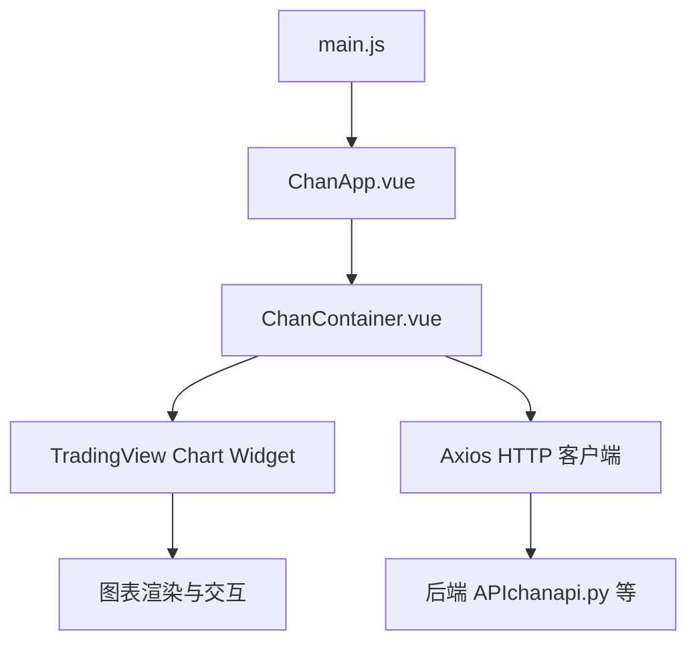
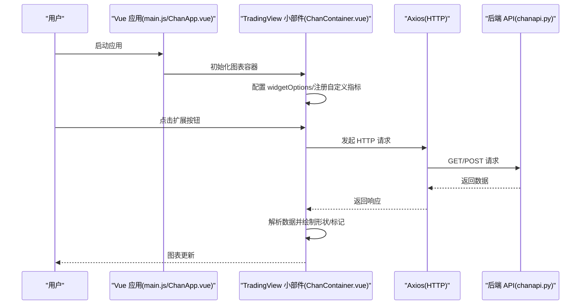
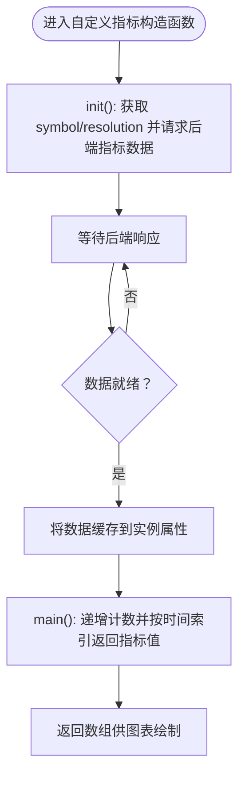
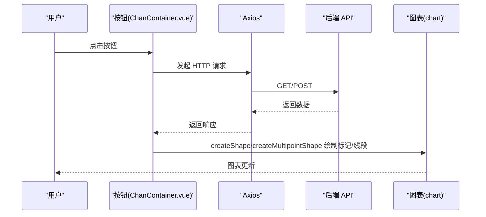
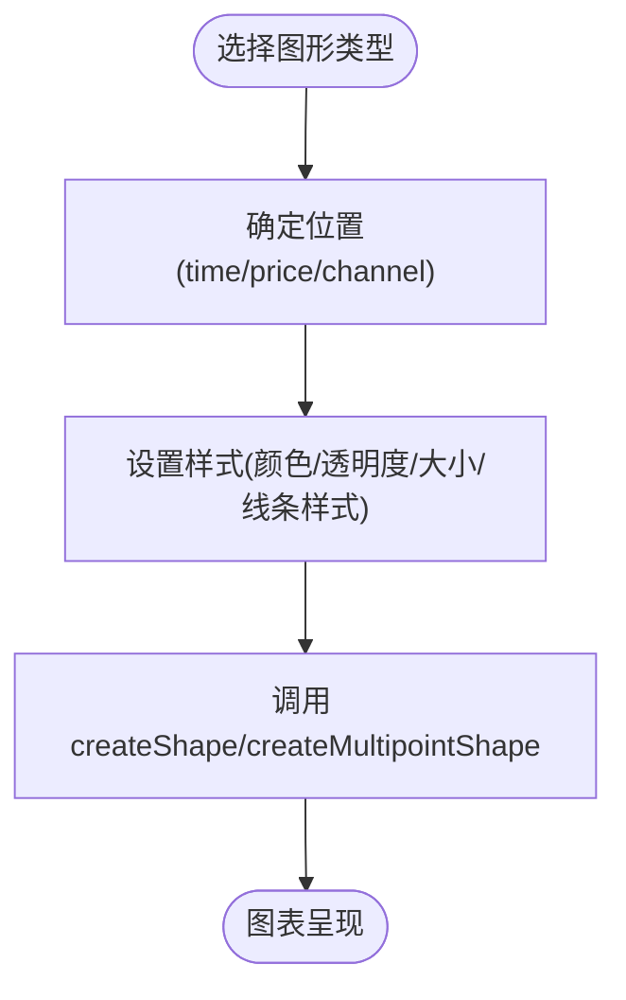
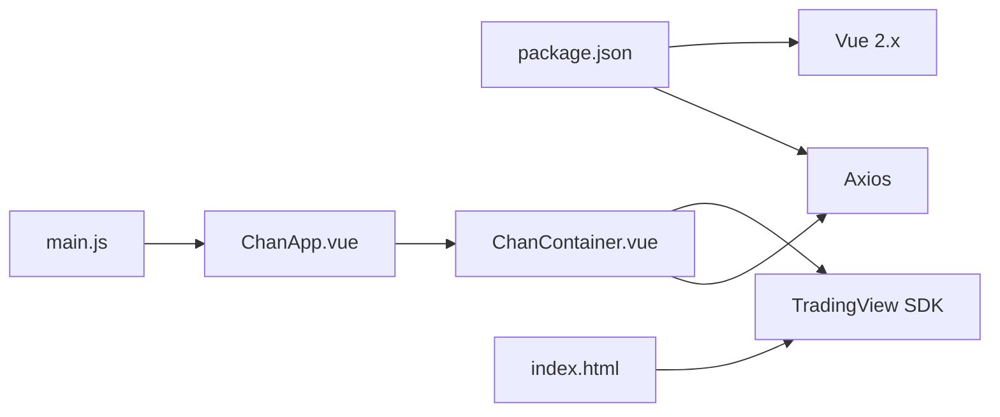

# 前端扩展开发

<cite>
**本文引用的文件**
- [ChanContainer.vue](file://ui/src/components/ChanContainer.vue)
- [ChanApp.vue](file://ui/src/ChanApp.vue)
- [main.js](file://ui/src/main.js)
- [index.html](file://ui/public/index.html)
- [main.css](file://ui/src/main.css)
- [package.json](file://ui/package.json)
- [README.md](file://README.md)
</cite>

## 目录
1. [简介](#简介)
2. [项目结构](#项目结构)
3. [核心组件](#核心组件)
4. [架构总览](#架构总览)
5. [详细组件分析](#详细组件分析)
6. [依赖关系分析](#依赖关系分析)
7. [性能考虑](#性能考虑)
8. [故障排查指南](#故障排查指南)
9. [结论](#结论)
10. [附录](#附录)

## 简介
本文件面向希望在 TradingView 图表中扩展自定义指标与交互按钮的开发者，基于 ChanContainer.vue 中已实现的 NMA、NMC、NDX 等指标定义与按钮扩展实践，系统讲解以下内容：
- 自定义指标的元信息配置、绘图类型、样式设置与数据绑定方法
- 如何通过 tvWidget.createButton() 创建按钮、绑定事件监听器，并通过 Axios 调用后端 API 获取数据
- 在图表上创建形状（如图标、虚线）与标记的完整示例，包括颜色、位置、图标代码等参数设置
- 如何复用现有组件进行界面扩展，并确保与现有 UI 风格一致

## 项目结构
前端采用 Vue 2.x + TradingView 本地 SDK 的组合，核心入口与组件如下：
- 入口脚本：main.js
- 应用容器：ChanApp.vue
- 图表容器：ChanContainer.vue（承载 TradingView 实例与扩展按钮/指标）
- HTML 模板：index.html（引入 TradingView 数据源与打包资源）
- 样式：main.css
- 依赖管理：package.json

图表来源
- [main.js](file://ui/src/main.js#L1-L12)
- [ChanApp.vue](file://ui/src/ChanApp.vue#L1-L20)
- [ChanContainer.vue](file://ui/src/components/ChanContainer.vue#L1-L120)
- [index.html](file://ui/public/index.html#L1-L20)

章节来源
- [main.js](file://ui/src/main.js#L1-L12)
- [ChanApp.vue](file://ui/src/ChanApp.vue#L1-L20)
- [index.html](file://ui/public/index.html#L1-L20)
- [package.json](file://ui/package.json#L1-L30)

## 核心组件
- ChanContainer.vue
  - 负责初始化 TradingView 小部件、注入自定义指标、创建扩展按钮、绘制形状与标记、订阅数据加载事件等
  - 关键职责：
    - 配置 widgetOptions（数据源、覆盖样式、语言、收藏等）
    - 注册 custom_indicators_getter，提供 NMA/NMC/NDX 等自定义指标
    - 在图表 headerReady 后创建多个按钮，绑定点击事件并通过 Axios 请求后端接口
    - 使用 createShape/createMultipointShape 在图表上绘制图标、箭头、矩形、趋势线等
- ChanApp.vue
  - 应用根组件，包含全局样式与标题区域
- main.js
  - 应用入口，挂载 ChanApp.vue
- index.html
  - 引入 TradingView 数据源与打包产物，提供应用挂载点
- main.css
  - 基础样式重置
- package.json
  - 依赖：Vue 2.x、Axios

章节来源
- [ChanContainer.vue](file://ui/src/components/ChanContainer.vue#L1-L120)
- [ChanApp.vue](file://ui/src/ChanApp.vue#L1-L20)
- [main.js](file://ui/src/main.js#L1-L12)
- [index.html](file://ui/public/index.html#L1-L20)
- [main.css](file://ui/src/main.css#L1-L6)
- [package.json](file://ui/package.json#L1-L30)

## 架构总览
下图展示了前端扩展的整体架构：Vue 应用通过 ChanContainer.vue 初始化 TradingView 小部件，注册自定义指标，创建按钮并绑定事件，Axios 发起后端请求，返回数据后在图表上绘制形状与标记。

图表来源
- [ChanContainer.vue](file://ui/src/components/ChanContainer.vue#L1570-L1600)
- [ChanContainer.vue](file://ui/src/components/ChanContainer.vue#L1652-L1700)
- [ChanContainer.vue](file://ui/src/components/ChanContainer.vue#L1743-L1801)
- [ChanContainer.vue](file://ui/src/components/ChanContainer.vue#L1848-L1896)
- [ChanContainer.vue](file://ui/src/components/ChanContainer.vue#L1949-L2076)
- [ChanContainer.vue](file://ui/src/components/ChanContainer.vue#L2145-L2192)
- [ChanContainer.vue](file://ui/src/components/ChanContainer.vue#L2195-L2317)
- [ChanContainer.vue](file://ui/src/components/ChanContainer.vue#L2320-L2376)
- [ChanContainer.vue](file://ui/src/components/ChanContainer.vue#L2447-L2492)
- [ChanContainer.vue](file://ui/src/components/ChanContainer.vue#L2495-L2541)
- [ChanContainer.vue](file://ui/src/components/ChanContainer.vue#L2543-L2554)

## 详细组件分析

### 自定义指标：元信息、绘图类型与样式
- 元信息配置
  - name：指标名称
  - description/shortDescription：显示在图表上的描述
  - is_hidden_study/is_price_study：控制是否隐藏与是否叠加在价格图层
  - plots：定义曲线类型（line、hline 等）
  - defaults.styles：默认样式（线条样式、透明度、颜色、宽度等）
  - styles.inputs：输入项（本项目示例中多为空）
- 绘图类型
  - plottype：线形图等
  - linestyle：实线/虚线/点线等
  - transparency/linewidth/color：透明度、线宽、颜色
- 数据绑定
  - 通过 Axios 请求后端接口，将返回数据映射到时间轴，再在 main() 中按时间索引返回对应值
  - 示例涉及 NMA、NMC、NDX、NST、NXC、MSH、MA34XD 等指标

图表来源
- [ChanContainer.vue](file://ui/src/components/ChanContainer.vue#L147-L206)
- [ChanContainer.vue](file://ui/src/components/ChanContainer.vue#L387-L448)
- [ChanContainer.vue](file://ui/src/components/ChanContainer.vue#L779-L851)
- [ChanContainer.vue](file://ui/src/components/ChanContainer.vue#L915-L987)
- [ChanContainer.vue](file://ui/src/components/ChanContainer.vue#L1196-L1268)
- [ChanContainer.vue](file://ui/src/components/ChanContainer.vue#L1330-L1400)
- [ChanContainer.vue](file://ui/src/components/ChanContainer.vue#L1464-L1507)

章节来源
- [ChanContainer.vue](file://ui/src/components/ChanContainer.vue#L147-L206)
- [ChanContainer.vue](file://ui/src/components/ChanContainer.vue#L387-L448)
- [ChanContainer.vue](file://ui/src/components/ChanContainer.vue#L779-L851)
- [ChanContainer.vue](file://ui/src/components/ChanContainer.vue#L915-L987)
- [ChanContainer.vue](file://ui/src/components/ChanContainer.vue#L1196-L1268)
- [ChanContainer.vue](file://ui/src/components/ChanContainer.vue#L1330-L1400)
- [ChanContainer.vue](file://ui/src/components/ChanContainer.vue#L1464-L1507)

### 按钮扩展：创建与事件绑定
- 创建按钮
  - 使用 tvWidget.createButton() 创建 DOM 按钮元素
  - 设置 title、innerHTML、类名（如 apply-common-tooltip）
- 事件绑定
  - addEventListener('click', handler) 绑定点击事件
  - 在 handler 内通过 Axios 请求后端接口，解析返回数据
- 常见用途
  - 获取图表信息、导出数据、跳转时间段
  - 绘制 K 线顶底、MA5 顶底、转折 K、中枢线、线段中枢、量化买卖点、本质线段/虚线、独立日线级别线段等

图表来源
- [ChanContainer.vue](file://ui/src/components/ChanContainer.vue#L1652-L1676)
- [ChanContainer.vue](file://ui/src/components/ChanContainer.vue#L1743-L1801)
- [ChanContainer.vue](file://ui/src/components/ChanContainer.vue#L1804-L1846)
- [ChanContainer.vue](file://ui/src/components/ChanContainer.vue#L1848-L1896)
- [ChanContainer.vue](file://ui/src/components/ChanContainer.vue#L1949-L2076)
- [ChanContainer.vue](file://ui/src/components/ChanContainer.vue#L2145-L2192)
- [ChanContainer.vue](file://ui/src/components/ChanContainer.vue#L2195-L2317)
- [ChanContainer.vue](file://ui/src/components/ChanContainer.vue#L2320-L2376)
- [ChanContainer.vue](file://ui/src/components/ChanContainer.vue#L2447-L2492)
- [ChanContainer.vue](file://ui/src/components/ChanContainer.vue#L2495-L2541)
- [ChanContainer.vue](file://ui/src/components/ChanContainer.vue#L2543-L2554)

章节来源
- [ChanContainer.vue](file://ui/src/components/ChanContainer.vue#L1652-L1676)
- [ChanContainer.vue](file://ui/src/components/ChanContainer.vue#L1743-L1801)
- [ChanContainer.vue](file://ui/src/components/ChanContainer.vue#L1804-L1846)
- [ChanContainer.vue](file://ui/src/components/ChanContainer.vue#L1848-L1896)
- [ChanContainer.vue](file://ui/src/components/ChanContainer.vue#L1949-L2076)
- [ChanContainer.vue](file://ui/src/components/ChanContainer.vue#L2145-L2192)
- [ChanContainer.vue](file://ui/src/components/ChanContainer.vue#L2195-L2317)
- [ChanContainer.vue](file://ui/src/components/ChanContainer.vue#L2320-L2376)
- [ChanContainer.vue](file://ui/src/components/ChanContainer.vue#L2447-L2492)
- [ChanContainer.vue](file://ui/src/components/ChanContainer.vue#L2495-L2541)
- [ChanContainer.vue](file://ui/src/components/ChanContainer.vue#L2543-L2554)

### 图形绘制：形状与标记
- 图形类型
  - 箭头：arrow_up/arrow_down
  - 图标：通过 text 与 icon（十六进制码）组合
  - 文本：text
  - 矩形：rectangle
  - 趋势线：trend_line（可设置实线/虚线）
- 参数设置
  - 位置：time、price 或 channel（如 high/low）
  - 样式：color、icon、size、transparency、linewidth、linecolor、backgroundColor 等
- 示例场景
  - K 线顶底、MA5 顶底、转折 K、中枢线、线段中枢、量化买卖点、本质线段/虚线、独立日线级别线段等

图表来源
- [ChanContainer.vue](file://ui/src/components/ChanContainer.vue#L1768-L1799)
- [ChanContainer.vue](file://ui/src/components/ChanContainer.vue#L1820-L1843)
- [ChanContainer.vue](file://ui/src/components/ChanContainer.vue#L1866-L1893)
- [ChanContainer.vue](file://ui/src/components/ChanContainer.vue#L1991-L2056)
- [ChanContainer.vue](file://ui/src/components/ChanContainer.vue#L2092-L2141)
- [ChanContainer.vue](file://ui/src/components/ChanContainer.vue#L2163-L2190)
- [ChanContainer.vue](file://ui/src/components/ChanContainer.vue#L2232-L2249)
- [ChanContainer.vue](file://ui/src/components/ChanContainer.vue#L2298-L2315)
- [ChanContainer.vue](file://ui/src/components/ChanContainer.vue#L2463-L2489)
- [ChanContainer.vue](file://ui/src/components/ChanContainer.vue#L2512-L2538)

章节来源
- [ChanContainer.vue](file://ui/src/components/ChanContainer.vue#L1768-L1799)
- [ChanContainer.vue](file://ui/src/components/ChanContainer.vue#L1820-L1843)
- [ChanContainer.vue](file://ui/src/components/ChanContainer.vue#L1866-L1893)
- [ChanContainer.vue](file://ui/src/components/ChanContainer.vue#L1991-L2056)
- [ChanContainer.vue](file://ui/src/components/ChanContainer.vue#L2092-L2141)
- [ChanContainer.vue](file://ui/src/components/ChanContainer.vue#L2163-L2190)
- [ChanContainer.vue](file://ui/src/components/ChanContainer.vue#L2232-L2249)
- [ChanContainer.vue](file://ui/src/components/ChanContainer.vue#L2298-L2315)
- [ChanContainer.vue](file://ui/src/components/ChanContainer.vue#L2463-L2489)
- [ChanContainer.vue](file://ui/src/components/ChanContainer.vue#L2512-L2538)

### 复用现有组件进行界面扩展
- 复用策略
  - 在 ChanApp.vue 中引入新的子组件或在 ChanContainer.vue 内部新增按钮/面板
  - 使用 apply-common-tooltip 类名保持 Tooltip 一致风格
  - 使用现有颜色体系与字体大小，确保视觉统一
- 与现有 UI 风格一致
  - 通过类名与内联样式保持按钮与文本颜色一致
  - 使用已有容器结构（如 header 区域）组织扩展按钮

章节来源
- [ChanApp.vue](file://ui/src/ChanApp.vue#L1-L20)
- [ChanContainer.vue](file://ui/src/components/ChanContainer.vue#L1652-L1676)
- [ChanContainer.vue](file://ui/src/components/ChanContainer.vue#L1743-L1801)
- [ChanContainer.vue](file://ui/src/components/ChanContainer.vue#L1848-L1896)
- [ChanContainer.vue](file://ui/src/components/ChanContainer.vue#L1949-L2076)
- [ChanContainer.vue](file://ui/src/components/ChanContainer.vue#L2145-L2192)
- [ChanContainer.vue](file://ui/src/components/ChanContainer.vue#L2195-L2317)
- [ChanContainer.vue](file://ui/src/components/ChanContainer.vue#L2320-L2376)
- [ChanContainer.vue](file://ui/src/components/ChanContainer.vue#L2447-L2492)
- [ChanContainer.vue](file://ui/src/components/ChanContainer.vue#L2495-L2541)
- [ChanContainer.vue](file://ui/src/components/ChanContainer.vue#L2543-L2554)

## 依赖关系分析
- 运行时依赖
  - Vue 2.x：组件化与生命周期
  - Axios：HTTP 请求封装
  - TradingView 本地 SDK：图表渲染与交互
- 构建与开发依赖
  - @vue/cli-service、babel、sass 等
- 文件间依赖
  - main.js -> ChanApp.vue -> ChanContainer.vue
  - index.html 引入打包后的数据源与脚本

图表来源
- [package.json](file://ui/package.json#L1-L30)
- [main.js](file://ui/src/main.js#L1-L12)
- [ChanApp.vue](file://ui/src/ChanApp.vue#L1-L20)
- [ChanContainer.vue](file://ui/src/components/ChanContainer.vue#L1-L120)
- [index.html](file://ui/public/index.html#L1-L20)

章节来源
- [package.json](file://ui/package.json#L1-L30)
- [main.js](file://ui/src/main.js#L1-L12)
- [ChanApp.vue](file://ui/src/ChanApp.vue#L1-L20)
- [ChanContainer.vue](file://ui/src/components/ChanContainer.vue#L1-L120)
- [index.html](file://ui/public/index.html#L1-L20)

## 性能考虑
- 指标数据请求
  - 使用 Axios 异步请求，避免阻塞主线程
  - 对高频刷新场景，建议在请求前进行去抖/节流处理
- 图形绘制
  - 批量绘制时注意减少重复创建与样式切换
  - 对大量标记，优先使用 createMultipointShape 合并绘制
- 图表准备状态
  - 在 onDataLoaded/dataReady 后再进行绘制，避免空数据导致的异常
- 主题与样式
  - 统一使用现有样式类名，减少额外样式计算

## 故障排查指南
- 按钮无响应
  - 检查 tvWidget.headerReady 是否触发
  - 确认按钮事件绑定是否在 headerReady 回调内
- 图形不显示
  - 检查时间戳格式与分辨率匹配
  - 确认 createShape/createMultipointShape 的位置参数正确
- 指标不显示
  - 确认 custom_indicators_getter 已注册
  - 检查后端接口返回数据结构与时间索引一致性
- Axios 请求失败
  - 检查跨域与后端服务状态
  - 确认请求路径与查询参数正确

章节来源
- [ChanContainer.vue](file://ui/src/components/ChanContainer.vue#L1600-L1651)
- [ChanContainer.vue](file://ui/src/components/ChanContainer.vue#L1652-L1676)
- [ChanContainer.vue](file://ui/src/components/ChanContainer.vue#L1743-L1801)
- [ChanContainer.vue](file://ui/src/components/ChanContainer.vue#L1848-L1896)
- [ChanContainer.vue](file://ui/src/components/ChanContainer.vue#L1949-L2076)
- [ChanContainer.vue](file://ui/src/components/ChanContainer.vue#L2145-L2192)
- [ChanContainer.vue](file://ui/src/components/ChanContainer.vue#L2195-L2317)
- [ChanContainer.vue](file://ui/src/components/ChanContainer.vue#L2320-L2376)
- [ChanContainer.vue](file://ui/src/components/ChanContainer.vue#L2447-L2492)
- [ChanContainer.vue](file://ui/src/components/ChanContainer.vue#L2495-L2541)
- [ChanContainer.vue](file://ui/src/components/ChanContainer.vue#L2543-L2554)

## 结论
通过 ChanContainer.vue 的实践，可以在 TradingView 图表中高效地扩展自定义指标与交互按钮，并在图表上绘制丰富的形状与标记。遵循本文的元信息配置、样式设置与数据绑定方法，结合 Axios 与现有按钮/图形绘制模式，可快速实现符合业务需求的可视化扩展。

## 附录
- 项目背景与功能概述可参考仓库 README
- TradingView 指标与按钮扩展的实现细节均在 ChanContainer.vue 中体现

章节来源
- [README.md](file://README.md#L90-L110)
- [README.md](file://README.md#L107-L136)