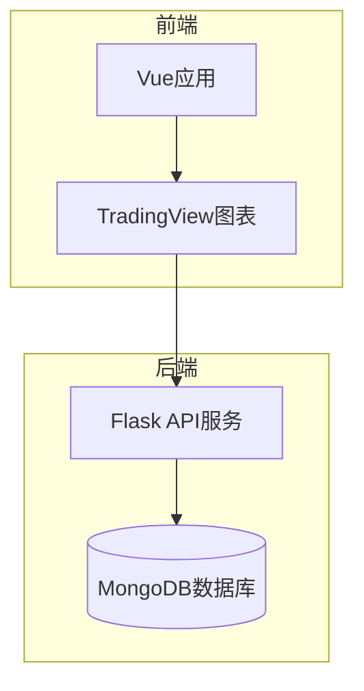
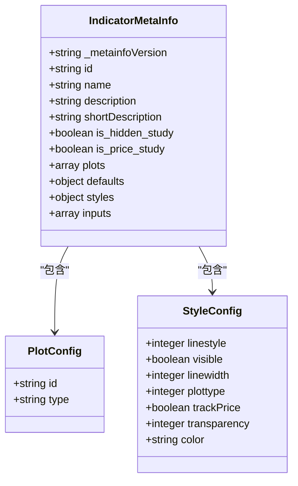
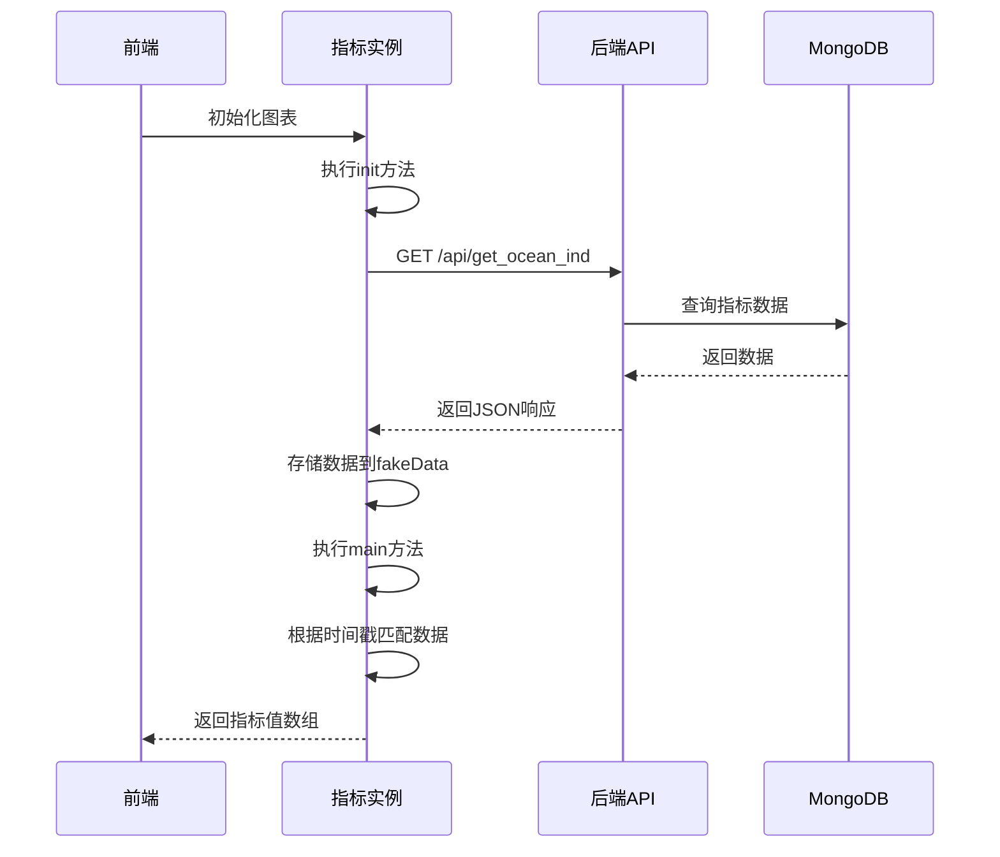
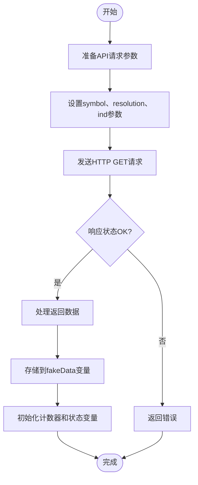
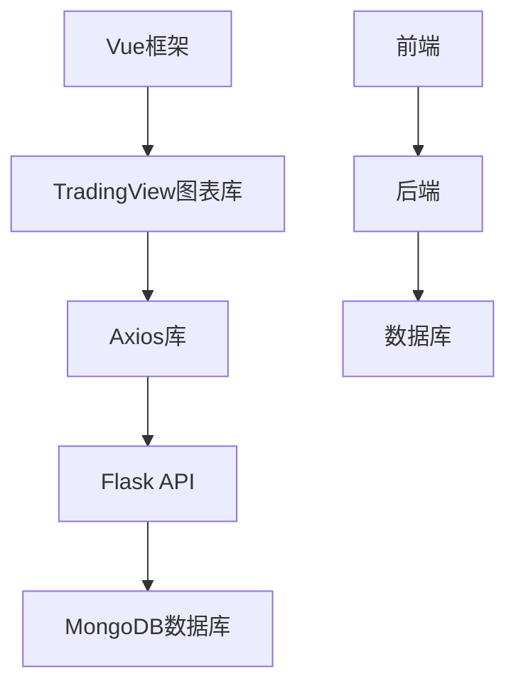

# 自定义指标开发

<cite>
**本文档引用文件**   
- [ChanContainer.vue](file://ui/src/components/ChanContainer.vue)
- [chanapi.py](file://api/chanapi.py)
- [conf.py](file://comm/conf.py)
</cite>

## 目录
1. [引言](#引言)
2. [项目结构](#项目结构)
3. [核心组件](#核心组件)
4. [架构概述](#架构概述)
5. [详细组件分析](#详细组件分析)
6. [依赖分析](#依赖分析)
7. [性能考虑](#性能考虑)
8. [故障排除指南](#故障排除指南)
9. [结论](#结论)

## 引言
本文档详细说明了如何在TradingView图表中定义和集成缠论相关技术指标（如NMA、NMC、NMM、NMS、NMC2、NDX）。基于ChanContainer.vue中的指标元信息（metainfo）配置，解释指标名称、描述、绘图类型（line/hline）、样式设置（颜色、线宽、透明度）、精度控制及数据绑定机制。说明constructor中init和main函数的执行逻辑，包括如何通过Axios调用后端/api/get_ocean_ind接口获取指标数据，并根据时间戳进行数据匹配与渲染。提供完整的指标定义结构示例，涵盖多条曲线输出、隐藏/显示控制（is_hidden_study）、是否叠加在价格图上（is_price_study）等配置项。指导开发者如何复用现有模式创建新指标，并确保与TradingView SDK兼容。

## 项目结构
本项目采用前后端分离架构，前端基于Vue框架实现，后端使用Python的Flask框架提供API接口。前端代码位于ui目录下，包含TradingView图表容器组件ChanContainer.vue。后端API代码位于api目录下，主要由chanapi.py文件实现。数据存储使用MongoDB数据库，配置信息在comm/conf.py中定义。整体架构支持本地或云平台部署，实现了缠论量化研究的可视化功能。

**Section sources**
- [ChanContainer.vue](file://ui/src/components/ChanContainer.vue#L1-L2845)
- [chanapi.py](file://api/chanapi.py#L1-L568)
- [conf.py](file://comm/conf.py#L1-L166)

## 核心组件
自定义指标的核心实现位于ChanContainer.vue文件中，通过custom_indicators_getter函数定义了一系列缠论相关指标。每个指标都包含完整的元信息配置（metainfo）和构造函数（constructor），其中定义了init和main两个关键方法。指标数据通过Axios从本地API服务获取，支持NMA、NMC、NMM、NMS、NMC2、NDX等多种缠论指标。这些指标可以叠加在价格图上或作为独立指标显示，具有不同的绘图样式和颜色配置。

**Section sources**
- [ChanContainer.vue](file://ui/src/components/ChanContainer.vue#L144-L1570)

## 架构概述
系统采用前后端分离架构，前端使用Vue框架集成TradingView图表库，后端使用Flask提供RESTful API接口。前端通过custom_indicators_getter机制定义自定义指标，每个指标通过Axios调用后端API获取数据。后端API从MongoDB数据库读取预计算的缠论指标数据，返回给前端进行可视化展示。整个系统支持多种时间周期和交易品种，实现了完整的缠论技术分析功能。



**Diagram sources **
- [ChanContainer.vue](file://ui/src/components/ChanContainer.vue#L75-L1574)
- [chanapi.py](file://api/chanapi.py#L23-L567)

## 详细组件分析

### 指标定义与配置分析
缠论指标在ChanContainer.vue中通过custom_indicators_getter函数定义，每个指标包含完整的元信息配置和构造函数。元信息中定义了指标的基本属性，如名称、描述、绘图类型、样式设置等。

#### 指标元信息配置


**Diagram sources **
- [ChanContainer.vue](file://ui/src/components/ChanContainer.vue#L150-L203)

#### 指标构造函数执行流程


**Diagram sources **
- [ChanContainer.vue](file://ui/src/components/ChanContainer.vue#L204-L264)
- [chanapi.py](file://api/chanapi.py#L210-L234)

### 指标数据获取与处理
系统通过Axios库从本地API服务获取缠论指标数据，数据请求包含交易品种、时间周期和指标类型等参数。后端API从MongoDB数据库中读取预计算的指标数据，前端根据K线时间戳进行数据匹配和渲染。

#### 指标数据获取流程


**Diagram sources **
- [ChanContainer.vue](file://ui/src/components/ChanContainer.vue#L210-L220)
- [chanapi.py](file://api/chanapi.py#L210-L234)

### 指标配置示例
以下是NMA指标的完整配置示例，展示了如何定义一个多曲线输出的缠论指标：

```mermaid
erDiagram
INDICATOR ||--o{ PLOT : "包含"
INDICATOR ||--o{ STYLE : "包含"
INDICATOR {
string name PK
string description
boolean is_hidden_study
boolean is_price_study
integer precision
}
PLOT {
string id PK
string type
string title
}
STYLE {
string plot_id PK
integer linestyle
boolean visible
integer linewidth
integer plottype
integer transparency
string color
}
```

**Diagram sources **
- [ChanContainer.vue](file://ui/src/components/ChanContainer.vue#L149-L203)

## 依赖分析
系统主要依赖于TradingView的图表库、Vue框架、Axios库和Flask框架。前端通过Vue组件化方式集成TradingView图表，使用Axios进行HTTP通信。后端使用Flask提供RESTful API接口，通过MongoDB存储和查询数据。各组件之间通过标准化的API接口进行通信，实现了前后端的完全解耦。



**Diagram sources **
- [ChanContainer.vue](file://ui/src/components/ChanContainer.vue#L7-L9)
- [chanapi.py](file://api/chanapi.py#L11-L13)

## 性能考虑
系统在设计时考虑了性能优化，通过预计算指标数据并存储在MongoDB中，避免了实时计算带来的性能压力。前端采用异步方式获取数据，不会阻塞UI渲染。API接口支持缓存机制，减少重复查询。对于大量数据的处理，系统采用分页和增量加载策略，确保图表的流畅性。

## 故障排除指南
当指标无法正常显示时，可按照以下步骤进行排查：首先检查后端API服务是否正常运行，确认端口8421是否监听；其次验证MongoDB数据库连接是否正常，确保数据集合存在且有数据；然后检查前端网络请求，确认API调用返回正确的数据格式；最后查看浏览器控制台日志，定位具体的错误信息。

**Section sources**
- [ChanContainer.vue](file://ui/src/components/ChanContainer.vue#L210-L220)
- [chanapi.py](file://api/chanapi.py#L210-L234)

## 结论
本文档详细介绍了基于TradingView的缠论技术指标开发方法。通过分析ChanContainer.vue中的指标定义机制，说明了如何配置元信息、定义构造函数以及处理数据获取和渲染。系统采用前后端分离架构，前端负责可视化展示，后端提供数据服务，实现了灵活可扩展的指标开发框架。开发者可以基于此模式创建新的缠论指标，满足个性化的量化分析需求。