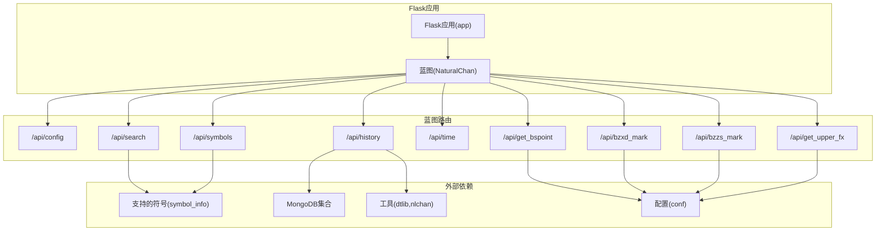
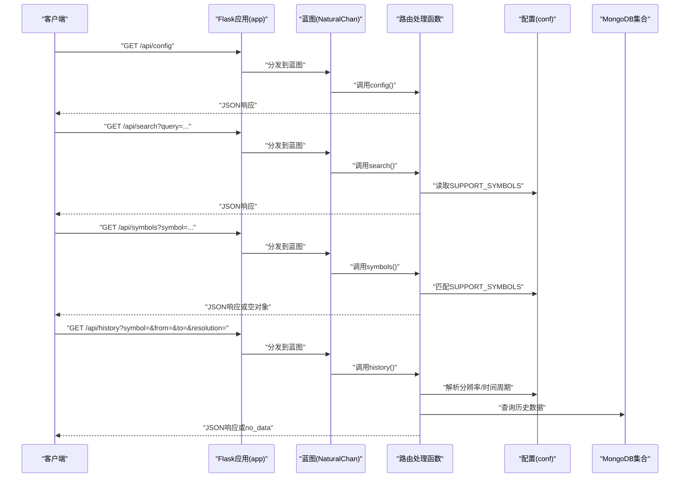
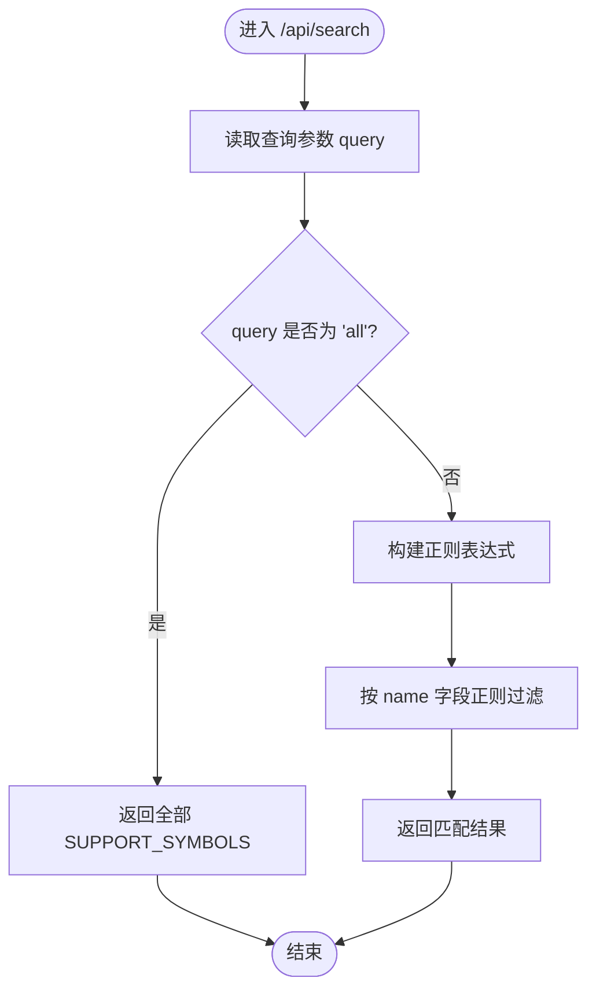
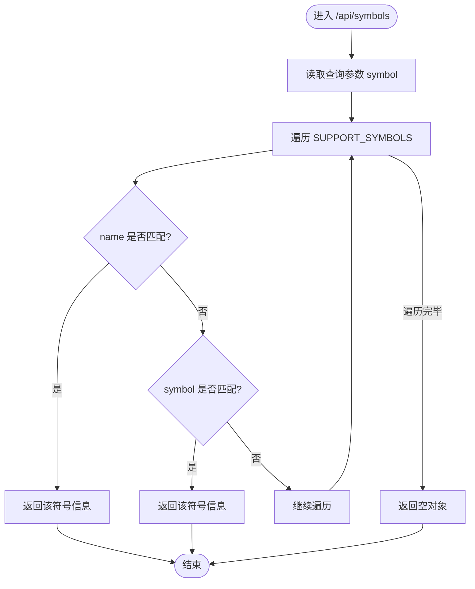
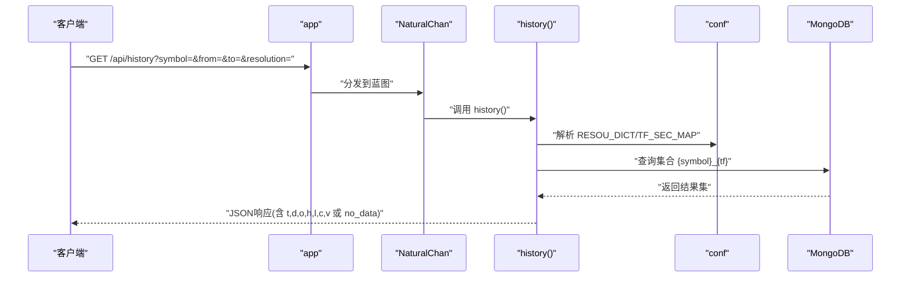
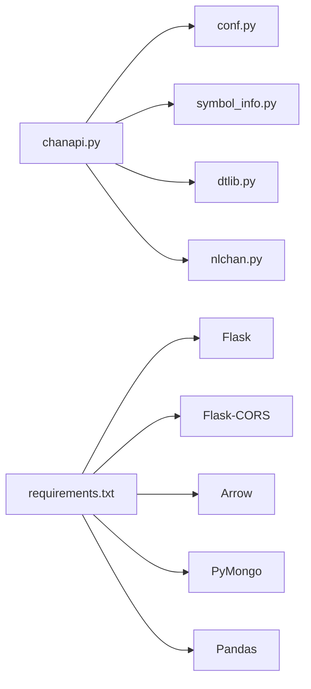

# API端点实现机制

<cite>
**本文引用的文件**
- [chanapi.py](file://api/chanapi.py)
- [symbol_info.py](file://api/symbol_info.py)
- [conf.py](file://comm/conf.py)
- [nlchan.py](file://utils/nlchan.py)
- [dtlib.py](file://utils/dtlib.py)
- [CLAUDE.md](file://api/CLAUDE.md)
- [README.md](file://README.md)
- [requirements.txt](file://api/requirements.txt)
</cite>

## 目录
1. [简介](#简介)
2. [项目结构](#项目结构)
3. [核心组件](#核心组件)
4. [架构总览](#架构总览)
5. [详细组件分析](#详细组件分析)
6. [依赖关系分析](#依赖关系分析)
7. [性能考量](#性能考量)
8. [故障排查指南](#故障排查指南)
9. [结论](#结论)
10. [附录](#附录)

## 简介
本文件聚焦于Flask蓝图(NaturalChan)的注册与路由机制，系统性阐述如何使用@NaturalChan.route装饰器定义RESTful端点，如何处理HTTP GET请求，以及请求参数的解析方法（如request.args.get）。以/api/config、/api/search和/api/symbols接口为例，展示基础查询接口的实现模式，包括参数验证、数据过滤和响应构造。同时深入分析Blueprint在模块化API设计中的作用，以及url_prefix=''的配置影响，并提供新增API端点的标准代码模板，包含错误处理和日志记录的最佳实践。

## 项目结构
- 后端采用Flask应用app，内部定义名为NaturalChan的Blueprint，所有API端点均注册在该蓝图下。
- 通过app.register_blueprint(NaturalChan, url_prefix='')将蓝图挂载到应用根路径，使端点URL直接以/api/开头。
- 配置与数据访问集中在comm.conf.py，提供数据库连接、时间周期映射、常量等。
- 品种信息由api/symbol_info.py生成，供搜索与符号详情接口使用。
- 工具函数位于utils/，如时间转换、缠论辅助等。

**图表来源**
- [chanapi.py](file://api/chanapi.py#L23-L25)
- [chanapi.py](file://api/chanapi.py#L41-L94)
- [chanapi.py](file://api/chanapi.py#L96-L234)
- [chanapi.py](file://api/chanapi.py#L237-L277)
- [chanapi.py](file://api/chanapi.py#L280-L491)
- [chanapi.py](file://api/chanapi.py#L494-L558)
- [conf.py](file://comm/conf.py#L12-L31)
- [symbol_info.py](file://api/symbol_info.py#L1-L74)

**章节来源**
- [chanapi.py](file://api/chanapi.py#L23-L25)
- [chanapi.py](file://api/chanapi.py#L560-L568)
- [conf.py](file://comm/conf.py#L12-L31)
- [symbol_info.py](file://api/symbol_info.py#L1-L74)

## 核心组件
- Flask应用与蓝图
  - 应用实例：app = Flask(__name__)
  - 蓝图定义：NaturalChan = Blueprint('NaturalChan', __name__)
  - 注册蓝图：app.register_blueprint(NaturalChan, url_prefix='')
- 路由装饰器与HTTP方法
  - @NaturalChan.route("/api/...") 用于声明端点
  - methods=['GET']显式声明HTTP方法
- 请求参数解析
  - 使用request.args.get('key', default)获取查询参数
  - 对数值参数进行类型转换（如int）
- 响应构造
  - 使用jsonify返回JSON
  - 使用Response返回原始文本
- 配置与数据访问
  - 通过comm.conf.py导入数据库连接、时间周期映射、常量等
  - 通过symbol_info.py提供SUPPORT_SYMBOLS

**章节来源**
- [chanapi.py](file://api/chanapi.py#L23-L25)
- [chanapi.py](file://api/chanapi.py#L41-L94)
- [chanapi.py](file://api/chanapi.py#L96-L234)
- [chanapi.py](file://api/chanapi.py#L237-L277)
- [chanapi.py](file://api/chanapi.py#L280-L491)
- [chanapi.py](file://api/chanapi.py#L494-L558)
- [conf.py](file://comm/conf.py#L12-L31)
- [symbol_info.py](file://api/symbol_info.py#L1-L74)

## 架构总览
蓝图机制将API端点组织为模块化的子系统，便于扩展与维护。url_prefix=''意味着所有端点直接位于应用根路径下，无需额外前缀，简化了前端调用路径。各端点通过request.args.get解析参数，结合conf.py中的映射与工具函数完成数据过滤与响应构造。

**图表来源**
- [chanapi.py](file://api/chanapi.py#L41-L94)
- [chanapi.py](file://api/chanapi.py#L96-L234)
- [conf.py](file://comm/conf.py#L12-L31)
- [symbol_info.py](file://api/symbol_info.py#L1-L74)

## 详细组件分析

### /api/config 接口
- 装饰器与方法
  - @NaturalChan.route("/api/config")，无显式methods，默认接受GET
- 参数解析
  - 该端点不依赖查询参数
- 数据过滤与响应
  - 返回图表配置信息，包含支持的时间周期、功能开关等
  - 使用jsonify构造响应

**章节来源**
- [chanapi.py](file://api/chanapi.py#L41-L58)

### /api/search 接口
- 装饰器与方法
  - @NaturalChan.route('/api/search')，无显式methods，默认GET
- 参数解析
  - query = request.args.get('query', 'all')
- 数据过滤与响应
  - 若query为'all'，返回全部SUPPORT_SYMBOLS
  - 否则基于正则匹配SUPPORT_SYMBOLS中的name字段，返回匹配结果
  - 使用jsonify构造响应

**图表来源**
- [chanapi.py](file://api/chanapi.py#L61-L73)
- [symbol_info.py](file://api/symbol_info.py#L1-L74)

**章节来源**
- [chanapi.py](file://api/chanapi.py#L61-L73)
- [symbol_info.py](file://api/symbol_info.py#L1-L74)

### /api/symbols 接口
- 装饰器与方法
  - @NaturalChan.route("/api/symbols")，无显式methods，默认GET
- 参数解析
  - symbol = request.args.get('symbol', 'BTC')
- 数据过滤与响应
  - 在SUPPORT_SYMBOLS中查找name或symbol字段匹配项
  - 返回首个匹配项，否则返回空对象
  - 使用jsonify构造响应

**图表来源**
- [chanapi.py](file://api/chanapi.py#L77-L94)
- [symbol_info.py](file://api/symbol_info.py#L1-L74)

**章节来源**
- [chanapi.py](file://api/chanapi.py#L77-L94)
- [symbol_info.py](file://api/symbol_info.py#L1-L74)

### /api/history 接口（示例：完整流程）
- 装饰器与方法
  - @NaturalChan.route("/api/history", methods=['GET'])
- 参数解析
  - symbol = request.args.get('symbol', 'BTC')
  - from_ = int(request.args.get('from', None))
  - to_ = int(request.args.get('to', None))
  - resolution = request.args.get('resolution', 'D')
- 数据过滤与响应
  - 解析resolution到内部时间周期tf
  - 根据symbol是否为数字判断为股票，切换数据库与集合命名
  - 查询历史数据集合，按ts升序排序
  - 若无数据，返回'status':'no_data'与nextTime
  - 否则构造包含时间、开盘、最高、最低、收盘、成交量的数组响应
  - 使用jsonify构造响应

**图表来源**
- [chanapi.py](file://api/chanapi.py#L96-L234)
- [conf.py](file://comm/conf.py#L12-L31)
- [dtlib.py](file://utils/dtlib.py#L148-L163)

**章节来源**
- [chanapi.py](file://api/chanapi.py#L96-L234)
- [conf.py](file://comm/conf.py#L12-L31)
- [dtlib.py](file://utils/dtlib.py#L148-L163)

### 其他端点（简述）
- /api/time：返回时间戳，使用Response直接返回文本
- /api/get_bspoint：读取CSV文件，返回买卖点标记
- /api/bzxd_mark、/api/bzzs_mark：基于不同mtype条件查询缠论标记
- /api/get_upper_fx：按级别向上聚合K线区间

这些端点均遵循相同的参数解析与响应构造模式，便于统一维护与扩展。

**章节来源**
- [chanapi.py](file://api/chanapi.py#L237-L277)
- [chanapi.py](file://api/chanapi.py#L280-L491)
- [chanapi.py](file://api/chanapi.py#L494-L558)

## 依赖关系分析
- 内部依赖
  - api/chanapi.py依赖comm/conf.py（数据库连接、时间周期映射）、utils/dtlib.py（时间转换）、api/symbol_info.py（支持符号）
- 外部依赖
  - Flask、Flask-CORS、Arrow、PyMongo、Pandas
- Blueprint与应用的关系
  - app.register_blueprint(NaturalChan, url_prefix='')将蓝图路由直接挂载到应用根路径，便于前端直接调用/api/xxx

**图表来源**
- [chanapi.py](file://api/chanapi.py#L11-L21)
- [requirements.txt](file://api/requirements.txt#L1-L9)
- [conf.py](file://comm/conf.py#L143-L148)
- [symbol_info.py](file://api/symbol_info.py#L1-L74)
- [dtlib.py](file://utils/dtlib.py#L148-L163)
- [nlchan.py](file://utils/nlchan.py#L1-L25)

**章节来源**
- [chanapi.py](file://api/chanapi.py#L11-L21)
- [requirements.txt](file://api/requirements.txt#L1-L9)
- [conf.py](file://comm/conf.py#L143-L148)

## 性能考量
- 查询优化
  - 在历史数据查询中，使用sort([('ts', ASCENDING)])确保有序返回，避免客户端二次排序
  - 对于高频查询，可在集合上建立索引（如ts字段），提升范围查询性能
- 数据量控制
  - 历史数据接口已内置时间范围限制与回测配置，避免一次性返回过多数据
- 响应体积
  - 将时间戳、日期字符串、OHLCV数组分别返回，有助于前端按需渲染
- 并发与跨域
  - 已启用CORS，便于前端跨域访问；生产环境建议配置更严格的CORS策略

[本节为通用性能建议，不直接分析具体文件]

## 故障排查指南
- 参数缺失或类型错误
  - 使用request.args.get('key', default)时，注意default值与类型转换
  - 对数值参数进行int()转换前，确认非None
- MongoDB连接问题
  - 确认MongoDB服务运行且端口正确
  - 检查数据库与集合名称是否与conf.py一致
- 响应异常
  - 若历史数据为空，接口返回'status':'no_data'与nextTime，前端需据此处理
- 日志与调试
  - 可在处理函数中打印关键信息（如查询条件、集合名、返回长度），便于定位问题
  - 生产环境建议使用结构化日志记录请求与异常

**章节来源**
- [chanapi.py](file://api/chanapi.py#L96-L234)
- [conf.py](file://comm/conf.py#L143-L148)

## 结论
通过Flask蓝图与@route装饰器，项目实现了清晰的模块化API设计。url_prefix=''的配置使得端点URL简洁直观，便于前端集成。参数解析、数据过滤与响应构造在多个端点中保持一致模式，便于维护与扩展。建议在新增端点时遵循本文提供的模板与最佳实践，确保一致性与可维护性。

[本节为总结性内容，不直接分析具体文件]

## 附录

### 新增API端点的标准代码模板
- 模板要点
  - 使用@NaturalChan.route声明端点，明确methods
  - 使用request.args.get解析参数，提供合理默认值
  - 进行必要的参数校验与类型转换
  - 通过conf.py或工具函数完成数据访问与处理
  - 使用jsonify或Response构造响应
  - 记录关键日志，便于排错
- 示例路径
  - 参考现有端点的参数解析与响应构造模式：
    - [chanapi.py](file://api/chanapi.py#L61-L73)
    - [chanapi.py](file://api/chanapi.py#L77-L94)
    - [chanapi.py](file://api/chanapi.py#L96-L234)
    - [chanapi.py](file://api/chanapi.py#L237-L277)
    - [chanapi.py](file://api/chanapi.py#L280-L491)
    - [chanapi.py](file://api/chanapi.py#L494-L558)

**章节来源**
- [chanapi.py](file://api/chanapi.py#L61-L73)
- [chanapi.py](file://api/chanapi.py#L77-L94)
- [chanapi.py](file://api/chanapi.py#L96-L234)
- [chanapi.py](file://api/chanapi.py#L237-L277)
- [chanapi.py](file://api/chanapi.py#L280-L491)
- [chanapi.py](file://api/chanapi.py#L494-L558)

### Blueprint在模块化API设计中的作用
- 将相关端点组织在同一蓝图下，便于管理与扩展
- 通过register_blueprint集中挂载，支持多蓝图组合
- url_prefix=''使端点URL直接位于应用根路径，降低前端调用复杂度

**章节来源**
- [chanapi.py](file://api/chanapi.py#L23-L25)
- [chanapi.py](file://api/chanapi.py#L560-L568)

### 请求参数解析方法
- 使用request.args.get('key', default)获取查询参数
- 对数值参数进行int()转换
- 对字符串参数进行正则匹配或字典映射（如resolution到tf）

**章节来源**
- [chanapi.py](file://api/chanapi.py#L61-L73)
- [chanapi.py](file://api/chanapi.py#L77-L94)
- [chanapi.py](file://api/chanapi.py#L96-L234)
- [conf.py](file://comm/conf.py#L12-L31)

### 响应构造模式
- 使用jsonify返回JSON响应
- 使用Response返回原始文本（如/api/time）
- 对空数据场景返回特定状态与提示

**章节来源**
- [chanapi.py](file://api/chanapi.py#L41-L58)
- [chanapi.py](file://api/chanapi.py#L61-L73)
- [chanapi.py](file://api/chanapi.py#L77-L94)
- [chanapi.py](file://api/chanapi.py#L96-L234)
- [chanapi.py](file://api/chanapi.py#L237-L242)

### 参考文档与启动说明
- API模块文档与接口说明
  - [CLAUDE.md](file://api/CLAUDE.md#L1-L64)
  - [CLAUDE.md](file://api/CLAUDE.md#L122-L151)
- 项目整体说明与启动步骤
  - [README.md](file://README.md#L106-L140)

**章节来源**
- [CLAUDE.md](file://api/CLAUDE.md#L1-L64)
- [CLAUDE.md](file://api/CLAUDE.md#L122-L151)
- [README.md](file://README.md#L106-L140)