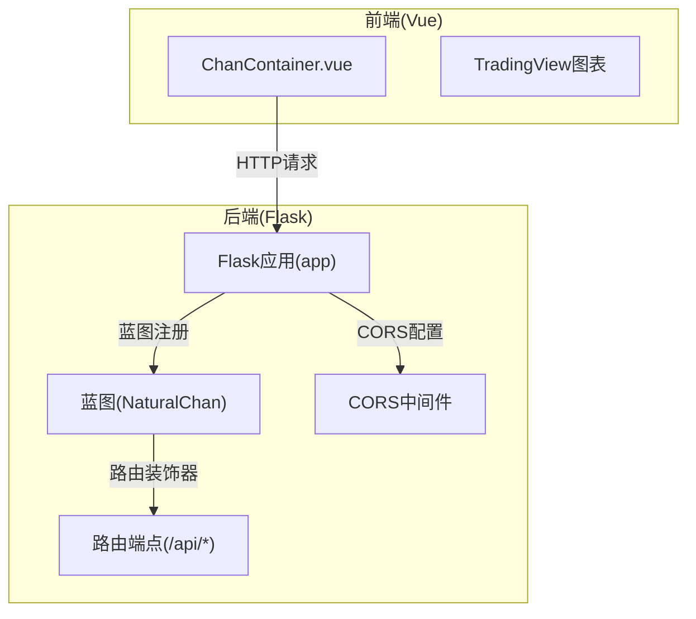
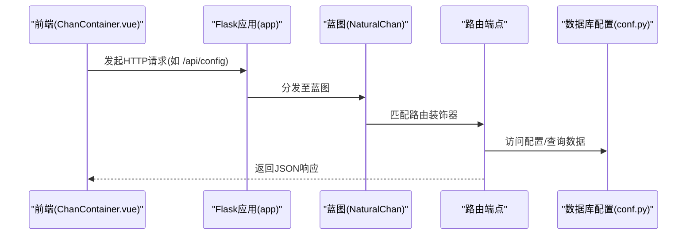
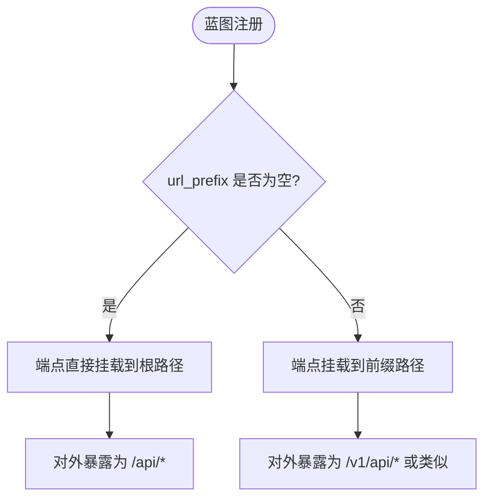
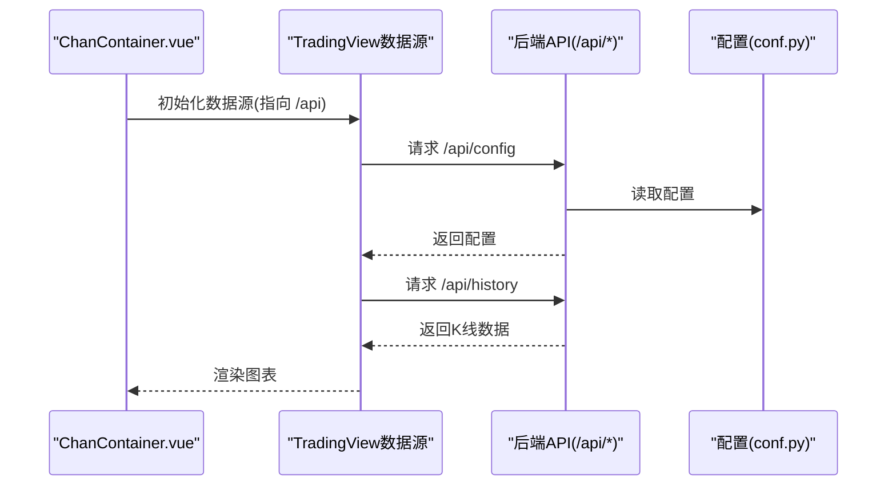
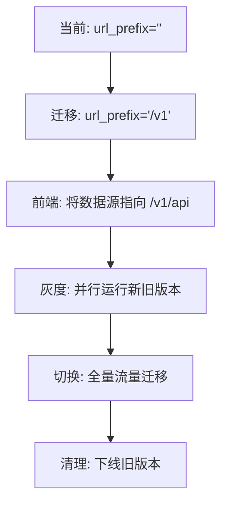
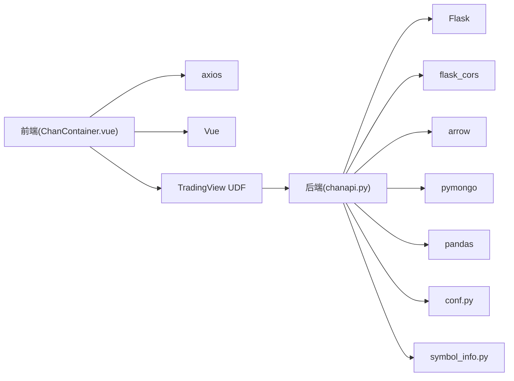

# API蓝图配置与路由注册

<cite>
**本文引用的文件**
- [chanapi.py](file://api/chanapi.py)
- [conf.py](file://comm/conf.py)
- [symbol_info.py](file://api/symbol_info.py)
- [nlchan.py](file://utils/nlchan.py)
- [requirements.txt](file://api/requirements.txt)
- [ChanContainer.vue](file://ui/src/components/ChanContainer.vue)
- [package.json](file://ui/package.json)
- [README.md](file://README.md)
</cite>

## 目录
1. [引言](#引言)
2. [项目结构](#项目结构)
3. [核心组件](#核心组件)
4. [架构总览](#架构总览)
5. [详细组件分析](#详细组件分析)
6. [依赖关系分析](#依赖关系分析)
7. [性能考量](#性能考量)
8. [故障排查指南](#故障排查指南)
9. [结论](#结论)
10. [附录](#附录)

## 引言
本文件围绕Flask Blueprint（NaturalChan）在项目中的初始化与注册机制展开，系统性说明以下要点：
- NaturalChan = Blueprint('NaturalChan', __name__)的命名与模块化设计优势
- app.register_blueprint(NaturalChan, url_prefix='')对API路径暴露的影响，解释为何所有端点直接挂载到根路径
- Blueprint如何实现前后端分离架构中的接口聚合
- 结合CORS配置说明跨域请求处理策略
- 提供启用蓝图前缀版本的迁移建议，以支持多版本API管理

## 项目结构
该项目采用前后端分离架构：
- 后端：基于Flask的API服务，位于api目录，核心文件为chanapi.py
- 前端：基于Vue的可视化界面，位于ui目录，图表数据由TradingView UDF兼容数据源驱动
- 配置与数据：comm/conf.py集中管理数据库连接与常量，symbol_info.py提供支持的交易品种信息

**章节来源**
- [README.md](file://README.md#L107-L137)

## 核心组件
- Flask应用与蓝图
  - 在chanapi.py中创建Flask应用实例，并定义名为NaturalChan的Blueprint
  - 通过app.register_blueprint(NaturalChan, url_prefix='')将蓝图注册到应用根路径
- 路由端点
  - 蓝图下定义了多个/api/*端点，如/api/config、/api/search、/api/symbols、/api/history等
- CORS配置
  - 在本地开发模式下，通过CORS(app, supports_credentials=True)开启跨域支持
- 配置与数据
  - conf.py提供数据库连接、时间周期映射、常量等
  - symbol_info.py生成支持的交易品种列表，供前端搜索与展示

**章节来源**
- [chanapi.py](file://api/chanapi.py#L23-L26)
- [chanapi.py](file://api/chanapi.py#L41-L560)
- [chanapi.py](file://api/chanapi.py#L560-L568)
- [conf.py](file://comm/conf.py#L1-L166)
- [symbol_info.py](file://api/symbol_info.py#L1-L74)

## 架构总览
蓝图机制将API端点按功能模块化组织，便于维护与扩展。注册时使用空前缀，使所有端点直接暴露在应用根路径下，简化了前后端对接。

**图表来源**
- [chanapi.py](file://api/chanapi.py#L23-L26)
- [chanapi.py](file://api/chanapi.py#L41-L560)
- [conf.py](file://comm/conf.py#L143-L158)

**章节来源**
- [chanapi.py](file://api/chanapi.py#L23-L26)
- [chanapi.py](file://api/chanapi.py#L41-L560)
- [conf.py](file://comm/conf.py#L143-L158)

## 详细组件分析

### 蓝图初始化与命名
- 初始化
  - 在chanapi.py中创建Flask应用实例与蓝图实例
  - 蓝图命名采用字符串标识，便于在应用中识别与调试
- 模块化设计优势
  - 将路由端点集中在蓝图内，降低主应用文件复杂度
  - 便于未来拆分为多个蓝图，实现更细粒度的功能划分
  - 有利于单元测试与文档生成

**章节来源**
- [chanapi.py](file://api/chanapi.py#L23-L26)

### 注册机制与url_prefix作用
- 注册位置
  - 在chanapi.py末尾调用app.register_blueprint(NaturalChan, url_prefix='')
- url_prefix=''的效果
  - 将蓝图下的所有路由端点直接挂载到应用根路径
  - 例如：蓝图内的"/api/config"最终暴露为"/api/config"
- 为什么选择根路径
  - 前端图表库(TradingView UDF)约定数据源路径为相对根路径，便于统一管理
  - 便于后续扩展多版本API时，通过不同前缀进行隔离

**图表来源**
- [chanapi.py](file://api/chanapi.py#L560-L560)

**章节来源**
- [chanapi.py](file://api/chanapi.py#L560-L560)

### 蓝图如何实现接口聚合
- 聚合策略
  - 将所有与图表数据相关的端点统一置于NaturalChan蓝图下
  - 前端通过同一数据源URL(如http://127.0.0.1:8421/api)访问，无需关心具体路由细节
- 前后端分离
  - 前端仅需关注数据格式与协议，后端负责数据查询与转换
  - 通过CORS允许来自前端服务器的跨域请求

**章节来源**
- [chanapi.py](file://api/chanapi.py#L41-L560)
- [ChanContainer.vue](file://ui/src/components/ChanContainer.vue#L37-L40)

### CORS配置与跨域请求处理
- 开启方式
  - 在本地开发模式下，通过CORS(app, supports_credentials=True)启用跨域支持
- 适用场景
  - 前端运行在不同端口或域名，需要从后端拉取图表数据
- 注意事项
  - 生产环境建议明确白名单与凭据策略，避免过度宽松

**章节来源**
- [chanapi.py](file://api/chanapi.py#L563-L567)
- [requirements.txt](file://api/requirements.txt#L1-L9)

### 端点一览与职责
- /api/config：返回图表配置信息
- /api/search：根据关键词搜索支持的交易品种
- /api/symbols：根据symbol返回品种详情
- /api/history：按时间周期与时间范围返回K线数据
- /api/time：返回时间戳
- /api/get_bspoint：返回买卖点
- /api/bzxd_mark、/api/bzzs_mark：返回缠论标记点与中枢信息
- /api/get_upper_fx：返回上级别分型区间
- /api/get_ocean_ind、/api/get_mas_ind、/api/get_ma34xd：返回各类技术指标数据

这些端点均通过蓝图装饰器在NaturalChan下声明，注册后直接暴露在根路径。

**章节来源**
- [chanapi.py](file://api/chanapi.py#L41-L560)

### 前端对接与数据流
- 前端组件
  - ChanContainer.vue通过TradingView UDF数据源指向后端根路径
  - 内部大量使用axios向后端/api/*发起请求
- 数据格式
  - 后端返回JSON，前端解析并渲染到图表
- 时区与精度
  - conf.py提供时间周期映射与价格精度等配置，影响前端显示

**图表来源**
- [ChanContainer.vue](file://ui/src/components/ChanContainer.vue#L37-L40)
- [chanapi.py](file://api/chanapi.py#L41-L560)
- [conf.py](file://comm/conf.py#L1-L166)

**章节来源**
- [ChanContainer.vue](file://ui/src/components/ChanContainer.vue#L37-L40)
- [package.json](file://ui/package.json#L1-L50)

### 启用蓝图前缀版本的迁移建议
为支持多版本API管理，建议采用如下步骤：
- 步骤1：为蓝图添加版本前缀
  - 将注册语句改为app.register_blueprint(NaturalChan, url_prefix='/v1')
  - 保持各端点路由不变，对外暴露为/v1/api/*
- 步骤2：前端适配
  - 修改ChanContainer.vue中的数据源URL，指向/v1/api
  - 确保所有axios请求路径同步更新
- 步骤3：灰度发布
  - 先在测试环境验证/v1/api可用性
  - 逐步切换生产流量，保留旧版本一段时间以便回滚
- 步骤4：清理与文档
  - 逐步下线旧版本API
  - 更新接口文档与部署说明

**图表来源**
- [chanapi.py](file://api/chanapi.py#L560-L560)
- [ChanContainer.vue](file://ui/src/components/ChanContainer.vue#L37-L40)

**章节来源**
- [chanapi.py](file://api/chanapi.py#L560-L560)
- [ChanContainer.vue](file://ui/src/components/ChanContainer.vue#L37-L40)

## 依赖关系分析
- 后端依赖
  - Flask：Web框架
  - flask_cors：跨域支持
  - arrow：时间处理
  - pymongo：MongoDB连接
  - pandas：数据处理
- 前端依赖
  - axios：HTTP客户端
  - vue：视图框架
- 配置依赖
  - conf.py提供数据库连接与常量映射
  - symbol_info.py基于conf.py生成支持的交易品种

**图表来源**
- [requirements.txt](file://api/requirements.txt#L1-L9)
- [ChanContainer.vue](file://ui/src/components/ChanContainer.vue#L37-L40)
- [chanapi.py](file://api/chanapi.py#L23-L26)
- [conf.py](file://comm/conf.py#L143-L158)
- [symbol_info.py](file://api/symbol_info.py#L1-L74)

**章节来源**
- [requirements.txt](file://api/requirements.txt#L1-L9)
- [ChanContainer.vue](file://ui/src/components/ChanContainer.vue#L37-L40)
- [chanapi.py](file://api/chanapi.py#L23-L26)
- [conf.py](file://comm/conf.py#L143-L158)
- [symbol_info.py](file://api/symbol_info.py#L1-L74)

## 性能考量
- 数据库查询优化
  - 使用索引与排序字段，减少全表扫描
  - 合理限制返回数据量，避免一次性传输过多K线
- 缓存策略
  - 对热点配置与静态数据可考虑缓存
- 前端渲染
  - 控制请求频率，避免频繁触发历史数据请求
- 版本化管理
  - 通过蓝图前缀实现版本隔离，便于渐进式优化与回滚

[本节为通用指导，不涉及具体文件分析]

## 故障排查指南
- 跨域错误
  - 确认已启用CORS且supports_credentials配置正确
  - 生产环境检查CORS白名单与凭据策略
- 路由404
  - 确认url_prefix是否为空，端点是否在蓝图内声明
  - 检查蓝图是否成功注册到应用
- 数据异常
  - 检查conf.py中的时间周期映射与数据库连接
  - 核对symbol_info.py生成的支持列表是否包含目标品种
- 前端无法加载数据
  - 确认ChanContainer.vue中的数据源URL与后端实际暴露路径一致

**章节来源**
- [chanapi.py](file://api/chanapi.py#L563-L567)
- [chanapi.py](file://api/chanapi.py#L560-L560)
- [conf.py](file://comm/conf.py#L143-L158)
- [symbol_info.py](file://api/symbol_info.py#L1-L74)
- [ChanContainer.vue](file://ui/src/components/ChanContainer.vue#L37-L40)

## 结论
- NaturalChan蓝图通过模块化组织API端点，配合空前缀注册，实现了简洁统一的根路径暴露，满足前端图表库的对接需求
- CORS配置确保了前后端分离场景下的跨域访问
- 通过蓝图前缀版本迁移，可平滑演进多版本API，提升系统的可维护性与可扩展性

[本节为总结性内容，不涉及具体文件分析]

## 附录
- 关键文件定位
  - 后端蓝图与路由：api/chanapi.py
  - 配置与数据库：comm/conf.py
  - 品种信息：api/symbol_info.py
  - 前端图表组件：ui/src/components/ChanContainer.vue
  - 前端依赖：ui/package.json
  - 依赖清单：api/requirements.txt

**章节来源**
- [chanapi.py](file://api/chanapi.py#L23-L26)
- [chanapi.py](file://api/chanapi.py#L41-L560)
- [chanapi.py](file://api/chanapi.py#L560-L568)
- [conf.py](file://comm/conf.py#L1-L166)
- [symbol_info.py](file://api/symbol_info.py#L1-L74)
- [ChanContainer.vue](file://ui/src/components/ChanContainer.vue#L37-L40)
- [package.json](file://ui/package.json#L1-L50)
- [requirements.txt](file://api/requirements.txt#L1-L9)