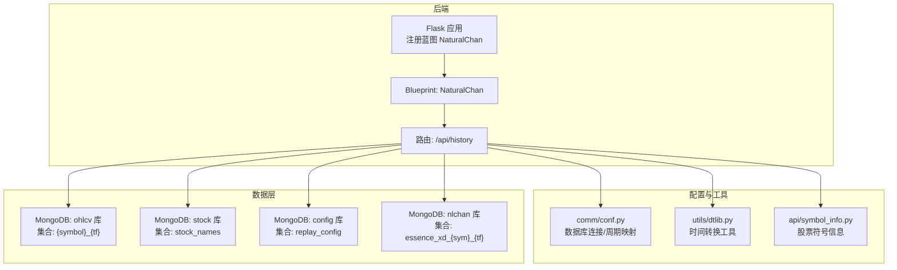
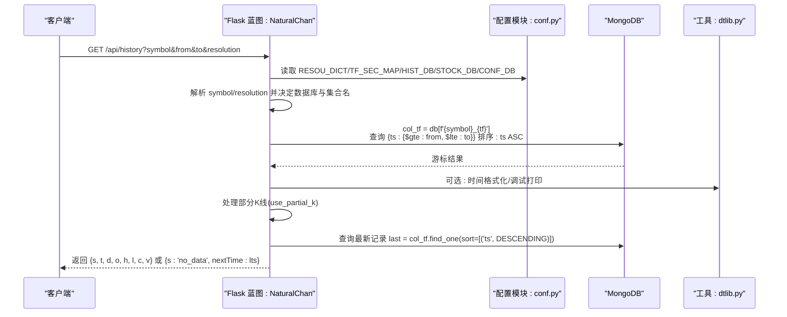
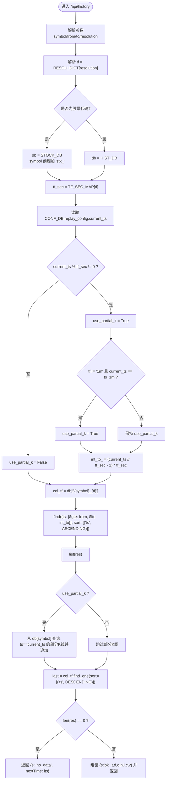
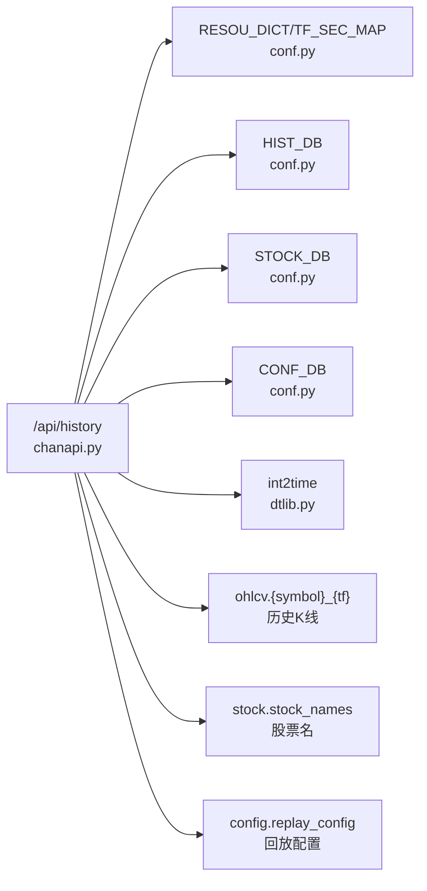

# MongoDB查询构建与执行

<cite>
**本文引用的文件**
- [chanapi.py](file://api/chanapi.py)
- [conf.py](file://comm/conf.py)
- [dtlib.py](file://utils/dtlib.py)
- [symbol_info.py](file://api/symbol_info.py)
- [restore_chanvis_mongo.sh](file://hetl/hmgo/restore_chanvis_mongo.sh)
- [stk_000001.XSHG_1d.metadata.json](file://data/stock/stk_000001.XSHG_1d.metadata.json)
- [essence_xd_000001.XSHG_1d.metadata.json](file://data/nlchan/essence_xd_000001.XSHG_1d.metadata.json)
</cite>

## 目录
1. [简介](#简介)
2. [项目结构](#项目结构)
3. [核心组件](#核心组件)
4. [架构总览](#架构总览)
5. [详细组件分析](#详细组件分析)
6. [依赖关系分析](#依赖关系分析)
7. [性能考量](#性能考量)
8. [故障排查指南](#故障排查指南)
9. [结论](#结论)

## 简介
本文围绕 /api/history 接口中的 MongoDB 查询构建与执行进行深入剖析，重点说明以下内容：
- 基于时间范围的查询条件构造（$gte/$lte）与升序排序（ASCENDING）的组合使用
- col_tf 变量如何根据 symbol 和 tf 动态生成集合名称（例如 'stk_000001.XSHG_1d'）
- 在回放/回测场景下对时间边界与部分K线的处理逻辑
- 查询结果转换为列表后的数据结构形态
- 通过 pprint 与 print 的调试输出定位问题
- last 记录的获取方式及其在返回 no_data 时提供 nextTime 建议值的作用

## 项目结构
后端采用 Flask Blueprint 暴露 /api/* 接口，历史数据接口位于 api/chanapi.py；数据库连接与时间周期映射等配置位于 comm/conf.py；时间转换工具位于 utils/dtlib.py；股票符号信息来源于 api/symbol_info.py；导入示例脚本位于 hetl/hmgo/restore_chanvis_mongo.sh；集合元数据示例位于 data/stock 与 data/nlchan。

图表来源
- [chanapi.py](file://api/chanapi.py#L96-L235)
- [conf.py](file://comm/conf.py#L12-L31)
- [conf.py](file://comm/conf.py#L143-L147)
- [symbol_info.py](file://api/symbol_info.py#L47-L70)

章节来源
- [chanapi.py](file://api/chanapi.py#L96-L235)
- [conf.py](file://comm/conf.py#L12-L31)
- [conf.py](file://comm/conf.py#L143-L147)
- [symbol_info.py](file://api/symbol_info.py#L47-L70)

## 核心组件
- /api/history 接口：接收 symbol、from、to、resolution 参数，解析时间周期，构造集合名，按 ts 范围查询并升序返回
- 配置模块：提供 RESOU_DICT（分辨率到内部周期）、TF_SEC_MAP（周期到秒）、数据库连接对象（HIST_DB/STOCK_DB/CONF_DB）
- 时间工具：提供时间戳与字符串互转，辅助调试打印
- 股票符号：支持股票代码与展示名映射，便于前端展示

章节来源
- [chanapi.py](file://api/chanapi.py#L96-L235)
- [conf.py](file://comm/conf.py#L12-L31)
- [conf.py](file://comm/conf.py#L143-L147)
- [dtlib.py](file://utils/dtlib.py#L148-L163)
- [symbol_info.py](file://api/symbol_info.py#L47-L70)

## 架构总览
/api/history 的整体流程如下：

图表来源
- [chanapi.py](file://api/chanapi.py#L96-L235)
- [conf.py](file://comm/conf.py#L12-L31)
- [conf.py](file://comm/conf.py#L143-L147)
- [dtlib.py](file://utils/dtlib.py#L148-L163)

## 详细组件分析

### 1) 时间范围与排序条件的构建
- 条件构造
  - 使用 ts 字段限定时间范围：{'ts': {'$gte': from_, '$lte': int_to_}}
  - 通过 sort=[('ts', ASCENDING)] 对结果按时间升序排列
- 边界处理
  - 回放/回测场景下，若当前时间 current_ts 不是目标周期 tf 的整数倍，则启用 use_partial_k，并将 int_to_ 回退到上一个周期末尾，避免跨周期截断导致的数据不一致
  - 若小级别到大级别且 current_ts 与 1 分钟周期相等，同样回退一个周期，保证大级别部分K线的正确性

图表来源
- [chanapi.py](file://api/chanapi.py#L96-L235)
- [conf.py](file://comm/conf.py#L12-L31)
- [conf.py](file://comm/conf.py#L143-L147)

章节来源
- [chanapi.py](file://api/chanapi.py#L96-L235)

### 2) col_tf 变量与集合命名规则
- 动态集合名
  - col_tf = db[f'{symbol}_{tf}']
  - symbol 可能被前置 'stk_'（当输入为 6 位数字时视为股票）
  - tf 由 RESOU_DICT 将前端分辨率映射为内部周期
- 示例
  - 股票：symbol=000001.XSHG，resolution=1D → tf=1d → 集合名为 'stk_000001.XSHG_1d'
  - 数字集合元数据示例：data/stock/stk_000001.XSHG_1d.metadata.json
  - 缠论本质集合示例：data/nlchan/essence_xd_000001.XSHG_1d.metadata.json

章节来源
- [chanapi.py](file://api/chanapi.py#L112-L116)
- [chanapi.py](file://api/chanapi.py#L171-L177)
- [stk_000001.XSHG_1d.metadata.json](file://data/stock/stk_000001.XSHG_1d.metadata.json#L1-L1)
- [essence_xd_000001.XSHG_1d.metadata.json](file://data/nlchan/essence_xd_000001.XSHG_1d.metadata.json#L1-L1)

### 3) 查询结果的数据结构形态
- 列表形态
  - res = list(res)，将游标转换为列表，便于后续处理与长度判断
- 返回结构
  - 当存在数据：返回包含 s:'ok' 与多个数组字段的 JSON
    - t: 时间戳数组（每个元素为整型）
    - d: 日期字符串数组（每个元素为字符串）
    - o/h/l/c/v: 开/高/低/收/量数组（每个元素为浮点数）
  - 当无数据：返回 s:'no_data'，并携带 nextTime 建议值（latest timestamp）

章节来源
- [chanapi.py](file://api/chanapi.py#L178-L179)
- [chanapi.py](file://api/chanapi.py#L215-L234)

### 4) 调试输出与可视化
- pprint 输出
  - 在某些接口中使用 pprint(list(res)) 输出查询结果，便于快速查看结构
- print 输出
  - /api/history 中打印了时间范围、结果长度、最新时间戳，以及构造的查询语句字符串，有助于定位边界问题
  - 通过 print(current_ts) 与 print(f'GET DATA: ...') 辅助观察回放/回测时的部分K线追加逻辑

章节来源
- [chanapi.py](file://api/chanapi.py#L178-L179)
- [chanapi.py](file://api/chanapi.py#L212-L214)

### 5) last 记录与 nextTime 建议
- last 获取
  - last = col_tf.find_one(sort=[('ts', DESCENDING)])，获取集合中 ts 最大的记录
  - lts = last['ts']，即最新时间戳
- no_data 场景
  - 当查询结果为空时，返回 {s: 'no_data', nextTime: lts}，向客户端提供继续请求的建议时间点，避免客户端无限重试或跳过未来数据

章节来源
- [chanapi.py](file://api/chanapi.py#L208-L211)
- [chanapi.py](file://api/chanapi.py#L215-L221)

## 依赖关系分析
- /api/history 依赖
  - 配置：RESOU_DICT、TF_SEC_MAP、HIST_DB、STOCK_DB、CONF_DB
  - 工具：时间转换（int2time）
  - 数据：ohlcv 库下的历史集合；stock 库下的 stock_names；config 库下的 replay_config
- 股票支持
  - symbol_info.py 从 STOCK_DB.stock_names 读取股票名称与显示名，用于前端展示与过滤

图表来源
- [chanapi.py](file://api/chanapi.py#L96-L235)
- [conf.py](file://comm/conf.py#L12-L31)
- [conf.py](file://comm/conf.py#L143-L147)
- [dtlib.py](file://utils/dtlib.py#L148-L163)
- [symbol_info.py](file://api/symbol_info.py#L47-L70)

章节来源
- [chanapi.py](file://api/chanapi.py#L96-L235)
- [conf.py](file://comm/conf.py#L12-L31)
- [conf.py](file://comm/conf.py#L143-L147)
- [dtlib.py](file://utils/dtlib.py#L148-L163)
- [symbol_info.py](file://api/symbol_info.py#L47-L70)

## 性能考量
- 索引建议
  - 在集合 {symbol}_{tf} 上为 ts 字段建立升序索引，以加速 $gte/$lte 与排序查询
- 查询优化
  - 控制时间范围大小，避免一次性拉取过多数据
  - 对高频访问的 symbol+tf 组合考虑缓存策略（如 Redis）
- 数据组织
  - 合理划分时间周期集合，避免单集合过大
- 回放/回测
  - 使用 replay_config 控制 current_ts，减少无效扫描

[本节为通用建议，无需特定文件来源]

## 故障排查指南
- 常见问题
  - 无数据返回：检查 symbol 是否为 6 位数字（股票）与 tf 映射是否正确；确认集合是否存在
  - 时间越界：from/to 超过 current_ts 时会被裁剪，注意回测边界
  - 部分K线缺失：use_partial_k 仅在满足条件时追加，确认 replay_config 中 ts_1m 与 ts_{tf} 的值
- 调试手段
  - 使用 print 输出时间范围、长度、最新时间戳
  - 使用 pprint 输出查询结果，核对字段结构
  - 导入示例数据集验证集合命名与字段一致性

章节来源
- [chanapi.py](file://api/chanapi.py#L132-L170)
- [chanapi.py](file://api/chanapi.py#L171-L207)
- [chanapi.py](file://api/chanapi.py#L212-L214)
- [restore_chanvis_mongo.sh](file://hetl/hmgo/restore_chanvis_mongo.sh#L22-L29)

## 结论
/api/history 接口通过 RESOU_DICT 与 TF_SEC_MAP 将前端分辨率映射为内部周期，结合 CONF_DB.replay_config 实现回放/回测场景下的边界控制；通过 ts 范围查询与 ASCENDING 排序，确保数据按时间顺序返回；col_tf 动态集合命名遵循 'symbol_tf' 规则，支持股票与加密货币两类数据源；查询结果转换为列表后按约定字段返回；当无数据时，last 记录的最新时间戳作为 nextTime 建议值，提升客户端体验。配合 pprint/print 调试输出，可快速定位边界与集合命名问题。