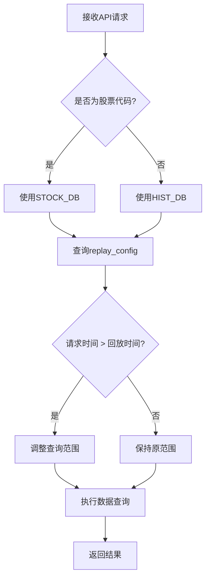
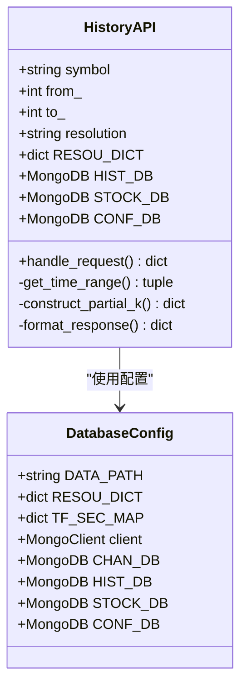

# 历史数据接口实现

<cite>
**本文档引用的文件**
- [chanapi.py](file://api/chanapi.py)
- [conf.py](file://comm/conf.py)
- [symbol_info.py](file://api/symbol_info.py)
- [dtlib.py](file://utils/dtlib.py)
- [nlchan.py](file://utils/nlchan.py)
- [replay_config.metadata.json](file://data/config/replay_config.metadata.json)
- [stock_names.metadata.json](file://data/stock/stock_names.metadata.json)
- [stk_000001.XSHG_1d.metadata.json](file://data/stock/stk_000001.XSHG_1d.metadata.json)
- [essence_xd_000001.XSHG_1d.metadata.json](file://data/nlchan/essence_xd_000001.XSHG_1d.metadata.json)
</cite>

## 目录

1. [引言](#引言)
2. [参数获取与转换逻辑](#参数获取与转换逻辑)
3. [RESOU_DICT映射表的作用](#resou_dict映射表的作用)
4. [数据库动态切换策略](#数据库动态切换策略)
5. [回放控制逻辑分析](#回放控制逻辑分析)
6. [部分K线构造原理](#部分k线构造原理)
7. [MongoDB查询与响应格式化](#mongodb查询与响应格式化)
8. [结论](#结论)

## 引言

`/api/history` 接口是 chanvis 项目中用于获取历史K线数据的核心接口，支持多种时间周期和交易品种。该接口不仅提供基础的历史数据查询功能，还集成了回放控制、部分K线构造等高级特性，以满足实时回测和可视化展示的需求。本文将深入解析该接口的实现机制，重点分析参数处理、数据库切换、回放控制和部分K线构造等关键环节。

## 参数获取与转换逻辑

`/api/history` 接口通过HTTP GET请求接收symbol、from、to和resolution四个核心参数。这些参数的获取和转换逻辑在`chanapi.py`文件中实现。

接口首先从请求参数中提取symbol、from、to和resolution的值，并进行基本的类型转换。其中，from和to参数被转换为整型时间戳，用于后续的时间范围查询。symbol参数用于标识具体的交易品种，而resolution参数则表示所需的时间周期。

**参数处理流程如下：**
1. 从`request.args`中获取原始参数值
2. 对from和to参数执行`int()`转换
3. 将resolution参数作为键在RESOU_DICT映射表中查找对应的内部时间周期标识

这种设计使得接口能够灵活地处理前端传入的各种时间周期表示方式，同时保持内部处理逻辑的一致性。

**本节来源**
- [chanapi.py](file://api/chanapi.py#L102-L105)

## RESOU_DICT映射表的作用

RESOU_DICT映射表在时间周期转换中扮演着关键角色，它定义了前端使用的时间周期表示与后端内部标识之间的映射关系。

该映射表在`comm/conf.py`文件中定义，其结构为一个字典，将前端常用的数字或缩写形式（如"1"、"5"、"1D"）映射到更具描述性的内部标识（如"1m"、"5m"、"1d"）。这种设计实现了前后端时间周期表示的解耦，使得前端可以使用用户友好的表示方式，而后端则可以使用统一的内部标识进行处理。

例如，当resolution参数为"1"时，通过RESOU_DICT["1"]可以得到"1m"，表示1分钟周期；当resolution为"1D"时，对应"1d"，表示日线周期。这种映射机制不仅提高了代码的可读性，还便于未来扩展新的时间周期类型。

**本节来源**
- [conf.py](file://comm/conf.py#L12-L20)

## 数据库动态切换策略

系统实现了STOCK_DB与HIST_DB数据库的动态切换策略，以支持不同类型的交易品种数据存储。

在`chanapi.py`文件中，接口通过正则表达式`re.match(r'\d{6}', symbol)`判断symbol参数是否为六位数字格式，以此识别股票代码。如果匹配成功，则将数据库连接切换到STOCK_DB；否则使用默认的HIST_DB。

这种设计基于以下考虑：
- 股票数据通常以六位数字代码表示（如000001）
- 加密货币等其他交易品种使用字母符号表示（如BTC）
- 不同类型的数据可能存储在不同的数据库中，便于管理和维护

数据库连接对象在`comm/conf.py`中通过MongoClient初始化，分别指向不同的MongoDB数据库实例。这种分离的存储策略有助于优化数据访问性能，并为不同类型的数据提供独立的管理机制。

**本节来源**
- [chanapi.py](file://api/chanapi.py#L112-L115)
- [conf.py](file://comm/conf.py#L143-L147)

## 回放控制逻辑分析

回放控制逻辑通过replay_config配置实现，用于限制数据查询范围，确保可视化时间轴的一致性。

系统在`conf.py`中定义了CONF_DB配置数据库，其中包含replay_config集合。当调用`/api/history`接口时，首先会更新replay_config集合中的current_symbol和current_tf字段，记录当前操作的交易品种和时间周期。

关键的控制逻辑在于对to_和from_参数的调整：系统会查询replay_config集合中对应时间周期的ts_字段值作为当前回放时间点。如果请求的to_或from_时间戳超过这个回放时间点，则将to_设置为回放时间点，并相应调整from_，确保查询范围不会超出当前回放进度。

这种机制保证了在回放模式下，用户只能查看到当前回放时间点之前的数据，从而维持了时间轴的一致性和回测的真实性。

**图表来源**
- [chanapi.py](file://api/chanapi.py#L126-L145)

**本节来源**
- [chanapi.py](file://api/chanapi.py#L126-L145)
- [conf.py](file://comm/conf.py#L147)

## 部分K线构造原理

部分K线（partial_k）的构造是实现实时回测效果的关键技术，它在`chanapi.py`文件中实现。

当系统检测到当前回放时间点不正好落在时间周期边界上时（即`current_ts % tf_sec != 0`），会启用部分K线构造逻辑。这种情况下，当前周期的K线尚未完成，但需要向用户展示部分数据以实现"实时"效果。

部分K线的构造过程如下：
1. 设置`use_partial_k = True`标志
2. 调整`int_to_`时间戳，使其指向已完成的最后一个完整周期
3. 从基础数据集合中查询当前时间点的记录
4. 提取该记录中预计算的部分K线字段（如partial_open_、partial_high_等）
5. 将这些部分值构造成一条新的K线数据并添加到结果集中

这种设计使得系统能够准确反映未完成周期的实时状态，为用户提供更真实的回测体验。部分K线的数据在数据预处理阶段就已经计算并存储，确保了查询效率。

**本节来源**
- [chanapi.py](file://api/chanapi.py#L155-L207)

## MongoDB查询与响应格式化

MongoDB查询条件的构建和响应数据的格式化是接口实现的重要环节。

查询条件构建方面，系统使用`col_tf.find()`方法，构造包含`$gte`和`$lte`操作符的时间范围查询条件。查询结果按时间戳升序排列，确保数据的时序正确性。

响应数据格式化遵循TradingView API规范，将查询结果转换为包含's'、't'、'o'、'h'、'l'、'c'、'v'等字段的对象。其中：
- 's'表示状态（'ok'或'no_data'）
- 't'为时间戳数组
- 'o'、'h'、'l'、'c'、'v'分别为开盘价、最高价、最低价、收盘价和成交量数组

当查询结果为空时，系统返回's'为'no_data'的特殊响应，并包含最新的时间戳信息，便于前端处理无数据情况。

**图表来源**
- [chanapi.py](file://api/chanapi.py#L173-L234)

**本节来源**
- [chanapi.py](file://api/chanapi.py#L173-L234)

## 结论

`/api/history`接口通过精心设计的参数处理、映射表转换、数据库切换、回放控制和部分K线构造等机制，实现了功能丰富且高效的历史数据查询服务。RESOU_DICT映射表提供了前后端时间周期表示的桥梁，数据库动态切换策略支持了多类型交易品种的存储需求，而回放控制逻辑和部分K线构造则确保了实时回测的真实性和一致性。整个实现体现了良好的架构设计和对用户体验的深入理解，为缠论分析系统的稳定运行提供了坚实的基础。