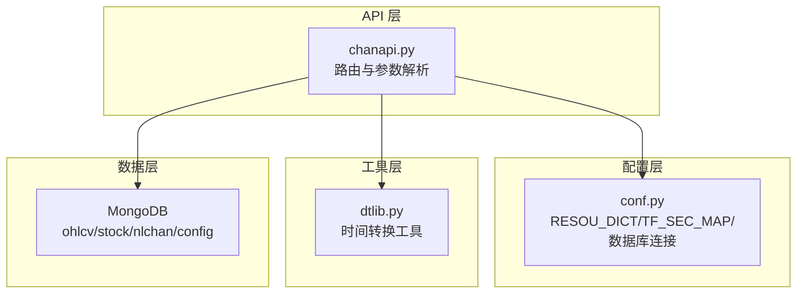
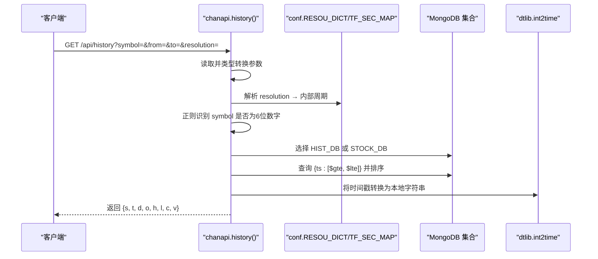
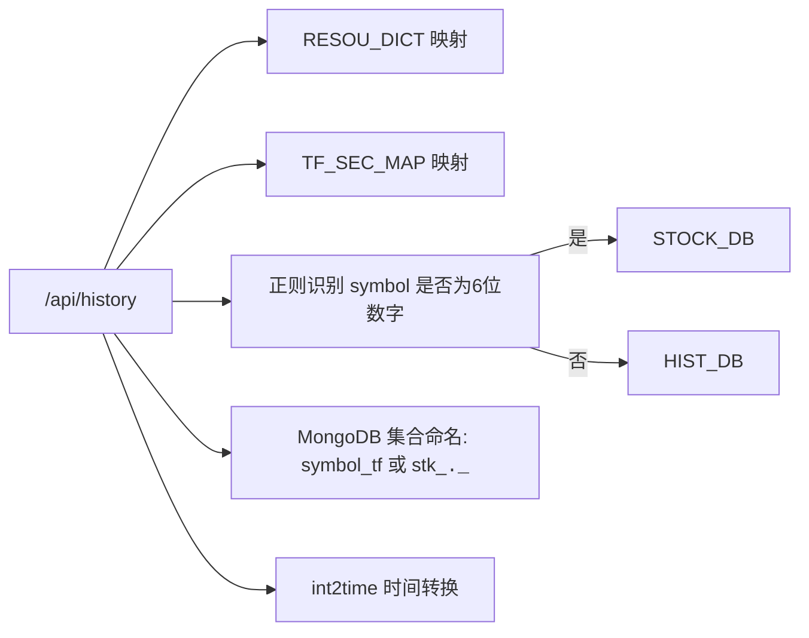

# 参数解析与转换机制

<cite>
**本文引用的文件**
- [api/chanapi.py](file://api/chanapi.py)
- [comm/conf.py](file://comm/conf.py)
- [api/symbol_info.py](file://api/symbol_info.py)
- [utils/dtlib.py](file://utils/dtlib.py)
- [data/stock/stk_000001.XSHG_1d.metadata.json](file://data/stock/stk_000001.XSHG_1d.metadata.json)
- [data/nlchan/essence_xd_000001.XSHG_1d.metadata.json](file://data/nlchan/essence_xd_000001.XSHG_1d.metadata.json)
- [data/stock/stock_names.metadata.json](file://data/stock/stock_names.metadata.json)
</cite>

## 目录
1. [简介](#简介)
2. [项目结构](#项目结构)
3. [核心组件](#核心组件)
4. [架构总览](#架构总览)
5. [详细组件分析](#详细组件分析)
6. [依赖关系分析](#依赖关系分析)
7. [性能考量](#性能考量)
8. [故障排查指南](#故障排查指南)
9. [结论](#结论)

## 简介
本文围绕 /api/history 接口的四个核心参数 symbol、from、to、resolution 的提取与类型转换展开，重点说明：
- 如何通过 request.args 安全提取参数并进行类型校验
- RESOU_DICT 在时间周期映射（如“1D”→“1440”）中的关键作用
- 正则表达式 re.match 对 6 位数字股票代码的识别逻辑
- 由此触发的数据库切换机制（HIST_DB → STOCK_DB）
- symbol 前缀“stk_”的添加规则及其在数据存储结构中的意义

## 项目结构
本项目采用分层组织：API 层负责路由与参数解析，配置层提供数据库连接与映射表，工具层提供时间转换辅助函数，数据层包含 MongoDB 中的历史数据集合。

图表来源
- [api/chanapi.py](file://api/chanapi.py#L96-L235)
- [comm/conf.py](file://comm/conf.py#L12-L31)
- [utils/dtlib.py](file://utils/dtlib.py#L148-L164)

章节来源
- [api/chanapi.py](file://api/chanapi.py#L96-L235)
- [comm/conf.py](file://comm/conf.py#L12-L31)
- [utils/dtlib.py](file://utils/dtlib.py#L148-L164)

## 核心组件
- /api/history 接口：统一入口，负责参数提取、类型转换、周期映射、数据库选择、查询与返回。
- 配置映射 RESOU_DICT：将前端传入的分辨率字符串映射为内部周期标识。
- TF_SEC_MAP：将内部周期映射为秒数，用于回放/回测的时间步长计算。
- 正则识别：通过 re.match(r'\d{6}') 判断是否为 6 位数字股票代码。
- 数据库选择：若为股票代码，则切换至 STOCK_DB，并对 symbol 前缀添加“stk_”。

章节来源
- [api/chanapi.py](file://api/chanapi.py#L96-L235)
- [comm/conf.py](file://comm/conf.py#L12-L31)

## 架构总览
/api/history 的执行流程如下：

图表来源
- [api/chanapi.py](file://api/chanapi.py#L96-L235)
- [comm/conf.py](file://comm/conf.py#L12-L31)
- [utils/dtlib.py](file://utils/dtlib.py#L148-L164)

## 详细组件分析

### 参数提取与类型校验
- symbol：从 request.args.get('symbol', 'BTC') 获取，默认值为“BTC”。该值在后续用于数据库集合命名与股票识别。
- from：从 request.args.get('from', None) 获取后直接转换为整型。注意：此处未显式校验空值，若 from 为空将导致转换异常。
- to：从 request.args.get('to', None) 获取后直接转换为整型。同样未显式校验空值。
- resolution：从 request.args.get('resolution', 'D') 获取，默认值为“D”。随后通过 RESOU_DICT 映射为内部周期标识。

类型转换与默认值策略：
- from/to：直接 int() 转换，无显式空值检查。建议在生产环境增加非空校验与异常捕获。
- resolution：先映射为内部周期，再在后续分支中按“D/1D/W”或数值进行二次处理。

章节来源
- [api/chanapi.py](file://api/chanapi.py#L102-L105)

### 分辨率映射 RESOU_DICT 的作用
- RESOU_DICT 将前端分辨率字符串映射为内部周期标识，例如：
  - "1" → "1m"
  - "5" → "5m"
  - "15" → "15m"
  - "30" → "30m"
  - "60" → "1h"
  - "240" → "4h"
  - "1D" → "1d"
  - "1W" → "1w"
- 在 /api/history 中，resolution 经过 RESOU_DICT 映射后得到 tf，用于后续集合命名与查询。

章节来源
- [comm/conf.py](file://comm/conf.py#L12-L20)
- [api/chanapi.py](file://api/chanapi.py#L107-L107)

### 时间周期到秒数映射 TF_SEC_MAP
- TF_SEC_MAP 将内部周期映射为秒数，用于计算时间步长与回放边界：
  - '1m' → 60 秒
  - '5m' → 300 秒
  - '30m' → 1800 秒
  - '1h' → 3600 秒
  - '4h' → 14400 秒
  - '1d' → 86400 秒
  - '1w' → 604800 秒
- 在 /api/history 中，tf 由 RESOU_DICT 得到后，再通过 TF_SEC_MAP 转换为 tf_sec，用于回放控制与部分 K 线处理。

章节来源
- [comm/conf.py](file://comm/conf.py#L23-L31)
- [api/chanapi.py](file://api/chanapi.py#L150-L151)

### 股票代码识别与数据库切换
- 识别逻辑：使用正则 re.match(r'\d{6}') 判断 symbol 是否为 6 位数字。
- 切换机制：
  - 若匹配成功：db 切换为 STOCK_DB，同时将 symbol 前缀加上“stk_”，形成集合名“stk_<code>_<tf>”。
  - 若不匹配：db 保持为 HIST_DB，集合名为“<symbol>_<tf>”。

该逻辑确保了历史数据查询在不同数据源之间正确路由。

章节来源
- [api/chanapi.py](file://api/chanapi.py#L112-L116)

### symbol 前缀“stk_”的添加规则与存储意义
- 添加规则：当识别到股票代码（6 位数字）时，在 symbol 前添加“stk_”。
- 存储意义：数据集合命名规范要求所有股票数据集合均以“stk_”开头，便于区分与检索。例如：
  - 集合名示例：stk_000001.XSHG_1d
  - 该命名在数据层 metadata 中可见，表明集合类型为“collection”。

章节来源
- [api/chanapi.py](file://api/chanapi.py#L115-L115)
- [data/stock/stk_000001.XSHG_1d.metadata.json](file://data/stock/stk_000001.XSHG_1d.metadata.json#L1-L1)

### 回放与部分 K 线处理
- 回放配置：通过 CONF_DB.replay_config 更新当前 symbol 与 current_tf，并读取 current_ts。
- 边界约束：若 from/to 超过 current_ts，则将其裁剪至不超过 current_ts，并按 tf_sec 计算窗口大小。
- 部分 K 线：当满足特定条件（如当前周期未整除或从 1 分钟到更高周期时），会额外查询 partial_* 字段并拼接到结果末尾，保证回测一致性。

章节来源
- [api/chanapi.py](file://api/chanapi.py#L126-L170)

### 时间戳到本地字符串转换
- 使用 utils/dtlib.int2time 将时间戳转换为本地字符串，用于响应中的 datetime 字段。

章节来源
- [utils/dtlib.py](file://utils/dtlib.py#L148-L164)
- [api/chanapi.py](file://api/chanapi.py#L147-L148)

### 数据库存储结构与集合命名
- 历史数据集合命名规则：
  - 非股票：symbol_tf（如 btc_1d）
  - 股票：stk_<code>.<exchange>_<tf>（如 stk_000001.XSHG_1d）
- 集合类型：collection，包含索引等元信息，用于高效查询与管理。

章节来源
- [api/chanapi.py](file://api/chanapi.py#L171-L171)
- [data/stock/stk_000001.XSHG_1d.metadata.json](file://data/stock/stk_000001.XSHG_1d.metadata.json#L1-L1)
- [data/nlchan/essence_xd_000001.XSHG_1d.metadata.json](file://data/nlchan/essence_xd_000001.XSHG_1d.metadata.json#L1-L1)

## 依赖关系分析

图表来源
- [api/chanapi.py](file://api/chanapi.py#L96-L235)
- [comm/conf.py](file://comm/conf.py#L12-L31)
- [utils/dtlib.py](file://utils/dtlib.py#L148-L164)

章节来源
- [api/chanapi.py](file://api/chanapi.py#L96-L235)
- [comm/conf.py](file://comm/conf.py#L12-L31)
- [utils/dtlib.py](file://utils/dtlib.py#L148-L164)

## 性能考量
- 查询范围：通过 {ts: {$gte: from, $lte: to}} 进行范围查询，建议确保 ts 字段建立索引以提升查询效率。
- 部分 K 线拼接：仅在回放场景下启用，避免对常规查询造成额外开销。
- 时间转换：int2time 为本地化显示，不影响查询性能，但应避免在高频请求中重复转换大量数据。

[本节为通用性能建议，不直接分析具体文件]

## 故障排查指南
- 参数为空导致转换异常
  - 现象：from/to 为空时直接 int() 转换会抛出异常。
  - 建议：在接口入口增加非空校验与异常捕获，返回明确错误码。
  - 参考位置：[api/chanapi.py](file://api/chanapi.py#L103-L104)
- 股票代码识别失败
  - 现象：symbol 不是 6 位数字时不会切换到 STOCK_DB。
  - 建议：确认 symbol 输入格式与交易所后缀是否正确。
  - 参考位置：[api/chanapi.py](file://api/chanapi.py#L112-L116)
- 集合不存在
  - 现象：STOCK_DB 中缺少“stk_<code>.<exchange>_<tf>”集合时查询失败。
  - 建议：确认数据导入完成且集合命名符合规范。
  - 参考位置：[api/chanapi.py](file://api/chanapi.py#L171-L171)
- 回放边界异常
  - 现象：from/to 超过 current_ts 时被裁剪，可能导致数据不足。
  - 建议：检查 CONF_DB.replay_config 中 current_ts 与 ts_tf 字段是否正确更新。
  - 参考位置：[api/chanapi.py](file://api/chanapi.py#L126-L146)

章节来源
- [api/chanapi.py](file://api/chanapi.py#L103-L104)
- [api/chanapi.py](file://api/chanapi.py#L112-L116)
- [api/chanapi.py](file://api/chanapi.py#L171-L171)
- [api/chanapi.py](file://api/chanapi.py#L126-L146)

## 结论
/api/history 的参数解析与转换机制围绕以下要点展开：
- 通过 request.args 提取并进行基本类型转换，建议补充非空校验。
- RESOU_DICT 将前端分辨率映射为内部周期，TF_SEC_MAP 将周期映射为秒数，支撑回放与边界控制。
- re.match(r'\d{6}') 识别 6 位数字股票代码，触发数据库切换与 symbol 前缀“stk_”添加，确保集合命名规范与数据路由正确。
- 集合命名规则清晰，STOCK_DB 与 HIST_DB 的区分使得历史数据查询具备良好的扩展性与可维护性。

[本节为总结性内容，不直接分析具体文件]