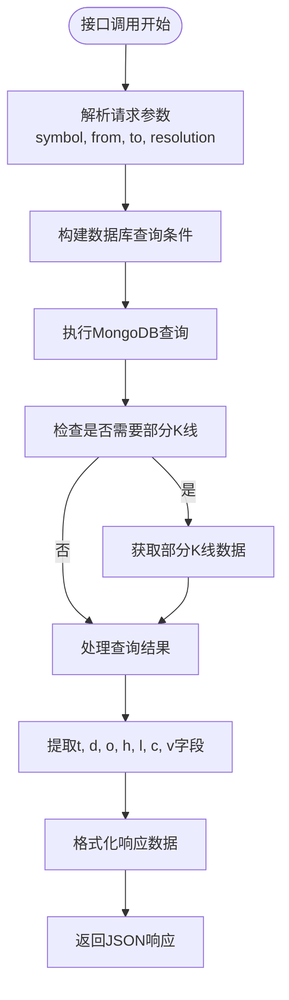
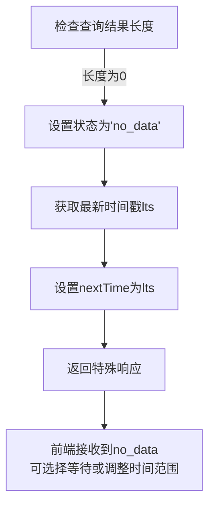

# 响应数据格式化机制

<cite>
**本文档引用文件**  
- [chanapi.py](file://api/chanapi.py)
- [conf.py](file://comm/conf.py)
- [dtlib.py](file://utils/dtlib.py)
</cite>

## 目录
1. [接口概述](#接口概述)
2. [数据字段生成逻辑](#数据字段生成逻辑)
3. [空数据处理机制](#空数据处理机制)
4. [数据类型保障](#数据类型保障)
5. [实际响应示例](#实际响应示例)

## 接口概述

`/api/history` 接口负责为TradingView图表库提供历史K线数据，遵循TradingView要求的响应结构。该接口接收symbol（交易对）、from（起始时间戳）、to（结束时间戳）和resolution（时间周期）等参数，从MongoDB数据库中查询相应的历史数据，并将其格式化为TradingView可识别的格式。

**Section sources**
- [chanapi.py](file://api/chanapi.py#L96-L234)

## 数据字段生成逻辑

接口响应包含多个关键字段，其生成逻辑如下：

- **'s' 字段**：表示请求状态，正常情况下为"ok"，当无数据时为"no_data"
- **'t' 字段**：时间戳数组，由查询结果中的'ts'字段提取并转换为整数
- **'d' 字段**：日期时间数组，由查询结果中的'datetime'字段提取
- **'o' 字段**：开盘价数组，由查询结果中的'open'字段提取
- **'h' 字段**：最高价数组，由查询结果中的'high'字段提取
- **'l' 字段**：最低价数组，由查询结果中的'low'字段提取
- **'c' 字段**：收盘价数组，由查询结果中的'close'字段提取
- **'v' 字段**：成交量数组，由查询结果中的'volume'字段提取

这些字段通过列表推导式从数据库查询结果中提取并构造成数组形式，确保数据的连续性和完整性。



**Diagram sources**
- [chanapi.py](file://api/chanapi.py#L173-L232)

**Section sources**
- [chanapi.py](file://api/chanapi.py#L225-L231)

## 空数据处理机制

当查询结果为空时，系统会返回特殊的状态码和建议的nextTime值以优化前端体验：



系统首先检查查询结果的长度，当长度为0时，会从数据库中获取最新的时间戳（lts），并将此值作为nextTime返回。这样前端可以利用这个时间戳进行后续的增量数据请求，避免重复请求无效的时间范围。

**Diagram sources**
- [chanapi.py](file://api/chanapi.py#L215-L221)

**Section sources**
- [chanapi.py](file://api/chanapi.py#L215-L221)

## 数据类型保障

系统通过多种机制确保数据类型的准确性：

- **时间戳**：使用`int()`函数确保时间戳为整数类型
- **价格数据**：在数据预处理阶段已确保为浮点数类型
- **成交量**：确保为数值类型

在`utils/dtlib.py`中定义的`int2time`函数确保了时间格式的统一性，而数据库查询结果中的数值字段在存储时已确保为正确的数据类型。

**Section sources**
- [dtlib.py](file://utils/dtlib.py#L148-L154)
- [chanapi.py](file://api/chanapi.py#L225-L231)

## 实际响应示例

一个典型的成功响应示例如下：

```json
{
  "s": "ok",
  "t": [1635724800, 1635724860, 1635724920],
  "d": ["2021-11-01 08:00:00", "2021-11-01 08:01:00", "2021-11-01 08:02:00"],
  "o": [63000.0, 63050.0, 63100.0],
  "h": [63150.0, 63200.0, 63250.0],
  "l": [62950.0, 63000.0, 63050.0],
  "c": [63100.0, 63150.0, 63200.0],
  "v": [100.5, 120.3, 95.7]
}
```

当没有数据时，响应如下：

```json
{
  "s": "no_data",
  "nextTime": 1635724800
}
```

这些响应格式完全符合TradingView的要求，确保了前端图表的正常显示和交互。

**Section sources**
- [chanapi.py](file://api/chanapi.py#L223-L232)