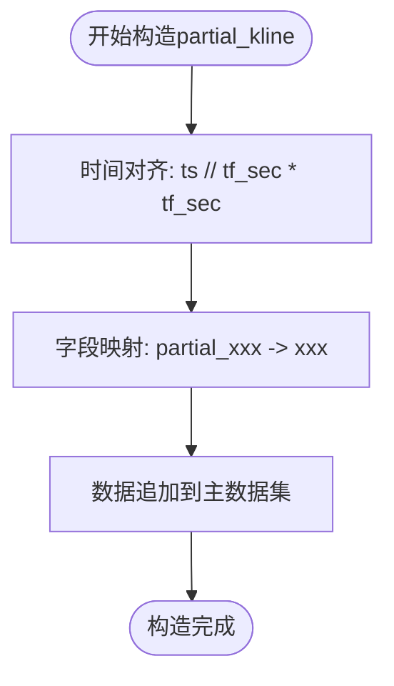

# 部分K线（Partial K-Line）构造原理

<cite>
**本文档引用的文件**   
- [chanapi.py](file://api/chanapi.py)
- [conf.py](file://comm/conf.py)
- [dtlib.py](file://utils/dtlib.py)
</cite>

## 目录
1. [引言](#引言)
2. [use_partial_k标志位的判定条件](#use_partial_k标志位的判定条件)
3. [部分K线数据查询机制](#部分K线数据查询机制)
4. [partial_kline对象的构造过程](#partial_kline对象的构造过程)
5. [实时回测中的逐K线推进机制](#实时回测中的逐K线推进机制)
6. [结论](#结论)

## 引言
本系统基于TradingView本地SDK构建，专为缠论量化研究设计。系统核心功能之一是实现精确的实时回测，其中部分K线（Partial K-Line）构造机制是实现"逐K线推进"效果的关键。该机制通过use_partial_k标志位控制，在回测过程中动态生成未完成周期的部分K线数据，确保分析的实时性和准确性。

## use_partial_k标志位的判定条件

use_partial_k标志位的判定基于两个核心条件：当前时间戳（current_ts）与时间周期秒数（tf_sec）的整除关系，以及跨周期同步机制。

第一个判定条件是`current_ts % tf_sec != 0`，即当前时间戳不能被时间周期秒数整除。这表示当前周期尚未结束，存在部分K线数据。例如，对于1440分钟（1天）的周期，如果当前时间戳不是1440的整数倍，则说明当天的K线数据仍在形成中。

第二个判定条件是跨周期同步机制，当从小级别到大级别时，小级别的1分钟数据刚好走到大级别的整数周期。具体实现为：`tf != '1m' and current_ts == ts_1m`。这表示当查询的不是1分钟周期，且当前时间戳等于1分钟级别的时间戳时，需要使用部分K线数据。这种机制确保了不同时间周期之间的数据同步。

**Diagram sources**
- [chanapi.py](file://api/chanapi.py#L155-L164)

**Section sources**
- [chanapi.py](file://api/chanapi.py#L155-L164)

## 部分K线数据查询机制

当use_partial_k为True时，系统从基础symbol集合中查询包含partial_open_1440等字段的实时聚合数据。查询过程首先定位到基础数据集合`db[f'{symbol}']`，然后根据当前时间戳和时间周期构建查询条件。

系统查询的字段包括partial_open_{tf}、partial_high_{tf}、partial_low_{tf}、partial_close_{tf}和partial_volume_{tf}，其中{tf}是时间周期标识符。这些字段存储了从周期开始到当前时间的实时聚合值，如从当天0点到当前时间的最高价、最低价等。

查询的关键是精确匹配当前时间戳`{'ts': {'$eq': current_ts}}`，确保获取的是最新的实时数据。这种设计使得系统能够获取到精确到秒的实时市场数据，为实时回测提供数据支持。

**Diagram sources**
- [chanapi.py](file://api/chanapi.py#L186-L196)

**Section sources**
- [chanapi.py](file://api/chanapi.py#L186-L196)

## partial_kline对象的构造过程

partial_kline对象的构造过程包含三个关键步骤：时间对齐、字段映射和数据追加。

首先是时间对齐，通过`one_k['ts'] // tf_sec * tf_sec`将时间戳向下取整到周期边界。例如，对于1440分钟的周期，任何在当天的时间戳都会被对齐到当天0点的时间戳。这确保了部分K线与完整K线在时间轴上对齐。

其次是字段映射，系统将partial字段映射到标准K线字段。通过循环处理open、high、low、close和volume五个字段，将`partial_{_c}_{tf}`的值赋给`partial_kline[_c]`。这种映射保持了数据结构的一致性，使得部分K线可以无缝集成到主数据集中。

最后是数据追加，构造完成的partial_kline对象被追加到主数据集`res`中。这个过程确保了返回的数据既包含历史完整K线，又包含最新的部分K线，实现了数据的完整性和实时性。

**Diagram sources**
- [chanapi.py](file://api/chanapi.py#L199-L206)

**Section sources**
- [chanapi.py](file://api/chanapi.py#L199-L206)

## 实时回测中的逐K线推进机制

部分K线构造机制在实现实时回测的"逐K线推进"效果中起着关键作用。当系统进行回测时，通过replay_config集合中的current_ts字段控制回放进度。每次回放前进一个K线周期，系统根据新的current_ts重新计算use_partial_k标志位。

这种机制使得回测过程能够精确模拟真实交易环境。当回测推进到一个新的周期时，系统首先返回该周期之前的所有完整K线，然后根据use_partial_k的判定结果决定是否返回部分K线。这确保了回测过程中的数据分析与实时市场分析保持一致。

跨周期同步机制进一步增强了回测的准确性。当1分钟级别的回测推进时，所有更高级别的周期（如5分钟、15分钟、日线等）都会相应更新，但只显示到当前1分钟数据对应的部分K线。这种设计避免了未来数据泄露，保证了回测结果的可靠性。

**Diagram sources**
- [chanapi.py](file://api/chanapi.py#L125-L130)
- [chanapi.py](file://api/chanapi.py#L185-L207)

**Section sources**
- [chanapi.py](file://api/chanapi.py#L125-L130)
- [chanapi.py](file://api/chanapi.py#L185-L207)

## 结论
部分K线构造机制是本系统实现实时回测的核心技术。通过use_partial_k标志位的精确判定、基础symbol集合的实时数据查询、partial_kline对象的规范构造，系统成功实现了"逐K线推进"的回测效果。这一机制不仅保证了回测的准确性，还确保了回测过程与实时分析的一致性，为缠论量化研究提供了可靠的技术支持。