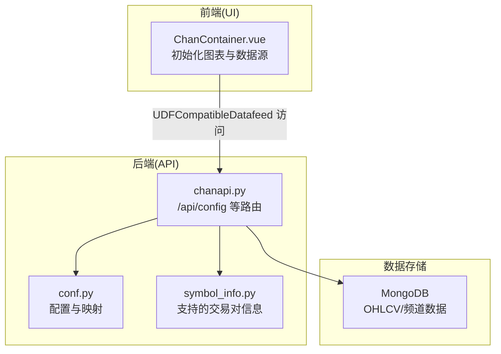
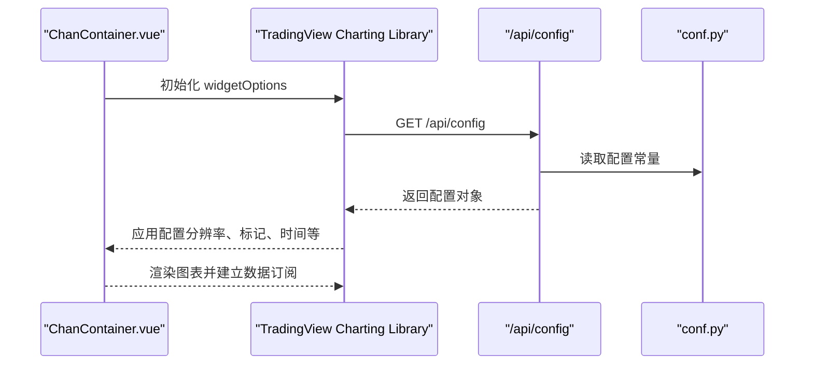
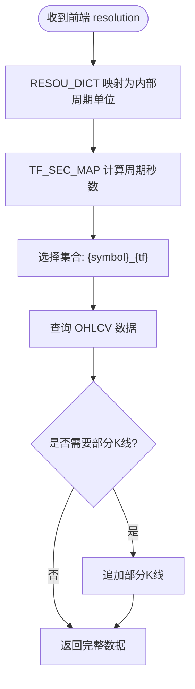
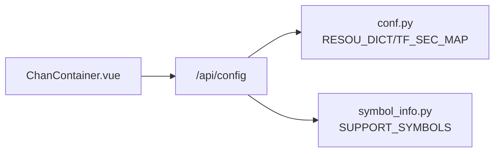

# /api/config 接口实现

<cite>
**本文引用的文件**
- [api/chanapi.py](file://api/chanapi.py)
- [comm/conf.py](file://comm/conf.py)
- [api/symbol_info.py](file://api/symbol_info.py)
- [ui/src/components/ChanContainer.vue](file://ui/src/components/ChanContainer.vue)
- [ui/CLAUDE.md](file://ui/CLAUDE.md)
</cite>

## 目录
1. [简介](#简介)
2. [项目结构](#项目结构)
3. [核心组件](#核心组件)
4. [架构总览](#架构总览)
5. [详细组件分析](#详细组件分析)
6. [依赖关系分析](#依赖关系分析)
7. [性能考量](#性能考量)
8. [故障排查指南](#故障排查指南)
9. [结论](#结论)
10. [附录](#附录)

## 简介
本文件聚焦于 /api/config 接口的实现与技术规范，系统性说明其返回的 TradingView SDK 所需配置参数（如 supports_search、supported_resolutions、supports_time 等），阐述该接口在系统初始化阶段的作用、如何影响前端图表行为模式，以及各字段的业务含义。结合代码中 supported_resolutions 支持的分辨率列表 ['1', '5', '30', '240', '1D', '1W', '1M']，解释时间周期映射机制。同时提供新增配置项（如自定义标记支持）的扩展范例路径，并说明如何通过 conf.py 进行动态配置注入。

## 项目结构
- 后端服务位于 api/chanapi.py，提供 /api/config 等接口。
- 配置与常量集中于 comm/conf.py，包含时间周期映射、数据库连接等。
- 前端基于 TradingView Charting Library，通过 UDFCompatibleDatafeed 访问后端接口。
- UI 层在 ui/src/components/ChanContainer.vue 中初始化图表并消费 /api/config 返回的配置。

**图表来源**
- [api/chanapi.py](file://api/chanapi.py#L41-L58)
- [comm/conf.py](file://comm/conf.py#L12-L31)
- [api/symbol_info.py](file://api/symbol_info.py#L1-L74)
- [ui/src/components/ChanContainer.vue](file://ui/src/components/ChanContainer.vue#L79-L128)

**章节来源**
- [api/chanapi.py](file://api/chanapi.py#L41-L58)
- [comm/conf.py](file://comm/conf.py#L12-L31)
- [api/symbol_info.py](file://api/symbol_info.py#L1-L74)
- [ui/src/components/ChanContainer.vue](file://ui/src/components/ChanContainer.vue#L79-L128)

## 核心组件
- /api/config 接口：返回 TradingView SDK 初始化所需的配置对象，包括搜索能力、支持的分辨率、时间轴标记等。
- conf.py：提供 RESOU_DICT（分辨率字符串到内部周期单位的映射）、TF_SEC_MAP（周期单位到秒的映射）等。
- symbol_info.py：提供 SUPPORT_SYMBOLS，用于前端搜索与符号信息展示。
- ChanContainer.vue：前端图表初始化，消费 /api/config 的返回值，决定可用分辨率、时间范围等。

**章节来源**
- [api/chanapi.py](file://api/chanapi.py#L41-L58)
- [comm/conf.py](file://comm/conf.py#L12-L31)
- [api/symbol_info.py](file://api/symbol_info.py#L1-L74)
- [ui/src/components/ChanContainer.vue](file://ui/src/components/ChanContainer.vue#L79-L128)

## 架构总览
/api/config 是 TradingView UDF（Charting Library Datafeed）协议中的标准入口，负责向客户端暴露数据源能力与约束。前端在首次加载图表时会请求 /api/config，以确定：
- 是否支持搜索与分组请求
- 支持哪些分辨率
- 是否支持标记与时间轴标记
- 是否支持时间戳查询

这些配置直接影响前端 UI 的可选项、默认分辨率、时间范围等行为。

**图表来源**
- [api/chanapi.py](file://api/chanapi.py#L41-L58)
- [comm/conf.py](file://comm/conf.py#L12-L31)
- [ui/src/components/ChanContainer.vue](file://ui/src/components/ChanContainer.vue#L79-L128)

## 详细组件分析

### /api/config 接口实现与字段语义
- supports_search：是否支持搜索交易对。返回 True，前端启用搜索框与动态符号选择。
- supports_group_request：是否支持分组请求。返回 False，前端按单个符号请求历史数据。
- supported_resolutions：后端支持的时间分辨率集合。与前端 supported_resolution 保持一致，确保 UI 可见且可用。
- supports_marks：是否支持标记（如买卖点、中枢等）。返回 False，前端不显示标记入口；若需启用，可在后端扩展标记接口并在配置中开启。
- supports_time：是否支持时间戳查询。返回 True，前端可请求精确时间边界的历史数据。
- sentsupports_timescale_marks：使用自定义的时间范围标记。用于控制时间刻度上的标记行为。

上述字段共同决定了前端图表的初始行为与可用功能集。

**章节来源**
- [api/chanapi.py](file://api/chanapi.py#L41-L58)

### supported_resolutions 分辨率映射机制
- 前端传入的 resolution 字符串（如 "1", "5", "30", "240", "1D", "1W", "1M"）由后端 RESOU_DICT 映射为内部周期单位（如 "1m", "5m", "30m", "4h", "1d", "1w"）。
- TF_SEC_MAP 提供周期单位到秒的映射，用于计算时间边界与部分K线处理。
- 历史数据接口 /api/history 会根据 resolution 选择对应集合（如 {symbol}_{tf}），并据此查询 OHLCV 数据。

**图表来源**
- [api/chanapi.py](file://api/chanapi.py#L96-L196)
- [comm/conf.py](file://comm/conf.py#L12-L31)

**章节来源**
- [api/chanapi.py](file://api/chanapi.py#L96-L196)
- [comm/conf.py](file://comm/conf.py#L12-L31)

### 与前端图表初始化的关系
- 前端在 ChanContainer.vue 中通过 UDFCompatibleDatafeed 指向后端 /api，首次加载时会请求 /api/config。
- supported_resolution 在前端 widgetOptions 中声明，与后端 supported_resolutions 保持一致，避免 UI 不可用或请求被拒绝。
- timeframe、favorites 等字段影响初始可见范围与收藏项，间接体现 /api/config 的影响力。

**章节来源**
- [ui/src/components/ChanContainer.vue](file://ui/src/components/ChanContainer.vue#L79-L128)
- [ui/CLAUDE.md](file://ui/CLAUDE.md#L104-L116)

### 与符号信息的协同
- SUPPORT_SYMBOLS 提供前端搜索与符号详情，配合 /api/symbols 与 /api/search 使用。
- 符号信息中的 intraday_multipliers 与 supported_resolutions 存在一致性约束，避免前端显示不可用的分辨率。

**章节来源**
- [api/symbol_info.py](file://api/symbol_info.py#L1-L74)

## 依赖关系分析
/api/config 的实现依赖于：
- conf.py：提供 RESOU_DICT、TF_SEC_MAP 等映射与常量。
- symbol_info.py：提供 SUPPORT_SYMBOLS，影响搜索与符号选择体验。
- 前端 ChanContainer.vue：消费 /api/config 的返回值，决定 UI 行为与可用分辨率。

**图表来源**
- [api/chanapi.py](file://api/chanapi.py#L41-L58)
- [comm/conf.py](file://comm/conf.py#L12-L31)
- [api/symbol_info.py](file://api/symbol_info.py#L1-L74)
- [ui/src/components/ChanContainer.vue](file://ui/src/components/ChanContainer.vue#L79-L128)

**章节来源**
- [api/chanapi.py](file://api/chanapi.py#L41-L58)
- [comm/conf.py](file://comm/conf.py#L12-L31)
- [api/symbol_info.py](file://api/symbol_info.py#L1-L74)
- [ui/src/components/ChanContainer.vue](file://ui/src/components/ChanContainer.vue#L79-L128)

## 性能考量
- 分辨率映射与时间边界计算应尽量避免重复计算，建议在接口层缓存常用映射结果。
- 历史数据查询涉及 MongoDB 的排序与范围查询，需确保 ts 字段建立索引以提升性能。
- 部分K线追加逻辑仅在回测场景下触发，应限制条件判断，避免对实时行情造成额外开销。

[本节为通用指导，无需具体文件分析]

## 故障排查指南
- 前端无法切换到某些分辨率：检查 /api/config 的 supported_resolutions 与前端 supported_resolution 是否一致。
- 搜索不到符号：确认 /api/search 与 /api/symbols 的返回是否与 SUPPORT_SYMBOLS 对齐。
- 时间边界异常：核对 TF_SEC_MAP 与 RESOU_DICT 的映射是否正确，避免时间戳换算错误。
- 标记未显示：若需启用标记，需在后端实现相应接口并在 /api/config 中将 supports_marks 设为 True。

**章节来源**
- [api/chanapi.py](file://api/chanapi.py#L41-L58)
- [api/symbol_info.py](file://api/symbol_info.py#L1-L74)

## 结论
/api/config 接口是 TradingView 图表初始化的关键入口，其返回的配置直接决定了前端的可用分辨率、搜索能力、标记与时间轴行为。通过 conf.py 的 RESOU_DICT 与 TF_SEC_MAP，后端实现了从字符串分辨率到内部周期单位的稳定映射，保障了历史数据查询与部分K线处理的准确性。结合前端 ChanContainer.vue 的初始化流程，/api/config 的设计既满足了现有需求，也为后续扩展（如自定义标记支持）提供了清晰的接入点。

[本节为总结，无需具体文件分析]

## 附录

### 新增配置项与扩展范例（路径指引）
- 新增自定义标记支持
  - 在后端添加标记接口（例如 /api/marks），参考 /api/bzxd_mark 的实现模式，返回标记数据结构。
  - 在 /api/config 中将 supports_marks 设为 True。
  - 在前端 ChanContainer.vue 中注册标记按钮与创建形状逻辑，参考现有标记按钮的实现方式。
  - 参考路径：
    - [api/chanapi.py](file://api/chanapi.py#L280-L360)
    - [api/chanapi.py](file://api/chanapi.py#L422-L491)
    - [ui/src/components/ChanContainer.vue](file://ui/src/components/ChanContainer.vue#L1743-L1800)

- 动态配置注入（通过 conf.py）
  - 在 conf.py 中新增或调整映射与常量（如 RESOU_DICT、TF_SEC_MAP），确保与 /api/history 的查询逻辑一致。
  - 参考路径：
    - [comm/conf.py](file://comm/conf.py#L12-L31)

- 与 TradingView SDK 规范的对齐
  - 参考 UI 文档中对 /api/config 的约定与字段说明：
    - [ui/CLAUDE.md](file://ui/CLAUDE.md#L104-L116)