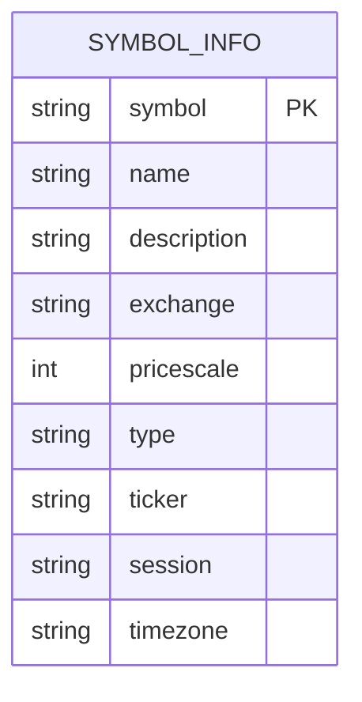

# /api/search 接口实现

<cite>
**本文档引用的文件**
- [chanapi.py](file://api/chanapi.py#L61-L72)
- [symbol_info.py](file://api/symbol_info.py#L4-L70)
- [conf.py](file://comm/conf.py#L87-L109)
</cite>

## 目录

1. [接口处理流程](#接口处理流程)
2. [模糊搜索算法原理](#模糊搜索算法原理)
3. [数据结构与字段组成](#数据结构与字段组成)
4. [性能优化建议](#性能优化建议)
5. [扩展实现示例](#扩展实现示例)

## 接口处理流程

`/api/search` 接口的实现机制基于 Flask 框架，通过 `request.args.get('query')` 获取搜索关键词。当客户端发起请求时，系统首先检查 query 参数的值。如果 query 为 "all" 或未提供，则返回完整的 `SUPPORT_SYMBOLS` 列表，这为前端提供了获取所有支持交易品种的能力。这种设计逻辑简化了前端初始化时的数据加载过程，避免了多次请求。

当 query 不为 "all" 时，系统进入模糊搜索模式。该接口的设计体现了简洁性和实用性，通过一个参数实现了两种不同的数据获取模式：全量获取和条件搜索。这种实现方式减少了 API 端点的数量，使接口更加简洁。接口的响应数据格式为 JSON，直接序列化 `SUPPORT_SYMBOLS` 列表中的匹配项，确保了与前端 TradingView SDK 的兼容性。

**Section sources**
- [chanapi.py](file://api/chanapi.py#L61-L72)

## 模糊搜索算法原理

模糊搜索的核心算法通过将搜索关键词转换为正则表达式来实现。具体实现中，系统使用 `'.'.join([_ for _ in query])` 将查询字符串的每个字符用 `.*` 连接，从而构建一个灵活的正则表达式模式。例如，当用户搜索 "BTC" 时，系统会将其转换为 "B.*T.*C.*" 的正则表达式，这允许匹配包含这些字符且顺序正确的任何字符串。

该算法在 `SUPPORT_SYMBOLS` 列表中进行遍历，使用 `re.search(qre, _['name'])` 对每个交易品种的名称字段进行正则匹配。这种实现方式提供了强大的模糊匹配能力，用户无需输入完整的名称即可找到目标交易品种。然而，该算法的时间复杂度为 O(n*m)，其中 n 是交易品种总数，m 是平均名称长度，这在数据量较大时可能影响性能。

**Section sources**
- [chanapi.py](file://api/chanapi.py#L70-L72)

## 数据结构与字段组成

`SUPPORT_SYMBOLS` 数据结构在 `symbol_info.py` 文件中定义，包含了加密货币和股票两类交易品种的信息。每个交易品种对象包含多个字段：`symbol` 表示交易代码，`name` 为名称，`description` 为描述信息，`exchange` 为交易所名称（统一为"自然之缠"），`pricescale` 为价格精度，`type` 区分资产类型（bitcoin 或 stock）。

对于加密货币，数据来源于 `hetl/selcoin/binance_syms.txt` 文件，通过 `ALL_SYMBOLS` 配置加载；对于股票，数据从 MongoDB 的 `stock` 数据库中读取 `stock_names` 集合。这种设计实现了多市场数据的统一管理。搜索结果返回的字段包括 symbol、name、exchange 等，这些信息足够支持前端的显示和交易功能，同时保持了数据传输的轻量化。



**Diagram sources**
- [symbol_info.py](file://api/symbol_info.py#L25-L38)
- [symbol_info.py](file://api/symbol_info.py#L55-L68)

## 性能优化建议

针对当前搜索实现的性能瓶颈，建议引入缓存机制。可以使用 Redis 作为缓存层，将完整的 `SUPPORT_SYMBOLS` 列表缓存起来，避免每次请求都重新加载数据。对于频繁的 "all" 查询，可以直接从缓存中返回结果，显著降低数据库访问压力。同时，可以实现查询结果缓存，对常见的搜索关键词进行缓存，减少正则匹配的计算开销。

另一种优化方案是引入前缀树（Trie）索引结构。将所有交易品种的名称构建成前缀树，可以实现 O(m) 时间复杂度的搜索，其中 m 是查询字符串的长度。前缀树特别适合自动补全场景，当用户输入前几个字符时，可以快速返回所有可能的匹配项。此外，可以考虑在 MongoDB 中为名称字段创建文本索引，利用数据库的原生搜索能力提高查询效率。

**Section sources**
- [symbol_info.py](file://api/symbol_info.py#L47-L50)
- [conf.py](file://comm/conf.py#L143-L147)

## 扩展实现示例

为了支持更精细的搜索过滤，可以扩展 `/api/search` 接口以支持市场分类过滤。以下是一个扩展实现的代码示例：

```python
@NaturalChan.route('/api/search')
def search():
    query = request.args.get('query', 'all')
    market = request.args.get('market', 'all')  # 新增市场过滤参数
    
    filtered_symbols = SUPPORT_SYMBOLS
    
    # 按市场过滤
    if market != 'all':
        filtered_symbols = [_ for _ in filtered_symbols if _['type'] == market]
    
    if query == "all":
        return jsonify(filtered_symbols)
    else:
        qre = '.*'.join([_ for _ in query])
        symbols = [_ for _ in filtered_symbols if re.search(qre, _['name'])]
        return jsonify(symbols)
```

此扩展允许通过 `market=stock` 或 `market=bitcoin` 参数过滤股票或加密货币。前端可以通过不同的搜索入口调用此接口，实现分类搜索功能。同时，可以进一步扩展支持多个过滤条件的组合，如按价格区间、交易量等，为用户提供更强大的搜索体验。

**Section sources**
- [chanapi.py](file://api/chanapi.py#L61-L72)