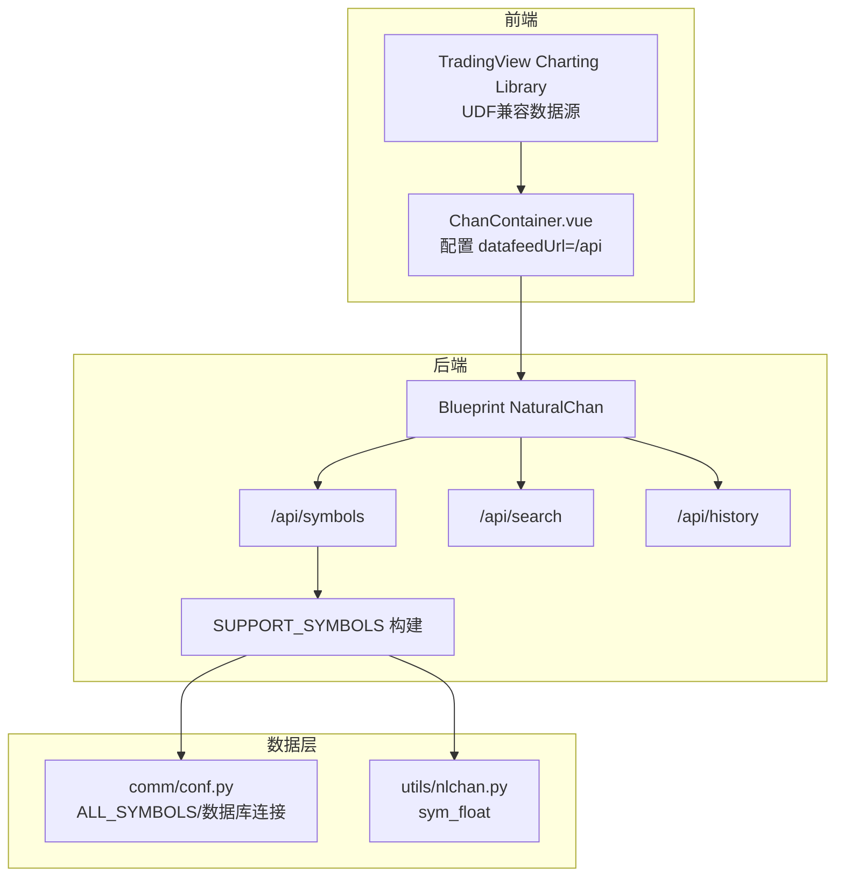
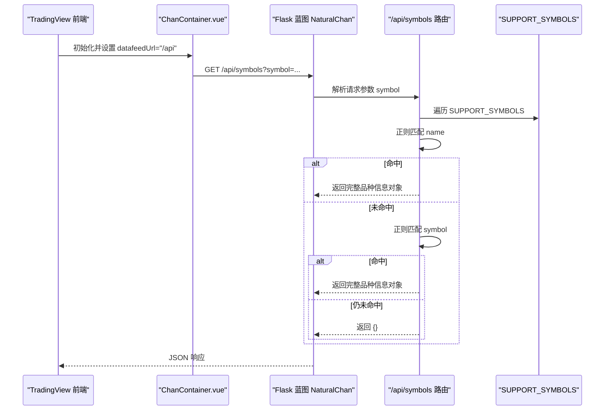
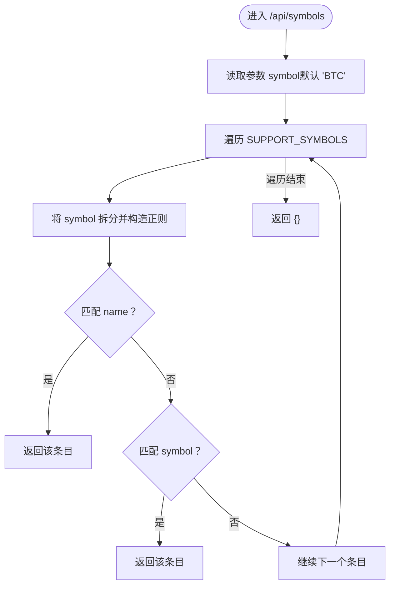
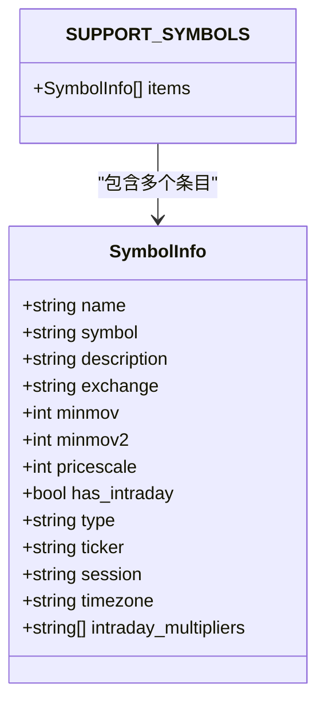
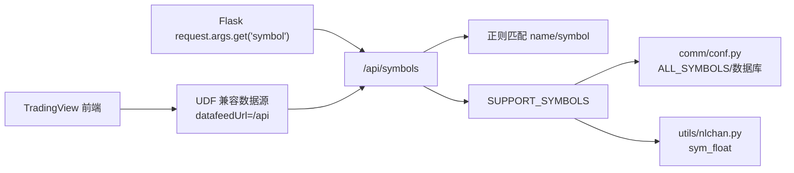

# /api/symbols 接口实现

<cite>
**本文引用的文件**
- [api/chanapi.py](file://api/chanapi.py)
- [api/symbol_info.py](file://api/symbol_info.py)
- [comm/conf.py](file://comm/conf.py)
- [utils/nlchan.py](file://utils/nlchan.py)
- [ui/src/components/ChanContainer.vue](file://ui/src/components/ChanContainer.vue)
- [ui/CLAUDE.md](file://ui/CLAUDE.md)
- [README.md](file://README.md)
</cite>

## 目录
1. [简介](#简介)
2. [项目结构](#项目结构)
3. [核心组件](#核心组件)
4. [架构总览](#架构总览)
5. [详细组件分析](#详细组件分析)
6. [依赖关系分析](#依赖关系分析)
7. [性能考量](#性能考量)
8. [故障排查指南](#故障排查指南)
9. [结论](#结论)
10. [附录](#附录)

## 简介
本文件围绕 /api/symbols 接口的实现进行深入剖析，重点说明以下内容：
- 通过 request.args.get('symbol') 获取交易对标识符的处理方式
- 遍历 SUPPORT_SYMBOLS 集合，使用正则表达式先后匹配 name 和 symbol 字段的双重查找机制
- 匹配成功时返回完整品种信息对象（包含描述、最小变动单位、价格精度等元数据）的设计目的，及其对前端图表渲染的支持作用
- 结合实际调用场景，演示 BTC、SH 等不同市场符号的解析流程
- 提供增加自定义字段映射或支持国际化名称的扩展实现方案

## 项目结构
该接口位于后端 Flask 蓝图 NaturalChan 内，与前端 TradingView Charting Library 通过 UDF 兼容数据源对接。关键文件与职责如下：
- api/chanapi.py：后端路由与业务逻辑，包含 /api/symbols、/api/search、/api/history 等接口
- api/symbol_info.py：构建 SUPPORT_SYMBOLS，聚合加密货币与股票的基础信息
- comm/conf.py：全局配置，包括 ALL_SYMBOLS 来源、数据库连接、时间周期映射等
- utils/nlchan.py：工具函数，如 sym_float 计算价格精度
- ui/src/components/ChanContainer.vue：前端集成 TradingView，配置 datafeedUrl 指向后端 /api
- ui/CLAUDE.md：前端与后端 API 的约定说明
- README.md：项目背景与整体架构说明

**图表来源**
- [api/chanapi.py](file://api/chanapi.py#L77-L94)
- [api/symbol_info.py](file://api/symbol_info.py#L1-L74)
- [comm/conf.py](file://comm/conf.py#L88-L109)
- [utils/nlchan.py](file://utils/nlchan.py#L6-L25)
- [ui/src/components/ChanContainer.vue](file://ui/src/components/ChanContainer.vue#L79-L913)
- [ui/CLAUDE.md](file://ui/CLAUDE.md#L104-L116)

**章节来源**
- [README.md](file://README.md#L90-L106)
- [ui/CLAUDE.md](file://ui/CLAUDE.md#L104-L116)

## 核心组件
- /api/symbols：接收前端请求中的 symbol 参数，遍历 SUPPORT_SYMBOLS，使用正则表达式先后匹配 name 与 symbol 字段，返回首个匹配的完整品种信息对象；若无匹配则返回空对象
- SUPPORT_SYMBOLS：由 api/symbol_info.py 构建，包含加密货币与股票两类条目，每条目包含 name、symbol、description、exchange、minmov、pricescale、type、ticker、timezone、intraday_multipliers 等字段
- 正则匹配策略：将输入字符串拆分为字符序列，插入通配符后构造正则，先匹配 name，再匹配 symbol，确保模糊搜索的灵活性与优先级

**章节来源**
- [api/chanapi.py](file://api/chanapi.py#L77-L94)
- [api/symbol_info.py](file://api/symbol_info.py#L1-L74)

## 架构总览
下图展示 TradingView 前端通过 UDF 兼容数据源调用后端 /api/symbols 的典型交互流程。

**图表来源**
- [api/chanapi.py](file://api/chanapi.py#L77-L94)
- [api/symbol_info.py](file://api/symbol_info.py#L1-L74)
- [ui/src/components/ChanContainer.vue](file://ui/src/components/ChanContainer.vue#L79-L913)
- [ui/CLAUDE.md](file://ui/CLAUDE.md#L104-L116)

## 详细组件分析

### /api/symbols 接口实现细节
- 参数获取：从 request.args.get('symbol', 'BTC') 获取 symbol，默认值为 'BTC'
- 遍历与匹配：
  - 对每个 SUPPORT_SYMBOLS 条目，将输入 symbol 拆分为字符序列并插入通配符，构造正则
  - 先尝试匹配 sym['name']，若命中则直接返回该条目
  - 若未命中，则尝试匹配 sym['symbol']，若命中则返回该条目
  - 若遍历结束后仍未命中，返回空对象
- 返回值：匹配成功时返回完整品种信息对象；未匹配时返回空对象，便于前端区分

**图表来源**
- [api/chanapi.py](file://api/chanapi.py#L77-L94)

**章节来源**
- [api/chanapi.py](file://api/chanapi.py#L77-L94)

### SUPPORT_SYMBOLS 构建与字段设计
- 数据来源：
  - 加密货币：从 comm/conf.py 中的 ALL_SYMBOLS 读取，过滤特殊符号后生成条目
  - 股票：从 STOCK_DB.stock_names 集合读取，拼装显示名称与代码
- 字段含义（节选）：
  - name：显示名称
  - symbol：交易代码
  - description：描述文本
  - exchange：交易所
  - minmov：最小变动单位
  - pricescale：价格精度（由 sym_float 计算而来）
  - type：类型（stock/bitcoin）
  - ticker：前端实际使用的标识符
  - timezone：时区
  - intraday_multipliers：支持的周期
- 设计目的：
  - 为 TradingView 提供完整的元数据，支撑前端图表渲染、精度控制、周期选择、时区显示等
  - 通过 pricescale 与 minmov 等字段，保证价格显示与计算的准确性

**图表来源**
- [api/symbol_info.py](file://api/symbol_info.py#L1-L74)

**章节来源**
- [api/symbol_info.py](file://api/symbol_info.py#L1-L74)
- [comm/conf.py](file://comm/conf.py#L88-L109)
- [utils/nlchan.py](file://utils/nlchan.py#L6-L25)

### 实际调用场景演示

#### 场景一：BTC 符号解析
- 输入：symbol='BTC'
- 匹配过程：
  - 正则构造：将 'BTC' 拆分为 'B'、'T'、'C'，插入通配符后构造正则
  - 先匹配 name：SUPPORT_SYMBOLS 中存在 name 为 'BTC' 的条目，命中
  - 返回该条目（包含 description、pricescale、type、ticker 等字段）
- 前端作用：TradingView 使用返回的 ticker 作为图表标识符，pricescale 控制价格精度，intraday_multipliers 决定周期菜单

**章节来源**
- [api/chanapi.py](file://api/chanapi.py#L77-L94)
- [api/symbol_info.py](file://api/symbol_info.py#L1-L74)

#### 场景二：SH 股票符号解析
- 输入：symbol='SH'
- 匹配过程：
  - 正则构造：将 'SH' 拆分为 'S'、'H'
  - 先匹配 name：可能未命中
  - 再匹配 symbol：SUPPORT_SYMBOLS 中存在 symbol 为 'SH' 的条目，命中
  - 返回该条目（包含 description、pricescale、type、ticker 等字段）
- 前端作用：TradingView 使用返回的 ticker 作为图表标识符，pricescale 控制价格精度，intraday_multipliers 决定周期菜单

**章节来源**
- [api/chanapi.py](file://api/chanapi.py#L77-L94)
- [api/symbol_info.py](file://api/symbol_info.py#L1-L74)

### 扩展实现方案

#### 方案一：增加自定义字段映射
- 目标：为特定 symbol 或类型附加额外元数据（如 market_category、sector 等），供前端定制渲染
- 实施步骤：
  - 在 api/symbol_info.py 中扩展条目构建逻辑，在循环内根据 symbol 或 type 判断并填充自定义字段
  - 在 /api/symbols 返回的对象中保留这些字段，前端通过 ticker 与自定义字段组合使用
- 注意事项：
  - 保持返回对象与 TradingView 兼容字段一致，避免破坏现有渲染
  - 对新增字段进行版本化管理，避免与未来 TV 协议冲突

**章节来源**
- [api/symbol_info.py](file://api/symbol_info.py#L1-L74)

#### 方案二：支持国际化名称
- 目标：在 description 或 name 中提供多语言显示，满足国际化需求
- 实施步骤：
  - 在 api/symbol_info.py 中引入翻译映射（如 name_i18n、description_i18n），根据前端传入的 locale 参数动态选择
  - 或在 /api/symbols 中增加 locale 参数，按需返回对应语言的 description/name
- 注意事项：
  - 保持 pricescale、timezone 等核心字段不变，仅替换显示文本
  - 与前端语言切换逻辑配合，确保切换即时生效

**章节来源**
- [api/symbol_info.py](file://api/symbol_info.py#L1-L74)
- [ui/src/components/ChanContainer.vue](file://ui/src/components/ChanContainer.vue#L79-L913)

## 依赖关系分析
- /api/symbols 依赖：
  - Flask request：解析 symbol 参数
  - SUPPORT_SYMBOLS：来自 api/symbol_info.py
  - 正则模块：用于模糊匹配 name 与 symbol
- SUPPORT_SYMBOLS 依赖：
  - comm/conf.py：ALL_SYMBOLS 来源、数据库连接
  - utils/nlchan.py：sym_float 计算 pricescale
- 前端依赖：
  - TradingView UDF 兼容数据源：通过 datafeedUrl 指向 /api
  - 品种信息用于初始化图表与渲染

**图表来源**
- [api/chanapi.py](file://api/chanapi.py#L77-L94)
- [api/symbol_info.py](file://api/symbol_info.py#L1-L74)
- [comm/conf.py](file://comm/conf.py#L88-L109)
- [utils/nlchan.py](file://utils/nlchan.py#L6-L25)
- [ui/src/components/ChanContainer.vue](file://ui/src/components/ChanContainer.vue#L79-L913)

**章节来源**
- [api/chanapi.py](file://api/chanapi.py#L77-L94)
- [api/symbol_info.py](file://api/symbol_info.py#L1-L74)
- [comm/conf.py](file://comm/conf.py#L88-L109)
- [utils/nlchan.py](file://utils/nlchan.py#L6-L25)
- [ui/src/components/ChanContainer.vue](file://ui/src/components/ChanContainer.vue#L79-L913)

## 性能考量
- 正则匹配复杂度：每次匹配为 O(n)（n 为条目长度），SUPPORT_SYMBOLS 规模较大时建议：
  - 为 name 与 symbol 建立索引（如数据库层面或内存字典树）
  - 对高频 symbol 增加缓存（Redis/Memory），命中直接返回
- 数据规模：ALL_SYMBOLS 来源于外部文件与数据库，建议：
  - 分批加载或懒加载策略
  - 对 pricescale 计算结果进行缓存，避免重复计算
- 前端渲染：TradingView 侧的首次加载与搜索体验可通过预热数据与本地缓存优化

[本节为通用性能建议，不直接分析具体文件]

## 故障排查指南
- 无匹配返回空对象
  - 现象：/api/symbols 返回 {}
  - 排查：确认 symbol 是否存在于 SUPPORT_SYMBOLS；检查 name 与 symbol 字段是否与输入一致
- 价格精度异常
  - 现象：前端价格显示精度不符合预期
  - 排查：检查 pricescale 是否由 sym_float 正确计算；确认 minmov 格式与数值
- 股票与加密货币混用
  - 现象：SH/BTC 等 symbol 行为差异
  - 排查：确认 type 与 intraday_multipliers 是否符合预期；核对前端 ticker 使用是否正确

**章节来源**
- [api/chanapi.py](file://api/chanapi.py#L77-L94)
- [api/symbol_info.py](file://api/symbol_info.py#L1-L74)
- [utils/nlchan.py](file://utils/nlchan.py#L6-L25)

## 结论
/api/symbols 接口通过 request.args.get('symbol') 获取交易对标识符，采用“先 name 后 symbol”的双重正则匹配策略，返回包含丰富元数据的完整品种信息对象。该设计既满足前端 TradingView 的渲染需求，又为后续扩展（自定义字段、国际化名称）提供了清晰路径。建议在生产环境中结合缓存与索引优化，进一步提升匹配效率与用户体验。

[本节为总结性内容，不直接分析具体文件]

## 附录
- 前端与后端 API 约定：参见 ui/CLAUDE.md 中关于 /api/symbols 的说明
- 项目整体架构与功能点：参见 README.md

**章节来源**
- [ui/CLAUDE.md](file://ui/CLAUDE.md#L104-L116)
- [README.md](file://README.md#L90-L106)