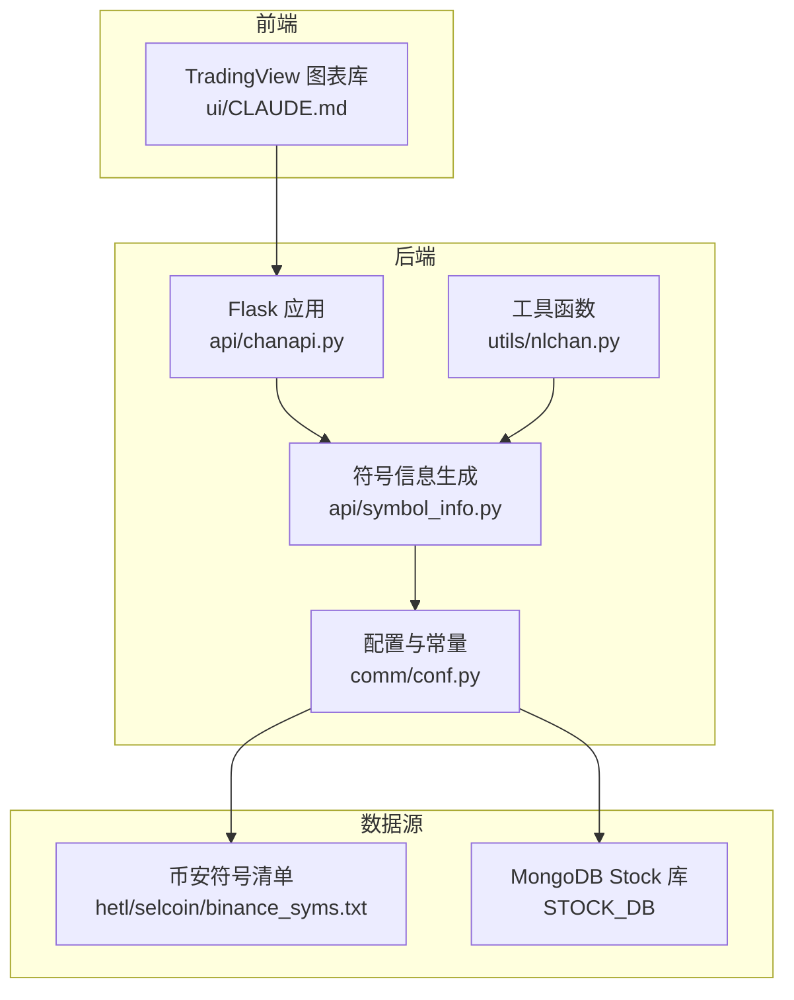
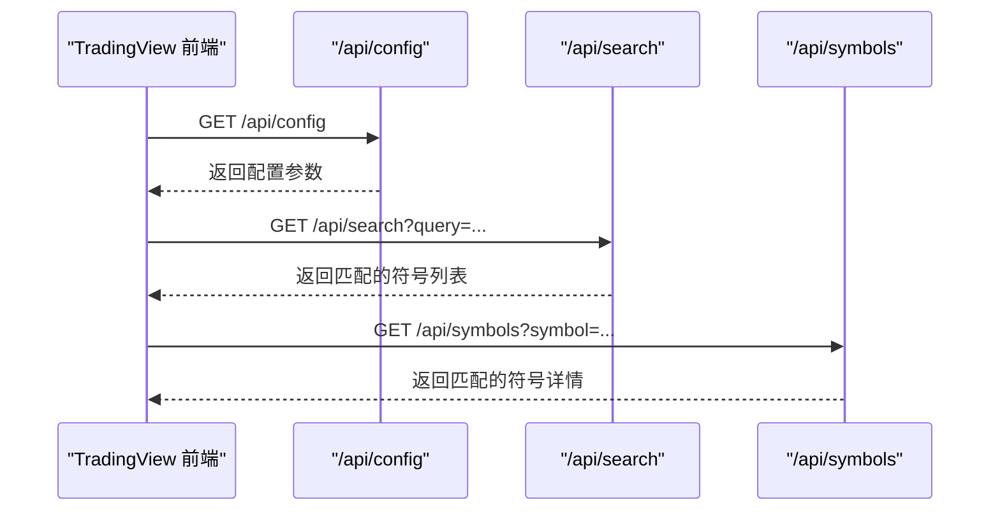
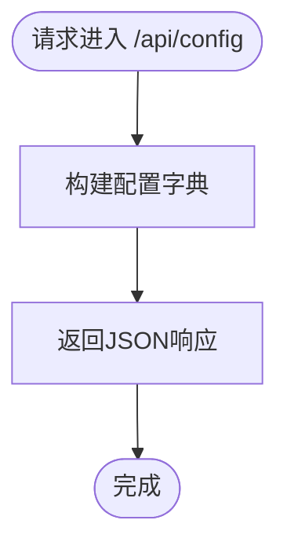
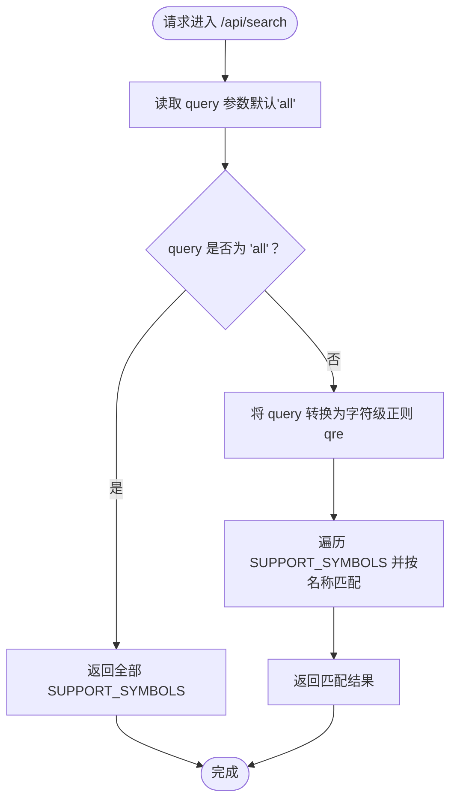
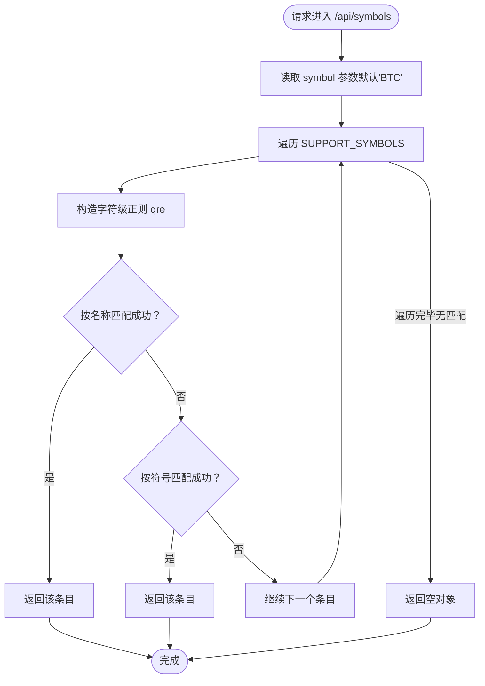
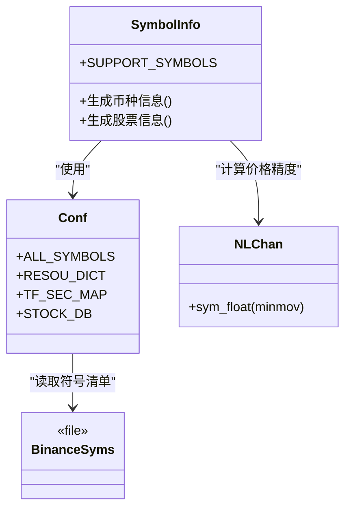
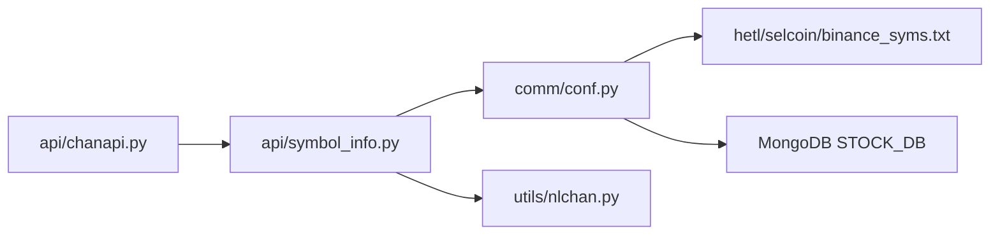

# 基础查询接口实现

<cite>
**本文引用的文件**
- [api/chanapi.py](file://api/chanapi.py)
- [api/symbol_info.py](file://api/symbol_info.py)
- [comm/conf.py](file://comm/conf.py)
- [utils/nlchan.py](file://utils/nlchan.py)
- [hetl/selcoin/binance_syms.txt](file://hetl/selcoin/binance_syms.txt)
- [ui/CLAUDE.md](file://ui/CLAUDE.md)
</cite>

## 目录
1. [简介](#简介)
2. [项目结构](#项目结构)
3. [核心组件](#核心组件)
4. [架构总览](#架构总览)
5. [详细组件分析](#详细组件分析)
6. [依赖关系分析](#依赖关系分析)
7. [性能考量](#性能考量)
8. [故障排查指南](#故障排查指南)
9. [结论](#结论)
10. [附录](#附录)

## 简介
本文聚焦于chanvis项目中的三个基础查询接口：/api/config、/api/search、/api/symbols，系统性解析其技术实现与数据规范，包括：
- /api/config如何返回TradingView SDK所需的配置参数（如supports_search、supported_resolutions等），并说明这些字段对前端行为的影响。
- /api/search如何基于正则进行“字符级模糊匹配”从SUPPORT_SYMBOLS中检索符号信息。
- /api/symbols如何通过re.search实现符号与名称的双重匹配查找。
- 结合request.args.get的默认值处理与条件判断模式，给出新增配置项的扩展范式。

## 项目结构
chanvis采用前后端分离的组织方式：
- 后端服务位于api目录，提供REST风格接口，包含配置、搜索、历史数据等路由。
- 配置与常量集中于comm/conf.py，统一管理数据库连接、时间周期映射、价格精度等。
- 符号信息由api/symbol_info.py生成，来源于comm/conf.py中的ALL_SYMBOLS与STOCK_DB中的股票名称集合。
- 前端UI通过TradingView Charting Library调用后端接口，接口契约在ui/CLAUDE.md中有明确说明。

图示来源
- [api/chanapi.py](file://api/chanapi.py#L41-L94)
- [api/symbol_info.py](file://api/symbol_info.py#L1-L74)
- [comm/conf.py](file://comm/conf.py#L1-L166)
- [utils/nlchan.py](file://utils/nlchan.py#L1-L25)
- [hetl/selcoin/binance_syms.txt](file://hetl/selcoin/binance_syms.txt#L1-L118)
- [ui/CLAUDE.md](file://ui/CLAUDE.md#L104-L116)

章节来源
- [api/chanapi.py](file://api/chanapi.py#L41-L94)
- [api/symbol_info.py](file://api/symbol_info.py#L1-L74)
- [comm/conf.py](file://comm/conf.py#L1-L166)
- [ui/CLAUDE.md](file://ui/CLAUDE.md#L104-L116)

## 核心组件
- /api/config：返回TradingView SDK所需的配置参数，决定前端是否启用搜索、支持哪些K线周期、是否支持时间戳等。
- /api/search：根据查询字符串进行字符级模糊匹配，返回SUPPORT_SYMBOLS中名称匹配的结果集。
- /api/symbols：根据symbol参数进行名称或符号的双重匹配，返回第一条匹配记录或空对象。

章节来源
- [api/chanapi.py](file://api/chanapi.py#L41-L94)

## 架构总览
下图展示了TradingView前端与后端接口的交互路径，以及符号信息的生成链路。

图示来源
- [api/chanapi.py](file://api/chanapi.py#L41-L94)
- [ui/CLAUDE.md](file://ui/CLAUDE.md#L104-L116)

## 详细组件分析

### /api/config 接口
- 功能定位：向TradingView SDK提供配置参数，控制前端行为与可用特性。
- 关键字段说明（基于返回值）：
  - supports_search：布尔值，指示前端是否启用搜索功能。
  - supports_group_request：布尔值，指示是否支持分组请求（本项目未启用）。
  - supported_resolutions：字符串数组，列出可用的K线周期（如“1”、“5”、“30”、“240”、“D”、“W”、“M”）。
  - supports_marks：布尔值，指示是否支持标记（本项目未启用）。
  - supports_time：布尔值，指示是否支持时间戳。
  - sentsupports_timescale_marks：布尔值，指示是否使用自定义的时间范围。
- 影响范围：前端会依据supported_resolutions渲染时间轴选项；supports_search影响搜索框是否可用；supports_time影响时间戳字段的呈现。

图示来源
- [api/chanapi.py](file://api/chanapi.py#L41-L58)

章节来源
- [api/chanapi.py](file://api/chanapi.py#L41-L58)

### /api/search 接口
- 输入参数：query（可选，默认“all”）。
- 处理流程：
  - 若query为“all”，直接返回全部SUPPORT_SYMBOLS。
  - 否则，将query拆分为字符序列并在每个字符之间插入“任意字符匹配”的通配符，形成正则表达式qre。
  - 在SUPPORT_SYMBOLS中筛选名称字段满足qre的条目，返回匹配结果。
- 匹配策略：字符级模糊匹配，即只要求目标名称中按顺序出现query中的字符即可，不考虑字符位置连续性。
- 性能特征：遍历SUPPORT_SYMBOLS，时间复杂度近似O(N*M)，其中N为符号总数，M为平均名称长度；若需优化，可考虑预构建索引或前缀树。

图示来源
- [api/chanapi.py](file://api/chanapi.py#L61-L73)
- [api/symbol_info.py](file://api/symbol_info.py#L1-L74)

章节来源
- [api/chanapi.py](file://api/chanapi.py#L61-L73)
- [api/symbol_info.py](file://api/symbol_info.py#L1-L74)

### /api/symbols 接口
- 输入参数：symbol（可选，默认“BTC”）。
- 处理流程：
  - 遍历SUPPORT_SYMBOLS，先尝试按名称匹配（re.search(qre, name)）。
  - 若未命中，再尝试按符号字段匹配（re.search(qre, symbol)）。
  - 返回第一条匹配记录，若无匹配则返回空对象。
- 匹配策略：名称优先，其次符号；同样采用字符级模糊匹配。
- 性能特征：与search类似，时间复杂度近似O(N*M)；若频繁调用，建议引入缓存或索引。

图示来源
- [api/chanapi.py](file://api/chanapi.py#L77-L94)
- [api/symbol_info.py](file://api/symbol_info.py#L1-L74)

章节来源
- [api/chanapi.py](file://api/chanapi.py#L77-L94)
- [api/symbol_info.py](file://api/symbol_info.py#L1-L74)

### 符号信息生成与数据来源
- ALL_SYMBOLS：从hetl/selcoin/binance_syms.txt读取币安符号及其最小变动单位（minmov）。
- SUPPORT_SYMBOLS：遍历ALL_SYMBOLS，过滤掉特殊符号（如TUSD），并为每个币生成标准字段（名称、符号、描述、交易所、价格精度、类型、会话、时区、日内倍数等）。
- 股票信息：从STOCK_DB的stock_names集合读取股票代码、显示名与名称，拼装为股票类型的SUPPORT_SYMBOLS条目。
- 价格精度（pricescale）：通过utils/nlchan.py的sym_float计算，将minmov转换为价格缩放比例。

图示来源
- [api/symbol_info.py](file://api/symbol_info.py#L1-L74)
- [comm/conf.py](file://comm/conf.py#L1-L166)
- [utils/nlchan.py](file://utils/nlchan.py#L1-L25)
- [hetl/selcoin/binance_syms.txt](file://hetl/selcoin/binance_syms.txt#L1-L118)

章节来源
- [api/symbol_info.py](file://api/symbol_info.py#L1-L74)
- [comm/conf.py](file://comm/conf.py#L1-L166)
- [utils/nlchan.py](file://utils/nlchan.py#L1-L25)
- [hetl/selcoin/binance_syms.txt](file://hetl/selcoin/binance_syms.txt#L1-L118)

## 依赖关系分析
- /api/config依赖于后端返回的固定配置字典，直接影响前端界面与交互能力。
- /api/search与/api/symbols均依赖SUPPORT_SYMBOLS，后者由api/symbol_info.py生成，前者进一步依赖comm/conf.py中的ALL_SYMBOLS与STOCK_DB。
- utils/nlchan.py提供sym_float，用于将minmov转换为pricescale，确保价格精度与TradingView兼容。

图示来源
- [api/chanapi.py](file://api/chanapi.py#L41-L94)
- [api/symbol_info.py](file://api/symbol_info.py#L1-L74)
- [comm/conf.py](file://comm/conf.py#L1-L166)
- [utils/nlchan.py](file://utils/nlchan.py#L1-L25)
- [hetl/selcoin/binance_syms.txt](file://hetl/selcoin/binance_syms.txt#L1-L118)

章节来源
- [api/chanapi.py](file://api/chanapi.py#L41-L94)
- [api/symbol_info.py](file://api/symbol_info.py#L1-L74)
- [comm/conf.py](file://comm/conf.py#L1-L166)

## 性能考量
- 字符级正则匹配：search与symbols均采用re.search对名称/符号进行模糊匹配，时间复杂度近似O(N*M)。对于大规模符号集，建议：
  - 引入前缀索引或倒排索引，按首字母/拼音首字母分桶加速。
  - 对常用查询建立缓存，减少重复计算。
  - 限制查询长度或提供更精确的过滤条件（如按交易所、类型）。
- 响应体体积：SUPPORT_SYMBOLS较大时，一次性返回可能造成网络传输压力。可考虑分页或增量更新策略。
- 前端集成：前端已声明supported_resolution与favorites.intervals，后端config中的supported_resolutions需与之保持一致，避免前端不可用的周期导致无效请求。

[本节为通用性能建议，无需特定文件来源]

## 故障排查指南
- /api/config返回异常
  - 确认返回字典字段完整且类型正确（布尔值、字符串数组）。
  - 检查前端是否正确解析并应用supported_resolutions。
- /api/search无结果
  - 确认query非“all”时，字符级正则是否按预期构造。
  - 检查SUPPORT_SYMBOLS是否加载成功（ALL_SYMBOLS与STOCK_DB是否可达）。
- /api/symbols返回空
  - 确认symbol参数是否传入，或默认值是否符合预期。
  - 检查名称与符号字段是否包含目标关键字。
- 价格精度问题
  - 检查minmov与pricescale的转换逻辑（sym_float）是否正确。
  - 确认不同币种的minmov差异是否被正确处理。

章节来源
- [api/chanapi.py](file://api/chanapi.py#L41-L94)
- [api/symbol_info.py](file://api/symbol_info.py#L1-L74)
- [utils/nlchan.py](file://utils/nlchan.py#L1-L25)
- [comm/conf.py](file://comm/conf.py#L1-L166)

## 结论
- /api/config为TradingView前端提供关键配置，决定了搜索、周期选择与时间戳支持等行为。
- /api/search与/api/symbols采用字符级模糊匹配策略，实现灵活的符号检索；在符号规模扩大时需关注性能优化。
- 符号信息生成链路清晰：从binance_syms.txt读取币种清单，结合STOCK_DB生成股票信息，最终汇总为SUPPORT_SYMBOLS供查询接口使用。
- 新增配置项与扩展接口时，应遵循现有参数解析与默认值处理模式，确保前后端一致性与可维护性。

[本节为总结性内容，无需特定文件来源]

## 附录

### TradingView SDK配置字段对照
- supports_search：是否启用搜索功能。
- supports_group_request：是否支持分组请求。
- supported_resolutions：可用K线周期列表。
- supports_marks：是否支持标记。
- supports_time：是否支持时间戳。
- sentsupports_timescale_marks：是否使用自定义时间范围。

章节来源
- [api/chanapi.py](file://api/chanapi.py#L41-L58)

### request.args.get默认值与条件判断模式
- 默认值处理：query默认“all”，symbol默认“BTC”。
- 条件判断：根据query是否为“all”决定全量返回或正则过滤；在symbols中先名称后符号的双通道匹配。
- 扩展范式（新增配置项）：
  - 在/api/config中添加新字段并返回。
  - 在前端ui/CLAUDE.md中同步声明该字段的用途与默认值。
  - 如需后端逻辑变更，参考/api/search与/api/symbols中的参数解析与条件分支模式，保持一致的健壮性与可读性。

章节来源
- [api/chanapi.py](file://api/chanapi.py#L61-L94)
- [ui/CLAUDE.md](file://ui/CLAUDE.md#L104-L116)