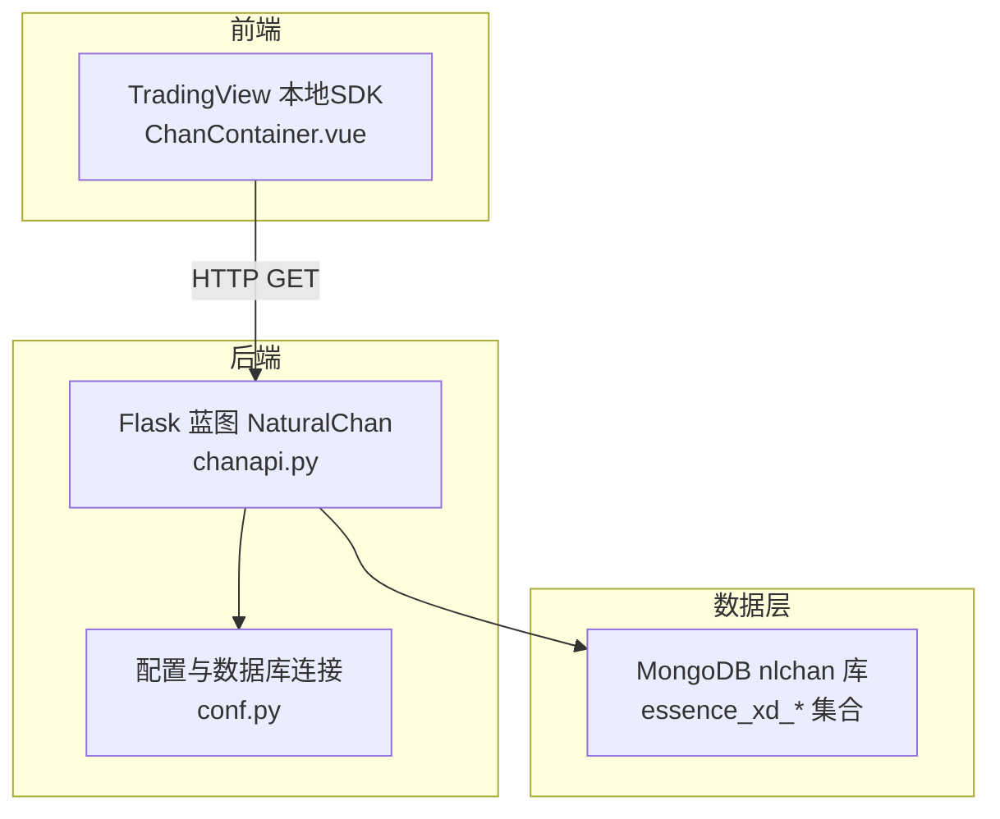
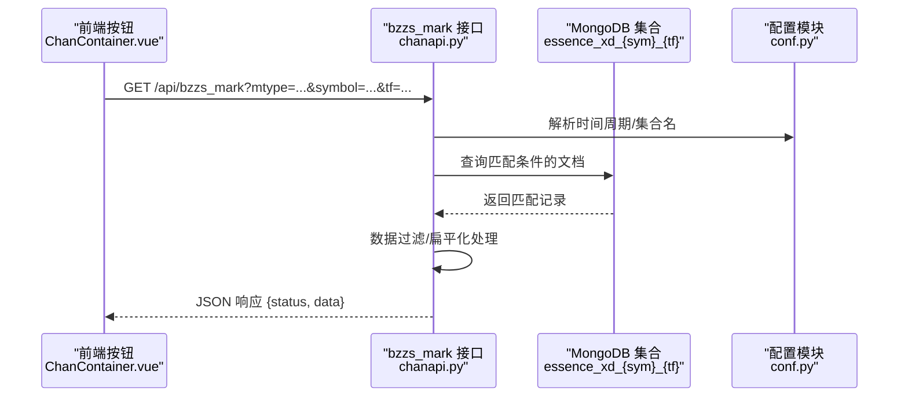
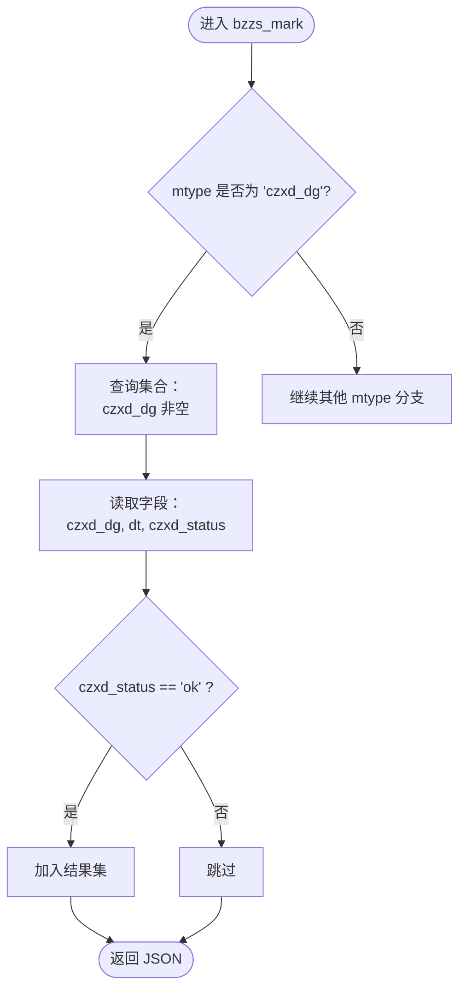
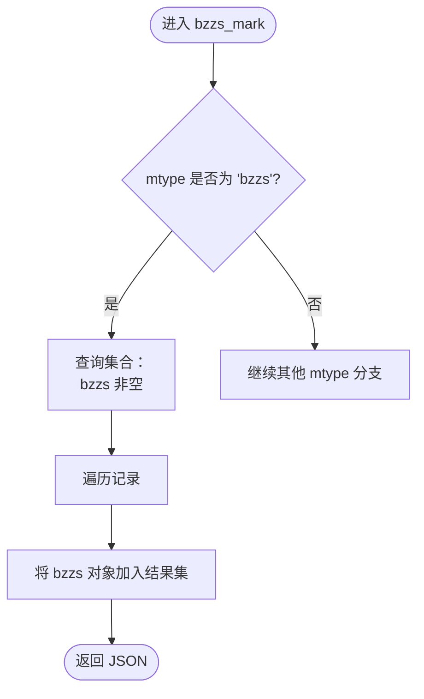
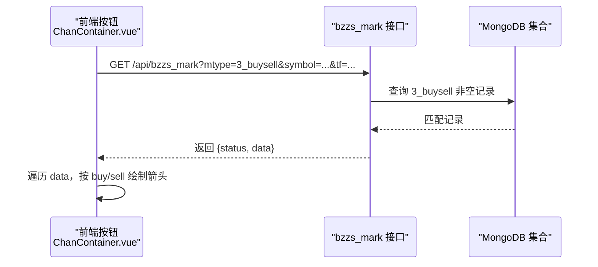
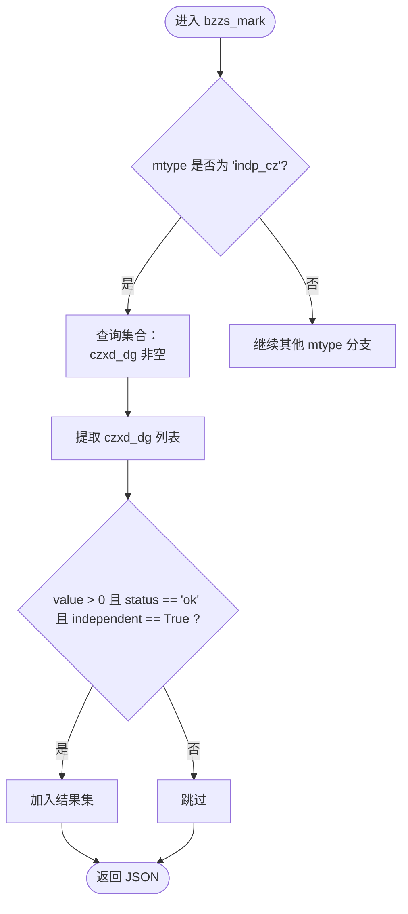
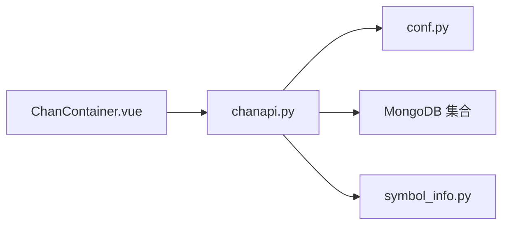

# 中枢标记接口实现

<cite>
**本文引用的文件**
- [chanapi.py](file://api/chanapi.py)
- [conf.py](file://comm/conf.py)
- [symbol_info.py](file://api/symbol_info.py)
- [ChanContainer.vue](file://ui/src/components/ChanContainer.vue)
- [nlchan.py](file://utils/nlchan.py)
- [README.md](file://README.md)
</cite>

## 目录
1. [引言](#引言)
2. [项目结构](#项目结构)
3. [核心组件](#核心组件)
4. [架构总览](#架构总览)
5. [详细组件分析](#详细组件分析)
6. [依赖关系分析](#依赖关系分析)
7. [性能考量](#性能考量)
8. [故障排查指南](#故障排查指南)
9. [结论](#结论)
10. [附录](#附录)

## 引言
本文件系统性阐述“中枢标记接口”中 mtype 参数为 'czxd_dg'、'bzzs'、'3_buysell' 等模式的实现细节，重点说明：
- czxd_dg 与 czxd_status 字段的关联查询与状态过滤机制
- bzzs 嵌套文档的提取与扁平化处理流程
- 独立中枢（indp_cz）的筛选条件（value > 0 且 independent 为 True）及其在量化策略中的意义
- 结合缠论理论，解释不同中枢标记类型在趋势判断和买卖点识别中的应用

## 项目结构
后端采用 Flask 提供 REST 接口，前端基于 TradingView 本地 SDK 与 Vue 组件进行可视化。中枢标记接口位于后端 API 层，数据来源于 MongoDB 的缠论结构集合。

图表来源
- [chanapi.py](file://api/chanapi.py#L422-L491)
- [conf.py](file://comm/conf.py#L143-L158)

章节来源
- [README.md](file://README.md#L91-L105)
- [chanapi.py](file://api/chanapi.py#L422-L491)
- [conf.py](file://comm/conf.py#L143-L158)

## 核心组件
- bzzs_mark 接口：根据 mtype 返回中枢标记数据
- 配置模块：提供数据库连接、时间周期映射、集合命名模板
- 符号信息：支持币种与股票符号的搜索与展示
- 前端可视化：通过按钮触发接口，绘制中枢标记

章节来源
- [chanapi.py](file://api/chanapi.py#L422-L491)
- [conf.py](file://comm/conf.py#L12-L31)
- [symbol_info.py](file://api/symbol_info.py#L1-L74)
- [ChanContainer.vue](file://ui/src/components/ChanContainer.vue#L2319-L2541)

## 架构总览
中枢标记接口的调用链路如下：

图表来源
- [chanapi.py](file://api/chanapi.py#L422-L491)
- [conf.py](file://comm/conf.py#L143-L158)

## 详细组件分析

### 接口入口与路由
- 路由：/api/bzzs_mark
- 方法：GET
- 参数：
  - mtype：标记类型，如 'czxd_dg'、'bzzs'、'3_buysell'、'indp_cz'
  - symbol：标的代码
  - tf：时间周期，映射到内部周期字符串

章节来源
- [chanapi.py](file://api/chanapi.py#L422-L491)

### mtype='czxd_dg' 的实现细节
- 查询条件：czxd_dg 字段非空
- 返回字段：czxd_dg、dt、czxd_status
- 状态过滤：仅保留 czxd_status 为 'ok' 的记录
- 数据结构：czxd_dg 为内嵌对象，包含中枢相关字段（如 value、vtype、is_valid_czxd 等）

图表来源
- [chanapi.py](file://api/chanapi.py#L443-L461)

章节来源
- [chanapi.py](file://api/chanapi.py#L443-L461)

### mtype='bzzs' 的实现细节
- 查询条件：bzzs 字段非空
- 返回字段：bzzs 对象（本质中枢）
- 处理逻辑：遍历匹配记录，直接将 bzzs 对象加入结果集

图表来源
- [chanapi.py](file://api/chanapi.py#L461-L471)

章节来源
- [chanapi.py](file://api/chanapi.py#L461-L471)

### mtype='3_buysell' 的实现细节
- 查询条件：3_buysell 字段非空
- 返回字段：包含 dt、high、low、3_buysell 的记录
- 处理逻辑：前端按钮点击后，接口返回该字段，前端据此绘制买卖箭头标记

图表来源
- [chanapi.py](file://api/chanapi.py#L471-L491)
- [ChanContainer.vue](file://ui/src/components/ChanContainer.vue#L2447-L2471)

章节来源
- [chanapi.py](file://api/chanapi.py#L471-L491)
- [ChanContainer.vue](file://ui/src/components/ChanContainer.vue#L2447-L2471)

### mtype='indp_cz' 的实现细节
- 查询条件：czxd_dg 字段非空
- 返回字段：czxd_dg、dt
- 筛选条件：value > 0 且 status == 'ok' 且 independent 为 True
- 作用：筛选“独立中枢”，强调日线级别中枢的独立有效性

图表来源
- [chanapi.py](file://api/chanapi.py#L477-L491)

章节来源
- [chanapi.py](file://api/chanapi.py#L477-L491)

### czxd_dg 与 czxd_status 的关联查询与状态过滤机制
- 关联查询：czxd_dg 字段非空作为基础条件，同时读取 czxd_status 字段
- 状态过滤：仅保留 czxd_status 为 'ok' 的记录，确保中枢处于有效状态
- 用途：为前端提供可验证的有效中枢标记，避免无效或过渡状态导致误判

章节来源
- [chanapi.py](file://api/chanapi.py#L443-L461)

### bzzs 嵌套文档的提取与扁平化处理流程
- 提取：查询 bzzs 字段非空的记录
- 扁平化：直接将 bzzs 对象加入结果数组，无需进一步拆解
- 适用场景：本质中枢矩形区域的可视化标注

章节来源
- [chanapi.py](file://api/chanapi.py#L461-L471)

### 独立中枢（indp_cz）的筛选条件与意义
- 筛选条件：value > 0 且 status == 'ok' 且 independent 为 True
- 意义：
  - value > 0：保证中枢具有实际价格区间
  - status == 'ok'：中枢处于稳定有效状态
  - independent 为 True：中枢在更高周期上具备独立性，增强信号强度
- 在量化策略中的应用：独立中枢通常被视为更强的趋势确认信号，适合用于趋势跟踪与买卖点确认

章节来源
- [chanapi.py](file://api/chanapi.py#L477-L491)

### 结合缠论理论的应用
- czxd_dg：日线级别中枢标记，反映大级别趋势结构，常用于趋势方向判断与背驰确认
- bzzs：本质中枢，强调中枢的稳定性与持续性，适合作为支撑/阻力与趋势延续的参考
- 3_buysell：三买/三卖点标记，结合中枢与走势结构，辅助买卖点识别
- indp_cz：独立中枢，强调中枢在更高周期上的独立有效性，提升信号可靠性

章节来源
- [README.md](file://README.md#L41-L75)
- [ChanContainer.vue](file://ui/src/components/ChanContainer.vue#L2319-L2541)

## 依赖关系分析
- 接口依赖：
  - 从 conf.py 获取数据库连接、集合命名模板、时间周期映射
  - 从 symbol_info.py 获取支持的符号列表
- 前端依赖：
  - ChanContainer.vue 通过按钮触发接口，解析响应并在图表上绘制标记

图表来源
- [chanapi.py](file://api/chanapi.py#L422-L491)
- [conf.py](file://comm/conf.py#L143-L158)
- [symbol_info.py](file://api/symbol_info.py#L1-L74)
- [ChanContainer.vue](file://ui/src/components/ChanContainer.vue#L2319-L2541)

章节来源
- [chanapi.py](file://api/chanapi.py#L422-L491)
- [conf.py](file://comm/conf.py#L143-L158)
- [symbol_info.py](file://api/symbol_info.py#L1-L74)
- [ChanContainer.vue](file://ui/src/components/ChanContainer.vue#L2319-L2541)

## 性能考量
- 查询优化：对 czxd_dg、bzzs、3_buysell 等字段建立索引可显著降低查询耗时
- 分页与分批：若数据量较大，建议按时间范围分批拉取
- 前端渲染：大量标记绘制可能影响渲染性能，建议按需显示或延迟加载

## 故障排查指南
- 接口无数据返回
  - 检查 symbol 与 tf 是否正确，确认集合名称是否符合模板
  - 确认 czxd_dg/bzzs/3_buysell 字段是否存在
- 中枢标记不显示
  - 检查 czxd_status 是否为 'ok'
  - 独立中枢需满足 value > 0 且 independent 为 True
- 前端按钮无响应
  - 确认接口 URL 与参数拼接正确
  - 检查浏览器控制台网络请求与跨域配置

章节来源
- [chanapi.py](file://api/chanapi.py#L422-L491)
- [ChanContainer.vue](file://ui/src/components/ChanContainer.vue#L2319-L2541)

## 结论
中枢标记接口通过 mtype 参数灵活切换不同中枢类型的可视化输出，结合 czxd_status 的状态过滤与独立中枢的筛选条件，能够为缠论量化研究提供可靠的数据支撑。前端通过按钮触发接口，将中枢标记直观地叠加到图表上，便于趋势判断与买卖点识别。

## 附录
- 常用 mtype 说明
  - czxd_dg：日线级别中枢标记
  - bzzs：本质中枢
  - 3_buysell：三买/三卖点
  - indp_cz：独立中枢