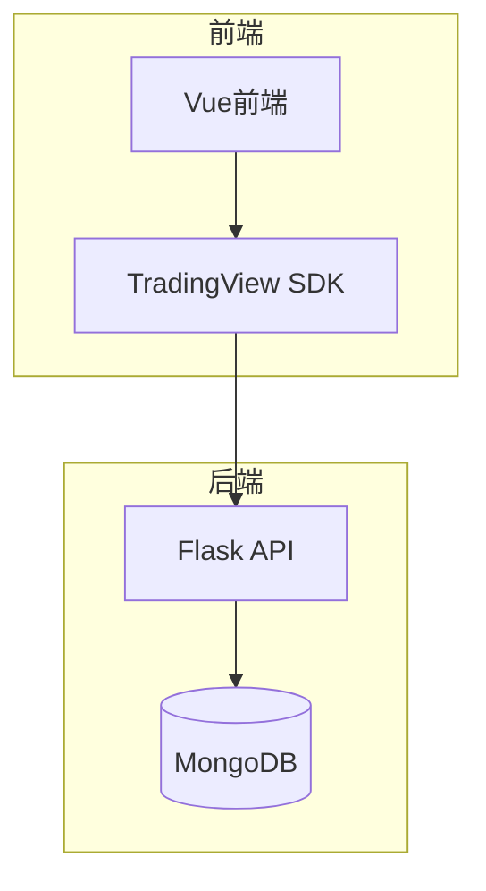
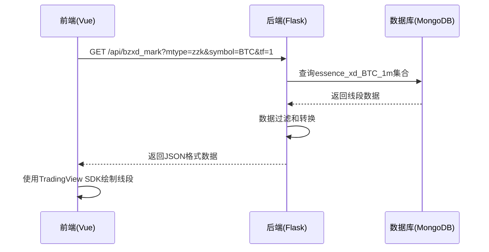
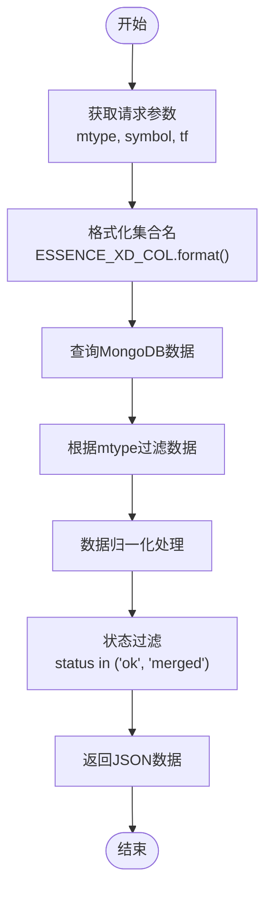
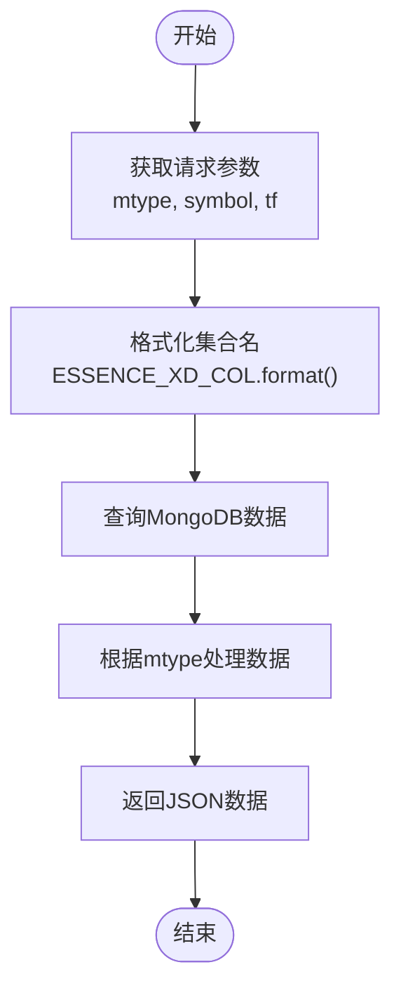
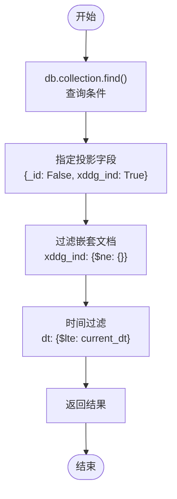
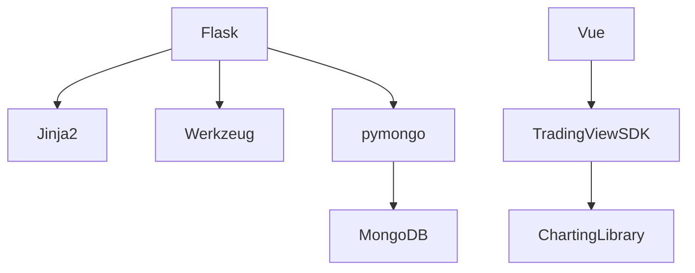

# 缠论分析数据接口实现

<cite>
**本文档引用的文件**   
- [chanapi.py](file://api/chanapi.py)
- [conf.py](file://comm/conf.py)
- [symbol_info.py](file://api/symbol_info.py)
- [ChanContainer.vue](file://ui/src/components/ChanContainer.vue)
</cite>

## 目录
1. [引言](#引言)
2. [项目结构](#项目结构)
3. [核心组件](#核心组件)
4. [架构概述](#架构概述)
5. [详细组件分析](#详细组件分析)
6. [依赖分析](#依赖分析)
7. [性能考虑](#性能考虑)
8. [故障排除指南](#故障排除指南)
9. [结论](#结论)

## 引言
本系统基于TradingView本地SDK构建，旨在为缠论量化研究提供可视化前后端解决方案。系统通过Python Flask后端提供API接口，前端使用Vue框架实现可视化功能。核心功能包括缠论结构标记、买卖点识别、中枢线绘制等，支持币圈和股票市场的多时间周期分析。系统采用MongoDB存储K线历史数据和缠论识别结果，实现了与TradingView的无缝集成。

## 项目结构
项目采用前后端分离架构，后端使用Flask框架提供API服务，前端使用Vue框架实现可视化界面。数据存储采用MongoDB，支持本地或云平台部署。系统通过TradingView的本地SDK实现K线分析功能，支持自定义按钮、线段、中枢等功能。



**图表来源**
- [ChanContainer.vue](file://ui/src/components/ChanContainer.vue#L1-L2845)
- [chanapi.py](file://api/chanapi.py#L1-L568)

**章节来源**
- [README.md](file://README.md#L1-L153)
- [project_structure](file://#L1-L50)

## 核心组件
系统核心组件包括缠论结构标记接口/bzxd_mark和/bzzs_mark，这些接口通过mtype参数实现多模式响应。接口从MongoDB中提取缠论特征数据，并根据前端可视化需求进行数据归一化处理。系统支持多种缠论结构的识别和可视化，包括线段、中枢、买卖点等。

**章节来源**
- [chanapi.py](file://api/chanapi.py#L280-L491)
- [chanapi.py](file://api/chanapi.py#L422-L491)

## 架构概述
系统采用分层架构设计，前端通过HTTP请求调用后端API接口获取数据，后端从MongoDB中查询并处理数据后返回给前端。前端使用TradingView SDK将数据可视化，支持多种图表类型和自定义指标。



**图表来源**
- [chanapi.py](file://api/chanapi.py#L280-L360)
- [ChanContainer.vue](file://ui/src/components/ChanContainer.vue#L1746-L1799)

## 详细组件分析

### /bzxd_mark接口分析
/bzxd_mark接口是系统的核心接口之一，负责处理缠论线段标记请求。接口通过mtype参数驱动多模式响应机制，支持多种请求类型，如zzk、xd_dg、zs_line等。



**图表来源**
- [chanapi.py](file://api/chanapi.py#L280-L360)

**章节来源**
- [chanapi.py](file://api/chanapi.py#L280-L360)

### /bzzs_mark接口分析
/bzzs_mark接口负责处理缠论中枢标记请求，与/bzxd_mark接口类似，也采用mtype参数驱动的多模式响应机制。



**图表来源**
- [chanapi.py](file://api/chanapi.py#L422-L491)

**章节来源**
- [chanapi.py](file://api/chanapi.py#L422-L491)

### 动态集合名生成规则
系统使用ESSENCE_XD_COL.format(sym=sym, tf=tf)动态生成MongoDB集合名称，实现不同标的和时间周期的数据隔离。

```mermaid
classDiagram
class CollectionNameGenerator {
+str ESSENCE_XD_COL = 'essence_xd_{sym}_{tf}'
+generate_name(sym, tf) str
}
CollectionNameGenerator --> "格式化" : 使用
"格式化" --> String : Python内置方法
```

**图表来源**
- [conf.py](file://comm/conf.py#L151)
- [chanapi.py](file://api/chanapi.py#L291)

**章节来源**
- [conf.py](file://comm/conf.py#L151)
- [chanapi.py](file://api/chanapi.py#L291)

### 嵌套文档过滤与投影技术
系统采用MongoDB的嵌套文档过滤与投影技术，高效提取所需数据。



**图表来源**
- [chanapi.py](file://api/chanapi.py#L319-L323)
- [chanapi.py](file://api/chanapi.py#L335-L339)

**章节来源**
- [chanapi.py](file://api/chanapi.py#L319-L339)

## 依赖分析
系统依赖于多个外部库和组件，包括Flask、MongoDB、TradingView SDK等。这些依赖关系通过Python的包管理工具进行管理。



**图表来源**
- [requirements.txt](file://api/requirements.txt)
- [package.json](file://ui/package.json)

## 性能考虑
系统在设计时考虑了性能优化，包括数据缓存、查询优化等方面。通过合理设计MongoDB索引和查询条件，提高数据检索效率。同时，前端采用数据分页和懒加载技术，减少网络传输量。

## 故障排除指南
常见问题包括数据加载失败、图表显示异常等。解决方法包括检查MongoDB连接、验证API接口、确认数据格式等。系统提供了详细的日志记录功能，便于问题排查。

**章节来源**
- [chanapi.py](file://api/chanapi.py#L560-L568)
- [README.md](file://README.md#L138-L142)

## 结论
本系统提供了一个完整的缠论分析解决方案，通过前后端分离架构实现了灵活的可视化功能。系统设计合理，扩展性强，可满足不同用户的缠论量化研究需求。未来可进一步优化数据处理算法，提高分析精度和效率。