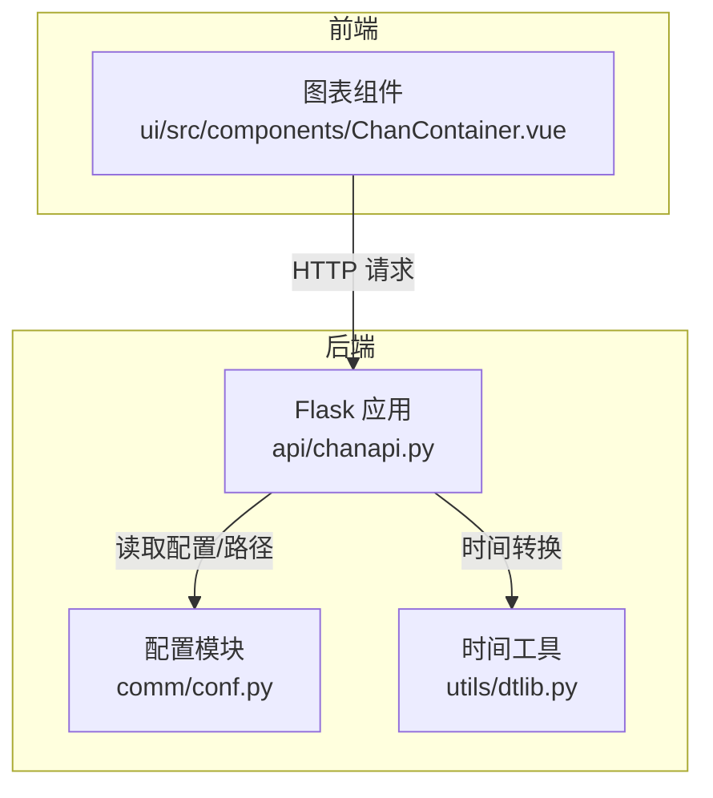
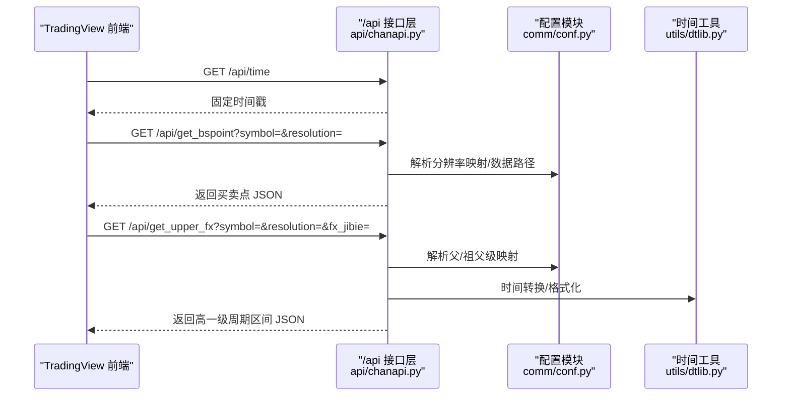
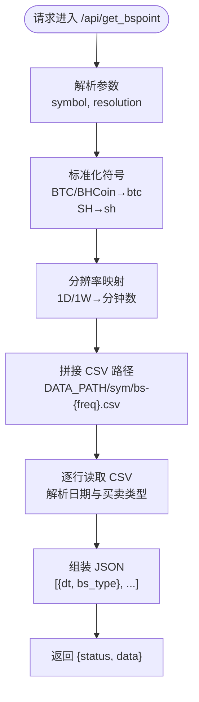
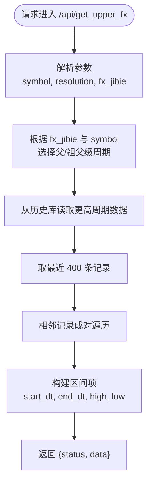
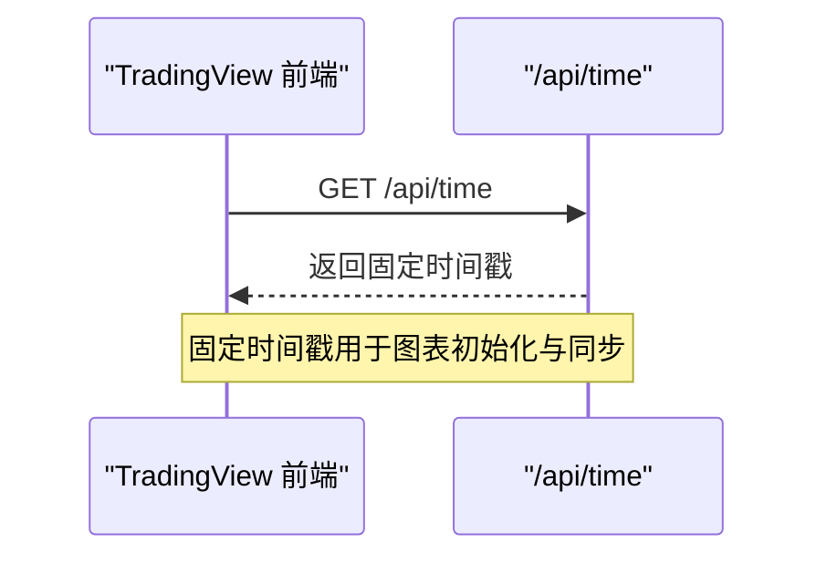
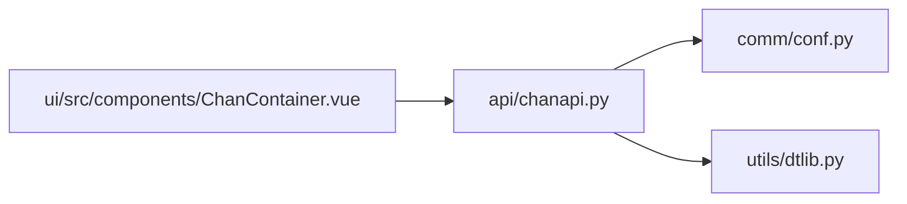

# 辅助功能接口实现

<cite>
**本文引用的文件**
- [chanapi.py](file://api/chanapi.py)
- [dtlib.py](file://utils/dtlib.py)
- [conf.py](file://comm/conf.py)
- [symbol_info.py](file://api/symbol_info.py)
- [ChanContainer.vue](file://ui/src/components/ChanContainer.vue)
</cite>

## 目录
1. [引言](#引言)
2. [项目结构](#项目结构)
3. [核心组件](#核心组件)
4. [架构总览](#架构总览)
5. [详细组件分析](#详细组件分析)
6. [依赖关系分析](#依赖关系分析)
7. [性能考量](#性能考量)
8. [故障排查指南](#故障排查指南)
9. [结论](#结论)
10. [附录](#附录)

## 引言
本文聚焦于三个辅助接口：/api/get_bspoint、/api/get_upper_fx 和 /api/time 的功能与实现细节，解释它们在策略验证与跨周期分析中的支撑作用，并对 /api/time 的设计目的与潜在改进方向进行讨论。读者无需深入编程背景，也能通过本文了解这些接口如何协同工作，为 TradingView 图表提供数据标注与时间同步能力。

## 项目结构
- 后端服务由 Flask 提供，路由集中在 api/chanapi.py 中，蓝图 NaturalChan 暴露多个 API。
- 数据与配置来自 comm/conf.py，包含时间周期映射、数据库连接、路径等。
- 时间工具位于 utils/dtlib.py，提供时间戳与字符串互转等基础能力。
- 前端通过 ui/src/components/ChanContainer.vue 调用后端接口，展示买卖点、分型、线段等标记。

图示来源
- [chanapi.py](file://api/chanapi.py#L1-L60)
- [conf.py](file://comm/conf.py#L1-L60)
- [dtlib.py](file://utils/dtlib.py#L140-L165)
- [ChanContainer.vue](file://ui/src/components/ChanContainer.vue#L1699-L1740)

章节来源
- [chanapi.py](file://api/chanapi.py#L1-L60)
- [conf.py](file://comm/conf.py#L1-L60)

## 核心组件
- /api/get_bspoint：从 CSV 文件加载买卖点数据，按 symbol 与 resolution 组合定位文件，解析每行的日期与买卖类型，返回 JSON 结构，便于前端在 TradingView 上绘制买卖标记。
- /api/get_upper_fx：在多级别分型识别中执行“时间周期向上追溯”，根据父级/祖父级映射规则，将当前级别数据映射到更高一级周期，输出相邻周期区间的起止时间与高低点，支持跨周期分析。
- /api/time：返回固定时间戳，用于 TradingView 的时间同步，确保前端图表显示稳定的时间基准。

章节来源
- [chanapi.py](file://api/chanapi.py#L237-L278)
- [chanapi.py](file://api/chanapi.py#L494-L558)
- [chanapi.py](file://api/chanapi.py#L237-L242)

## 架构总览
下图展示了 TradingView 前端与后端接口的交互流程，以及关键数据流与依赖关系。

图示来源
- [chanapi.py](file://api/chanapi.py#L237-L278)
- [chanapi.py](file://api/chanapi.py#L494-L558)
- [conf.py](file://comm/conf.py#L12-L21)
- [dtlib.py](file://utils/dtlib.py#L148-L155)

## 详细组件分析

### /api/get_bspoint：从 CSV 加载买卖点并返回 JSON
- 功能概述
  - 根据 symbol 与 resolution 参数，定位对应 CSV 文件（位于 DATA_PATH 下的 symbol 子目录）。
  - 逐行解析日期与买卖类型，组装为统一的 JSON 结构，便于前端在 TradingView 上绘制买卖标记。
- 关键实现要点
  - 符号标准化：将 BTC/BHCoin 映射为 btc，SH 映射为 sh，确保文件命名一致性。
  - 分辨率映射：将 1D/1W 映射为分钟数（如 1440/10080），以匹配 CSV 文件命名规范。
  - 数据组织：将每条记录封装为包含日期与买卖类型的对象，最终返回 status 与 data 字段。
- 前端集成
  - 前端按钮点击后调用 /api/bzxd_mark 并传入 mtype=bspoint，可直接从数据库集合读取买卖点；而 /api/get_bspoint 则从 CSV 文件读取，二者互补，满足不同场景需求。
- 错误与边界
  - 若 CSV 文件不存在或格式异常，需在接口层增加健壮性处理（例如返回空数组或错误码）。

图示来源
- [chanapi.py](file://api/chanapi.py#L244-L278)
- [conf.py](file://comm/conf.py#L12-L21)

章节来源
- [chanapi.py](file://api/chanapi.py#L244-L278)

### /api/get_upper_fx：多级别分型识别的时间周期向上追溯
- 功能概述
  - 在多级别分析中，将当前级别数据映射到父级或祖父级周期，输出相邻周期区间的起止时间与高低点，用于绘制跨周期分型矩形区域。
- 关键实现要点
  - 父级映射（fx_jibie=father）：
    - 15/30 分钟映射到 4 小时；240 分钟映射到日线；1D 映射到周线。
  - 祖父级映射（fx_jibie=grandpa）：
    - 对于币圈（BTC/BHCoin）：1/5 分钟映射到日线；15/30 分钟映射到日线；240 分钟映射到周线。
    - 对于股票（SH）：1/5 分钟映射到日线；15/30 分钟映射到周线。
  - 数据读取与处理：
    - 从历史数据库对应集合中读取更高一级周期的数据，转换为 DataFrame，取最近 400 条记录。
    - 两两配对相邻记录，构造起止时间与高低点，形成区间列表。
- 前端集成
  - 前端按钮注释中展示了调用方式，用于在 TradingView 上绘制上级别分型矩形区域，辅助跨周期分析与趋势确认。
- 错误与边界
  - 若目标集合不存在或数据不足，应返回空列表或错误提示；同时注意不同 symbol 的映射差异。

图示来源
- [chanapi.py](file://api/chanapi.py#L494-L558)
- [conf.py](file://comm/conf.py#L12-L21)

章节来源
- [chanapi.py](file://api/chanapi.py#L494-L558)

### /api/time：固定时间戳设计目的与改进方向
- 设计目的
  - TradingView 在首次加载图表时会请求时间接口以确定时间基准，返回固定时间戳可保证图表初始渲染稳定，避免因实时时间波动导致的显示不一致。
- 当前实现
  - 返回固定时间戳（基于特定日期），直接以文本响应形式返回。
- 潜在改进方向
  - 动态时间服务：根据当前系统时间或业务时间源返回实时时间戳，满足回放/复盘场景下的时间推进需求。
  - 多时区支持：结合配置模块中的时区信息，支持不同地区用户的本地时间显示。
  - 回放模式适配：在回放/重播模式下，时间戳应与回放进度保持一致，避免与实际交易时间冲突。
  - 安全与缓存：考虑缓存策略与跨域安全头，确保接口稳定与安全。

图示来源
- [chanapi.py](file://api/chanapi.py#L237-L242)

章节来源
- [chanapi.py](file://api/chanapi.py#L237-L242)

## 依赖关系分析
- 接口依赖
  - /api/get_bspoint 依赖 DATA_PATH 与 RESOU_DICT，用于定位 CSV 文件与分辨率映射。
  - /api/get_upper_fx 依赖 RESOU_DICT、TF_SEC_MAP 与 HIST_DB，用于周期映射与历史数据读取。
  - /api/time 不依赖外部数据，但与 TradingView 的时间同步机制相关。
- 时间工具依赖
  - /api/get_upper_fx 使用 utils/dtlib 的时间转换函数，确保日期字符串与时间戳的正确转换。
- 前端依赖
  - 前端按钮事件调用后端接口，实现买卖点、分型、线段等标记的可视化。

图示来源
- [chanapi.py](file://api/chanapi.py#L1-L60)
- [conf.py](file://comm/conf.py#L12-L21)
- [dtlib.py](file://utils/dtlib.py#L148-L155)
- [ChanContainer.vue](file://ui/src/components/ChanContainer.vue#L1699-L1740)

章节来源
- [chanapi.py](file://api/chanapi.py#L1-L60)
- [conf.py](file://comm/conf.py#L12-L21)
- [dtlib.py](file://utils/dtlib.py#L148-L155)
- [ChanContainer.vue](file://ui/src/components/ChanContainer.vue#L1699-L1740)

## 性能考量
- /api/get_bspoint
  - CSV 文件读取为顺序扫描，建议在高频调用场景下引入缓存或预加载策略，减少磁盘 IO。
  - 对于大型 CSV，可考虑分页或增量加载，避免一次性读取全部数据。
- /api/get_upper_fx
  - 读取历史数据并转换为 DataFrame，建议限制返回条数（当前已限制为 400 条），并在数据库侧建立索引以提升查询性能。
  - 相邻配对遍历为 O(n)，整体复杂度可控，但需关注 DataFrame 内存占用。
- /api/time
  - 无外部依赖，性能开销极低，适合频繁调用。

## 故障排查指南
- /api/get_bspoint
  - 症状：返回空数据或报错。
  - 排查：确认 CSV 文件是否存在且命名符合 DATA_PATH/sym/bs-{freq}.csv 规范；检查符号标准化是否正确；确认分辨率映射是否命中预期分钟数。
- /api/get_upper_fx
  - 症状：返回空数据或周期映射错误。
  - 排查：核对 fx_jibie 与 symbol 的映射规则；确认目标集合存在且有足够历史数据；检查 TF_SEC_MAP 与 RESOU_DICT 是否一致。
- /api/time
  - 症状：图表时间显示异常。
  - 排查：确认返回的是固定时间戳；若改为动态时间，需确保与回放/重播进度一致。

章节来源
- [chanapi.py](file://api/chanapi.py#L244-L278)
- [chanapi.py](file://api/chanapi.py#L494-L558)
- [chanapi.py](file://api/chanapi.py#L237-L242)

## 结论
- /api/get_bspoint 提供了从 CSV 加载买卖点的能力，配合前端可在 TradingView 上直观展示策略信号，适用于策略验证与回测标注。
- /api/get_upper_fx 通过父/祖父级映射，实现了多级别分型识别的跨周期分析，帮助用户在更高周期维度审视当前走势，提升分析深度。
- /api/time 的固定时间戳设计保障了 TradingView 的时间同步稳定性；未来可考虑动态时间服务以适配回放与复盘场景。
- 三者共同构成了策略验证与跨周期分析的重要基础设施，建议在生产环境中加入缓存、索引与错误处理等优化措施，以提升稳定性与性能。

## 附录
- 前端调用示例（来自前端组件）
  - 买卖点：/api/bzxd_mark?mtype=bspoint&tf={resolution}&symbol={symbol}
  - 上级分型：/api/get_upper_fx?fx_jibie=father&resolution={resolution}&symbol={symbol}
  - 日线线段：/api/bzzs_mark?mtype=czxd_dg&tf={resolution}&symbol={symbol}

章节来源
- [ChanContainer.vue](file://ui/src/components/ChanContainer.vue#L2145-L2195)
- [ChanContainer.vue](file://ui/src/components/ChanContainer.vue#L1699-L1740)
- [ChanContainer.vue](file://ui/src/components/ChanContainer.vue#L2320-L2344)