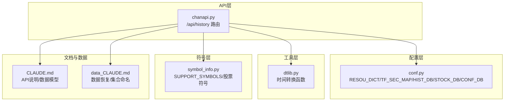
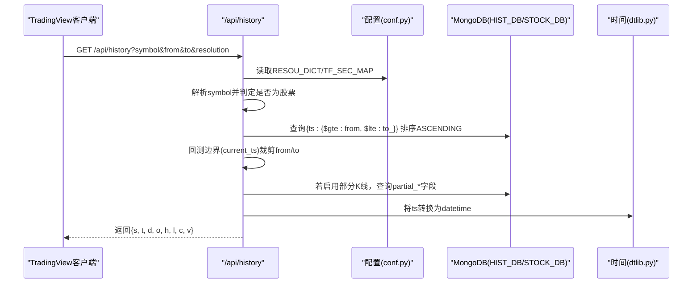
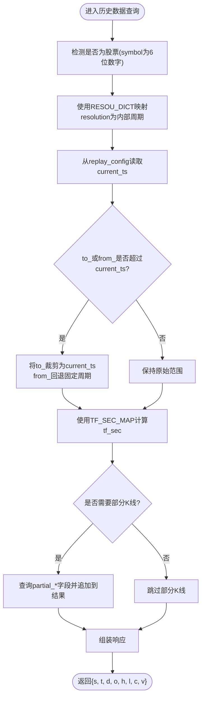
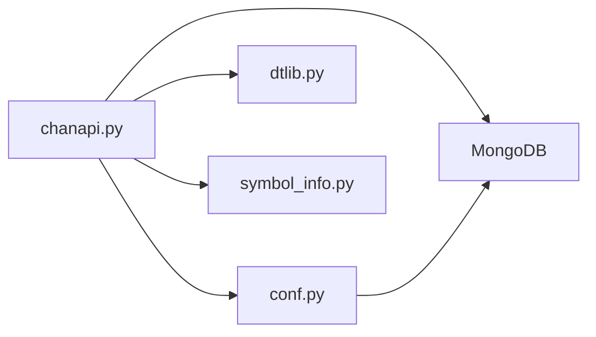

# 历史数据API

<cite>
**本文引用的文件**
- [chanapi.py](file://api/chanapi.py)
- [conf.py](file://comm/conf.py)
- [dtlib.py](file://utils/dtlib.py)
- [symbol_info.py](file://api/symbol_info.py)
- [CLAUDE.md](file://api/CLAUDE.md)
- [data_CLAUDE.md](file://data/CLAUDE.md)
</cite>

## 目录
1. [简介](#简介)
2. [项目结构](#项目结构)
3. [核心组件](#核心组件)
4. [架构总览](#架构总览)
5. [详细组件分析](#详细组件分析)
6. [依赖关系分析](#依赖关系分析)
7. [性能考量](#性能考量)
8. [故障排查指南](#故障排查指南)
9. [结论](#结论)
10. [附录](#附录)

## 简介
本文件针对历史数据API（/api/history）进行深入技术文档化，重点覆盖以下方面：
- 参数处理逻辑：symbol、from/to时间戳、resolution周期的映射机制
- RESOU_DICT配置字典如何将TradingView的分辨率字符串（如'1D'）转换为内部表示（如'1440'）
- 时间范围限制逻辑，特别是回测模式下current_ts的边界控制机制
- K线数据查询的MongoDB查询构造，包括时间范围过滤($gte/$lte)和排序(ASCENDING)
- 响应数据结构（'s', 't', 'd', 'o', 'h', 'l', 'c', 'v'）的构造过程，以及部分K线(partial_kline)的特殊处理逻辑
- 性能优化建议，如索引创建和数据分页策略

## 项目结构
围绕历史数据API的关键文件与职责如下：
- API路由与业务逻辑：api/chanapi.py
- 配置与常量：comm/conf.py（包含RESOU_DICT、TF_SEC_MAP、数据库连接等）
- 时间工具：utils/dtlib.py（时间戳与日期互转）
- 符号与支持列表：api/symbol_info.py
- 文档与数据模型参考：api/CLAUDE.md、data/CLAUDE.md

图表来源
- [chanapi.py](file://api/chanapi.py#L96-L235)
- [conf.py](file://comm/conf.py#L1-L166)
- [dtlib.py](file://utils/dtlib.py#L148-L155)
- [symbol_info.py](file://api/symbol_info.py#L1-L74)
- [CLAUDE.md](file://api/CLAUDE.md#L66-L120)
- [data_CLAUDE.md](file://data/CLAUDE.md#L45-L123)

章节来源
- [chanapi.py](file://api/chanapi.py#L96-L235)
- [conf.py](file://comm/conf.py#L1-L166)
- [dtlib.py](file://utils/dtlib.py#L148-L155)
- [symbol_info.py](file://api/symbol_info.py#L1-L74)
- [CLAUDE.md](file://api/CLAUDE.md#L66-L120)
- [data_CLAUDE.md](file://data/CLAUDE.md#L45-L123)

## 核心组件
- 历史数据路由：负责接收请求参数、解析与校验、构建MongoDB查询、处理回测边界与部分K线、组装响应
- 配置字典与映射：
  - RESOU_DICT：将TradingView分辨率字符串映射为内部周期标识
  - TF_SEC_MAP：将内部周期标识映射为秒数，用于时间边界计算与周期对齐
- 时间工具：提供时间戳与本地字符串互转，辅助响应中的datetime字段
- 符号与支持列表：提供symbol解析与股票代码识别逻辑

章节来源
- [chanapi.py](file://api/chanapi.py#L96-L235)
- [conf.py](file://comm/conf.py#L12-L31)
- [dtlib.py](file://utils/dtlib.py#L148-L155)
- [symbol_info.py](file://api/symbol_info.py#L1-L74)

## 架构总览
历史数据API的调用链路如下：

图表来源
- [chanapi.py](file://api/chanapi.py#L96-L235)
- [conf.py](file://comm/conf.py#L12-L31)
- [dtlib.py](file://utils/dtlib.py#L148-L155)

## 详细组件分析

### 参数处理与映射机制
- symbol解析：
  - 若输入为6位数字（股票代码），自动切换到STOCK_DB，并将symbol前缀改为“stk_”
- resolution映射：
  - 使用RESOU_DICT将TradingView分辨率字符串映射为内部周期标识
  - 对于'1D'/'1W'等，内部可能进一步映射为数值（如1440/10080），以便后续秒级计算
- 时间戳处理：
  - from/to均为Unix时间戳，直接参与MongoDB查询构造
  - 使用TF_SEC_MAP将内部周期标识转换为秒数，用于边界对齐与部分K线计算

章节来源
- [chanapi.py](file://api/chanapi.py#L102-L124)
- [conf.py](file://comm/conf.py#L12-L31)

### RESOU_DICT配置字典映射详解
- TradingView分辨率字符串到内部周期标识的映射：
  - 例如："1" -> "1m"、"5" -> "5m"、"15" -> "15m"、"30" -> "30m"、"60" -> "1h"、"240" -> "4h"、"1D" -> "1d"、"1W" -> "1w"
- 内部周期标识到秒数的映射：
  - TF_SEC_MAP提供各周期的秒数，用于计算K线数量与边界对齐

章节来源
- [conf.py](file://comm/conf.py#L12-L31)

### 时间范围限制与回测边界控制
- current_ts边界：
  - 从CONF_DB的replay_config集合读取current_ts，作为回测的“当前时刻”
  - 若to_或from_超过current_ts，则将两者裁剪至current_ts附近
- 边界宽度：
  - 在裁剪后，from_会回退一定周期长度（基于tf_sec与固定倍数）以保证数据连续性
- 周期对齐与部分K线：
  - 当current_ts不严格对齐到tf_sec的整数倍，或从小级别跳到大级别且恰好到达整数周期时，启用部分K线（partial_kline）

图表来源
- [chanapi.py](file://api/chanapi.py#L125-L207)
- [conf.py](file://comm/conf.py#L24-L31)

章节来源
- [chanapi.py](file://api/chanapi.py#L125-L207)

### MongoDB查询构造与排序
- 集合选择：
  - 非股票：使用HIST_DB，集合名为“{symbol}_{tf}”
  - 股票：使用STOCK_DB，集合名为“stk_{symbol}”
- 查询条件：
  - 时间范围过滤：ts >= from 且 ts <= to_
  - 排序：按ts升序（ASCENDING）
- 部分K线查询：
  - 当启用部分K线时，从同一symbol集合读取partial_*字段，构造partial_kline并追加到结果末尾

章节来源
- [chanapi.py](file://api/chanapi.py#L171-L207)
- [conf.py](file://comm/conf.py#L143-L147)

### 响应数据结构与部分K线处理
- 响应字段：
  - s: 状态码（'ok'或'no_data'）
  - t: 时间戳数组（ts）
  - d: 本地日期字符串数组（datetime）
  - o/h/l/c/v: 开高低收与成交量数组
- 特殊处理：
  - 当存在部分K线时，将其ts对齐到当前周期起点（按tf_sec对齐），并填充open/high/low/close/volume
  - 若查询无数据，返回's': 'no_data'并提供nextTime（最新ts）

章节来源
- [chanapi.py](file://api/chanapi.py#L215-L234)
- [dtlib.py](file://utils/dtlib.py#L148-L155)

### 股票代码识别与数据库切换
- 股票识别：
  - 使用正则匹配6位数字作为股票代码
- 数据库切换：
  - 切换到STOCK_DB，并将symbol前缀改为“stk_”，集合命名遵循“stk_{code}”
- 符号支持：
  - 通过symbol_info.py构建SUPPORT_SYMBOLS，包含股票与加密货币的描述信息

章节来源
- [chanapi.py](file://api/chanapi.py#L112-L116)
- [symbol_info.py](file://api/symbol_info.py#L42-L74)

## 依赖关系分析
- 外部依赖：
  - Flask：提供Web服务与路由
  - PyMongo：MongoDB访问
  - Arrow：时间处理（用于配置中的时间范围）
- 内部依赖：
  - conf.py：提供数据库连接、周期映射、常量
  - dtlib.py：提供时间戳与本地时间互转
  - symbol_info.py：提供符号支持列表与股票信息

图表来源
- [chanapi.py](file://api/chanapi.py#L1-L20)
- [conf.py](file://comm/conf.py#L143-L147)
- [dtlib.py](file://utils/dtlib.py#L1-L20)
- [symbol_info.py](file://api/symbol_info.py#L1-L20)

章节来源
- [chanapi.py](file://api/chanapi.py#L1-L20)
- [conf.py](file://comm/conf.py#L143-L147)
- [dtlib.py](file://utils/dtlib.py#L1-L20)
- [symbol_info.py](file://api/symbol_info.py#L1-L20)

## 性能考量
- 索引建议：
  - 在集合“{symbol}_{tf}”上为字段ts建立升序索引，以加速时间范围查询
  - 在集合“{symbol}”上为字段ts建立索引，以加速部分K线查询
- 分页策略：
  - 当查询范围过大时，可考虑分批拉取（如按固定天数切片），避免一次性返回过多数据
- 缓存策略：
  - 对热点symbol+resolution组合的结果进行短期缓存，降低重复查询压力
- 数据库连接：
  - 使用连接池，减少连接开销
- 响应体积：
  - 控制返回的K线数量，避免超大数据包传输

章节来源
- [chanapi.py](file://api/chanapi.py#L171-L178)
- [CLAUDE.md](file://api/CLAUDE.md#L166-L170)

## 故障排查指南
- 常见问题与定位：
  - 无数据返回：检查集合是否存在、索引是否缺失、时间范围是否超出current_ts
  - 时间错位：确认TF_SEC_MAP与RESOU_DICT映射是否一致，ts与datetime转换是否正确
  - 股票数据异常：确认symbol是否为6位数字，数据库是否切换到STOCK_DB
- 日志与调试：
  - API中打印了查询条件与最新ts，便于定位问题
  - 可在本地开启调试模式，观察回测边界与部分K线逻辑

章节来源
- [chanapi.py](file://api/chanapi.py#L208-L214)
- [CLAUDE.md](file://api/CLAUDE.md#L166-L170)

## 结论
历史数据API通过清晰的参数映射、严格的回测边界控制与高效的MongoDB查询，实现了对不同周期与品种的统一访问。配合合理的索引与分页策略，可在保证数据准确性的同时提升整体性能。建议在生产环境中完善错误处理与监控，并持续优化热点数据的缓存策略。

## 附录
- API端点与参数
  - 端点：/api/history
  - 方法：GET
  - 参数：
    - symbol：交易品种
    - from：起始Unix时间戳
    - to：结束Unix时间戳
    - resolution：时间周期（如"1"、"5"、"30"、"240"、"1D"、"1W"）
  - 返回：
    - s：状态（'ok'/'no_data'）
    - t：时间戳数组
    - d：本地日期字符串数组
    - o/h/l/c/v：开盘/最高/最低/收盘/成交量数组
    - 当无数据时，额外返回nextTime（最新ts）

章节来源
- [chanapi.py](file://api/chanapi.py#L96-L235)
- [CLAUDE.md](file://api/CLAUDE.md#L66-L120)