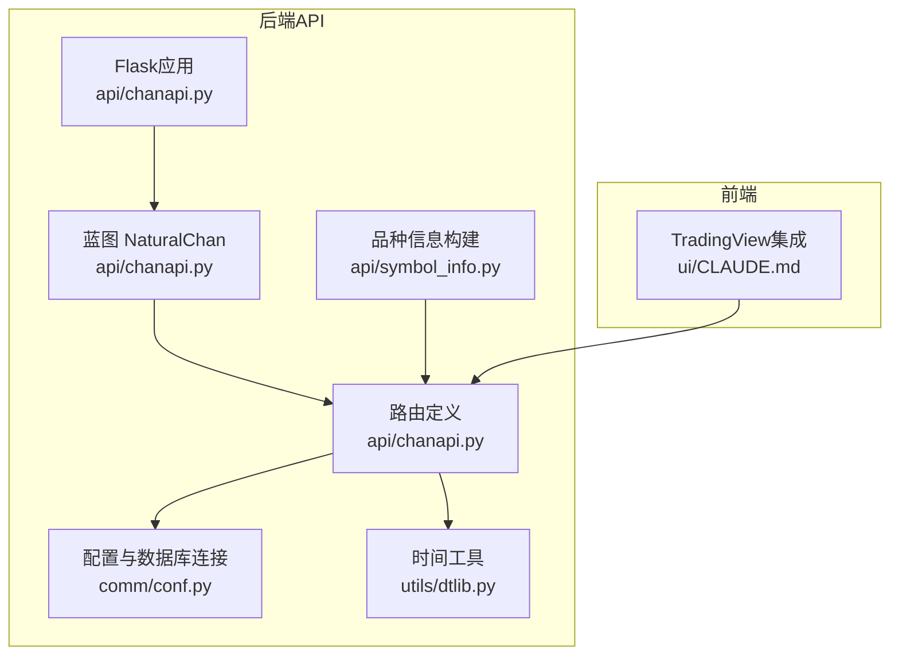
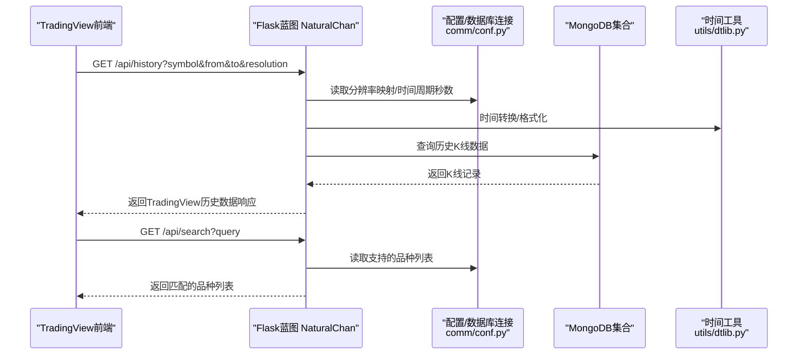
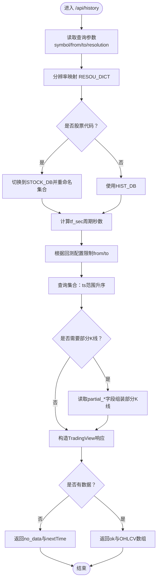
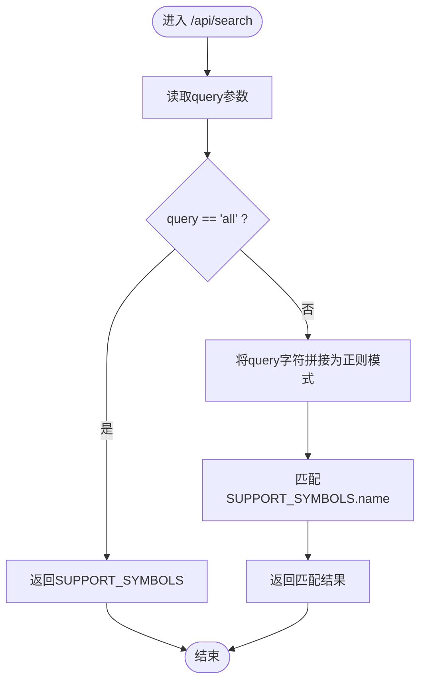
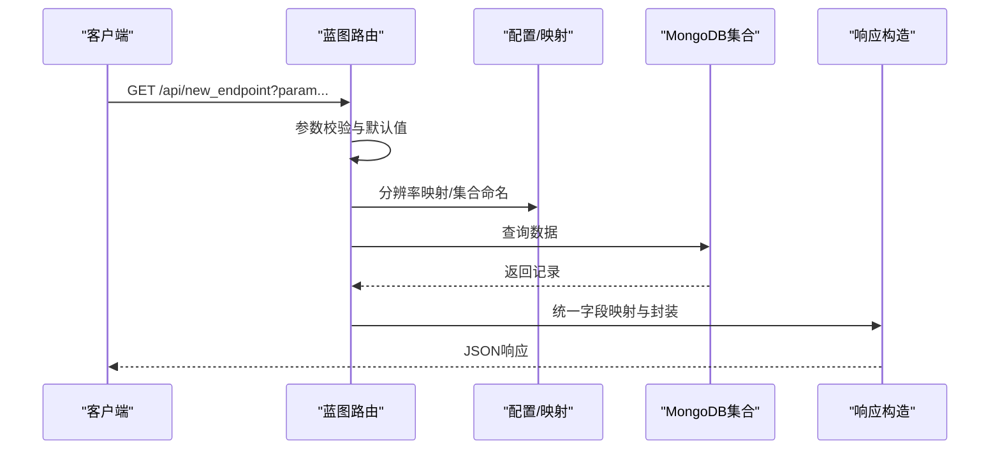
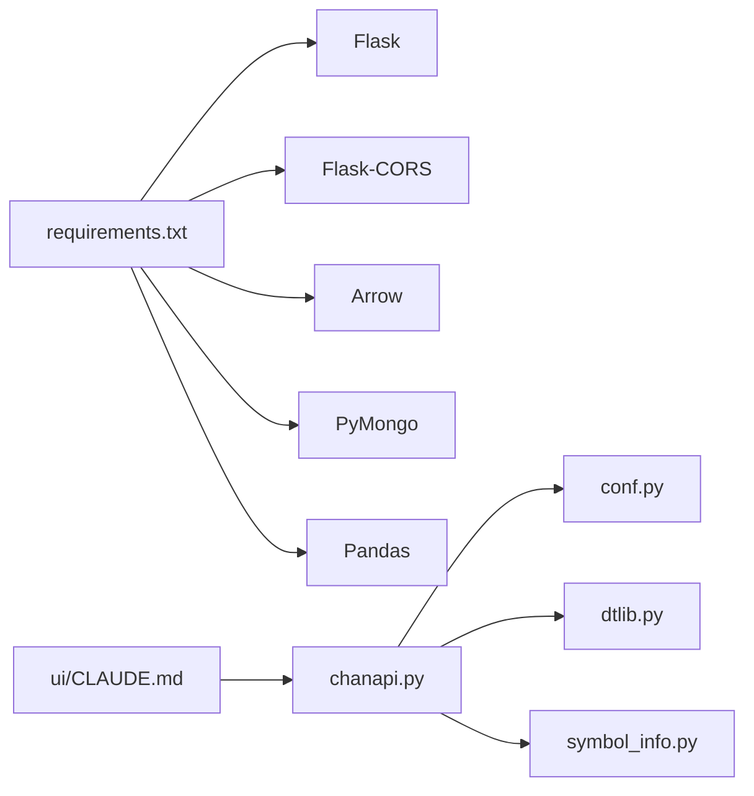

# 后端API扩展

<cite>
**本文引用的文件**
- [chanapi.py](file://api/chanapi.py)
- [symbol_info.py](file://api/symbol_info.py)
- [conf.py](file://comm/conf.py)
- [dtlib.py](file://utils/dtlib.py)
- [requirements.txt](file://api/requirements.txt)
- [CLAUDE.md](file://api/CLAUDE.md)
- [ui_CLAUDE.md](file://ui/CLAUDE.md)
</cite>

## 目录
1. [简介](#简介)
2. [项目结构](#项目结构)
3. [核心组件](#核心组件)
4. [架构总览](#架构总览)
5. [详细组件分析](#详细组件分析)
6. [依赖关系分析](#依赖关系分析)
7. [性能考量](#性能考量)
8. [故障排查指南](#故障排查指南)
9. [结论](#结论)
10. [附录](#附录)

## 简介
本文件面向后端开发者，系统性讲解如何在现有Flask蓝图基础上新增RESTful API端点，重点以/bzxd_mark、get_bspoint等接口为范例，说明：
- 使用Flask路由装饰器定义新接口
- 处理查询参数与参数校验
- 连接MongoDB数据库获取数据
- 构造符合TradingView规范的响应格式
- 深入解析历史数据接口(/api/history)与品种搜索接口(/api/search)的实现逻辑，包括时间序列处理、分辨率映射与符号匹配规则
- 提供新增API端点的完整实践步骤，包含错误处理、数据验证与性能优化建议

## 项目结构
后端API位于api/目录，采用Flask蓝图组织路由，核心文件如下：
- api/chanapi.py：Flask应用与蓝图、路由定义、MongoDB访问、TradingView响应构造
- api/symbol_info.py：支持的交易品种列表构建
- comm/conf.py：全局配置、数据库连接、分辨率映射、常量定义
- utils/dtlib.py：时间转换工具
- api/requirements.txt：后端依赖
- api/CLAUDE.md：API模块文档（含接口说明、数据模型、性能建议）
- ui/CLAUDE.md：前端与TradingView集成说明

**图表来源**
- [chanapi.py](file://api/chanapi.py#L23-L568)
- [symbol_info.py](file://api/symbol_info.py#L1-L74)
- [conf.py](file://comm/conf.py#L1-L166)
- [dtlib.py](file://utils/dtlib.py#L1-L207)
- [ui_CLAUDE.md](file://ui/CLAUDE.md#L82-L120)

**章节来源**
- [chanapi.py](file://api/chanapi.py#L23-L568)
- [symbol_info.py](file://api/symbol_info.py#L1-L74)
- [conf.py](file://comm/conf.py#L1-L166)
- [dtlib.py](file://utils/dtlib.py#L1-L207)
- [requirements.txt](file://api/requirements.txt#L1-L9)
- [CLAUDE.md](file://api/CLAUDE.md#L1-L209)
- [ui_CLAUDE.md](file://ui/CLAUDE.md#L82-L120)

## 核心组件
- Flask应用与蓝图
  - 应用实例与蓝图注册，便于模块化组织路由
  - 参考：[chanapi.py](file://api/chanapi.py#L23-L568)
- 配置与数据库连接
  - 分辨率映射、时间周期秒数映射、数据库连接、集合命名模板
  - 参考：[conf.py](file://comm/conf.py#L1-L166)
- 时间工具
  - 时间戳与字符串互转、本地时间转换
  - 参考：[dtlib.py](file://utils/dtlib.py#L1-L207)
- 品种信息
  - 支持的交易品种列表构建（加密货币与股票）
  - 参考：[symbol_info.py](file://api/symbol_info.py#L1-L74)
- TradingView响应构造
  - 历史数据响应字段、配置接口返回、标记数据返回
  - 参考：[chanapi.py](file://api/chanapi.py#L41-L235)

**章节来源**
- [chanapi.py](file://api/chanapi.py#L23-L235)
- [conf.py](file://comm/conf.py#L1-L166)
- [dtlib.py](file://utils/dtlib.py#L1-L207)
- [symbol_info.py](file://api/symbol_info.py#L1-L74)

## 架构总览
后端API通过蓝图集中管理路由，统一处理请求参数、访问MongoDB、构造TradingView兼容的响应。前端通过UDF兼容数据源对接后端接口。

**图表来源**
- [chanapi.py](file://api/chanapi.py#L61-L235)
- [conf.py](file://comm/conf.py#L1-L166)
- [dtlib.py](file://utils/dtlib.py#L1-L207)

## 详细组件分析

### 历史数据接口 /api/history 的实现逻辑
- 查询参数处理
  - symbol：交易品种标识
  - from/to：Unix时间戳范围
  - resolution：时间周期（如1、5、30、240、1D、1W等）
  - 参考：[chanapi.py](file://api/chanapi.py#L96-L110)
- 分辨率映射与数据库选择
  - 使用RESOU_DICT将用户输入映射到内部周期标识
  - 股票代码识别：若symbol为6位数字，则切换到STOCK_DB并按约定命名集合
  - 参考：[chanapi.py](file://api/chanapi.py#L107-L116)，[conf.py](file://comm/conf.py#L12-L21)
- 时间序列与回测约束
  - 读取回测配置中的current_ts，限制查询范围不超过当前回测时间
  - 计算tf_sec（周期秒数），用于判断是否使用部分K线
  - 参考：[chanapi.py](file://api/chanapi.py#L117-L171)，[conf.py](file://comm/conf.py#L23-L31)
- 部分K线处理
  - 当处于大级别周期末尾且存在部分K线时，从partial_*字段拼装一条部分K线并追加到结果
  - 参考：[chanapi.py](file://api/chanapi.py#L185-L207)
- 响应构造（TradingView规范）
  - 返回字段：s（状态）、t（时间戳数组）、d（日期字符串数组）、o/h/l/c/v（OHLCV数组）
  - 无数据时返回no_data与nextTime
  - 参考：[chanapi.py](file://api/chanapi.py#L215-L234)

**图表来源**
- [chanapi.py](file://api/chanapi.py#L96-L234)
- [conf.py](file://comm/conf.py#L12-L31)

**章节来源**
- [chanapi.py](file://api/chanapi.py#L96-L234)
- [conf.py](file://comm/conf.py#L12-L31)

### 品种搜索接口 /api/search 的实现逻辑
- 查询参数
  - query：搜索关键词
  - 参考：[chanapi.py](file://api/chanapi.py#L61-L73)
- 符号匹配规则
  - 若query为all，直接返回全部支持的品种
  - 否则对query字符进行正则通配拼接，匹配SUPPORT_SYMBOLS中name字段
  - 参考：[chanapi.py](file://api/chanapi.py#L66-L72)，[symbol_info.py](file://api/symbol_info.py#L1-L74)

**图表来源**
- [chanapi.py](file://api/chanapi.py#L61-L73)
- [symbol_info.py](file://api/symbol_info.py#L1-L74)

**章节来源**
- [chanapi.py](file://api/chanapi.py#L61-L73)
- [symbol_info.py](file://api/symbol_info.py#L1-L74)

### 新增API端点的完整步骤（以/bzxd_mark、get_bspoint为例）
- 步骤1：定义路由与参数
  - 使用蓝图装饰器定义新路由，读取查询参数（如symbol、resolution、mtype等）
  - 参考：[chanapi.py](file://api/chanapi.py#L244-L278)，[chanapi.py](file://api/chanapi.py#L280-L420)
- 步骤2：参数校验与默认值
  - 对必填参数进行非空校验，必要时提供默认值
  - 参考：[chanapi.py](file://api/chanapi.py#L28-L39)
- 步骤3：分辨率映射与集合选择
  - 使用RESOU_DICT将用户输入映射到内部周期标识
  - 根据业务类型选择数据库与集合（如CHANE_DB、HIST_DB）
  - 参考：[chanapi.py](file://api/chanapi.py#L289-L291)，[conf.py](file://comm/conf.py#L12-L21)
- 步骤4：MongoDB查询与数据处理
  - 构造查询条件与投影字段，读取数据并进行必要的字段映射或聚合
  - 参考：[chanapi.py](file://api/chanapi.py#L316-L360)，[chanapi.py](file://api/chanapi.py#L411-L413)
- 步骤5：响应构造（TradingView规范）
  - 统一返回status与data字段，或按历史数据规范返回t/d/o/h/l/c/v等字段
  - 参考：[chanapi.py](file://api/chanapi.py#L273-L277)，[chanapi.py](file://api/chanapi.py#L415-L418)

**图表来源**
- [chanapi.py](file://api/chanapi.py#L28-L39)
- [chanapi.py](file://api/chanapi.py#L289-L360)
- [chanapi.py](file://api/chanapi.py#L411-L418)
- [conf.py](file://comm/conf.py#L12-L21)

**章节来源**
- [chanapi.py](file://api/chanapi.py#L28-L39)
- [chanapi.py](file://api/chanapi.py#L244-L420)
- [conf.py](file://comm/conf.py#L12-L21)

### 新增API端点的代码示例（步骤指引）
以下为新增端点的完整步骤说明（不直接粘贴代码）：
- 在蓝图上新增路由装饰器，定义HTTP方法与路径
  - 示例参考：[chanapi.py](file://api/chanapi.py#L41-L58)
- 读取查询参数并进行非空校验
  - 示例参考：[chanapi.py](file://api/chanapi.py#L28-L39)
- 解析与映射分辨率
  - 示例参考：[chanapi.py](file://api/chanapi.py#L289-L291)，[conf.py](file://comm/conf.py#L12-L21)
- 连接MongoDB并执行查询
  - 示例参考：[chanapi.py](file://api/chanapi.py#L316-L360)
- 构造符合TradingView规范的响应
  - 历史数据响应字段：s、t、d、o、h、l、c、v
  - 示例参考：[chanapi.py](file://api/chanapi.py#L215-L234)
- 注册蓝图并启动服务
  - 示例参考：[chanapi.py](file://api/chanapi.py#L560-L568)

**章节来源**
- [chanapi.py](file://api/chanapi.py#L41-L58)
- [chanapi.py](file://api/chanapi.py#L28-L39)
- [chanapi.py](file://api/chanapi.py#L289-L291)
- [chanapi.py](file://api/chanapi.py#L316-L360)
- [chanapi.py](file://api/chanapi.py#L215-L234)
- [chanapi.py](file://api/chanapi.py#L560-L568)

## 依赖关系分析
- 组件耦合
  - 蓝图路由依赖配置模块提供的映射与数据库连接
  - 历史数据接口同时依赖时间工具与配置模块
  - 参考：[chanapi.py](file://api/chanapi.py#L17-L21)
- 外部依赖
  - Flask、Flask-CORS、Arrow、PyMongo、Pandas
  - 参考：[requirements.txt](file://api/requirements.txt#L1-L9)
- 接口契约
  - TradingView前端通过UDF兼容数据源调用后端接口
  - 参考：[ui_CLAUDE.md](file://ui/CLAUDE.md#L82-L120)

**图表来源**
- [requirements.txt](file://api/requirements.txt#L1-L9)
- [chanapi.py](file://api/chanapi.py#L17-L21)
- [conf.py](file://comm/conf.py#L1-L166)
- [dtlib.py](file://utils/dtlib.py#L1-L207)
- [symbol_info.py](file://api/symbol_info.py#L1-L74)
- [ui_CLAUDE.md](file://ui/CLAUDE.md#L82-L120)

**章节来源**
- [requirements.txt](file://api/requirements.txt#L1-L9)
- [chanapi.py](file://api/chanapi.py#L17-L21)
- [conf.py](file://comm/conf.py#L1-L166)
- [dtlib.py](file://utils/dtlib.py#L1-L207)
- [symbol_info.py](file://api/symbol_info.py#L1-L74)
- [ui_CLAUDE.md](file://ui/CLAUDE.md#L82-L120)

## 性能考量
- 索引优化
  - 为常用查询字段（如ts、datetime、symbol等）建立索引，提升查询效率
  - 参考：[CLAUDE.md](file://api/CLAUDE.md#L166-L170)
- 分页与批量处理
  - 对大数据量查询采用分页或批量处理，避免一次性返回过多数据
  - 参考：[CLAUDE.md](file://api/CLAUDE.md#L166-L170)
- 缓存策略
  - 对热点数据引入缓存（如Redis），降低数据库压力
  - 参考：[CLAUDE.md](file://api/CLAUDE.md#L166-L170)
- 时间序列处理
  - 使用TF_SEC_MAP与RESOU_DICT进行周期换算，避免重复计算
  - 参考：[conf.py](file://comm/conf.py#L23-L31)

**章节来源**
- [CLAUDE.md](file://api/CLAUDE.md#L166-L170)
- [conf.py](file://comm/conf.py#L23-L31)

## 故障排查指南
- 常见错误与处理
  - 参数为空：使用非空校验函数返回统一错误格式
    - 参考：[chanapi.py](file://api/chanapi.py#L28-L39)
  - 无数据返回：历史数据接口在无数据时返回no_data与nextTime
    - 参考：[chanapi.py](file://api/chanapi.py#L215-L222)
  - 分辨率映射错误：确认RESOU_DICT与TF_SEC_MAP配置
    - 参考：[conf.py](file://comm/conf.py#L12-L31)
  - 数据库连接失败：检查MongoDB连接与集合命名模板
    - 参考：[conf.py](file://comm/conf.py#L143-L158)
- 日志与调试
  - 使用日志记录关键操作，便于定位问题
  - 参考：[conf.py](file://comm/conf.py#L139-L141)

**章节来源**
- [chanapi.py](file://api/chanapi.py#L28-L39)
- [chanapi.py](file://api/chanapi.py#L215-L222)
- [conf.py](file://comm/conf.py#L12-L31)
- [conf.py](file://comm/conf.py#L139-L158)

## 结论
通过以上分析可知，新增后端API端点的关键在于：
- 使用蓝图统一管理路由，遵循参数校验与默认值策略
- 正确映射分辨率与数据库集合，确保查询范围与回测约束一致
- 严格遵循TradingView响应规范，保证前后端兼容
- 引入索引、缓存与分页等性能优化手段，提升系统稳定性与吞吐能力

## 附录
- 启动与运行
  - 安装依赖并启动Flask服务
  - 参考：[CLAUDE.md](file://api/CLAUDE.md#L1-L209)
- TradingView集成
  - 前端通过UDF兼容数据源对接后端接口
  - 参考：[ui_CLAUDE.md](file://ui/CLAUDE.md#L82-L120)

**章节来源**
- [CLAUDE.md](file://api/CLAUDE.md#L1-L209)
- [ui_CLAUDE.md](file://ui/CLAUDE.md#L82-L120)