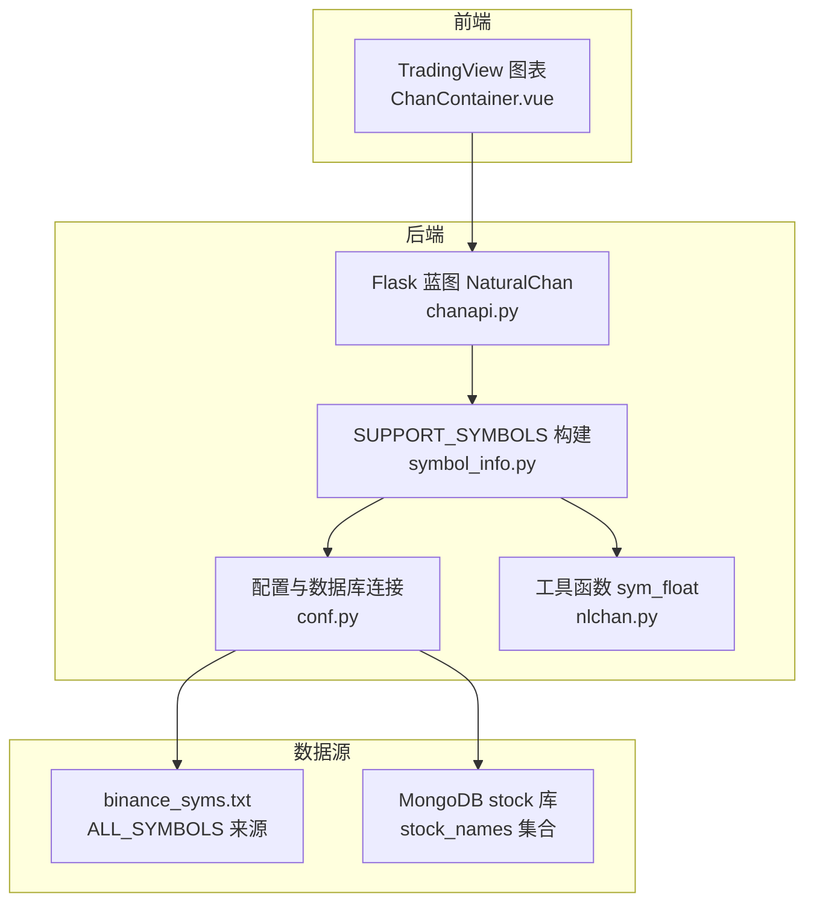
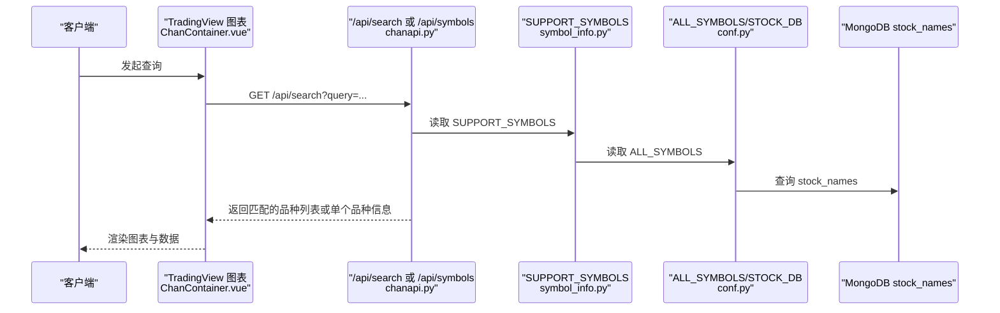
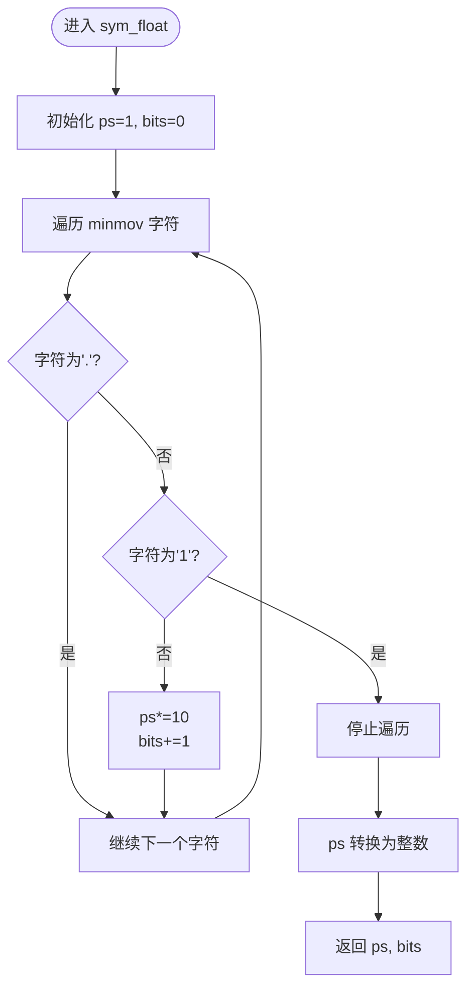
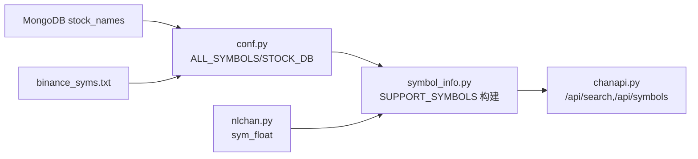

# 品种管理API

<cite>
**本文引用的文件**
- [api/chanapi.py](file://api/chanapi.py)
- [api/symbol_info.py](file://api/symbol_info.py)
- [comm/conf.py](file://comm/conf.py)
- [utils/nlchan.py](file://utils/nlchan.py)
- [hetl/selcoin/binance_syms.txt](file://hetl/selcoin/binance_syms.txt)
- [ui/src/components/ChanContainer.vue](file://ui/src/components/ChanContainer.vue)
</cite>

## 目录
1. [简介](#简介)
2. [项目结构](#项目结构)
3. [核心组件](#核心组件)
4. [架构总览](#架构总览)
5. [详细组件分析](#详细组件分析)
6. [依赖关系分析](#依赖关系分析)
7. [性能考量](#性能考量)
8. [故障排查指南](#故障排查指南)
9. [结论](#结论)
10. [附录](#附录)

## 简介
本文件面向“品种管理API”的使用者与维护者，聚焦以下目标：
- 文档化 /api/search 与 /api/symbols 两个核心接口的行为与参数。
- 解释 SUPPORT_SYMBOLS 全局变量的生成机制：来自 ALL_SYMBOLS 配置与 STOCK_DB 数据库的组合构建。
- 分析 symbol_info.py 中 pricescale 精度计算逻辑（sym_float 函数）。
- 解释搜索接口的模糊匹配算法：将 query 参数转换为正则表达式进行名称匹配。
- 阐述品种信息查询的双重匹配逻辑：同时按 name 与 symbol 字段搜索。
- 提供新增自定义交易品种的完整流程：在 ALL_SYMBOLS 中添加配置、更新 SUPPORT_SYMBOLS 生成逻辑，并说明前端 symbol 格式兼容性注意事项。

## 项目结构
围绕“品种管理API”，涉及的核心模块如下：
- 后端API层：api/chanapi.py 提供 /api/search 与 /api/symbols 接口。
- 品种信息构建：api/symbol_info.py 生成 SUPPORT_SYMBOLS 并注入 pricescale。
- 配置与数据库：comm/conf.py 定义 ALL_SYMBOLS 来源与 STOCK_DB 连接。
- 工具函数：utils/nlchan.py 提供 sym_float 计算 pricescale 的辅助方法。
- 前端集成：ui/src/components/ChanContainer.vue 使用 TradingView UDF 兼容数据源，通过 /api 前缀访问后端接口。

图表来源
- [api/chanapi.py](file://api/chanapi.py#L61-L94)
- [api/symbol_info.py](file://api/symbol_info.py#L1-L74)
- [comm/conf.py](file://comm/conf.py#L88-L110)
- [utils/nlchan.py](file://utils/nlchan.py#L6-L25)
- [hetl/selcoin/binance_syms.txt](file://hetl/selcoin/binance_syms.txt#L1-L118)

章节来源
- [api/chanapi.py](file://api/chanapi.py#L61-L94)
- [api/symbol_info.py](file://api/symbol_info.py#L1-L74)
- [comm/conf.py](file://comm/conf.py#L88-L110)
- [utils/nlchan.py](file://utils/nlchan.py#L6-L25)
- [hetl/selcoin/binance_syms.txt](file://hetl/selcoin/binance_syms.txt#L1-L118)

## 核心组件
- /api/search：根据 query 参数返回匹配的品种列表。当 query 为 all 时返回全部 SUPPORT_SYMBOLS；否则将 query 每个字符之间插入通配符，构造正则表达式对 name 字段进行模糊匹配。
- /api/symbols：根据 symbol 参数返回单个品种信息。先按 name 模糊匹配，再按 symbol 精确匹配，返回第一个匹配项；若无匹配则返回空对象。
- SUPPORT_SYMBOLS：由 ALL_SYMBOLS 与 STOCK_DB 的 stock_names 合并生成，包含各品种的展示名、最小变动单位、价格刻度、类型、时区等元数据。
- pricescale 计算：通过 sym_float 对 minmov 进行解析，得到 pricescale 与精度位数，用于前端价格显示与交互。

章节来源
- [api/chanapi.py](file://api/chanapi.py#L61-L94)
- [api/symbol_info.py](file://api/symbol_info.py#L1-L74)
- [utils/nlchan.py](file://utils/nlchan.py#L6-L25)

## 架构总览
下图展示了从请求到响应的关键路径，以及数据来源与依赖关系。

图表来源
- [api/chanapi.py](file://api/chanapi.py#L61-L94)
- [api/symbol_info.py](file://api/symbol_info.py#L1-L74)
- [comm/conf.py](file://comm/conf.py#L88-L110)

## 详细组件分析

### /api/search 接口
- 请求参数
  - query：字符串，可为 all 或任意文本。默认 all。
- 处理逻辑
  - 若 query 为 all：直接返回 SUPPORT_SYMBOLS。
  - 否则：将 query 的每个字符之间插入通配符，构造正则表达式，对 SUPPORT_SYMBOLS 中每个元素的 name 字段进行匹配，返回匹配集合。
- 性能与复杂度
  - 匹配过程为线性扫描 SUPPORT_SYMBOLS，时间复杂度 O(n)，n 为 SUPPORT_SYMBOLS 长度。
  - 正则构造与匹配为 O(m)（m 为查询字符数），整体复杂度近似 O(n·m)。
- 错误处理
  - 未显式校验 query 是否为空；当 query 传入空字符串时，仍会构造正则并进行匹配，可能返回空列表。

章节来源
- [api/chanapi.py](file://api/chanapi.py#L61-L73)

### /api/symbols 接口
- 请求参数
  - symbol：字符串，表示要查询的品种标识。
- 处理逻辑
  - 遍历 SUPPORT_SYMBOLS，先按 name 进行模糊匹配（同 /api/search 的正则策略），若未命中再按 symbol 精确匹配，返回第一个匹配项；若无匹配返回空对象。
- 性能与复杂度
  - 线性扫描 SUPPORT_SYMBOLS，时间复杂度 O(n)。
- 错误处理
  - 未命中时返回空对象，不抛异常。

章节来源
- [api/chanapi.py](file://api/chanapi.py#L77-L94)

### SUPPORT_SYMBOLS 生成机制
- 数据来源
  - ALL_SYMBOLS：来自 hetl/selcoin/binance_syms.txt 文件，每行包含 symbol 与 minmov，过滤掉特定符号（如 TUSD）后形成基础列表。
  - STOCK_DB：来自 MongoDB stock 库的 stock_names 集合，读取 code、display_name、name 字段，映射为股票类品种。
- 构建流程
  - 遍历 ALL_SYMBOLS，对每个条目：
    - 通过 sym_float 解析 minmov，得到 pricescale 与精度位数。
    - 构造标准品种字典（name、symbol、description、exchange、minmov、minmov2、pricescale、has_intraday、type、ticker、session、timezone、intraday_multipliers）并加入 SUPPORT_SYMBOLS。
  - 从 STOCK_DB 的 stock_names 查询结果，逐项构造股票类字典并追加到 SUPPORT_SYMBOLS。
- 注意事项
  - 特殊符号（如 TUSD）会被过滤。
  - 股票类 pricescale 固定为 100，与币类通过 sym_float 动态计算不同。

章节来源
- [api/symbol_info.py](file://api/symbol_info.py#L1-L74)
- [comm/conf.py](file://comm/conf.py#L88-L110)
- [utils/nlchan.py](file://utils/nlchan.py#L6-L25)
- [hetl/selcoin/binance_syms.txt](file://hetl/selcoin/binance_syms.txt#L1-L118)

### pricescale 精度计算逻辑（sym_float）
- 输入：minmov（字符串形式的小数值）
- 输出：pricescale（整数）、bits（小数位数）
- 算法要点
  - 遍历 minmov 字符串，遇到 '.' 跳过；遇到数字 '1' 停止计数。
  - 在此之前，每遇到一个非 '1' 数字，pricescale 乘以 10，同时 bits 加一。
  - 最终 pricescale 为整数，bits 为小数点后的位数。
- 用途
  - 用于设置 SUPPORT_SYMBOLS 中的 pricescale 字段，确保前端价格显示与交互符合最小变动单位。

图表来源
- [utils/nlchan.py](file://utils/nlchan.py#L6-L25)

章节来源
- [utils/nlchan.py](file://utils/nlchan.py#L6-L25)

### 搜索接口的模糊匹配算法
- 规则
  - 将 query 的每个字符之间插入通配符，形成正则表达式模式，用于匹配 SUPPORT_SYMBOLS.name。
  - 该策略允许在名称中任意位置出现查询字符序列，实现“近似顺序匹配”的模糊搜索。
- 示例
  - query="abc" 会转换为 "a.*b.*c" 的正则，匹配包含按顺序出现的 a、b、c 的名称。
- 复杂度
  - 对每个 SUPPORT_SYMBOLS 元素执行一次正则匹配，整体 O(n·m)。

章节来源
- [api/chanapi.py](file://api/chanapi.py#L61-L73)

### 品种信息查询的双重匹配逻辑
- 顺序
  - 先按 name 进行模糊匹配（同上）。
  - 若未命中，则按 symbol 进行精确匹配。
- 设计意图
  - name 更便于用户记忆与检索，symbol 更适合程序间稳定识别。
- 结果
  - 返回第一个匹配项；若无匹配返回空对象。

章节来源
- [api/chanapi.py](file://api/chanapi.py#L77-L94)

### 新增自定义交易品种的完整流程
- 步骤
  1) 在 ALL_SYMBOLS 来源文件中添加新条目
     - 在 hetl/selcoin/binance_syms.txt 中追加一行，格式为 symbol 与 minmov（空格分隔）。
     - 注意：特殊符号（如 TUSD）会被过滤，若需保留请调整过滤逻辑。
  2) 重新加载配置与构建 SUPPORT_SYMBOLS
     - 重启后端服务，使 conf.py 重新读取 binance_syms.txt 并更新 ALL_SYMBOLS。
     - symbol_info.py 重新遍历 ALL_SYMBOLS，调用 sym_float 计算 pricescale，生成新的 SUPPORT_SYMBOLS。
  3) 如需股票类品种，请在 STOCK_DB 的 stock_names 集合中添加相应记录（code、display_name、name）。
  4) 前端 symbol 格式兼容性
     - 前端 ChanContainer.vue 默认使用 TradingView UDF 兼容数据源，通过 datafeedUrl 指向后端 /api。
     - 品种标识在前端显示与交互中通常使用 ticker 字段（symbol_info.py 中的 "ticker" 字段），但实际请求时会使用 symbol 参数传递给后端。
     - 若新增品种的 symbol 与前端默认值冲突或不符合预期，可在前端组件 props 中调整默认 symbol，或确保后端 /api/symbols 能正确匹配 name/symbol。
- 影响范围
  - /api/search 与 /api/symbols 的匹配结果将包含新品种。
  - 前端 TradingView 图表可直接通过 /api 获取数据并渲染。

章节来源
- [comm/conf.py](file://comm/conf.py#L88-L110)
- [api/symbol_info.py](file://api/symbol_info.py#L1-L74)
- [hetl/selcoin/binance_syms.txt](file://hetl/selcoin/binance_syms.txt#L1-L118)
- [ui/src/components/ChanContainer.vue](file://ui/src/components/ChanContainer.vue#L74-L120)

## 依赖关系分析
- 模块耦合
  - api/chanapi.py 依赖 api/symbol_info.py 中的 SUPPORT_SYMBOLS。
  - api/symbol_info.py 依赖 comm/conf.py 中的 ALL_SYMBOLS 与 STOCK_DB。
  - sym_float 位于 utils/nlchan.py，被 symbol_info.py 引用。
- 外部依赖
  - MongoDB：STOCK_DB 提供 stock_names 集合。
  - 文件系统：hetl/selcoin/binance_syms.txt 提供 ALL_SYMBOLS 的初始数据。
- 潜在循环依赖
  - 当前文件组织未见循环导入；若后续扩展，应避免在 conf.py 中引入 api 层。

图表来源
- [api/chanapi.py](file://api/chanapi.py#L61-L94)
- [api/symbol_info.py](file://api/symbol_info.py#L1-L74)
- [comm/conf.py](file://comm/conf.py#L88-L110)
- [utils/nlchan.py](file://utils/nlchan.py#L6-L25)

章节来源
- [api/chanapi.py](file://api/chanapi.py#L61-L94)
- [api/symbol_info.py](file://api/symbol_info.py#L1-L74)
- [comm/conf.py](file://comm/conf.py#L88-L110)
- [utils/nlchan.py](file://utils/nlchan.py#L6-L25)

## 性能考量
- /api/search 的线性扫描与正则匹配
  - 当 SUPPORT_SYMBOLS 规模较大时，建议：
    - 仅在必要时触发全量搜索（例如用户输入达到一定长度后再发起）。
    - 对 SUPPORT_SYMBOLS 增加索引（name/symbol）以加速匹配。
- pricescale 计算
  - sym_float 为常数时间复杂度，对性能影响较小。
- 前端集成
  - TradingView UDF 兼容数据源会在图表切换 symbol 时频繁请求 /api/symbols，建议保持该接口快速响应。

[本节为通用指导，无需具体文件引用]

## 故障排查指南
- /api/search 返回空列表
  - 检查 query 是否为空字符串或仅包含特殊字符。
  - 确认 SUPPORT_SYMBOLS 中是否存在 name 符合模糊匹配规则的条目。
- /api/symbols 返回空对象
  - 确认 symbol 是否存在于 SUPPORT_SYMBOLS 的 name 或 symbol 字段。
  - 检查是否遗漏了 STOCK_DB 的股票记录。
- pricescale 显示异常
  - 检查对应 symbol 的 minmov 是否为合法字符串，确保 sym_float 能正确解析。
- 新增品种未生效
  - 确认已重启后端服务以重新加载 conf.py 与 symbol_info.py。
  - 检查 hetl/selcoin/binance_syms.txt 是否存在有效条目且未被过滤。

章节来源
- [api/chanapi.py](file://api/chanapi.py#L61-L94)
- [api/symbol_info.py](file://api/symbol_info.py#L1-L74)
- [utils/nlchan.py](file://utils/nlchan.py#L6-L25)

## 结论
- /api/search 与 /api/symbols 提供了灵活的品种检索能力，前者支持模糊匹配，后者支持双重匹配（name/symbol）。
- SUPPORT_SYMBOLS 的生成结合了 ALL_SYMBOLS 与 STOCK_DB，pricescale 通过 sym_float 动态计算，保证前端价格显示一致性。
- 新增自定义品种流程清晰：在配置文件中添加条目、重启服务、验证前端 symbol 格式兼容性。
- 建议在生产环境中对搜索接口增加输入长度阈值与索引优化，以提升用户体验与系统性能。

[本节为总结性内容，无需具体文件引用]

## 附录
- 关键接口摘要
  - GET /api/search?query=...：返回匹配的品种列表；query=all 返回全部。
  - GET /api/symbols?symbol=...：返回单个品种信息；优先 name 模糊匹配，再按 symbol 精确匹配。
- 关键配置与数据源
  - ALL_SYMBOLS 来自 hetl/selcoin/binance_syms.txt。
  - STOCK_DB.stock_names 提供股票类品种信息。
  - sym_float 用于计算 pricescale。

[本节为概览性内容，无需具体文件引用]