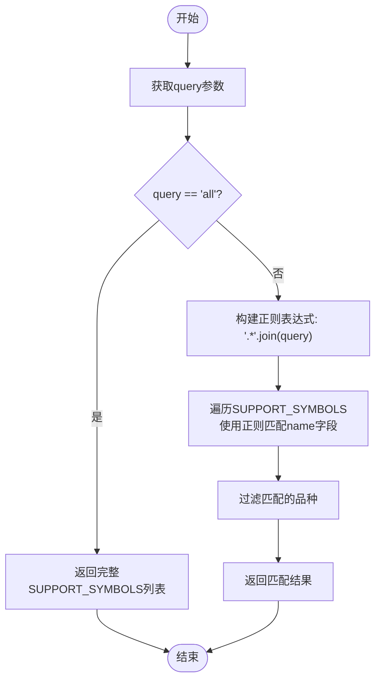
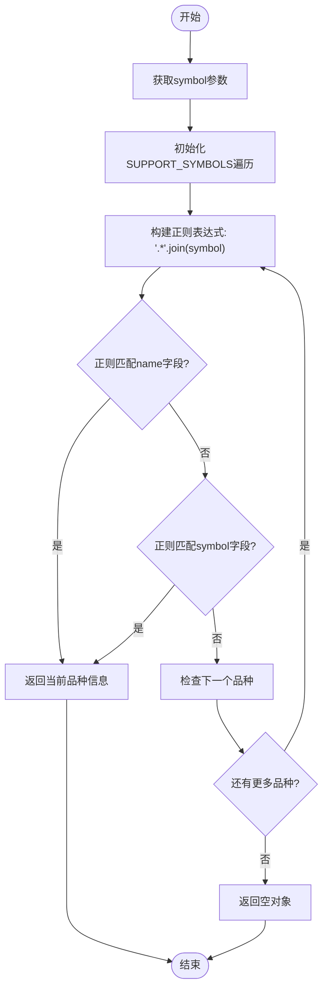
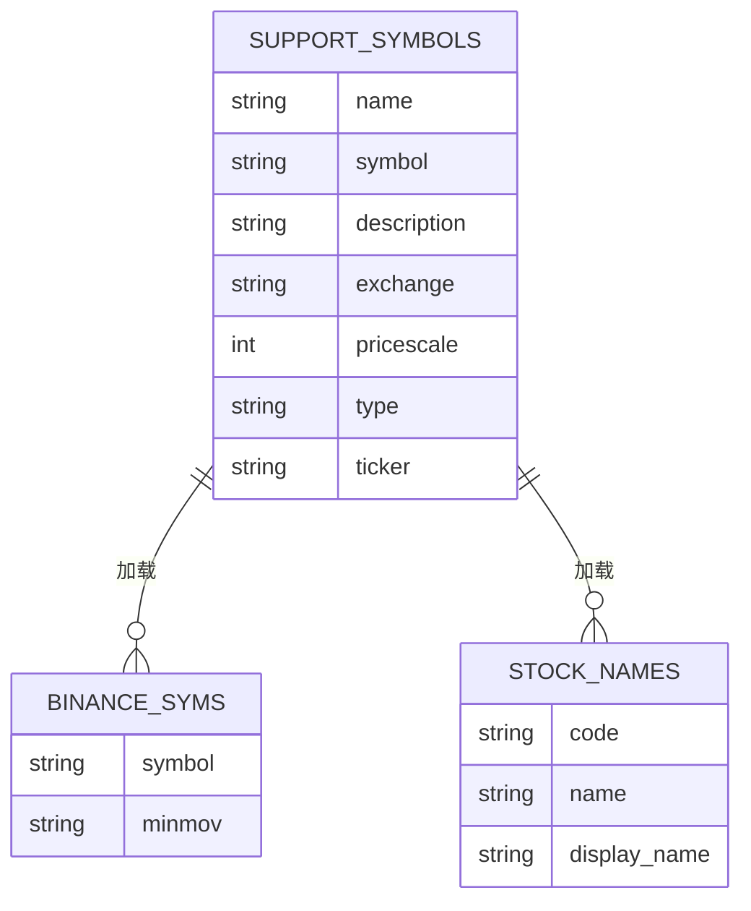

# 品种管理API实现

<cite>
**本文档引用的文件**  
- [chanapi.py](file://api/chanapi.py)
- [symbol_info.py](file://api/symbol_info.py)
- [conf.py](file://comm/conf.py)
</cite>

## 目录
1. [简介](#简介)
2. [搜索接口实现](#搜索接口实现)
3. [品种查询接口实现](#品种查询接口实现)
4. [数据模型与依赖关系](#数据模型与依赖关系)
5. [异常处理机制](#异常处理机制)
6. [HTTP请求响应示例](#http请求响应示例)

## 简介
本项目是一个基于TradingView本地SDK的可视化前后端系统，专为缠论量化研究和其他几何交易量化研究设计。系统通过RESTful API提供品种管理功能，支持对加密货币和股票品种的搜索与查询。核心API接口包括`/api/search`和`/api/symbols`，分别用于实现品种搜索和品种信息查询功能。系统后端采用Python Flask框架，前端基于Vue实现，通过MongoDB存储K线历史数据和缠论识别结构数据。

**Section sources**
- [README.md](file://README.md#L2-L153)

## 搜索接口实现
搜索接口`/api/search`实现了对支持品种的模糊搜索功能。该接口通过query参数接收搜索关键词，当查询值为"all"时返回完整的支持品种列表，否则使用正则表达式进行模糊匹配。

接口首先获取query参数，默认值为"all"。如果查询值等于"all"，则直接返回SUPPORT_SYMBOLS全局变量中的完整品种列表。否则，将查询字符串转换为正则表达式模式，通过在每个字符间插入".*"来实现模糊匹配。然后遍历SUPPORT_SYMBOLS列表，使用正则表达式对每个品种的name字段进行匹配，返回所有匹配成功的品种信息。



**Diagram sources**
- [chanapi.py](file://api/chanapi.py#L61-L72)

**Section sources**
- [chanapi.py](file://api/chanapi.py#L61-L72)

## 品种查询接口实现
品种查询接口`/api/symbols`实现了对特定品种的双重匹配查询机制。该接口接收symbol参数，优先按name字段进行正则匹配，未找到时再尝试symbol字段匹配，并在匹配成功时立即返回结果。

接口首先获取symbol参数，默认值为"BTC"。然后遍历SUPPORT_SYMBOLS列表，对每个品种执行双重匹配逻辑：首先将查询字符串转换为正则表达式模式，检查是否与当前品种的name字段匹配；如果不匹配，则继续检查是否与symbol字段匹配。一旦找到匹配的品种，立即返回该品种的完整信息对象。如果遍历完所有品种都未找到匹配项，则返回空对象。

该接口实现了短路逻辑，即在找到第一个匹配项后立即返回，不再继续遍历剩余品种，提高了查询效率。这种双重匹配机制确保了即使用户输入的是品种代码或名称的任意形式，都能准确找到对应的品种信息。



**Diagram sources**
- [chanapi.py](file://api/chanapi.py#L77-L93)

**Section sources**
- [chanapi.py](file://api/chanapi.py#L77-L93)

## 数据模型与依赖关系
品种管理API的核心数据模型是SUPPORT_SYMBOLS，该数据结构存储了所有支持的交易品种信息，包括加密货币和股票。SUPPORT_SYMBOLS是一个包含多个品种对象的列表，每个品种对象包含name、symbol、description、exchange、pricescale等属性。

SUPPORT_SYMBOLS数据模型的构建依赖于两个主要数据源：加密货币数据来自`hetl/selcoin/binance_syms.txt`文件，股票数据来自MongoDB的stock_names集合。系统启动时，通过symbol_info.py模块加载这些数据源并构建SUPPORT_SYMBOLS列表。加密货币品种的name和symbol字段均设置为交易对符号（如BTC），而股票品种的name字段为股票名称，symbol字段为股票代码（如000001.XSHG）。

前端通过ticker字段与后端交互，该字段在API响应中与symbol字段保持一致。对于加密货币，ticker字段直接使用交易对符号；对于股票，ticker字段使用股票代码。这种映射规则确保了前端能够通过统一的ticker字段访问所有类型的交易品种。



**Diagram sources**
- [symbol_info.py](file://api/symbol_info.py#L4-L70)
- [conf.py](file://comm/conf.py#L87-L108)

**Section sources**
- [symbol_info.py](file://api/symbol_info.py#L4-L70)
- [conf.py](file://comm/conf.py#L87-L108)

## 异常处理机制
品种管理API的异常处理机制设计简洁而有效。当搜索接口`/api/search`接收到非"all"的查询参数但未找到任何匹配品种时，返回一个空数组。这种设计允许前端优雅地处理无匹配结果的情况，例如显示"未找到相关品种"的提示信息。

对于品种查询接口`/api/symbols`，当无法找到匹配的品种时，返回一个空对象{}。这种设计考量基于以下原因：前端在请求特定品种信息时，期望获得一个包含品种属性的对象。返回空对象而非错误状态码，使得前端代码可以统一处理响应数据，无需区分"品种不存在"和"请求失败"两种情况。前端可以通过检查返回对象是否为空来判断品种是否存在，并相应地更新用户界面。

系统未对查询参数进行严格的输入验证，这基于TradingView SDK的使用场景：查询参数通常由前端界面自动生成，而非用户直接输入。这种设计简化了后端逻辑，将输入验证的责任交给前端，符合前后端分离架构的最佳实践。

**Section sources**
- [chanapi.py](file://api/chanapi.py#L61-L93)

## HTTP请求响应示例
以下是不同查询场景下的HTTP请求响应示例，展示了品种管理API的实际使用效果。

**搜索接口示例：**

请求：`GET /api/search?query=all`
```json
[
  {
    "name": "BTC",
    "symbol": "BTC",
    "description": "BTC",
    "exchange": "自然之缠",
    "pricescale": 100,
    "type": "bitcoin",
    "ticker": "BTC"
  },
  {
    "name": "中国平安",
    "symbol": "000001.XSHG",
    "description": "中国平安[000001.XSHG]",
    "exchange": "自然之缠",
    "pricescale": 100,
    "type": "stock",
    "ticker": "000001.XSHG"
  }
]
```

请求：`GET /api/search?query=平安`
```json
[
  {
    "name": "中国平安",
    "symbol": "000001.XSHG",
    "description": "中国平安[000001.XSHG]",
    "exchange": "自然之缠",
    "pricescale": 100,
    "type": "stock",
    "ticker": "000001.XSHG"
  }
]
```

**品种查询接口示例：**

请求：`GET /api/symbols?symbol=BTC`
```json
{
  "name": "BTC",
  "symbol": "BTC",
  "description": "BTC",
  "exchange": "自然之缠",
  "pricescale": 100,
  "type": "bitcoin",
  "ticker": "BTC"
}
```

请求：`GET /api/symbols?symbol=000001`
```json
{
  "name": "中国平安",
  "symbol": "000001.XSHG",
  "description": "中国平安[000001.XSHG]",
  "exchange": "自然之缠",
  "pricescale": 100,
  "type": "stock",
  "ticker": "000001.XSHG"
}
```

请求：`GET /api/symbols?symbol=INVALID`
```json
{}
```

**Section sources**
- [chanapi.py](file://api/chanapi.py#L61-L93)