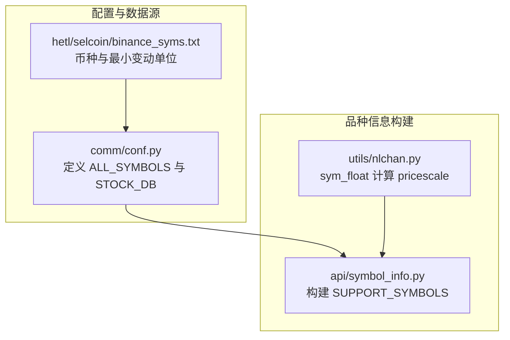
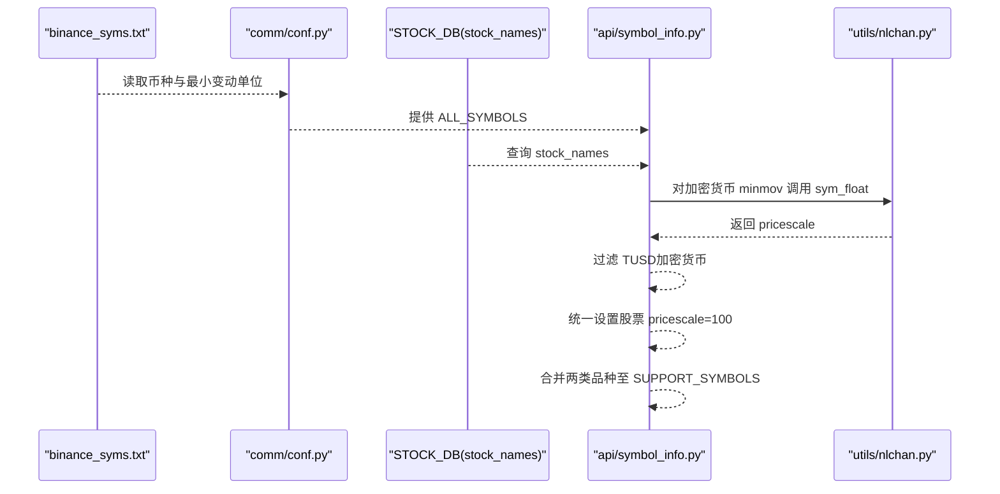
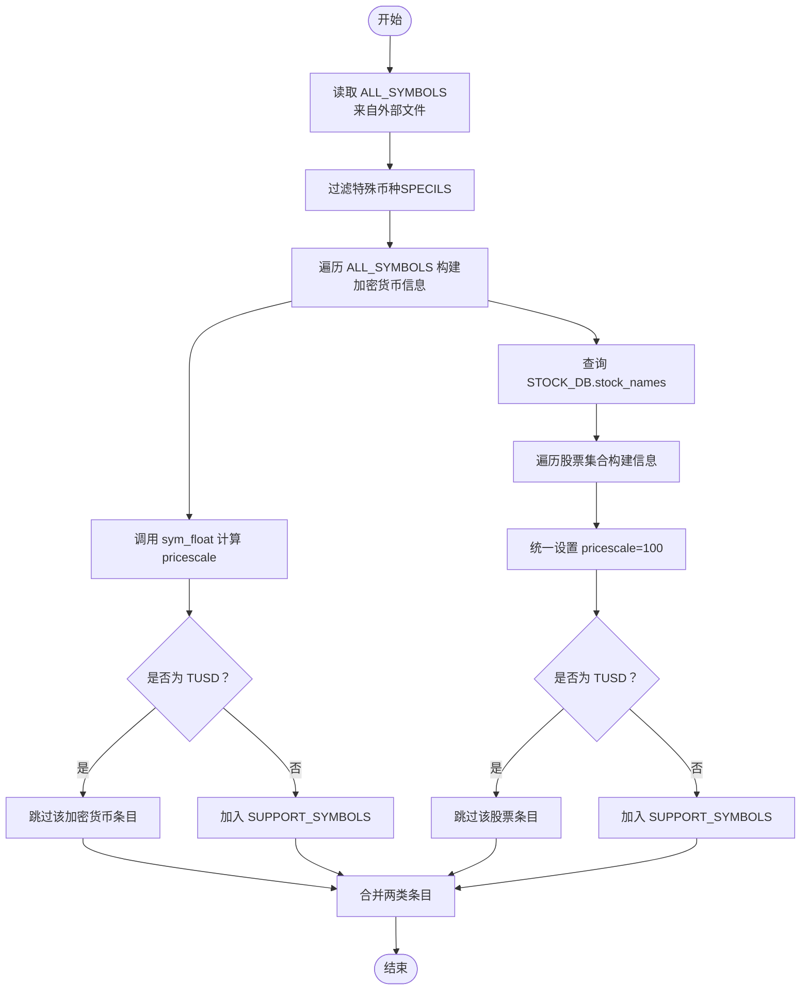
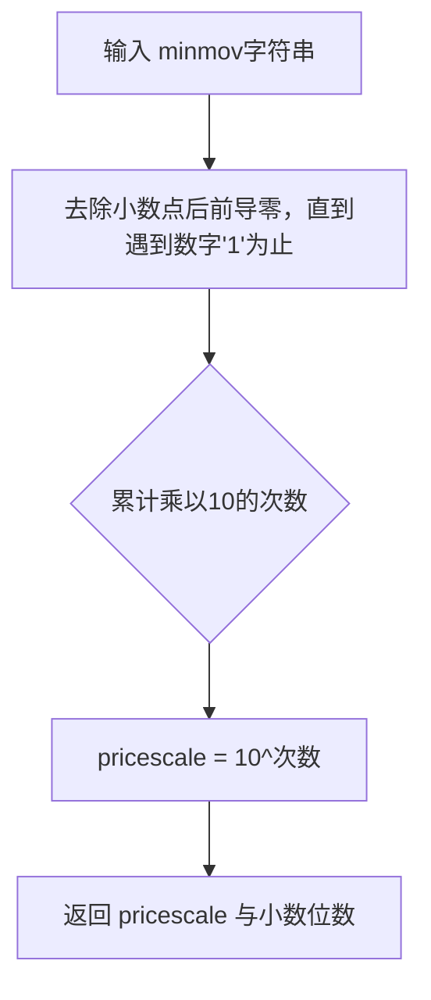
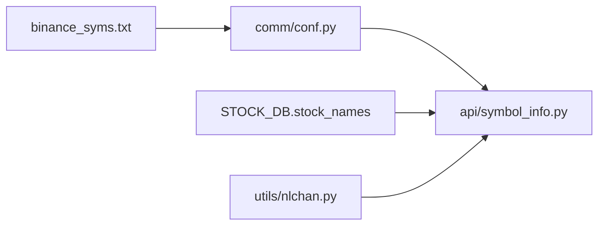

# 品种管理数据模型

<cite>
**本文引用的文件**
- [api/symbol_info.py](file://api/symbol_info.py)
- [comm/conf.py](file://comm/conf.py)
- [utils/nlchan.py](file://utils/nlchan.py)
- [hetl/selcoin/binance_syms.txt](file://hetl/selcoin/binance_syms.txt)
</cite>

## 目录
1. [简介](#简介)
2. [项目结构](#项目结构)
3. [核心组件](#核心组件)
4. [架构总览](#架构总览)
5. [详细组件分析](#详细组件分析)
6. [依赖关系分析](#依赖关系分析)
7. [性能考量](#性能考量)
8. [故障排查指南](#故障排查指南)
9. [结论](#结论)

## 简介
本文件聚焦于“品种管理数据模型”，系统性阐述 SUPPORT_SYMBOLS 全局变量的构建流程与数据结构设计。重点覆盖以下内容：
- 如何从 comm.conf 模块中的 ALL_SYMBOLS 配置与 STOCK_DB 数据库共同生成支持的交易品种列表
- symbol_info.py 中对加密货币与股票品种的差异化处理逻辑：加密货币基于 minmov 字段通过 sym_float 计算 pricescale 精度；股票统一设置 pricescale 为 100
- 每个品种信息对象的关键字段及其与 TradingView SDK 的兼容性说明（如 name、symbol、pricescale、intraday_multipliers 等）
- SUPPORT_SYMBOLS 初始化的执行时序：从配置读取、数据库查询到最终列表构建的完整生命周期
- 实际数据结构示例与 TUSD 显式过滤的业务原因说明

## 项目结构
围绕“品种管理”的核心文件组织如下：
- 配置与数据源
  - comm/conf.py：定义 ALL_SYMBOLS 列表与 STOCK_DB 连接，负责从外部文件加载币种符号与最小变动单位，并建立 MongoDB 连接
  - hetl/selcoin/binance_syms.txt：币种符号与最小变动单位的原始数据源
- 品种信息构建
  - api/symbol_info.py：聚合 ALL_SYMBOLS 与 STOCK_DB，构造 SUPPORT_SYMBOLS，完成字段映射与差异化处理
  - utils/nlchan.py：提供 sym_float 工具函数，用于根据最小变动单位推导 pricescale 精度

**图表来源**
- [comm/conf.py](file://comm/conf.py#L88-L109)
- [api/symbol_info.py](file://api/symbol_info.py#L1-L39)
- [utils/nlchan.py](file://utils/nlchan.py#L6-L25)
- [hetl/selcoin/binance_syms.txt](file://hetl/selcoin/binance_syms.txt#L1-L118)

**章节来源**
- [comm/conf.py](file://comm/conf.py#L88-L109)
- [api/symbol_info.py](file://api/symbol_info.py#L1-L39)
- [utils/nlchan.py](file://utils/nlchan.py#L6-L25)
- [hetl/selcoin/binance_syms.txt](file://hetl/selcoin/binance_syms.txt#L1-L118)

## 核心组件
- ALL_SYMBOLS（来自 comm.conf）：由外部币种清单文件解析而来，每项包含 symbol 与 minmov 两个键
- STOCK_DB（来自 comm.conf）：MongoDB 连接下的 stock_names 集合，提供股票基础信息
- SUPPORT_SYMBOLS（来自 api/symbol_info.py）：最终输出的交易品种列表，包含两类：
  - 加密货币：基于 minmov 计算 pricescale，type 为 bitcoin
  - 股票：统一 pricescale=100，type 为 stock
- sym_float（来自 utils/nlchan.py）：根据最小变动单位字符串推导 pricescale 与小数位数

**章节来源**
- [comm/conf.py](file://comm/conf.py#L88-L109)
- [api/symbol_info.py](file://api/symbol_info.py#L1-L39)
- [utils/nlchan.py](file://utils/nlchan.py#L6-L25)

## 架构总览
下图展示了从数据源到最终 SUPPORT_SYMBOLS 的端到端流程：

**图表来源**
- [comm/conf.py](file://comm/conf.py#L88-L109)
- [api/symbol_info.py](file://api/symbol_info.py#L1-L39)
- [utils/nlchan.py](file://utils/nlchan.py#L6-L25)
- [hetl/selcoin/binance_syms.txt](file://hetl/selcoin/binance_syms.txt#L1-L118)

## 详细组件分析

### 支持的交易品种列表构建流程（SUPPORT_SYMBOLS 初始化）
- 配置读取阶段
  - 从外部文件读取币种与最小变动单位，形成 ALL_SYMBOLS 列表
  - 在同一文件中维护特殊币种白名单/黑名单（例如 SPECILS 包含 DAI、TUSD），用于后续过滤
- 数据库查询阶段
  - 通过 STOCK_DB 连接查询 stock_names 集合，提取股票基础信息（如 code、display_name、name）
- 列表构建阶段
  - 遍历 ALL_SYMBOLS，逐项生成加密货币品种信息对象
  - 对加密货币：使用 sym_float 基于 minmov 计算 pricescale；同时设置 intraday_multipliers 等字段
  - 对股票：统一设置 pricescale=100，并设置不同的 intraday_multipliers
  - 过滤掉 TUSD（无论来自加密货币还是股票集合）
  - 将两类对象合并到 SUPPORT_SYMBOLS

**图表来源**
- [comm/conf.py](file://comm/conf.py#L88-L109)
- [api/symbol_info.py](file://api/symbol_info.py#L1-L39)
- [utils/nlchan.py](file://utils/nlchan.py#L6-L25)
- [hetl/selcoin/binance_syms.txt](file://hetl/selcoin/binance_syms.txt#L1-L118)

**章节来源**
- [comm/conf.py](file://comm/conf.py#L88-L109)
- [api/symbol_info.py](file://api/symbol_info.py#L1-L39)
- [utils/nlchan.py](file://utils/nlchan.py#L6-L25)
- [hetl/selcoin/binance_syms.txt](file://hetl/selcoin/binance_syms.txt#L1-L118)

### 加密货币与股票的差异化处理逻辑
- 加密货币
  - 使用 sym_float 基于 minmov 推导 pricescale，确保价格精度与最小变动单位一致
  - 设置 type 为 bitcoin，intraday_multipliers 为 ["1","5","30","240","D"]
- 股票
  - 统一设置 pricescale=100，以适配 A 股等市场的报价习惯
  - 设置 type 为 stock，intraday_multipliers 为 ["1","5","30","D"]

**图表来源**
- [utils/nlchan.py](file://utils/nlchan.py#L6-L25)

**章节来源**
- [api/symbol_info.py](file://api/symbol_info.py#L1-L39)
- [utils/nlchan.py](file://utils/nlchan.py#L6-L25)

### SUPPORT_SYMBOLS 中的字段与 TradingView SDK 兼容性
每个品种信息对象包含以下关键字段（示例字段名与语义，不展示具体值）：
- name：显示名称
- symbol：交易代码
- description：描述文本
- exchange：交易所标识
- minmov/minmov2：最小变动单位相关
- pricescale：价格缩放因子，直接影响刻度精度
- has_intraday：是否支持分时数据
- type：品种类型（bitcoin 或 stock）
- ticker：前端调用所需的代码字段
- session/timezone：会话与时区
- intraday_multipliers：分时周期列表（如 1 分钟、5 分钟、30 分钟、240 分钟、日线）

这些字段与 TradingView SDK 的兼容性体现在：
- pricescale 与最小变动单位一致，保证图表刻度与数据精度匹配
- intraday_multipliers 与可用周期保持一致，避免前端请求无效周期
- type 与 session/timezone 的组合满足不同市场（加密货币 24x7、股票工作日）的展示需求

**章节来源**
- [api/symbol_info.py](file://api/symbol_info.py#L25-L38)
- [api/symbol_info.py](file://api/symbol_info.py#L55-L68)

### 实际数据结构示例
- 加密货币条目（示意字段）
  - name、symbol、description、exchange、minmov、minmov2、pricescale、has_intraday、type、ticker、session、timezone、intraday_multipliers
- 股票条目（示意字段）
  - name、symbol、description、exchange、minmov、minmov2、pricescale、has_intraday、type、ticker、session、timezone、intraday_multipliers

注：以上为字段清单与用途说明，具体值来源于运行时构建结果。

**章节来源**
- [api/symbol_info.py](file://api/symbol_info.py#L25-L38)
- [api/symbol_info.py](file://api/symbol_info.py#L55-L68)

### TUSD 品种被显式过滤的业务原因
- 在 ALL_SYMBOLS 的构建过程中，SPECILS 列表包含 DAI、TUSD 等稳定币
- 在遍历 ALL_SYMBOLS 生成加密货币信息时，若 symbol 为 TUSD，则直接跳过
- 因此 SUPPORT_SYMBOLS 中不会出现 TUSD，从而避免将其作为可交易品种暴露给前端或下游逻辑

**章节来源**
- [comm/conf.py](file://comm/conf.py#L90-L104)
- [api/symbol_info.py](file://api/symbol_info.py#L9-L11)

## 依赖关系分析
- 外部依赖
  - MongoDB：通过 comm.conf 建立连接，访问 STOCK_DB.stock_names
  - 文件系统：读取 hetl/selcoin/binance_syms.txt 作为 ALL_SYMBOLS 的数据源
- 内部依赖
  - api/symbol_info.py 依赖 comm/conf.py 的 ALL_SYMBOLS 与 STOCK_DB
  - api/symbol_info.py 依赖 utils/nlchan.py 的 sym_float 函数
- 关键耦合点
  - ALL_SYMBOLS 的格式与稳定性直接影响 pricescale 的正确性
  - STOCK_DB 的 schema（code、display_name、name）决定股票信息的字段映射

**图表来源**
- [comm/conf.py](file://comm/conf.py#L88-L109)
- [api/symbol_info.py](file://api/symbol_info.py#L1-L39)
- [utils/nlchan.py](file://utils/nlchan.py#L6-L25)
- [hetl/selcoin/binance_syms.txt](file://hetl/selcoin/binance_syms.txt#L1-L118)

**章节来源**
- [comm/conf.py](file://comm/conf.py#L88-L109)
- [api/symbol_info.py](file://api/symbol_info.py#L1-L39)
- [utils/nlchan.py](file://utils/nlchan.py#L6-L25)
- [hetl/selcoin/binance_syms.txt](file://hetl/selcoin/binance_syms.txt#L1-L118)

## 性能考量
- 数据源规模
  - ALL_SYMBOLS 来自外部文件，通常规模有限；STOCK_DB.stock_names 也应控制在合理范围
- 查询效率
  - STOCK_DB 查询使用投影仅返回必要字段，减少网络与内存开销
- 计算复杂度
  - sym_float 对 minmov 字符串进行线性扫描，时间复杂度 O(n)，空间复杂度 O(1)
- 初始化成本
  - SUPPORT_SYMBOLS 在模块导入时一次性构建，后续复用，避免重复 IO 与计算

[本节为通用性能建议，不直接分析具体文件]

## 故障排查指南
- MongoDB 连接失败
  - 现象：STOCK_DB 查询报错
  - 排查：确认本地 MongoDB 是否启动，以及连接参数与数据库名称是否正确
  - 参考位置：STOCK_DB 定义与连接处
- 外部文件缺失
  - 现象：ALL_SYMBOLS 为空或构建异常
  - 排查：确认 hetl/selcoin/binance_syms.txt 是否存在且格式正确（每行 symbol 与 minmov）
- pricescale 异常
  - 现象：图表刻度与报价不匹配
  - 排查：检查对应 symbol 的 minmov 格式与 sym_float 计算逻辑
- TUSD 未出现
  - 现象：期望看到 TUSD 但未出现在 SUPPORT_SYMBOLS
  - 排查：确认 SPECILS 中包含 TUSD，且在构建流程中被显式跳过

**章节来源**
- [comm/conf.py](file://comm/conf.py#L143-L146)
- [api/symbol_info.py](file://api/symbol_info.py#L47-L69)
- [utils/nlchan.py](file://utils/nlchan.py#L6-L25)
- [hetl/selcoin/binance_syms.txt](file://hetl/selcoin/binance_syms.txt#L1-L118)

## 结论
SUPPORT_SYMBOLS 的构建是一个“配置+数据库”的双数据源聚合过程。通过 comm.conf 从外部文件加载 ALL_SYMBOLS，并借助 STOCK_DB 获取股票基础信息，再经 api/symbol_info.py 的差异化处理（加密货币按 minmov 计算 pricescale，股票统一设置为 100），最终形成与 TradingView SDK 兼容的品种清单。TUSD 被显式过滤，体现了业务层面对稳定币的特殊策略。整体流程清晰、职责分离明确，具备良好的扩展性与可维护性。