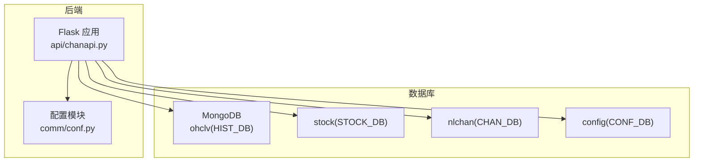
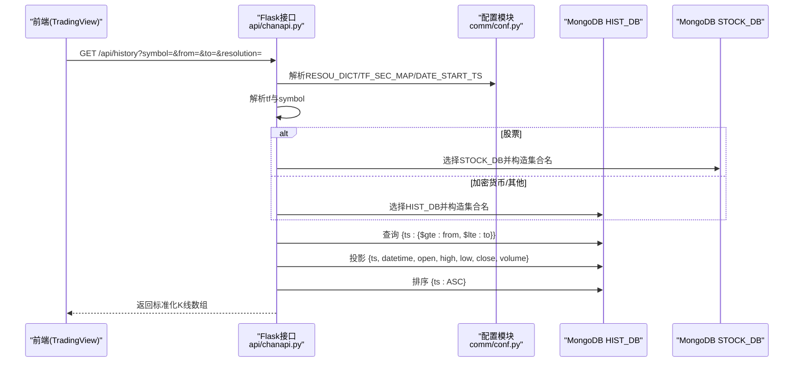
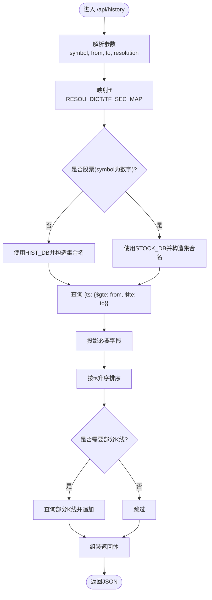
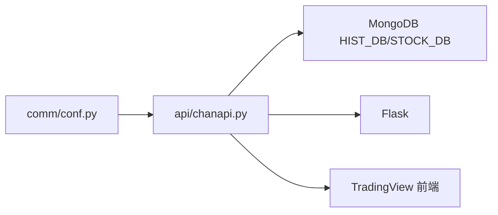

# 历史数据获取

<cite>
**本文引用的文件**
- [comm/conf.py](file://comm/conf.py)
- [api/chanapi.py](file://api/chanapi.py)
- [api/CLAUDE.md](file://api/CLAUDE.md)
- [README.md](file://README.md)
- [data/CLAUDE.md](file://data/CLAUDE.md)
- [data/nlchan/essence_xd_000001.XSHG_1d.metadata.json](file://data/nlchan/essence_xd_000001.XSHG_1d.metadata.json)
- [data/stock/stk_000001.XSHG_1d.metadata.json](file://data/stock/stk_000001.XSHG_1d.metadata.json)
- [data/config/replay_config.metadata.json](file://data/config/replay_config.metadata.json)
- [data/stock/stock_names.metadata.json](file://data/stock/stock_names.metadata.json)
- [hetl/hmgo/restore_chanvis_mongo.sh](file://hetl/hmgo/restore_chanvis_mongo.sh)
</cite>

## 目录
1. [简介](#简介)
2. [项目结构](#项目结构)
3. [核心组件](#核心组件)
4. [架构总览](#架构总览)
5. [详细组件分析](#详细组件分析)
6. [依赖关系分析](#依赖关系分析)
7. [性能考量](#性能考量)
8. [故障排查指南](#故障排查指南)
9. [结论](#结论)
10. [附录](#附录)

## 简介
本文件面向需要从HIST_DB数据库获取K线历史数据的开发者，系统性说明从comm/conf.py中获取数据库连接、通过symbol与tf参数动态构建集合名、在查询中使用投影字段减少网络传输、使用排序与分页加载最新数据块、以及DATE_START_TS在限定查询时间范围中的作用。同时给出性能优化建议，包括在id/ts字段上建立索引、合理设置连接池大小、以及利用MongoDB自然排序避免内存排序。

## 项目结构
- 后端服务通过Flask提供REST接口，核心历史数据接口位于api/chanapi.py。
- 数据库连接与配置位于comm/conf.py，其中包含HIST_DB客户端、时间周期映射、起始时间配置等。
- 数据模型与集合命名遵循“symbol_tf”的模式，历史K线集合位于ohclv数据库下。
- README.md与api/CLAUDE.md提供了系统架构与API说明，便于理解整体设计。

图表来源
- [api/chanapi.py](file://api/chanapi.py#L1-L40)
- [comm/conf.py](file://comm/conf.py#L143-L148)

章节来源
- [README.md](file://README.md#L90-L106)
- [api/CLAUDE.md](file://api/CLAUDE.md#L86-L107)

## 核心组件
- 数据库连接与命名空间
  - 通过MongoClient在本地27017端口创建客户端，分别绑定ohclv为HIST_DB、stock为STOCK_DB、nlchan为CHAN_DB、config为CONF_DB。
- 时间周期映射与起始时间
  - RESOU_DICT将请求分辨率映射为内部时间周期字符串；TF_SEC_MAP提供周期秒数映射；DATE_START_TS为各周期的起始时间戳字典。
- 历史数据接口
  - /api/history负责历史K线查询，接收symbol、from、to、resolution四个参数，内部解析tf并定位集合，执行查询、投影、排序与返回。

章节来源
- [comm/conf.py](file://comm/conf.py#L12-L21)
- [comm/conf.py](file://comm/conf.py#L23-L31)
- [comm/conf.py](file://comm/conf.py#L114-L121)
- [comm/conf.py](file://comm/conf.py#L143-L148)
- [api/chanapi.py](file://api/chanapi.py#L96-L116)
- [api/chanapi.py](file://api/chanapi.py#L108-L110)

## 架构总览
历史数据获取的关键流程如下：
- 接收请求参数（symbol、from、to、resolution），解析tf。
- 选择数据库（HIST_DB或STOCK_DB），动态构造集合名col = HIST_DB[f'{symbol}_{tf}']。
- 在查询中限定时间范围，使用投影仅返回必要字段，按ts升序排序，必要时追加部分K线片段。
- 返回标准化的K线数组给前端。

图表来源
- [api/chanapi.py](file://api/chanapi.py#L96-L116)
- [api/chanapi.py](file://api/chanapi.py#L171-L177)
- [api/chanapi.py](file://api/chanapi.py#L181-L207)
- [api/chanapi.py](file://api/chanapi.py#L208-L214)
- [comm/conf.py](file://comm/conf.py#L12-L21)
- [comm/conf.py](file://comm/conf.py#L23-L31)
- [comm/conf.py](file://comm/conf.py#L143-L148)

## 详细组件分析

### 组件A：历史数据接口与查询流程
- 参数解析与集合选择
  - 将resolution映射为tf，若symbol为数字则切换到STOCK_DB并调整symbol前缀。
  - 动态构造集合名col = HIST_DB[f'{symbol}_{tf}']。
- 查询条件与投影
  - 查询条件限定在from/to之间；投影仅返回id、datetime、open、high、low、close、volume等必要字段，减少网络传输。
- 排序与分页
  - 使用sort([('ts', ASCENDING)])确保按时间顺序返回；如需分页，可在查询层增加limit与skip。
- 最新数据块与部分K线
  - 通过find_one(sort=[('ts', DESCENDING)])获取最新时间戳，用于no_data场景的nextTime提示。
  - 若处于回测边界且存在部分K线，额外查询并追加该部分K线，保证回测一致性。

图表来源
- [api/chanapi.py](file://api/chanapi.py#L96-L116)
- [api/chanapi.py](file://api/chanapi.py#L171-L177)
- [api/chanapi.py](file://api/chanapi.py#L181-L207)
- [api/chanapi.py](file://api/chanapi.py#L208-L214)

章节来源
- [api/chanapi.py](file://api/chanapi.py#L96-L116)
- [api/chanapi.py](file://api/chanapi.py#L171-L177)
- [api/chanapi.py](file://api/chanapi.py#L181-L207)
- [api/chanapi.py](file://api/chanapi.py#L208-L214)

### 组件B：配置模块与数据库连接
- 数据库连接
  - 通过MongoClient('localhost', 27017)连接本地MongoDB，分别绑定ohclv为HIST_DB、stock为STOCK_DB、nlchan为CHAN_DB、config为CONF_DB。
- 时间周期与起始时间
  - RESOU_DICT将请求分辨率映射为内部周期字符串；TF_SEC_MAP提供周期秒数映射；DATE_START_TS为各周期的起始时间戳字典，用于限定查询范围。

章节来源
- [comm/conf.py](file://comm/conf.py#L143-L148)
- [comm/conf.py](file://comm/conf.py#L12-L21)
- [comm/conf.py](file://comm/conf.py#L23-L31)
- [comm/conf.py](file://comm/conf.py#L114-L121)

### 组件C：数据模型与集合命名
- 集合命名规范
  - 历史K线集合采用“symbol_tf”命名，例如“BTC_1h”、“000001.XSHG_1d”，由symbol与tf拼接得到。
- 元数据与索引
  - 示例集合metadata显示默认索引为_id_，实际业务查询通常需要在ts/id字段建立复合索引以提升排序与过滤性能。

章节来源
- [data/nlchan/essence_xd_000001.XSHG_1d.metadata.json](file://data/nlchan/essence_xd_000001.XSHG_1d.metadata.json#L1-L1)
- [data/stock/stk_000001.XSHG_1d.metadata.json](file://data/stock/stk_000001.XSHG_1d.metadata.json#L1-L1)

### 组件D：数据恢复与演示数据
- 恢复脚本
  - 提供restore_chanvis_mongo.sh用于从data目录恢复nlchan、stock、config等集合。
- 演示数据
  - data/CLAUDE.md说明了BSON与metadata文件格式，以及如何恢复演示数据。

章节来源
- [hetl/hmgo/restore_chanvis_mongo.sh](file://hetl/hmgo/restore_chanvis_mongo.sh#L1-L29)
- [data/CLAUDE.md](file://data/CLAUDE.md#L45-L123)

## 依赖关系分析
- 模块耦合
  - api/chanapi.py依赖comm/conf.py中的HIST_DB、RESOU_DICT、TF_SEC_MAP、DATE_START_TS等配置。
- 外部依赖
  - MongoDB驱动pymongo；Flask提供HTTP接口；前端通过TradingView SDK调用后端接口。

图表来源
- [api/chanapi.py](file://api/chanapi.py#L1-L21)
- [comm/conf.py](file://comm/conf.py#L143-L148)

章节来源
- [api/chanapi.py](file://api/chanapi.py#L1-L21)
- [comm/conf.py](file://comm/conf.py#L143-L148)

## 性能考量
- 索引优化
  - 在ts字段上建立升序索引，可显著加速按时间范围的查询与排序。
  - 在id字段上建立升序索引，可加速按id的排序与分页（若业务需要）。
  - 建议建立复合索引：{ts: 1, _id: 1}，以覆盖常见查询模式。
- 连接池与资源管理
  - 合理设置MongoDB连接池大小，避免过多连接导致资源耗尽；在高并发场景下启用连接池复用。
- 分页与批量加载
  - 使用limit与skip进行分页；优先使用游标式迭代（pymongo Cursor）以降低内存占用。
- 投影字段最小化
  - 仅返回前端需要的字段，减少网络传输与序列化开销。
- 自然排序与内存排序
  - 利用MongoDB的自然排序（索引顺序）避免内存排序，提高大规模数据查询效率。

## 故障排查指南
- 无数据返回
  - 检查symbol与tf组合是否正确，确认集合是否存在；使用find_one(sort=[('ts', DESCENDING)])获取最新时间戳，核对from/to范围。
- 查询超时或慢查询
  - 确认是否缺少ts/id索引；检查查询条件是否过于宽泛；考虑缩小时间范围或增加投影字段。
- 回测边界部分K线缺失
  - 确认回测配置集合replay_config中current_ts与tf_sec映射正确；检查部分K线集合的字段命名是否一致。

章节来源
- [api/chanapi.py](file://api/chanapi.py#L208-L214)
- [data/config/replay_config.metadata.json](file://data/config/replay_config.metadata.json#L1-L1)
- [data/stock/stock_names.metadata.json](file://data/stock/stock_names.metadata.json#L1-L1)

## 结论
通过comm/conf.py提供的数据库连接与配置映射，结合/api/history接口的动态集合构建、投影字段控制、排序与分页策略，能够高效稳定地从HIST_DB中获取K线历史数据。配合合理的索引与连接池配置，可进一步提升查询性能与系统稳定性。

## 附录
- API说明与数据库配置参考
  - 参考api/CLAUDE.md中的数据库与配置说明，确认ohclv、stock、nlchan、config等数据库与集合的用途。
- 数据模型参考
  - 参考data/CLAUDE.md了解BSON与metadata文件格式，便于理解数据导入与恢复流程。

章节来源
- [api/CLAUDE.md](file://api/CLAUDE.md#L86-L107)
- [data/CLAUDE.md](file://data/CLAUDE.md#L45-L123)