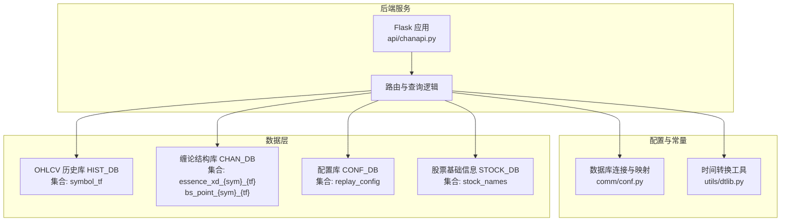
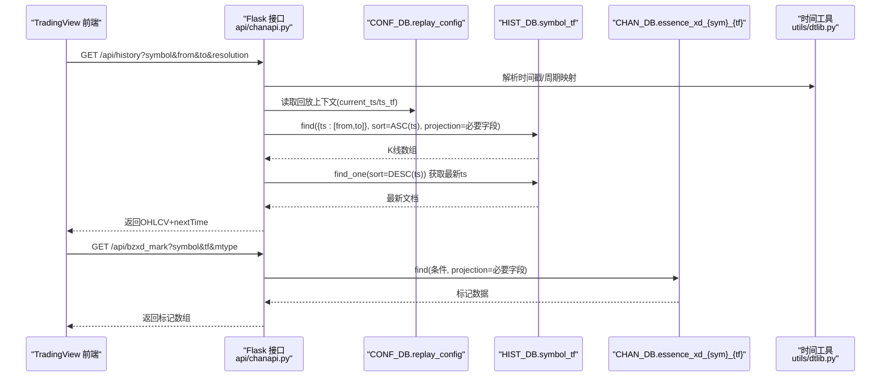
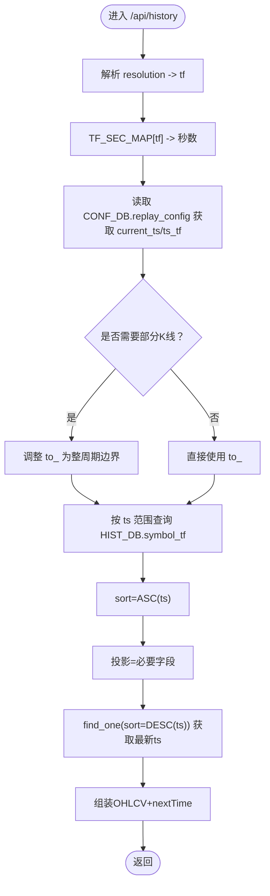
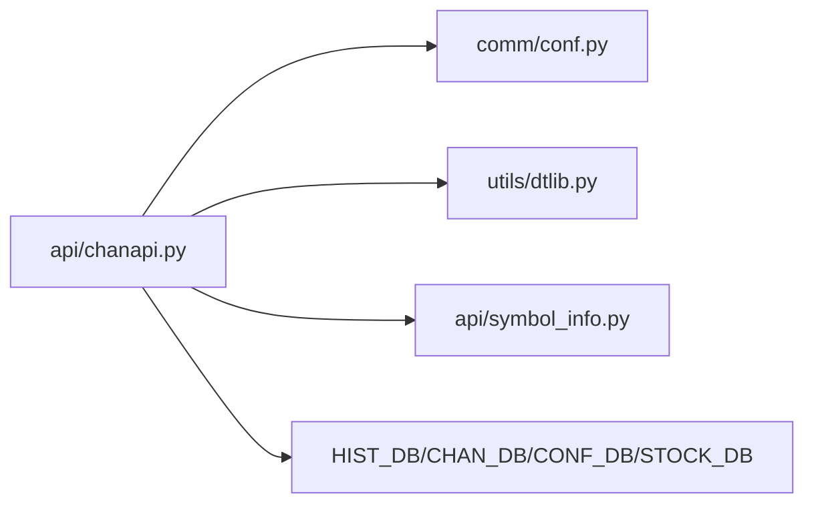

# 数据获取策略

<cite>
**本文引用的文件**
- [comm/conf.py](file://comm/conf.py)
- [api/chanapi.py](file://api/chanapi.py)
- [api/symbol_info.py](file://api/symbol_info.py)
- [utils/dtlib.py](file://utils/dtlib.py)
- [data/CLAUDE.md](file://data/CLAUDE.md)
- [api/CLAUDE.md](file://api/CLAUDE.md)
</cite>

## 目录
1. [简介](#简介)
2. [项目结构](#项目结构)
3. [核心组件](#核心组件)
4. [架构总览](#架构总览)
5. [详细组件分析](#详细组件分析)
6. [依赖关系分析](#依赖关系分析)
7. [性能考量](#性能考量)
8. [故障排查指南](#故障排查指南)
9. [结论](#结论)

## 简介
本文件聚焦于后端从 MongoDB 获取数据的统一模式，系统性解析以下主题：
- HIST_DB、CHAN_DB、CONF_DB 三个数据库连接的配置来源与用途
- TF_SEC_MAP 时间周期映射表的用途与计算逻辑
- 动态集合命名模式 col_tf = db[f'{symbol}_{tf}'] 的查询策略
- find() 查询的投影(projection)参数如何优化网络传输
- DESCENDING 排序在获取最新数据时的应用
- 数据库性能调优建议：索引策略、连接池配置与查询缓存机制

## 项目结构
后端 API 服务位于 api/chanapi.py，数据库配置与常量定义位于 comm/conf.py，股票与币种信息由 symbol_info.py 提供，时间转换工具位于 utils/dtlib.py。数据层集合命名遵循“symbol_tf”的规则，并通过 CONF_DB 存储回放/回测上下文。



**图表来源**
- [api/chanapi.py](file://api/chanapi.py#L96-L235)
- [comm/conf.py](file://comm/conf.py#L143-L158)
- [data/CLAUDE.md](file://data/CLAUDE.md#L45-L93)

**章节来源**
- [api/chanapi.py](file://api/chanapi.py#L96-L235)
- [comm/conf.py](file://comm/conf.py#L143-L158)
- [data/CLAUDE.md](file://data/CLAUDE.md#L45-L93)

## 核心组件
- 数据库连接与命名空间
  - HIST_DB：OHLCV 历史数据库，按 symbol_tf 命名集合存储 K 线
  - CHAN_DB：缠论结构数据库，包含 essence_xd_{sym}_{tf}、bs_point_{sym}_{tf} 等集合
  - CONF_DB：配置库，包含 replay_config 集合用于回放/回测上下文
  - STOCK_DB：股票基础信息库，提供股票名称等元数据
- 时间周期映射
  - RESOU_DICT：将 TradingView 周期字符串映射到内部周期标识
  - TF_SEC_MAP：将内部周期标识映射到秒数，用于回测/回放的时间边界计算
- 动态集合命名
  - col_tf = db[f'{symbol}_{tf}']：按 symbol 和 tf 动态拼接集合名进行查询
- 投影优化
  - find(query, projection)：仅返回必要字段，减少网络传输与序列化开销
- 排序策略
  - ASCENDING(ts)：保证时间序列顺序
  - DESCENDING(ts)：快速定位最新数据的 ts，用于 nextTime 或增量拉取

**章节来源**
- [comm/conf.py](file://comm/conf.py#L143-L158)
- [api/chanapi.py](file://api/chanapi.py#L96-L235)
- [api/chanapi.py](file://api/chanapi.py#L171-L209)
- [api/chanapi.py](file://api/chanapi.py#L280-L420)

## 架构总览
后端 API 通过统一的数据库连接与映射表，实现对 OHLCV 历史数据、缠论结构数据以及回放配置的跨库查询。动态集合命名与投影优化确保了在多周期、多标的场景下高效稳定地返回前端所需的最小数据集。



**图表来源**
- [api/chanapi.py](file://api/chanapi.py#L96-L235)
- [api/chanapi.py](file://api/chanapi.py#L280-L420)
- [utils/dtlib.py](file://utils/dtlib.py#L148-L155)

## 详细组件分析

### 数据库连接与命名空间
- HIST_DB、CHAN_DB、CONF_DB、STOCK_DB 在配置文件中一次性建立连接，分别指向不同的数据库实例，避免重复连接与上下文切换。
- 集合命名采用“symbol_tf”或“essence_xd_{sym}_{tf}”等模板，便于按周期与标的检索。
- 股票与币种的区分：当 symbol 为 6 位数字时，视为股票，切换到 STOCK_DB，并对 symbol 做前缀处理。

**章节来源**
- [comm/conf.py](file://comm/conf.py#L143-L158)
- [api/chanapi.py](file://api/chanapi.py#L112-L116)
- [api/symbol_info.py](file://api/symbol_info.py#L47-L69)

### TF_SEC_MAP 时间周期映射表
- 作用：将内部周期标识（如 1m、5m、1h、1d、1w）映射为秒数，用于回测/回放的时间边界计算与部分 K 线处理。
- 使用场景：
  - 回放配置中按 tf 计算 current_ts 的边界
  - 判断是否需要插入“部分 K 线”，以保证小级别推进时大级别不越界
  - 计算回测窗口大小（如 2000 个周期）



**图表来源**
- [api/chanapi.py](file://api/chanapi.py#L96-L235)
- [comm/conf.py](file://comm/conf.py#L23-L31)

**章节来源**
- [comm/conf.py](file://comm/conf.py#L23-L31)
- [api/chanapi.py](file://api/chanapi.py#L117-L171)
- [api/chanapi.py](file://api/chanapi.py#L171-L209)

### 动态集合命名与查询模式
- 统一模式：col_tf = db[f'{symbol}_{tf}']，按 symbol 与 tf 拼接集合名，查询 ts 范围内的 K 线。
- 股票路径：当 symbol 为 6 位数字时，db 切换至 STOCK_DB，并对 symbol 前缀加 “stk_”。
- 缠论标记：通过 CHAN_DB[ESSENCE_XD_COL.format(sym,sym)] 查询，配合投影仅返回标记字段，降低网络传输。

```mermaid
classDiagram
class HistoryRoute {
+解析参数(symbol,resolution,from,to)
+选择数据库(HIST_DB/STOCK_DB)
+动态集合名(symbol_tf)
+查询(ts范围,投影,排序)
+返回OHLCV+nextTime
}
class MarkRoutes {
+解析参数(symbol,tf,mtype)
+动态集合名(essence_xd_{sym}_{tf})
+条件查询+投影
+返回标记数据
}
class ConfDB {
+replay_config
+current_symbol/current_tf
+ts_1m/ts_tf
}
HistoryRoute --> ConfDB : "读取回放上下文"
HistoryRoute --> HIST_DB : "查询 symbol_tf"
MarkRoutes --> CHAN_DB : "查询 essence_xd_{sym}_{tf}"
```

**图表来源**
- [api/chanapi.py](file://api/chanapi.py#L96-L235)
- [api/chanapi.py](file://api/chanapi.py#L280-L420)
- [comm/conf.py](file://comm/conf.py#L143-L158)

**章节来源**
- [api/chanapi.py](file://api/chanapi.py#L112-L116)
- [api/chanapi.py](file://api/chanapi.py#L171-L209)
- [api/chanapi.py](file://api/chanapi.py#L280-L420)

### 投影(projection)参数优化网络传输
- 历史数据接口：仅返回前端需要的字段（时间戳、日期、开盘、最高、最低、收盘、成交量），避免传输冗余字段。
- 标记数据接口：按 mtype 动态投影，仅返回标记相关字段，减少 JSON 序列化与网络带宽占用。
- 优势：显著降低响应体大小，提升前端渲染与网络吞吐效率。

**章节来源**
- [api/chanapi.py](file://api/chanapi.py#L208-L235)
- [api/chanapi.py](file://api/chanapi.py#L431-L458)

### DESCENDING 排序在获取最新数据中的应用
- 获取最新数据：通过 sort=[('ts', DESCENDING)] 快速定位最新文档，提取最新时间戳用于 nextTime 或增量拉取。
- 适用场景：分页/滑动窗口、增量订阅、回测推进。

**章节来源**
- [api/chanapi.py](file://api/chanapi.py#L208-L210)

## 依赖关系分析
- api/chanapi.py 依赖 comm/conf.py 提供的数据库连接与映射表
- symbol_info.py 依赖 STOCK_DB 提供股票基础信息
- utils/dtlib.py 提供时间戳与日期转换工具，被历史接口用于时间边界计算



**图表来源**
- [api/chanapi.py](file://api/chanapi.py#L17-L21)
- [api/symbol_info.py](file://api/symbol_info.py#L1-L10)
- [comm/conf.py](file://comm/conf.py#L143-L158)

**章节来源**
- [api/chanapi.py](file://api/chanapi.py#L17-L21)
- [api/symbol_info.py](file://api/symbol_info.py#L1-L10)
- [comm/conf.py](file://comm/conf.py#L143-L158)

## 性能考量
- 索引策略
  - ts 字段建立升序索引：加速 ts 范围查询与 ASC(ts) 排序
  - 复合索引建议：若存在常用组合条件（如 ts + symbol），可考虑复合索引以进一步降低查询成本
- 连接池配置
  - 使用连接池减少连接建立开销，提高并发查询吞吐
  - 合理设置连接池大小与超时，避免资源耗尽
- 查询缓存机制
  - 对高频访问的 symbol_tf 组合进行短期缓存（如 LRU），减少重复查询
  - 缓存失效策略：基于 ts 边界或定时刷新，确保数据新鲜度
- 投影与分页
  - 始终使用投影仅返回必要字段
  - 对长周期数据采用分页或滑动窗口，避免一次性返回大量数据
- 回放/回测优化
  - 利用 CONF_DB.replay_config 中的 current_ts/ts_tf 减少无效扫描
  - 部分 K 线仅在必要时插入，避免重复聚合

[本节为通用性能建议，无需特定文件引用]

## 故障排查指南
- 无数据返回
  - 检查 symbol_tf 集合是否存在，确认 symbol 与 tf 映射正确
  - 核对 ts 范围是否合理，必要时调整 to_ 与 from_ 边界
- 最新时间异常
  - 确认 DESCENDING 排序是否正确执行，检查 latest ts 来源
- 回放/回测越界
  - 检查 CONF_DB.replay_config 是否写入 current_symbol/current_tf 与 ts_tf
  - 核对 TF_SEC_MAP 与 use_partial_k 的逻辑分支
- 字段缺失
  - 确认 find() 投影是否包含所需字段，避免遗漏

**章节来源**
- [api/chanapi.py](file://api/chanapi.py#L126-L146)
- [api/chanapi.py](file://api/chanapi.py#L171-L209)
- [api/chanapi.py](file://api/chanapi.py#L208-L210)

## 结论
本项目通过统一的数据库连接与映射表，实现了对 OHLCV 历史数据、缠论结构数据与回放配置的高效查询。动态集合命名与投影优化相结合，既满足多周期、多标的复杂场景，又兼顾网络传输与前端渲染效率。建议在生产环境中完善索引、连接池与缓存策略，持续优化查询性能与稳定性。