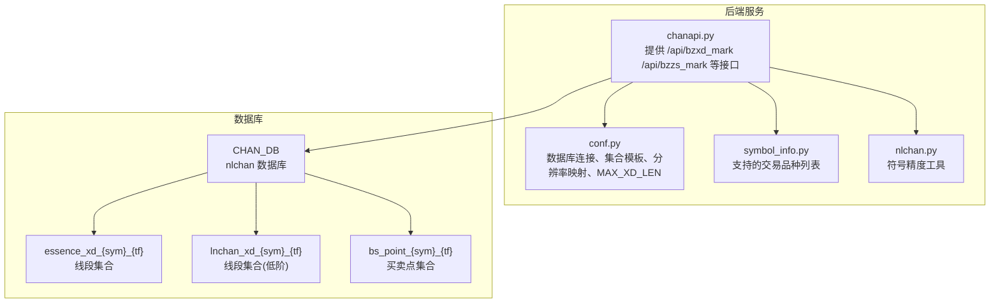
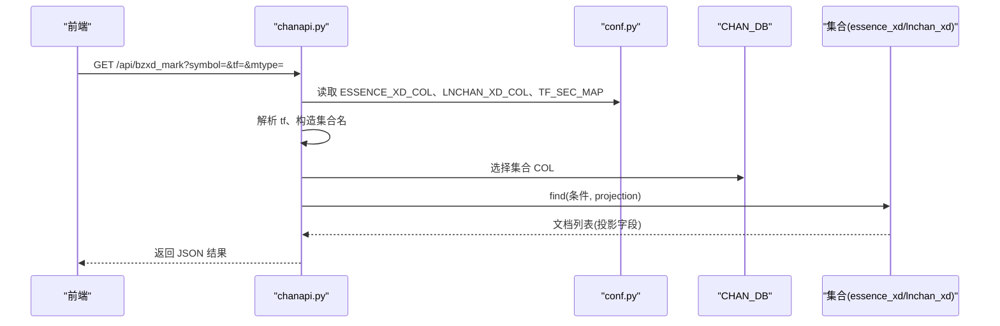
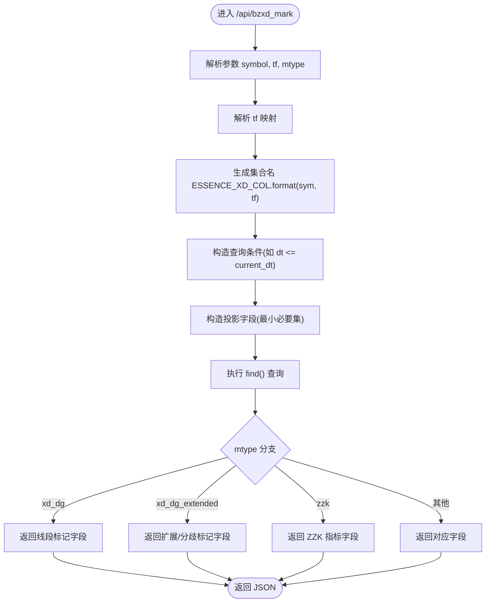
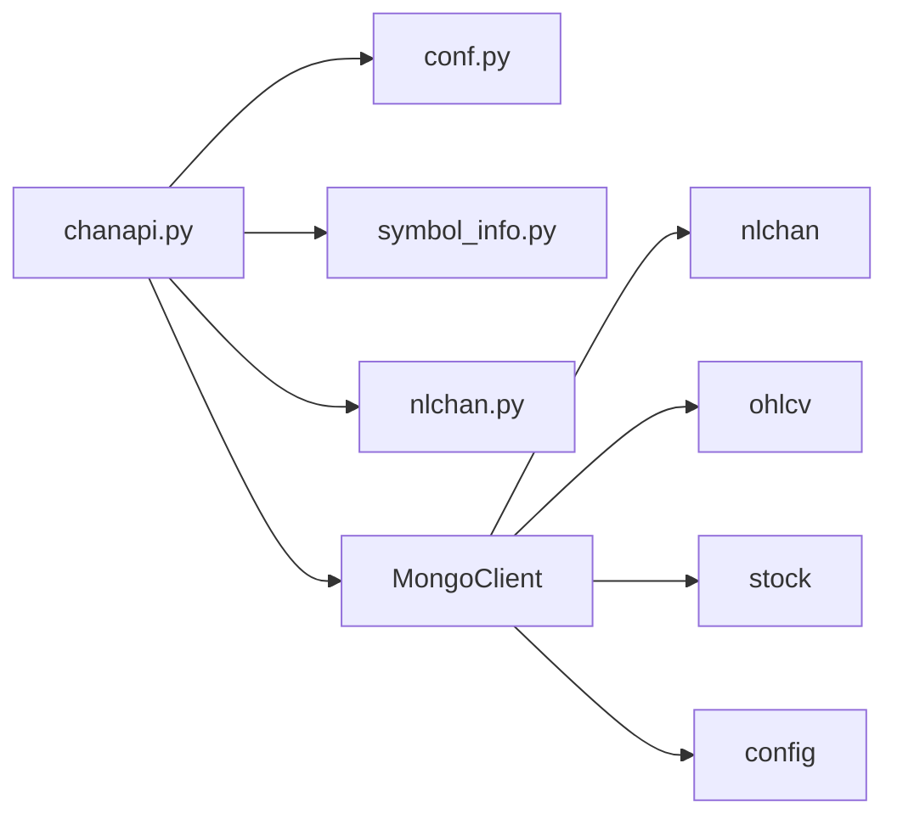

# 缠论结构数据获取

<cite>
**本文引用的文件**
- [chanapi.py](file://api/chanapi.py)
- [symbol_info.py](file://api/symbol_info.py)
- [conf.py](file://comm/conf.py)
- [nlchan.py](file://utils/nlchan.py)
- [essence_xd_000001.XSHG_1d.metadata.json](file://data/nlchan/essence_xd_000001.XSHG_1d.metadata.json)
- [README.md](file://README.md)
</cite>

## 目录
1. [简介](#简介)
2. [项目结构](#项目结构)
3. [核心组件](#核心组件)
4. [架构总览](#架构总览)
5. [组件详解](#组件详解)
6. [依赖关系分析](#依赖关系分析)
7. [性能考量](#性能考量)
8. [故障排查指南](#故障排查指南)
9. [结论](#结论)

## 简介
本文档聚焦于从 CHAN_DB 数据库读取缠论“线段”和“中枢”结构数据的机制，系统性说明以下内容：
- ESSENCE_XD_COL 和 LNCHAN_XD_COL 等模板如何通过 format(sym=symbol, tf=tf) 生成实际集合名
- 查询时如何使用 ts 字段作为排序键，结合 DESCENDING 顺序获取最新缠论结构
- find() 查询中 projection 的字段选择策略，仅返回 xd_id、start、end、start_idx、end_idx、direction 等关键属性
- 与 symbol_info.py 的协同关系，如何根据品种信息确定数据源类型
- 查询优化建议：在 ts 字段上建立升序索引、在 symbol 和 tf 字段上建立复合索引、合理设置 MAX_XD_LEN 限制返回数量防止内存溢出

## 项目结构
围绕缠论结构数据获取的相关模块与文件如下：
- 后端 API：api/chanapi.py 提供查询接口，负责解析参数、构造集合名、执行查询与投影
- 配置与连接：comm/conf.py 定义数据库连接、集合命名模板、分辨率映射、最大返回条数等
- 品种信息：api/symbol_info.py 提供支持的交易品种列表，并区分“币类”和“股票”
- 工具函数：utils/nlchan.py 提供与符号精度相关的工具
- 数据样例：data/nlchan 下包含示例集合的元数据，展示集合命名与索引情况
- 文档说明：README.md 展示目录结构与数据导入流程

图表来源
- [chanapi.py](file://api/chanapi.py#L280-L491)
- [conf.py](file://comm/conf.py#L143-L158)
- [symbol_info.py](file://api/symbol_info.py#L1-L74)

章节来源
- [README.md](file://README.md#L107-L137)
- [conf.py](file://comm/conf.py#L143-L158)

## 核心组件
- 接口层：提供线段与中枢标记的查询接口，按 mtype 分支返回不同结构
- 集合命名：通过 ESSENCE_XD_COL、LNCHAN_XD_COL 等模板，基于 symbol 与 tf 动态生成集合名
- 查询与投影：在 CHAN_DB 中按条件筛选与投影字段，返回前端所需的关键属性
- 数据源判定：根据 symbol_info.py 的支持列表与规则，区分币类与股票数据源

章节来源
- [chanapi.py](file://api/chanapi.py#L280-L491)
- [conf.py](file://comm/conf.py#L143-L158)
- [symbol_info.py](file://api/symbol_info.py#L1-L74)

## 架构总览
下图展示了从前端请求到数据库查询的整体流程，以及集合命名与投影策略：

图表来源
- [chanapi.py](file://api/chanapi.py#L280-L491)
- [conf.py](file://comm/conf.py#L143-L158)

## 组件详解

### 集合命名与数据源判定
- 集合命名模板
  - ESSENCE_XD_COL = "essence_xd_{sym}_{tf}"
  - LNCHAN_XD_COL = "lnchan_xd_{sym}_{tf}"
  - 在接口中通过 format(sym=symbol, tf=tf) 生成实际集合名
- 数据源类型判定
  - 若 symbol 为 6 位数字，则视为股票，切换到 STOCK_DB，并将 symbol 前缀改为 "stk_"
  - 否则默认使用 HIST_DB 或 CHAN_DB 对应集合
- 品种支持列表
  - symbol_info.py 提供 SUPPORT_SYMBOLS，其中包含币类与股票两类条目，前端可据此进行搜索与展示

章节来源
- [conf.py](file://comm/conf.py#L143-L158)
- [chanapi.py](file://api/chanapi.py#L112-L116)
- [symbol_info.py](file://api/symbol_info.py#L1-L74)

### 查询与投影策略
- 条件筛选
  - 使用 dt 或其他业务字段进行过滤，例如 mtype 为 "xd_dg"、"xd_dg_extended" 等分支
  - 通过 current_dt 限制时间范围，确保只返回“最新有效”的结构
- 排序键与顺序
  - 对历史数据查询使用 ts 升序排序
  - 对线段/中枢标记查询未显式指定排序键，但可通过后续处理或索引优化提升性能
- 投影字段
  - 不同 mtype 返回不同字段组合，但核心字段通常包含：
    - xd_id：线段标识
    - start/end：线段起止时间
    - start_idx/end_idx：线段在序列中的索引
    - direction：方向（如向上/向下）
    - 其他：如 dt、low、high、xd_dg、czxd_dg、xddg_ind、bzzs、xdzs 等
  - 投影策略遵循“最小必要集”，避免传输冗余字段

章节来源
- [chanapi.py](file://api/chanapi.py#L280-L491)

### 与 symbol_info.py 的协同关系
- 品种类型决定数据源
  - 币类：使用 HIST_DB/CHAN_DB 的默认集合
  - 股票：使用 STOCK_DB，并对 symbol 做前缀转换
- 前端搜索与展示
  - symbol_info.py 提供 SUPPORT_SYMBOLS，包含名称、代码、价格刻度等信息，便于前端搜索与会话配置

章节来源
- [chanapi.py](file://api/chanapi.py#L112-L116)
- [symbol_info.py](file://api/symbol_info.py#L1-L74)

### 示例：线段标记查询流程

图表来源
- [chanapi.py](file://api/chanapi.py#L280-L491)
- [conf.py](file://comm/conf.py#L143-L158)

## 依赖关系分析
- 外部依赖
  - MongoDB：通过 MongoClient 连接 nlchan、ohlcv、stock、config 数据库
  - Flask + PyMongo：提供 REST 接口与查询能力
- 内部依赖
  - conf.py 提供数据库连接、集合模板、分辨率映射、最大返回条数
  - symbol_info.py 提供支持的交易品种列表
  - utils/nlchan.py 提供符号精度工具

图表来源
- [chanapi.py](file://api/chanapi.py#L2-L21)
- [conf.py](file://comm/conf.py#L143-L158)

章节来源
- [chanapi.py](file://api/chanapi.py#L2-L21)
- [conf.py](file://comm/conf.py#L143-L158)

## 性能考量
- 索引建议
  - 在 ts 字段上建立升序索引，以支持按时间范围高效查询与排序
  - 在 (symbol, tf) 上建立复合索引，以加速按品种与周期过滤
- 返回数量控制
  - 使用 MAX_XD_LEN 控制返回条数上限，避免一次性返回过多数据导致内存压力
- 查询优化
  - 尽可能缩小查询范围（如 dt <= current_dt），减少扫描文档数
  - 仅投影必要字段，降低网络与序列化开销

章节来源
- [conf.py](file://comm/conf.py#L131-L133)
- [essence_xd_000001.XSHG_1d.metadata.json](file://data/nlchan/essence_xd_000001.XSHG_1d.metadata.json#L1-L1)

## 故障排查指南
- 集合不存在或命名不匹配
  - 确认 ESSENCE_XD_COL/LNCHAN_XD_COL 模板与实际集合名一致
  - 检查 symbol 与 tf 是否正确映射
- 查询无结果
  - 检查 dt 过滤条件是否过严
  - 确认 ts 字段存在且已建立索引
- 返回数据过多
  - 设置 MAX_XD_LEN 限制返回条数
  - 优化投影字段，仅返回前端所需字段
- 数据源类型错误
  - 确认 symbol 是否为 6 位数字（股票）并已加上 "stk_" 前缀

章节来源
- [chanapi.py](file://api/chanapi.py#L112-L116)
- [conf.py](file://comm/conf.py#L131-L133)

## 结论
- 通过 ESSENCE_XD_COL/LNCHAN_XD_COL 模板与 format(sym, tf)，系统实现了灵活的集合命名与数据源判定
- 查询采用最小投影字段策略，结合 ts 字段与 DESCENDING/ASCENDING 排序，满足前端展示需求
- 与 symbol_info.py 协同，实现币类与股票数据源的自动识别
- 建议在 ts、(symbol, tf) 建立索引，并合理设置 MAX_XD_LEN，以获得更优的查询性能与稳定性