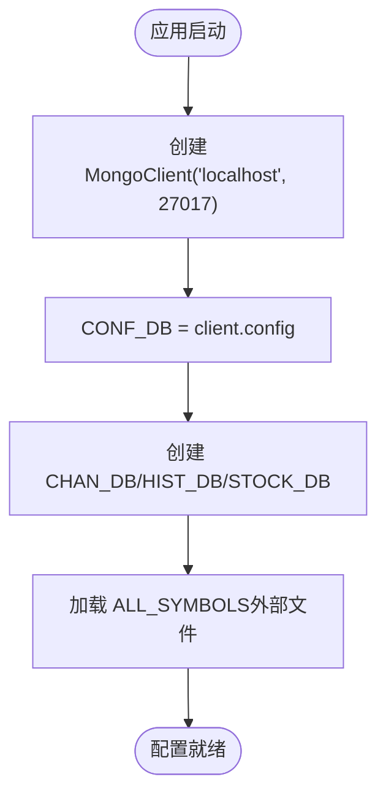

# 配置数据访问

<cite>
**本文引用的文件**
- [comm/conf.py](file://comm/conf.py)
- [api/symbol_info.py](file://api/symbol_info.py)
- [api/chanapi.py](file://api/chanapi.py)
- [api/CLAUDE.md](file://api/CLAUDE.md)
- [comm/CLAUDE.md](file://comm/CLAUDE.md)
- [README.md](file://README.md)
- [hetl/selcoin/binance_syms.txt](file://hetl/selcoin/binance_syms.txt)
</cite>

## 目录
1. [简介](#简介)
2. [项目结构](#项目结构)
3. [核心组件](#核心组件)
4. [架构总览](#架构总览)
5. [详细组件分析](#详细组件分析)
6. [依赖分析](#依赖分析)
7. [性能考虑](#性能考虑)
8. [故障排查指南](#故障排查指南)
9. [结论](#结论)
10. [附录](#附录)

## 简介
本文件聚焦于“配置数据访问”的实现，围绕以下目标展开：
- 解释 CONF_DB = client.config 的初始化过程及其在全局配置中的角色
- 说明如何从配置数据库中读取交易品种元数据、时间周期规则、显示参数等信息
- 详述 ALL_SYMBOLS 和 ALL_TIMEFRAMES 等全局变量如何从数据库或外部文件加载并缓存在内存中以提升访问效率
- 阐述与 symbol_info.py 的集成方式，如何通过配置数据动态生成 API 响应
- 提供访问最佳实践，包括配置缓存策略、读取超时设置、故障降级处理，以及如何通过索引优化快速检索特定 symbol 的配置信息

## 项目结构
该项目采用模块化组织，核心配置集中在 comm 模块，API 服务集中在 api 模块，数据来源包含外部文本文件与 MongoDB 集合。

**图表来源**
- [comm/conf.py](file://comm/conf.py#L139-L166)
- [api/chanapi.py](file://api/chanapi.py#L17-L21)
- [api/symbol_info.py](file://api/symbol_info.py#L1-L74)
- [hetl/selcoin/binance_syms.txt](file://hetl/selcoin/binance_syms.txt#L1-L118)

**章节来源**
- [README.md](file://README.md#L91-L136)

## 核心组件
- 配置中心（comm/conf.py）
  - 初始化 MongoDB 客户端并创建多个数据库句柄（CHAN_DB、HIST_DB、STOCK_DB、CONF_DB）
  - 定义时间周期映射、秒数映射、日期起始时间、最大线段长度等常量
  - 从外部文件加载 ALL_SYMBOLS，并维护 ALL_TIMEFRAMES
- 品种信息生成（api/symbol_info.py）
  - 基于 ALL_SYMBOLS 计算 pricescale 并生成 SUPPORT_SYMBOLS
  - 从 STOCK_DB.stock_names 查询股票基础信息，拼装为 SUPPORT_SYMBOLS
- API 服务（api/chanapi.py）
  - 提供 /api/config、/api/search、/api/symbols、/api/history 等接口
  - 在历史数据接口中使用 CONF_DB.replay_config 进行回放控制

**章节来源**
- [comm/conf.py](file://comm/conf.py#L139-L166)
- [api/symbol_info.py](file://api/symbol_info.py#L1-L74)
- [api/chanapi.py](file://api/chanapi.py#L41-L94)

## 架构总览
下图展示了从 TradingView 前端到后端 API，再到配置与数据层的整体流程。

**图表来源**
- [api/chanapi.py](file://api/chanapi.py#L41-L94)
- [api/chanapi.py](file://api/chanapi.py#L96-L235)
- [api/symbol_info.py](file://api/symbol_info.py#L1-L74)
- [comm/conf.py](file://comm/conf.py#L139-L166)

## 详细组件分析

### 配置数据库初始化与全局配置角色（CONF_DB = client.config）
- 初始化过程
  - 通过 MongoClient 连接本地 MongoDB，默认端口 27017
  - 创建 CONF_DB = client.config，用于存放系统配置类数据
  - 同时创建 CHAN_DB、HIST_DB、STOCK_DB，分别用于缠论结构数据、历史K线与股票基础信息
- 全局配置中的角色
  - CONF_DB 用于存放回放配置（例如 replay_config 集合），在历史数据接口中被读取以控制当前时间步长与回放边界
  - 其他配置常量（如时间周期映射、日期起始时间、最大线段长度等）由 comm/conf.py 内部定义，供 API 与工具模块使用

**图表来源**
- [comm/conf.py](file://comm/conf.py#L139-L166)

**章节来源**
- [comm/conf.py](file://comm/conf.py#L139-L166)

### 交易品种元数据加载与缓存（ALL_SYMBOLS）
- 来源与加载
  - 从 hetl/selcoin/binance_syms.txt 读取币种与最小变动单位（minmov）
  - 过滤特殊币种（如 DAI、TUSD），构建 ALL_SYMBOLS 列表
- 缓存策略
  - ALL_SYMBOLS 在进程启动时一次性加载到内存，避免每次请求重复 IO
  - symbol_info.py 基于 ALL_SYMBOLS 计算 pricescale 并生成 SUPPORT_SYMBOLS，同样驻留内存
- 与 API 集成
  - /api/search 与 /api/symbols 直接从内存中的 SUPPORT_SYMBOLS 返回结果，无需再次访问数据库

**图表来源**
- [comm/conf.py](file://comm/conf.py#L87-L109)
- [api/symbol_info.py](file://api/symbol_info.py#L1-L40)
- [hetl/selcoin/binance_syms.txt](file://hetl/selcoin/binance_syms.txt#L1-L118)

**章节来源**
- [comm/conf.py](file://comm/conf.py#L87-L109)
- [api/symbol_info.py](file://api/symbol_info.py#L1-L40)
- [hetl/selcoin/binance_syms.txt](file://hetl/selcoin/binance_syms.txt#L1-L118)

### 时间周期规则与显示参数（ALL_TIMEFRAMES、TF_SEC_MAP、RESOU_DICT）
- ALL_TIMEFRAMES
  - 定义系统支持的所有时间周期集合，用于前端展示与后端逻辑判断
- TF_SEC_MAP
  - 将内部周期字符串映射为秒数，用于计算时间边界与回放步长
- RESOU_DICT
  - 将 TradingView 周期字符串映射为内部周期字符串，用于构造集合名与查询条件

**图表来源**
- [comm/conf.py](file://comm/conf.py#L12-L41)
- [api/chanapi.py](file://api/chanapi.py#L96-L171)

**章节来源**
- [comm/conf.py](file://comm/conf.py#L12-L41)
- [api/chanapi.py](file://api/chanapi.py#L96-L171)

### 回放配置与 CONF_DB.replay_config 的使用
- CONF_DB.replay_config
  - 存放当前回放状态（如 current_symbol、current_tf、ts_1m、ts_4h 等）
  - 在 /api/history 中读取当前时间戳，限制查询范围并决定是否使用部分K线
- 使用流程
  - 读取 CONF_DB.replay_config.find_one({'current_ts': {$exists: 1}})
  - 根据 resolution 与 TF_SEC_MAP 计算时间边界
  - 若处于部分K线阶段，则从对应集合读取 partial_* 字段并合并到结果

**图表来源**
- [api/chanapi.py](file://api/chanapi.py#L116-L207)
- [comm/conf.py](file://comm/conf.py#L23-L41)

**章节来源**
- [api/chanapi.py](file://api/chanapi.py#L116-L207)

### 与 symbol_info.py 的集成与 API 响应生成
- 集成方式
  - api/symbol_info.py 直接导入 ALL_SYMBOLS，并基于 minmov 计算 pricescale
  - 从 STOCK_DB.stock_names 查询股票基础信息，拼装为 SUPPORT_SYMBOLS
  - api/chanapi.py 导入 SUPPORT_SYMBOLS，用于 /api/search 与 /api/symbols 接口
- 动态生成 API 响应
  - /api/search：对 SUPPORT_SYMBOLS 进行模糊匹配并返回
  - /api/symbols：根据 symbol 参数返回对应品种的详细信息（含 pricescale、intraday_multipliers 等）

**图表来源**
- [api/symbol_info.py](file://api/symbol_info.py#L1-L74)
- [api/chanapi.py](file://api/chanapi.py#L17-L21)

**章节来源**
- [api/symbol_info.py](file://api/symbol_info.py#L1-L74)
- [api/chanapi.py](file://api/chanapi.py#L17-L21)

## 依赖分析
- 模块耦合
  - api/chanapi.py 依赖 comm/conf.py 的数据库句柄与映射常量
  - api/symbol_info.py 依赖 comm/conf.py 的 ALL_SYMBOLS 与 STOCK_DB
- 外部依赖
  - MongoDB：提供 CONF_DB、HIST_DB、STOCK_DB、CHAN_DB 数据源
  - 外部文件：binance_syms.txt 提供币种与最小变动单位

**图表来源**
- [api/chanapi.py](file://api/chanapi.py#L17-L21)
- [api/symbol_info.py](file://api/symbol_info.py#L1-L74)
- [comm/conf.py](file://comm/conf.py#L139-L166)

**章节来源**
- [api/chanapi.py](file://api/chanapi.py#L17-L21)
- [api/symbol_info.py](file://api/symbol_info.py#L1-L74)
- [comm/conf.py](file://comm/conf.py#L139-L166)

## 性能考虑
- 内存缓存
  - ALL_SYMBOLS 与 SUPPORT_SYMBOLS 均驻留内存，避免重复 IO 与解析
  - 建议在高并发场景下保持这些集合的只读与不可变性，防止竞态
- 索引优化
  - 历史数据查询通常按 ts 排序与筛选，建议在 symbol_tf 集合上为 ts 字段建立升序索引
  - replay_config 集合中常用字段（如 current_ts、ts_1m、ts_4h 等）建议建立索引以加速读取
- 读取超时与重试
  - 建议在 API 层设置合理的查询超时（如 5-10 秒），并在数据库异常时进行有限次重试
- 分页与限流
  - 对大数据量查询采用分页策略，避免一次性返回过多数据
  - 对高频接口（如 /api/history）实施限流，防止数据库压力过大

[本节为通用指导，不直接分析具体文件]

## 故障排查指南
- 数据库连接失败
  - 确认 MongoDB 服务运行且端口可达
  - 检查 CONF_DB 初始化是否成功（client.config 是否可用）
- 品种缺失或异常
  - 检查 binance_syms.txt 是否存在且格式正确
  - 确认 symbol_info.py 是否正确过滤了特殊币种
- 历史数据为空
  - 检查 CONF_DB.replay_config 是否存在 current_ts 字段
  - 确认 symbol_tf 集合是否存在且包含 ts 字段
- API 响应慢
  - 为 ts 字段添加索引
  - 优化查询条件，减少不必要的排序与投影

**章节来源**
- [comm/conf.py](file://comm/conf.py#L139-L166)
- [api/chanapi.py](file://api/chanapi.py#L96-L235)
- [api/symbol_info.py](file://api/symbol_info.py#L1-L74)

## 结论
- CONF_DB = client.config 作为配置数据库，主要用于存放回放配置等系统级配置
- ALL_SYMBOLS 与 ALL_TIMEFRAMES 通过外部文件与常量定义加载到内存，显著提升了 API 响应速度
- symbol_info.py 基于配置数据动态生成 SUPPORT_SYMBOLS，使 API 能够返回标准化的品种信息
- 历史数据接口通过 CONF_DB.replay_config 控制回放边界与部分K线逻辑，保证回测一致性
- 建议在生产环境中完善索引、超时与重试策略，并对高频接口实施限流

[本节为总结性内容，不直接分析具体文件]

## 附录

### 配置数据访问最佳实践清单
- 缓存策略
  - 将 ALL_SYMBOLS 与 SUPPORT_SYMBOLS 缓存在内存中，避免重复 IO
  - 对只读配置采用只读缓存，必要时引入缓存失效策略
- 读取超时
  - 为数据库查询设置合理超时（如 5-10 秒），避免阻塞请求
- 故障降级
  - 当 CONF_DB 不可用时，提供默认配置或降级响应
  - 对历史数据接口，若无 partial 数据，回退到完整K线
- 索引优化
  - 为 symbol_tf 集合的 ts 字段建立升序索引
  - 为 replay_config 的常用字段建立索引
- 快速检索
  - 对 symbol 建立唯一索引，便于按 symbol 快速定位
  - 在 API 层对 SUPPORT_SYMBOLS 进行字典化或哈希索引，加速模糊匹配

[本节为通用指导，不直接分析具体文件]